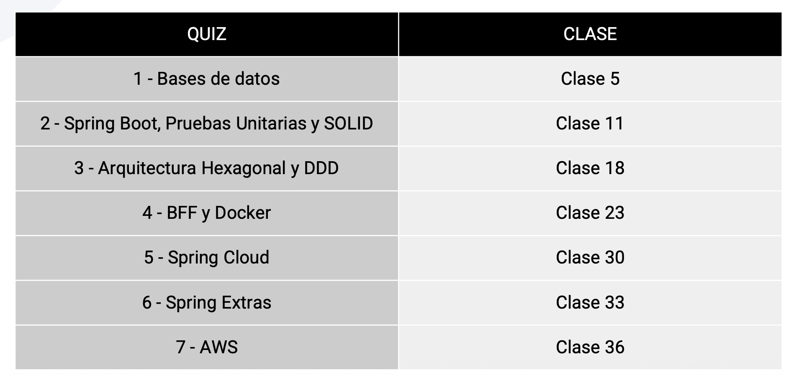

# AceleraTI

## Presentación del Programa

Acelera TI, una iniciativa de **Bancolombia** y **Pragma**, les da la más cálida bienvenida a este programa diseñado para transformar su potencial en experiencia.

Este curso, dictado por nuestro aliado estratégico **Enyoi**, ha sido desarrollado con un pensum cuidadosamente co-creado junto a las necesidades actuales de la industria tecnológica.

**Nuestro objetivo es claro:** cerrar las brechas del mercado al formar profesionales con las habilidades técnicas y prácticas que las empresas necesitan para prosperar en un mundo en constante evolución.

## Metodología Inmersiva

### Aprendizaje basado en proyectos

El ABP potencia un aprendizaje activo y práctico, alineado con los retos reales del sector tecnológico.

### Acompañamiento constante

Acompañamiento cercano para guiar, motivar y apoyar el aprendizaje, asegurando avance con sentido y confianza.

### Formato y ritmo

160 horas sincrónicas con un reto final que integra conocimientos y habilidades adquiridas.

### Asesorías personalizadas

Para resolver dudas, reforzar conceptos y brindar apoyo personalizado que potencia el aprendizaje.

## Horario y Duración

**Fecha de inicio:** Miércoles 5 de noviembre de 2025

**Días de clase:** Lunes | Miércoles | Jueves  
**Horario:** 19:00 a 22:00 hrs (Col - Per - Ecu)

**Duración total:** 160 horas  
**Frecuencia:** 9 horas semanales durante 17 semanas

## Fechas Importantes

### Quices

### Panel de Expertos

**Fecha:** Semana del 30 de marzo al 3 de abril de 2026

#### ¿Qué es el Panel de Expertos?

- Es el espacio donde culmina tu formación
- Te conectarás con 2 expertos de la industria para sustentar tu proyecto final
- Se valida la apropiación de conocimientos técnicos y la capacidad de aplicarlos en un reto real

#### Dinámica del proceso

- Al terminar las clases técnicas tendrás 2 semanas de preparación para ajustar tu proyecto
- Te compartiremos opciones de calendario para que elijas tu fecha de presentación
- La sustentación es individual y guiada por las historias de usuario y el backlog trabajado durante el curso

#### ¿Por qué es importante?

- Todo el programa gira en torno a tu proyecto: el reto es el eje central de la formación
- En el panel recibes un diagnóstico técnico personalizado e individual, que se convierte en un soporte clave de tu aprendizaje y en la culminación oficial del proceso

## Currículum | Módulos

### Parte I

- Introducción al curso y al proyecto a desarrollar
- SQL y NoSQL
- SpringBoot / Clean Architecture
- Pruebas Unitarias
- IA aplicada a Java

### Parte II

- Principios SOLID | Clean Code
- Arquitectura hexagonal y DDD
- Programación Funcional
- Programación Reactiva
- Docker
- Spring Cloud
- Spring Security
- Cloud computing
- AWS Práctico
- DevOps

## Docente

### Andrés Felipe Isaza

**Formación:**

- Ingeniero de Sistemas
- Especialista en Sistemas de Información

**Certificaciones:**

- AWS Certified Solutions Architect
- Scrum Master
- ITIL V3

**Experiencia:**

Líder técnico con más de 13 años de experiencia en transformación digital, arquitectura de soluciones y modernización tecnológica.

Actualmente **Líder Técnico EVC en Bancolombia**, donde ha impulsado la adopción de Cloud, DevSecOps y microservicios.

Ha diseñado e implementado soluciones en AWS, Big Data, Kubernetes, Java, Python y Node.js, integrando negocio y tecnología para mejorar la eficiencia y escalar productos digitales.

Docente apasionado por el aprendizaje aplicado, promueve pensamiento crítico, innovación y liderazgo técnico en sus equipos.

## Proyecto Final: Arka

El proyecto **Arka** es el eje central de la formación. Se trata de desarrollar una plataforma de e-commerce para una empresa de tecnología que desea migrar sus operaciones físicas al mundo digital.

### Recursos del Proyecto

- [Backlog del proyecto Java Backend Arka](assets/PDFs/Backlog%20del%20proyecto%20Java%20Backend%20Arka.pdf) - Listado completo de historias de usuario y tareas del proyecto
- [Proyecto Arka - Versión 1](assets/PDFs/Proyecto%20Arka%201.pdf) - Especificaciones iniciales del proyecto
- [Proyecto Java Backend Reto - Versión 2](assets/PDFs/Proyecto%20Java%20Backend%20Reto%20V2.pdf) - Versión actualizada con requisitos detallados

> **Nota:** Consulta también el archivo [clase_1.md](clase_1.md) para ver consejos detallados sobre el desarrollo del proyecto.

## Requisitos de Graduación

### 1. Asistencia

- **Mínimo requerido:** >80% de asistencia durante todo el programa de 17 semanas
- La asistencia se toma solo 1 vez por clase

### 2. Quices

- **Total:** 7 quices durante toda la formación
- **Tiempo disponible:** 24 horas desde el día definido para presentar cada quiz

### 3. Proyecto

Desde el primer día comenzaremos a trabajar en el proyecto final, el cual deberán desarrollar a medida que avanza el curso, aplicando lo visto en cada módulo.
