# Arquitectura Backend Arka - Diagrama C4 Nivel 2 (Contenedores)

**Autor:** Senior Software Architect  
**Fecha:** 21 de Febrero, 2026  
**Proyecto:** Arka - Sistema de Retail Digital  
**Stack Técnico:** Java + Spring Boot, Kafka, PostgreSQL, AWS

---

## 1. Contexto del Dominio Arka

**Arka** es una empresa colombiana de venta de equipos tecnológicos que está migrando sus operaciones del mundo físico al mundo digital. El sistema debe soportar:

- **Gestión de Inventario:** Control de stock, categorías, umbrales de reorden, reservas temporales
- **Gestión de Pedidos:** Flujo completo desde creación hasta entrega
- **Catálogo Digital:** Productos, precios, categorías
- **Procesamiento de Pagos:** Integración con pasarelas de pago
- **Reportes y Analítica:** Ventas, rentabilidad, carritos abandonados

### Desafío Principal Identificado

El **cuello de botella crítico** en Retail es la **concurrencia en ventas** que genera condiciones de carrera (race conditions), resultando en:
- **Stock negativo** (sobreventa de productos)
- **Inconsistencias** entre pedidos y disponibilidad real
- **Mala experiencia del cliente** por cancelaciones posteriores

**Solución propuesta:** Arquitectura de microservicios con comunicación asíncrona mediante eventos y patrón Saga para garantizar consistencia eventual.

---

## 2. Diagrama C4 Nivel 2 - Contenedores

### Diagrama Visual (Mermaid.js)

```mermaid
C4Context
    title Diagrama C4 Nivel 2 - Arquitectura Backend Arka (Contenedores)
    
    Person(cliente_web, "Cliente Web", "Usuario navegando marketplace")
    Person(cliente_mobile, "Cliente Mobile", "Usuario en app móvil")
    Person(admin, "Administrador", "Gestiona inventario y pedidos")
    
    System_Boundary(aws_cloud, "AWS Cloud") {
        Container(api_gateway, "API Gateway", "AWS API Gateway + Load Balancer", "Punto de entrada único, autenticación JWT, rate limiting, enrutamiento")
        
        Container_Boundary(microservices, "Capa de Microservicios") {
            Container(catalog_service, "Catalog Service", "Spring Boot + WebFlux", "Gestiona productos, categorías y precios")
            Container(inventory_service, "Inventory Service", "Spring Boot + WebFlux", "Control de stock, reservas temporales, umbrales de reorden")
            Container(order_service, "Order Service", "Spring Boot + WebFlux", "Procesamiento de pedidos, máquina de estados, Saga orchestrator")
            Container(payment_service, "Payment Service", "Spring Boot + WebFlux", "Integración con pasarelas de pago, transacciones")
            Container(reporting_service, "Reporting Service", "Spring Boot + WebFlux", "Analítica, reportes de ventas, CQRS read model")
            Container(notification_service, "Notification Service", "Spring Boot + WebFlux", "Envío de emails, SMS, notificaciones push")
        }
        
        Container(kafka_broker, "Apache Kafka", "Event Streaming Platform", "Message broker para comunicación asíncrona y eventos de dominio")
        
        ContainerDb(catalog_db, "Catalog DB", "PostgreSQL", "Productos, categorías, precios (datos maestros)")
        ContainerDb(inventory_db, "Inventory DB", "PostgreSQL", "Stock, reservas, movimientos de inventario (ACID)")
        ContainerDb(order_db, "Order DB", "PostgreSQL", "Pedidos, items, estados, historial (ACID)")
        ContainerDb(payment_db, "Payment DB", "PostgreSQL", "Transacciones de pago, refunds (ACID)")
        
        ContainerDb(analytics_db, "Analytics DB", "DynamoDB", "Vistas desnormalizadas, reportes, eventos agregados")
        ContainerDb(cache_layer, "Cache Layer", "Redis/ElastiCache", "Catálogo de productos, sesiones, carritos")
    }
    
    System_Ext(payment_gateway, "Payment Gateway", "Stripe/MercadoPago/PayU")
    System_Ext(email_service, "Email Service", "SendGrid/SES")
    
    Rel(cliente_web, api_gateway, "HTTPS/REST")
    Rel(cliente_mobile, api_gateway, "HTTPS/REST")
    Rel(admin, api_gateway, "HTTPS/REST")
    
    Rel(api_gateway, catalog_service, "REST/gRPC", "Consulta productos")
    Rel(api_gateway, inventory_service, "REST/gRPC", "Verifica disponibilidad")
    Rel(api_gateway, order_service, "REST/gRPC", "Crea pedidos")
    Rel(api_gateway, payment_service, "REST/gRPC", "Procesa pagos")
    Rel(api_gateway, reporting_service, "REST", "Consulta reportes")
    
    Rel(catalog_service, catalog_db, "R2DBC")
    Rel(inventory_service, inventory_db, "R2DBC")
    Rel(order_service, order_db, "R2DBC")
    Rel(payment_service, payment_db, "R2DBC")
    Rel(reporting_service, analytics_db, "SDK")
    
    Rel(catalog_service, kafka_broker, "Publica: ProductCreated, ProductUpdated")
    Rel(inventory_service, kafka_broker, "Publica: StockReserved, StockReleased, StockUpdated")
    Rel(order_service, kafka_broker, "Publica: OrderCreated, OrderConfirmed, OrderCancelled")
    Rel(payment_service, kafka_broker, "Publica: PaymentProcessed, PaymentFailed")
    
    Rel(inventory_service, kafka_broker, "Consume: OrderCreated")
    Rel(payment_service, kafka_broker, "Consume: StockReserved")
    Rel(order_service, kafka_broker, "Consume: PaymentProcessed, PaymentFailed, StockReserveFailed")
    Rel(notification_service, kafka_broker, "Consume: OrderConfirmed, OrderCancelled")
    Rel(reporting_service, kafka_broker, "Consume: Todos los eventos de dominio")
    
    Rel(catalog_service, cache_layer, "Lee/Escribe catálogo")
    Rel(payment_service, payment_gateway, "HTTPS")
    Rel(notification_service, email_service, "HTTPS")
    
    UpdateLayoutConfig($c4ShapeInRow="3", $c4BoundaryInRow="1")
```



---

## 3. Responsabilidades de Cada Contenedor

### 3.1 API Gateway (AWS API Gateway + Application Load Balancer)

**Tipo:** Infraestructura como Servicio  
**Responsabilidades:**
- ✅ **Punto de entrada único** para todos los clientes (web, mobile, admin)
- ✅ **Autenticación y Autorización** mediante JWT tokens
- ✅ **Rate Limiting** para prevenir abuso y DDoS
- ✅ **Enrutamiento inteligente** a microservicios basado en path/método
- ✅ **Balanceo de carga** entre instancias de servicios
- ✅ **Terminación SSL/TLS** para comunicación segura
- ✅ **Circuit Breaker** a nivel de infraestructura
- ✅ **Logging y monitoreo centralizado** (CloudWatch)

**Justificación Stack:**
- **AWS API Gateway:** Maneja cross-cutting concerns sin código
- **ALB:** Distribuye tráfico con health checks automáticos
- Reduce complejidad en los microservicios

---

### 3.2 Catalog Service (Servicio de Catálogo)

**Tipo:** Microservicio Spring Boot + WebFlux  
**Responsabilidades:**
- 📦 **Gestión de productos:** CRUD de productos con atributos (SKU, nombre, descripción, precio)
- 📂 **Gestión de categorías:** Jerarquía de categorías maestras
- 💰 **Gestión de precios:** Precio de venta, costo, moneda, impuestos
- ✅ **Validaciones de negocio:** Precio > Costo, campos obligatorios
- 📊 **Publicación de eventos:** `ProductCreated`, `ProductUpdated`, `ProductDeleted`

**Base de Datos:** PostgreSQL (catalog_db)
- Relaciones entre productos y categorías (normalizado)
- Queries transaccionales ACID para consistencia

**Caché:** Redis (cache_layer)
- Catálogo completo cacheado para lecturas rápidas
- Invalidación de caché mediante eventos Kafka

**Patrón:** CQRS parcial (escritura en PostgreSQL, lectura desde caché)

---

### 3.3 Inventory Service (Servicio de Inventario)

**Tipo:** Microservicio Spring Boot + WebFlux  
**Responsabilidades:**
- 📊 **Control de stock en tiempo real** por SKU
- 🔒 **Reserva temporal de stock** con timeout (previene race conditions)
- ⚠️ **Alertas de umbral de reorden** (Cron Jobs)
- 📉 **Registro de mermas** (daños, robos, pérdidas)
- 📈 **Actualización de stock** por compras y devoluciones
- 🔔 **Publicación de eventos:** `StockReserved`, `StockReleased`, `StockUpdated`, `LowStockAlert`

**Base de Datos:** PostgreSQL (inventory_db)
- Transacciones ACID para operaciones de stock
- Constraint de stock >= 0 a nivel de BD
- Tabla de reservas con timestamp de expiración

**Consumer de Eventos:**
- `OrderCreated` → Reserva stock temporalmente
- `PaymentFailed` → Libera reserva de stock
- `OrderCancelled` → Libera reserva de stock

**Patrón Crítico:** Saga Pattern (Choreography)
- Este servicio es el **segundo paso** en la Saga de creación de pedidos

---

### 3.4 Order Service (Servicio de Pedidos)

**Tipo:** Microservicio Spring Boot + WebFlux  
**Responsabilidades:**
- 📝 **Creación de pedidos** con validación de disponibilidad
- 🎯 **Máquina de estados de pedidos:**
  - `PENDING` → Pedido creado, esperando reserva de stock
  - `STOCK_RESERVED` → Stock reservado, esperando confirmación de pago
  - `CONFIRMED` → Pago exitoso, pedido confirmado
  - `IN_TRANSIT` → En proceso de entrega
  - `DELIVERED` → Entregado al cliente
  - `CANCELLED` → Cancelado por fallo en Saga o solicitud del usuario
- 🔄 **Orquestación de Saga:** Coordina el flujo Order → Inventory → Payment
- 🛒 **Gestión de carritos de compra:**
  - Persistencia de carritos abandonados
  - Timeout configurable para considerar carrito abandonado
  - Eventos para marketing: `CartAbandoned`
- 📊 **Publicación de eventos:** `OrderCreated`, `OrderConfirmed`, `OrderCancelled`, `OrderDelivered`

**Base de Datos:** PostgreSQL (order_db)
- Tabla `orders` con estado actual
- Tabla `order_items` con productos y cantidades
- Tabla `order_state_history` para auditoría completa
- Tabla `shopping_carts` para carritos activos/abandonados

**Consumer de Eventos:**
- `StockReserved` → Transición a STOCK_RESERVED
- `StockReserveFailed` → Transición a CANCELLED (compensación)
- `PaymentProcessed` → Transición a CONFIRMED
- `PaymentFailed` → Publica `StockReleaseRequested` (compensación)

**Patrón:** Saga Choreography + Event Sourcing
- El servicio mantiene el estado de la Saga distribuida
- Event Sourcing en `order_state_history` para auditoría completa

---

### 3.5 Payment Service (Servicio de Pagos)

**Tipo:** Microservicio Spring Boot + WebFlux  
**Responsabilidades:**
- 💳 **Procesamiento de pagos** mediante integración con pasarelas externas (Stripe, MercadoPago, PayU)
- 🔐 **Tokenización de tarjetas** (no almacenar información sensible)
- ♻️ **Manejo de refunds y reversiones** en caso de cancelación
- 📊 **Publicación de eventos:** `PaymentProcessed`, `PaymentFailed`, `PaymentRefunded`
- 🛡️ **Idempotencia:** Detectar pagos duplicados usando `orderId + correlationId`

**Base de Datos:** PostgreSQL (payment_db)
- Tabla `payments` con transacciones ACID
- Tabla `payment_attempts` para reintentos y auditoría
- Compliance PCI DSS (no guardar CVV ni números completos)

**Consumer de Eventos:**
- `StockReserved` → Inicia proceso de pago
- `OrderCancelled` → Ejecuta refund si el pago ya se procesó

**Integración Externa:**
- Llamadas síncronas (REST/HTTPS) a Payment Gateway externo
- Circuit Breaker + Retry Pattern con Resilience4j
- Timeout de 30s máximo

**Patrón:** Saga Pattern (Choreography)
- Este servicio es el **tercer y último paso** en la Saga de creación de pedidos

---

### 3.6 Reporting Service (Servicio de Reportes y Analítica)

**Tipo:** Microservicio Spring Boot + WebFlux  
**Responsabilidades:**
- 📊 **Reportes de ventas:** Total de ventas en dinero y unidades
- 💰 **Análisis de rentabilidad:** Basado en costo promedio del período
- 🛒 **Detección de carritos abandonados:** Para remarketing
- 📈 **Dashboard de métricas:** Stock bajo, productos más vendidos, tendencias
- 🔍 **Queries optimizadas de lectura:** Catálogo desnormalizado, vistas agregadas

**Base de Datos:** DynamoDB (analytics_db) - **NoSQL Justificado (ver sección 4)**
- Vistas materializadas desnormalizadas
- Alta disponibilidad para lecturas concurrentes
- Modelo de datos orientado a queries específicas

**Consumer de Eventos:**
- Consume **TODOS** los eventos de dominio de Kafka
- Construye vistas agregadas en tiempo real
- Alimenta modelo de lectura CQRS

**Patrón:** CQRS (Command Query Responsibility Segregation)
- **Write Model:** Otros servicios escriben en PostgreSQL
- **Read Model:** Este servicio construye vistas optimizadas desde eventos
- Consistencia eventual aceptable para reportes

---

### 3.7 Notification Service (Servicio de Notificaciones)

**Tipo:** Microservicio Spring Boot + WebFlux  
**Responsabilidades:**
- 📧 **Envío de emails:** Confirmación de pedido, updates de estado
- 📱 **SMS y notificaciones push:** Alertas críticas
- 📢 **Plantillas de mensajes:** Personalización por tipo de evento
- 🔄 **Reintentos automáticos:** Si el servicio externo falla

**Consumer de Eventos:**
- `OrderConfirmed` → Email de confirmación
- `OrderCancelled` → Email de cancelación
- `OrderDelivered` → Email de entrega exitosa
- `CartAbandoned` → Email de recuperación con descuento

**Integración Externa:**
- SendGrid/AWS SES para emails
- Twilio para SMS
- Sin base de datos propia (stateless), usa logs para auditoría

---

### 3.8 Apache Kafka (Message Broker)

**Tipo:** Plataforma de Event Streaming  
**Responsabilidades:**
- 📨 **Event Bus central** para comunicación asíncrona entre microservicios
- 🔄 **Garantía de entrega:** At-least-once delivery con confirmaciones
- 📊 **Persistencia de eventos:** Retention configurable (7 días para eventos de dominio)
- 🎯 **Tópicos principales:**
  - `product-events`: ProductCreated, ProductUpdated
  - `inventory-events`: StockReserved, StockReleased, StockUpdated
  - `order-events`: OrderCreated, OrderConfirmed, OrderCancelled
  - `payment-events`: PaymentProcessed, PaymentFailed
  - `notification-events`: Eventos para envío de notificaciones

**Configuración:**
- **Particiones:** Mínimo 3 por tópico para paralelismo
- **Replication Factor:** 3 para alta disponibilidad
- **Consumer Groups:** Un grupo por microservicio para escalado horizontal

**Patrón:** Outbox Pattern (Transactional Outbox)
- Cada servicio escribe eventos en tabla `outbox_events` dentro de la misma transacción
- Un relay (@Scheduled) publica eventos pendientes a Kafka
- Garantiza consistencia entre BD y eventos

---

### 3.9 Bases de Datos

#### PostgreSQL (catalog_db, inventory_db, order_db, payment_db)

**Justificación:**
- ✅ **ACID requerido** para operaciones críticas (stock, pagos, pedidos)
- ✅ **Relaciones complejas** entre entidades (productos-categorías, pedidos-items)
- ✅ **Transacciones atómicas** para garantizar consistencia fuerte
- ✅ **Madurez y confiabilidad** en ambientes de producción

**Configuración:**
- **Connection Pooling:** R2DBC con HikariCP
- **Read Replicas:** Para separar tráfico de lectura
- **Backups automáticos:** Snapshots diarios + WAL archiving

#### DynamoDB (analytics_db) - NoSQL

**Justificación (ver sección 4):**
- ✅ **Alta disponibilidad** con replicación multi-región
- ✅ **Baja latencia** para queries de lectura intensiva (<10ms)
- ✅ **Escalabilidad automática** sin downtime
- ✅ **Modelo flexible** para vistas desnormalizadas

#### Redis/ElastiCache (cache_layer)

**Justificación:**
- ✅ **Caché de catálogo** para reducir carga en PostgreSQL
- ✅ **Sesiones de usuario** y carritos de compra temporales
- ✅ **Rate limiting** distribuido
- ✅ **TTL automático** para expiración de datos

---

## 4. Justificación de Base de Datos NoSQL (DynamoDB)

### Contexto del Problema

El **Reporting Service** tiene requisitos únicos que difieren del resto de microservicios:

| Requisito                | PostgreSQL (ACID)                    | DynamoDB (NoSQL)                         |
| ------------------------ | ------------------------------------ | ---------------------------------------- |
| **Tipo de carga**        | Escrituras transaccionales críticas  | **Lecturas masivas concurrentes** ✅     |
| **Consistencia**         | Fuerte (ACID)                        | **Eventual (aceptable para reportes)** ✅ |
| **Escalabilidad**        | Vertical (más potente servidor)      | **Horizontal (auto-scaling)** ✅         |
| **Latencia en queries**  | Variable (depende de complejidad)    | **Predecible <10ms** ✅                  |
| **Modelo de datos**      | Normalizado (evita duplicados)       | **Desnormalizado (optimizado)** ✅       |
| **Costo a escala**       | Alto (instancias grandes)            | **Pay-per-request** ✅                   |
| **Alta disponibilidad**  | Requiere configuración (Replicas)    | **Multi-AZ nativo** ✅                   |

### Casos de Uso Específicos en Arka que Justifican DynamoDB

#### 1. **Dashboard de Métricas en Tiempo Real**

**Escenario:** Administradores consultando dashboard cada 5 segundos durante Black Friday

**Problema con PostgreSQL:**
```sql
-- Query compleja con múltiples JOINs
SELECT 
  p.category_id,
  c.name,
  SUM(oi.quantity) as total_sold,
  SUM(oi.quantity * oi.price) as revenue,
  AVG(i.cost) as avg_cost
FROM order_items oi
JOIN products p ON oi.product_id = p.id
JOIN categories c ON p.category_id = c.id
JOIN inventory i ON p.sku = i.sku
WHERE o.status = 'CONFIRMED' 
  AND o.created_at >= NOW() - INTERVAL '7 days'
GROUP BY p.category_id, c.name;
```
- Escanea millones de filas en `order_items`
- Múltiples JOINs entre 4 tablas
- Carga alta en CPU/RAM durante picos de tráfico
- Latencia > 2 segundos en hora pico

**Solución con DynamoDB:**
```javascript
// Vista materializada desnormalizada
{
  "PK": "METRICS#CATEGORY#123",
  "SK": "WEEK#2026-W08",
  "categoryName": "Tarjetas Gráficas",
  "totalSold": 247,
  "revenue": 394530.00,
  "avgCost": 1200.50,
  "lastUpdated": "2026-02-21T14:30:00Z"
}
```
- **Query directa por PK:** Latencia <5ms
- **Datos pre-agregados:** Sin cálculos en tiempo de lectura
- **Auto-scaling:** Maneja 10,000 req/s sin configuración

#### 2. **Análisis de Carritos Abandonados**

**Escenario:** Marketing ejecuta campañas basadas en carritos abandonados de las últimas 24h

**Problema con PostgreSQL:**
```sql
-- Necesita escanear tabla completa de carritos
SELECT 
  c.id, c.customer_email, c.created_at,
  p.name, ci.quantity, ci.price
FROM shopping_carts c
JOIN cart_items ci ON c.id = ci.cart_id
JOIN products p ON ci.product_id = p.id
WHERE c.status = 'ABANDONED'
  AND c.abandoned_at >= NOW() - INTERVAL '24 hours'
ORDER BY c.abandoned_at DESC;
```
- Full table scan en `shopping_carts` (millones de registros históricos)
- Index poco efectivo por rango de fechas
- Compite por recursos con operaciones transaccionales críticas

**Solución con DynamoDB (con GSI):**
```javascript
// Partition Key: STATUS, Sort Key: ABANDONED_AT
// Global Secondary Index
{
  "PK": "CART#uuid-123",
  "SK": "METADATA",
  "GSI1PK": "STATUS#ABANDONED",  // Index para query rápida
  "GSI1SK": "2026-02-21T10:00:00Z",
  "customerEmail": "user@example.com",
  "items": [
    {
      "sku": "GPU-RTX4090",
      "name": "NVIDIA RTX 4090",
      "quantity": 1,
      "price": 1599.99
    }
  ],
  "abandonedAt": "2026-02-21T10:00:00Z",
  "totalValue": 1599.99
}
```
- **Query por GSI:** Latencia <10ms
- **Sin impacto** en operaciones transaccionales (BD separada)
- **Datos desnormalizados:** Toda la info del carrito en un item

#### 3. **Reportes de Rentabilidad con Costo Promedio**

**Escenario:** CFO solicita reporte de rentabilidad mensual por categoría

**Desafío Identificado en clase-01:**
> "Cómo se maneja la rentabilidad en reportes periódicos, cuando se base en variables dinámicas como el costo, que por ejemplo, puede cambiar de lunes a jueves."  
> **Solución Retail:** Costo promedio ponderado del período analizado

**Problema con PostgreSQL:**
```sql
-- Calcular costo promedio ponderado en tiempo de query
SELECT 
  p.category_id,
  SUM((oi.quantity * oi.price) - (oi.quantity * weighted_cost.avg_cost)) as profit
FROM order_items oi
JOIN (
  -- Subquery compleja para calcular costo promedio ponderado
  SELECT 
    product_id,
    SUM(cost * quantity) / SUM(quantity) as avg_cost
  FROM inventory_movements
  WHERE movement_date BETWEEN '2026-02-01' AND '2026-02-28'
  GROUP BY product_id
) weighted_cost ON oi.product_id = weighted_cost.product_id
WHERE o.status = 'CONFIRMED'
  AND o.created_at BETWEEN '2026-02-01' AND '2026-02-28'
GROUP BY p.category_id;
```
- Subqueries anidadas muy costosas
- Cálculo en cada ejecución (no cacheables fácilmente)
- Timeout en reportes históricos (>12 meses)

**Solución con DynamoDB + Event Sourcing:**

El **Reporting Service** consume eventos `ProductCostUpdated` y `OrderConfirmed` de Kafka y mantiene agregaciones pre-calculadas:

```javascript
// Documento actualizado en tiempo real con cada evento
{
  "PK": "PROFITABILITY#CATEGORY#123",
  "SK": "MONTH#2026-02",
  "categoryName": "Tarjetas Gráficas",
  "totalRevenue": 1250000.00,
  "totalCost": 890000.00,        // Costo promedio ponderado pre-calculado
  "profit": 360000.00,
  "profitMargin": 28.8,
  "unitsSold": 534,
  "lastEventProcessed": "event-uuid-999",
  "lastUpdated": "2026-02-28T23:59:59Z"
}
```

**Flujo de actualización:**
1. `OrderConfirmed` event → Incrementa revenue
2. `ProductCostUpdated` event → Recalcula costo promedio ponderado
3. Ambos actualizan el mismo documento (atomic counters)
4. Reportes consultan dato pre-calculado: **latencia <5ms**

---

### Comparativa Final: PostgreSQL vs DynamoDB para Reportes

| Criterio                    | PostgreSQL (Normalizado)     | DynamoDB (Desnormalizado)       |
| --------------------------- | ---------------------------- | ------------------------------- |
| **Latencia p95 en lecturas** | 500-2000ms                   | **<10ms** ✅                    |
| **Escalabilidad horizontal** | Difícil (sharding manual)    | **Automática** ✅               |
| **Concurrencia de lecturas** | Limitada por hardware        | **Ilimitada (auto-scale)** ✅   |
| **Costo a 1M queries/día**   | ~$500/mes (instancia grande) | **~$30/mes (on-demand)** ✅     |
| **Alta disponibilidad**      | 99.95% (multi-AZ manual)     | **99.99% (nativo)** ✅          |
| **Complejidad operacional**  | Alta (tunning, indices)      | **Baja (managed service)** ✅   |
| **Idoneidad para OLAP**      | Requiere data warehouse      | **Óptimo para agregaciones** ✅ |

---

### Arquitectura Híbrida: Lo Mejor de Ambos Mundos

```
┌─────────────────────────────────────────────────────────────┐
│                    Microservicios (Write)                   │
│  [Catalog, Inventory, Order, Payment Services]              │
└────────────┬────────────────────────────────────────────────┘
             │
             │ Publican eventos de dominio
             │
             ▼
    ┌────────────────────┐
    │   Apache Kafka     │ (Event Bus)
    └────────┬───────────┘
             │
             │ Consume todos los eventos
             ▼
    ┌────────────────────────┐
    │  Reporting Service     │
    │  (CQRS Read Model)     │
    └────────┬───────────────┘
             │
             │ Escribe vistas agregadas
             ▼
    ┌────────────────────────┐
    │      DynamoDB          │ (Analytics DB)
    │  - Dashboard metrics   │
    │  - Abandoned carts     │
    │  - Profitability       │
    └────────────────────────┘
```

**Principio CQRS aplicado:**
- ✅ **Write Model (PostgreSQL):** Consistencia fuerte para transacciones críticas
- ✅ **Read Model (DynamoDB):** Optimizado para queries analíticas de alta concurrencia
- ✅ **Sincronización:** Eventos de Kafka garantizan consistencia eventual

---

### Alternativa Considerada: MongoDB

| Criterio                     | DynamoDB                          | MongoDB                               |
| ---------------------------- | --------------------------------- | ------------------------------------- |
| **Managed Service**          | AWS nativo (serverless)           | Requiere Atlas o self-hosting         |
| **Escalabilidad automática** | Sí (on-demand mode)               | Manual (sharding configuration)       |
| **Latencia garantizada**     | <10ms (SLA)                       | Variable (depende de índices)         |
| **Modelo de datos**          | Key-Value + Document              | Document con queries ricas            |
| **Costo operacional**        | Bajo (pay-per-request)            | Alto (instancias dedicadas)           |
| **Integración AWS**          | Nativa (IAM, VPC, CloudWatch)     | Requiere VPC Peering                  |
| **Casos de uso**             | **Catálogos, métricas, caché** ✅ | Documentos complejos, búsquedas texto |

**Decisión:** DynamoDB para el stack Arka por:
1. **Simplicidad operacional** (serverless, sin administración de cluster)
2. **Integración nativa** con el stack AWS
3. **Costo predecible** con on-demand pricing
4. **Latencia garantizada** para dashboards en tiempo real

---

## 5. Identificación de Cuellos de Botella en el Flujo de Retail

### 5.1 Consistencia Eventual en Inventario (Problema Crítico)

**Escenario:** 100 clientes intentan comprar el mismo producto con solo 5 unidades en stock

#### ❌ Arquitectura Síncrona (API Composition)

```
Cliente 1 → API Gateway → Order Service → Inventory Service (check stock)
                                        ↓
                                    5 unidades disponibles ✅
                                        ↓
                            Order Service crea pedido
                                        ↓
                            Inventory Service decrementa stock (-1)
                                        ↓
                                    4 unidades restantes

[MIENTRAS TANTO, simultáneamente...]

Cliente 2 → API Gateway → Order Service → Inventory Service (check stock)
                                        ↓
                                    5 unidades disponibles ❌ (RACE CONDITION!)
```

**Problema:** Entre el `check stock` y el `decrement stock`, otro thread modificó el valor → **sobreventa**

#### ✅ Arquitectura Asíncrona con Saga Pattern (Solución)

```
1. Cliente → Order Service: POST /orders
   ├─ Crea orden con estado PENDING
   └─ Publica evento: OrderCreated

2. Inventory Service consume OrderCreated
   ├─ SELECT ... FOR UPDATE (lock pesimista)
   ├─ Verifica stock >= quantity
   │  ├─ SI → Decrementa stock + crea reserva temporal (15 min)
   │  │      └─ Publica: StockReserved
   │  └─ NO → Publica: StockReserveFailed
   
3. Order Service consume eventos:
   ├─ StockReserved → Transición a STOCK_RESERVED
   │                  └─ Trigger: Payment Service
   └─ StockReserveFailed → Transición a CANCELLED
                           └─ Notificación al cliente

4. Payment Service consume StockReserved
   ├─ Procesa pago con gateway externo
   │  ├─ Éxito → Publica: PaymentProcessed
   │  └─ Fallo → Publica: PaymentFailed

5. Inventory Service consume PaymentProcessed
   ├─ Marca reserva como CONFIRMED
   └─ Stock no se restaura (venta confirmada)

6. Order Service consume PaymentProcessed
   └─ Transición a CONFIRMED (pedido exitoso ✅)

[COMPENSACIÓN SI FALLA EL PAGO]
5b. Inventory Service consume PaymentFailed
    ├─ Elimina reserva
    ├─ Restaura stock (+quantity)
    └─ Publica: StockReleased

6b. Order Service consume PaymentFailed
    └─ Transición a CANCELLED
```

**Ventajas de la Solución:**
- ✅ **Lock pesimista** en BD (`SELECT FOR UPDATE`) previene race conditions
- ✅ **Reserva temporal** con timeout (15 min) libera stock si el pago no se completa
- ✅ **Compensación automática** mediante eventos (Saga Pattern)
- ✅ **Idempotencia** mediante `orderId` en eventos (previene procesamiento duplicado)

**Trade-off aceptado:**
- ⚠️ **Consistencia eventual:** El cliente ve "Orden pendiente" durante 2-5 segundos mientras se procesa
- ✅ **Mitigación:** WebSockets o polling en frontend para actualizar estado en tiempo real

---

### 5.2 Timeout de Reserva de Stock

**Problema:** Cliente reserva producto, inicia pago pero abandona el checkout → stock bloqueado indefinidamente

**Solución:** Cron Job en Inventory Service

```java
@Scheduled(fixedRate = 60000) // Cada 60 segundos
public void releaseExpiredReservations() {
    LocalDateTime threshold = LocalDateTime.now().minus(15, ChronoUnit.MINUTES);
    
    inventoryRepository.findExpiredReservations(threshold)
        .flatMap(reservation -> {
            reservation.setStatus(ReservationStatus.EXPIRED);
            return inventoryRepository.save(reservation)
                .then(stockRepository.incrementStock(reservation.getSku(), reservation.getQuantity()))
                .then(kafkaProducer.send("inventory-events", 
                    new StockReleasedEvent(reservation.getOrderId(), "Timeout")));
        })
        .subscribe();
}
```

**Comportamiento:**
1. Reservas con `created_at < NOW() - 15 minutes` se marcan como `EXPIRED`
2. Stock se restaura automáticamente
3. Evento `StockReleased` notifica a Order Service
4. Order Service transiciona el pedido a `CANCELLED`

---

### 5.3 Fallos en Cascada (Cascading Failures)

**Escenario:** Payment Gateway externo (Stripe) está lento (5s de latencia) → Order Service espera → API Gateway timeout → Todos los endpoints del API se bloquean

#### ❌ Sin Circuit Breaker

```
Cliente → API Gateway → Order Service → Payment Service → [Stripe lento 5s]
                                                          ↓
                                            Thread pool agotado
                                                          ↓
                                            Nuevas requests en cola
                                                          ↓
                                        API Gateway timeout (30s)
                                                          ↓
                                            SISTEMA CAÍDO ❌
```

#### ✅ Con Circuit Breaker (Resilience4j)

```java
// Configuración en Payment Service
@Bean
public CircuitBreakerConfig circuitBreakerConfig() {
    return CircuitBreakerConfig.custom()
        .failureRateThreshold(50)                    // 50% de fallos → OPEN
        .waitDurationInOpenState(Duration.ofSeconds(30))  // Espera 30s antes de Half-Open
        .slidingWindowSize(10)                       // Evalúa últimas 10 llamadas
        .minimumNumberOfCalls(5)                     // Mínimo 5 llamadas para evaluar
        .build();
}

@Service
public class PaymentGatewayClient {
    
    @CircuitBreaker(name = "payment-gateway", fallbackMethod = "paymentFallback")
    public Mono<PaymentResponse> processPayment(PaymentRequest request) {
        return webClient.post()
            .uri("/v1/charges")
            .bodyValue(request)
            .retrieve()
            .bodyToMono(PaymentResponse.class)
            .timeout(Duration.ofSeconds(5)); // Timeout agresivo
    }
    
    // Fallback method
    private Mono<PaymentResponse> paymentFallback(PaymentRequest request, Exception ex) {
        log.error("Payment gateway failed, executing fallback", ex);
        
        // Opción 1: Encolar para retry asíncrono
        return paymentQueueService.enqueue(request)
            .thenReturn(PaymentResponse.pending(request.getOrderId()));
        
        // Opción 2: Respuesta inmediata al cliente
        // return Mono.just(PaymentResponse.temporaryFailure());
    }
}
```

**Estados del Circuit Breaker:**
1. **CLOSED (Normal):** Todas las requests pasan al Payment Gateway
2. **OPEN (Protección):** 50% de fallos detectados → Todas las requests usan fallback (fail-fast)
3. **HALF-OPEN (Prueba):** Después de 30s, permite 5 requests de prueba
   - Si >50% fallan → Vuelve a OPEN
   - Si <50% fallan → Vuelve a CLOSED (recuperación)

**Ventajas:**
- ✅ **Fail-fast:** Respuesta inmediata sin esperar timeout
- ✅ **Recuperación automática:** Auto-healing cuando el servicio vuelve
- ✅ **Protección del sistema:** Thread pool no se agota
- ✅ **Experiencia del usuario:** Mensaje claro "Procesando pago, recibirás confirmación en 5 minutos"

---

### 5.4 Dual-Write Problem (Inconsistencia BD + Kafka)

**Escenario:** Order Service guarda pedido en PostgreSQL pero falla al publicar evento a Kafka → Inventory Service nunca se entera

#### ❌ Sin Outbox Pattern

```java
@Transactional
public Mono<Order> createOrder(CreateOrderRequest request) {
    return orderRepository.save(order)                    // 1. Escribe en BD ✅
        .flatMap(saved -> 
            kafkaProducer.send("order-created", event))   // 2. Publica a Kafka ❌ (falla)
        .thenReturn(saved);
}
```

**Problema:** Si Kafka está caído, la transacción de BD se confirma pero el evento nunca se publica → **Inconsistencia**

#### ✅ Con Transactional Outbox Pattern

```java
@Transactional
public Mono<Order> createOrder(CreateOrderRequest request) {
    return orderRepository.save(order)
        .flatMap(saved -> {
            // Evento se guarda en la MISMA transacción
            OutboxEvent event = OutboxEvent.builder()
                .eventType("OrderCreated")
                .payload(toJson(new OrderCreatedEvent(saved)))
                .topic("order-events")
                .status(OutboxStatus.PENDING)
                .build();
                
            return outboxRepository.save(event)
                .thenReturn(saved);
        });
}
```

**Relay que publica eventos pendientes:**

```java
@Component
public class OutboxRelay {
    
    @Scheduled(fixedDelay = 5000) // Cada 5 segundos
    public void publishPendingEvents() {
        outboxRepository.findByStatus(OutboxStatus.PENDING)
            .flatMap(event -> 
                kafkaProducer.send(event.getTopic(), event.getPayload())
                    .then(outboxRepository.updateStatus(event.getId(), OutboxStatus.PUBLISHED))
                    .onErrorResume(ex -> {
                        log.error("Failed to publish event {}, will retry", event.getId(), ex);
                        return Mono.empty(); // Retry en la siguiente ejecución
                    })
            )
            .subscribe();
    }
}
```

**Garantías:**
- ✅ **Atomicidad:** Orden + Evento se guardan en la misma transacción (ACID)
- ✅ **Eventual delivery:** El relay reintenta hasta que Kafka acepte el evento
- ✅ **Idempotencia:** Consumers deben usar `eventId` para detectar duplicados
- ✅ **Auditoría:** Tabla `outbox_events` mantiene historial completo

---

### 5.5 Consultas Lentas en Reportes (Query Performance)

**Problema:** Reporte de "Top 10 productos más vendidos del mes" hace JOIN entre 4 tablas con millones de registros

#### ❌ Query Síncrona en PostgreSQL

```sql
SELECT 
    p.sku, p.name, 
    COUNT(oi.id) as order_count,
    SUM(oi.quantity) as total_sold,
    SUM(oi.quantity * oi.price) as revenue
FROM order_items oi
JOIN orders o ON oi.order_id = o.id
JOIN products p ON oi.product_id = p.id
WHERE o.status = 'CONFIRMED'
  AND o.created_at >= DATE_TRUNC('month', NOW())
GROUP BY p.sku, p.name
ORDER BY total_sold DESC
LIMIT 10;
```

**Problemas:**
- ⚠️ Escanea 2M+ registros en `order_items`
- ⚠️ Múltiples JOINs costosos
- ⚠️ Latencia 5-10 segundos en hora pico
- ⚠️ Compite por recursos con operaciones transaccionales

#### ✅ CQRS con Vista Materializada en DynamoDB

**Reporting Service consume eventos `OrderConfirmed`:**

```java
@KafkaListener(topics = "order-events")
public Mono<Void> onOrderConfirmed(OrderConfirmedEvent event) {
    return event.getItems().stream()
        .map(item -> 
            dynamoDbClient.updateItem(UpdateItemRequest.builder()
                .tableName("product_sales_monthly")
                .key(Map.of(
                    "PK", AttributeValue.builder().s("PRODUCT#" + item.getSku()).build(),
                    "SK", AttributeValue.builder().s("MONTH#" + YearMonth.now()).build()
                ))
                .updateExpression("ADD order_count :one, total_sold :qty, revenue :rev")
                .expressionAttributeValues(Map.of(
                    ":one", AttributeValue.builder().n("1").build(),
                    ":qty", AttributeValue.builder().n(String.valueOf(item.getQuantity())).build(),
                    ":rev", AttributeValue.builder().n(String.valueOf(item.getTotal())).build()
                ))
                .build())
        )
        .collect(Collectors.toList())
        .flatMap(updates -> Flux.fromIterable(updates).flatMap(u -> Mono.fromFuture(u)).then());
}
```

**Query ultra-rápida:**

```java
// Top 10 productos → Query en DynamoDB con GSI
public Mono<List<ProductSalesDTO>> getTop10Products() {
    return Mono.fromFuture(
        dynamoDbClient.query(QueryRequest.builder()
            .tableName("product_sales_monthly")
            .indexName("GSI-SalesByMonth")  // Global Secondary Index
            .keyConditionExpression("month = :month")
            .expressionAttributeValues(Map.of(
                ":month", AttributeValue.builder().s("2026-02").build()
            ))
            .scanIndexForward(false)  // Descending order
            .limit(10)
            .build())
    ).map(response -> response.items().stream()
        .map(this::toDTO)
        .collect(Collectors.toList()));
}
```

**Ventajas:**
- ✅ Latencia <10ms (sin JOINs, sin agregaciones)
- ✅ Datos pre-calculados en cada evento
- ✅ Sin impacto en PostgreSQL transaccional
- ✅ Escalabilidad ilimitada

---

## 6. Flujos Críticos del Sistema

### 6.1 Flujo de Creación de Pedido (Happy Path - Saga Exitosa)

```
[Cliente Web]
    │
    │ 1. POST /api/orders
    │    Body: { items: [...], customerId: "..." }
    ▼
[API Gateway]
    │ Auth + Rate Limiting
    ▼
[Order Service]
    │ 2. Crea orden con estado PENDING
    │    order_id = uuid-123
    │    Guarda en order_db (PostgreSQL)
    │
    │ 3. Guarda evento en outbox_events
    │    Event: OrderCreated { orderId, items, customerId }
    │
    │ 4. Responde al cliente (202 Accepted)
    │    Response: { orderId: "uuid-123", status: "PENDING" }
    │
    ▼
[Outbox Relay - Order Service]
    │ 5. Lee outbox_events con status=PENDING
    │    Publica a Kafka: topic="order-events"
    │    Marca evento como PUBLISHED
    ▼
[Kafka Broker]
    │ 6. Distribuye evento a consumers
    │
    ├────────────────────────┬─────────────────────────┐
    ▼                        ▼                         ▼
[Inventory Service]    [Notification Service]    [Reporting Service]
    │                        │                         │
    │ 7. Verifica stock      │ 9. (En esta etapa no    │ 10. Actualiza vista
    │    SELECT * FROM       │  envía notificación     │     en DynamoDB:
    │    stock WHERE         │  porque orden está      │     pending_orders++
    │    sku=... FOR UPDATE  │  PENDING)               │
    │                        │                         │
    │ 8a. Stock OK           │                         │
    │     - Decrementa stock │                         │
    │     - Crea reserva     │                         │
    │       (expires_at =    │                         │
    │        NOW() + 15min)  │                         │
    │     - Publica evento:  │                         │
    │       StockReserved    │                         │
    ▼                        │                         │
[Kafka Broker]               │                         │
    │                        │                         │
    ├────────────────────────┴─────────────────────────┘
    │
    ├─────────────────────────┐
    ▼                         ▼
[Order Service]          [Payment Service]
    │                         │
    │ 11. Consume             │ 12. Consume StockReserved
    │     StockReserved       │     - Llama a Payment Gateway
    │     - Actualiza estado: │       (Stripe/MercadoPago)
    │       STOCK_RESERVED    │     - Timeout: 30s
    │                         │     - Circuit Breaker activo
    │                         │
    │                         │ 13. Pago exitoso ✅
    │                         │     - Guarda transacción
    │                         │       en payment_db
    │                         │     - Publica evento:
    │                         │       PaymentProcessed
    │                         ▼
    │                    [Kafka Broker]
    │                         │
    ├─────────────────────────┴─────────────────────────┐
    │                                                    │
    ▼                                                    ▼
[Order Service]                              [Inventory Service]
    │                                                    │
    │ 14. Consume PaymentProcessed                       │ 15. Consume PaymentProcessed
    │     - Actualiza estado: CONFIRMED                  │     - Marca reserva como
    │     - Guarda en order_state_history                │       CONFIRMED (no restaura)
    │     - Publica evento: OrderConfirmed               │
    ▼                                                    ▼
[Kafka Broker]
    │
    ├─────────────────────────┐
    ▼                         ▼
[Notification Service]   [Reporting Service]
    │                         │
    │ 16. Email de           │ 17. Actualiza métricas:
    │     confirmación       │     - pending_orders--
    │     "Tu pedido #123    │     - confirmed_orders++
    │      ha sido           │     - total_revenue += amount
    │      confirmado"       │     - Actualiza tabla de
    │                         │       top productos
    ▼                         ▼
[SendGrid/SES]           [DynamoDB]

[Cliente recibe email + puede consultar estado en frontend]
```

---

### 6.2 Flujo de Compensación (Saga Fallida - Stock Insuficiente)

```
[Cliente Web]
    │ POST /api/orders (solicita 10 unidades)
    ▼
[Order Service]
    │ Crea orden PENDING
    │ Publica: OrderCreated
    ▼
[Inventory Service]
    │ Verifica stock
    │ Stock actual: 3 unidades ❌
    │ Publica evento: StockReserveFailed
    │   { orderId, reason: "Insufficient stock" }
    ▼
[Order Service]
    │ Consume StockReserveFailed
    │ Actualiza estado: CANCELLED
    │ Publica: OrderCancelled
    ▼
[Notification Service]
    │ Email al cliente:
    │ "Lo sentimos, no hay stock suficiente"
    │ "Te notificaremos cuando esté disponible"
```

---

### 6.3 Flujo de Compensación (Saga Fallida - Pago Rechazado)

```
[Order Service]
    │ Orden en estado STOCK_RESERVED
    │ (stock ya descontado)
    ▼
[Payment Service]
    │ Llama a Payment Gateway
    │ Respuesta: 402 Payment Required ❌
    │   (tarjeta rechazada)
    │
    │ Publica evento: PaymentFailed
    │   { orderId, reason: "Card declined" }
    ▼
[Kafka Broker]
    │
    ├─────────────────────────┐
    ▼                         ▼
[Inventory Service]      [Order Service]
    │                         │
    │ COMPENSACIÓN:            │ COMPENSACIÓN:
    │ - Elimina reserva        │ - Actualiza estado:
    │ - Restaura stock (+qty)  │   CANCELLED
    │ - Publica:               │ - Publica:
    │   StockReleased          │   OrderCancelled
    ▼                         ▼
[Notification Service]
    │ Email al cliente:
    │ "Tu pago fue rechazado"
    │ "Puedes reintentar con otro método"
```

---

## 7. Patrones de Resiliencia Implementados

### 7.1 Circuit Breaker (Resilience4j)

**Aplicado en:**
- Order Service → Inventory Service
- Payment Service → Payment Gateway externo
- Notification Service → SendGrid

**Configuración recomendada:**

```yaml
# application.yml
resilience4j:
  circuitbreaker:
    instances:
      payment-gateway:
        failure-rate-threshold: 50
        wait-duration-in-open-state: 30s
        sliding-window-size: 10
        minimum-number-of-calls: 5
        permitted-number-of-calls-in-half-open-state: 3
      inventory-service:
        failure-rate-threshold: 60
        wait-duration-in-open-state: 20s
        sliding-window-size: 20
```

---

### 7.2 Retry Pattern con Backoff Exponencial

**Aplicado en:**
- Publicación de eventos a Kafka (transient failures)
- Llamadas HTTP a servicios externos

```java
@Bean
public RetryConfig retryConfig() {
    return RetryConfig.custom()
        .maxAttempts(3)
        .waitDuration(Duration.ofSeconds(1))
        .intervalFunction(IntervalFunction.ofExponentialBackoff(1000, 2))
        .retryExceptions(ConnectException.class, TimeoutException.class)
        .ignoreExceptions(BusinessException.class)
        .build();
}
```

---

### 7.3 Bulkhead Pattern

**Aislamiento de thread pools** para prevenir que un servicio lento consuma todos los recursos:

```java
@Bean
public ThreadPoolBulkheadConfig bulkheadConfig() {
    return ThreadPoolBulkheadConfig.custom()
        .maxThreadPoolSize(10)
        .coreThreadPoolSize(5)
        .queueCapacity(100)
        .build();
}
```

---

### 7.4 Timeout Agresivo

**Configuración en WebClient:**

```java
@Bean
public WebClient webClient() {
    HttpClient httpClient = HttpClient.create()
        .option(ChannelOption.CONNECT_TIMEOUT_MILLIS, 5000)
        .responseTimeout(Duration.ofSeconds(5))
        .doOnConnected(conn -> 
            conn.addHandlerLast(new ReadTimeoutHandler(5))
                .addHandlerLast(new WriteTimeoutHandler(5)));
    
    return WebClient.builder()
        .clientConnector(new ReactorClientHttpConnector(httpClient))
        .build();
}
```

---

## 8. Tecnologías y Herramientas del Stack

| Componente              | Tecnología                                  | Justificación                                                      |
| ----------------------- | ------------------------------------------- | ------------------------------------------------------------------ |
| **Framework Backend**   | Spring Boot 3.2 + WebFlux                   | Reactive streams, alto throughput, non-blocking I/O                |
| **Persistencia**        | Spring Data R2DBC                           | Acceso reactivo a PostgreSQL                                       |
| **Message Broker**      | Apache Kafka (Confluent Cloud o MSK)        | Event streaming, alta disponibilidad, retención de eventos         |
| **API Gateway**         | AWS API Gateway + Application Load Balancer | Managed service, integración nativa con AWS, SSL termination       |
| **BD Transaccional**    | PostgreSQL 15 (RDS Multi-AZ)                | ACID, relaciones complejas, madurez                                |
| **BD Analítica**        | Amazon DynamoDB                             | Baja latencia, escalabilidad horizontal, pay-per-request           |
| **Caché**               | Redis/ElastiCache                           | In-memory, sub-millisecond latency                                 |
| **Service Discovery**   | Docker Compose DNS (dev) / AWS ECS Service Discovery (prod) | Auto-discovery de servicios en contenedores           |
| **Resiliencia**         | Resilience4j                                | Circuit breaker, retry, bulkhead, rate limiter                     |
| **Observabilidad**      | Spring Boot Actuator + Micrometer + CloudWatch | Métricas, health checks, traces distribuidos                |
| **CI/CD**               | GitHub Actions + AWS CodePipeline           | Despliegue automatizado a ECS/EKS                                  |
| **Orquestación**        | Docker Compose (dev) / Amazon ECS (prod)    | Gestión de contenedores                                            |
| **Logging**             | SLF4J + Logback + CloudWatch Logs           | Logs centralizados, búsqueda y análisis                            |
| **Autenticación**       | Spring Security + JWT                       | Stateless authentication, integración con OAuth2                   |

---

## 9. Métricas de Éxito y SLOs

### Service Level Objectives (SLOs)

| Métrica                        | Objetivo (SLO)       | Medición                          |
| ------------------------------ | -------------------- | --------------------------------- |
| **Disponibilidad (Uptime)**    | 99.9%                | Tiempo sin errores 5xx            |
| **Latencia API (p95)**         | <500ms               | Tiempo de respuesta percentil 95  |
| **Latencia DB (p95)**          | <50ms                | Query execution time              |
| **Latencia Reporting (p95)**   | <100ms               | DynamoDB query time               |
| **Throughput de pedidos**      | 1000 pedidos/minuto  | Kafka produce rate                |
| **Tasa de error de pagos**     | <1%                  | PaymentFailed / Total Payments    |
| **Tiempo de recuperación (MTTR)** | <5 minutos       | Time to recovery after incident   |
| **Consistencia eventual**      | <5 segundos          | Tiempo entre evento y propagación |

---

## 10. Plan de Implementación (Fases)

### Fase 1: MVP - Monolito Modular (Semanas 1-4)

- ✅ Implementar arquitectura limpia con módulos bien delimitados
- ✅ PostgreSQL como única BD
- ✅ REST APIs síncronas
- ✅ Validar modelo de dominio y lógica de negocio

### Fase 2: Introducción de Kafka (Semanas 5-6)

- ✅ Instalar Kafka (Docker Compose local)
- ✅ Implementar Outbox Pattern
- ✅ Eventos de dominio básicos (ProductCreated, OrderCreated)
- ✅ Consumer en Reporting Service

### Fase 3: Extracción de Microservicios (Semanas 7-10)

- ✅ Extraer Inventory Service (primer microservicio)
- ✅ Implementar Database per Service
- ✅ Comunicación híbrida (REST síncrono + Kafka asíncrono)
- ✅ Extraer Order Service con Saga Pattern
- ✅ Extraer Payment Service con Circuit Breaker

### Fase 4: CQRS y DynamoDB (Semanas 11-12)

- ✅ Implementar Reporting Service independiente
- ✅ Migrar vistas de lectura a DynamoDB
- ✅ Event handlers para construir read model

### Fase 5: Producción y Observabilidad (Semanas 13-14)

- ✅ Desplegar en AWS ECS/EKS
- ✅ Configurar API Gateway y Load Balancers
- ✅ Implementar distributed tracing (AWS X-Ray)
- ✅ Alertas y dashboards (CloudWatch + Grafana)
- ✅ Pruebas de carga y caos engineering

---

## 11. Consideraciones de Seguridad

### 11.1 Autenticación y Autorización

- ✅ **JWT tokens** firmados con RS256 (asymmetric key)
- ✅ **Refresh tokens** con rotación automática
- ✅ **Role-based access control (RBAC):**
  - `CUSTOMER`: Consultar catálogo, crear pedidos
  - `ADMIN`: Gestionar inventario, ver reportes
  - `SUPPORT`: Consultar pedidos, cancelar pedidos

### 11.2 Seguridad en Comunicación

- ✅ **HTTPS obligatorio** en todas las APIs públicas
- ✅ **mTLS (mutual TLS)** entre microservicios (opcional en ECS)
- ✅ **VPC privada** para PostgreSQL y Kafka
- ✅ **Security Groups** estrictos (least privilege)

### 11.3 Protección de Datos Sensibles

- ✅ **Encriptación at-rest:** RDS y DynamoDB con KMS
- ✅ **Encriptación in-transit:** TLS 1.3
- ✅ **Secrets Manager:** Credenciales de BD y API keys
- ✅ **PCI DSS compliance:** Tokenización de tarjetas en Payment Gateway

### 11.4 Rate Limiting y DDoS Protection

- ✅ **API Gateway rate limiting:** 100 req/s por IP
- ✅ **AWS WAF:** Protección contra OWASP Top 10
- ✅ **CloudFront:** CDN para caché y protección DDoS

---

## 12. Resumen de Decisiones Arquitectónicas

### ✅ Decisiones Clave

1. **Arquitectura de Microservicios con Database per Service**
   - Justificación: Autonomía de equipos, escalabilidad horizontal, resiliencia
   - Trade-off: Complejidad operacional, consistencia eventual

2. **Comunicación Asíncrona con Kafka**
   - Justificación: Desacoplamiento temporal, tolerancia a fallos, event sourcing
   - Trade-off: Debugging más complejo, curva de aprendizaje

3. **Saga Pattern (Choreography) para Transacciones Distribuidas**
   - Justificación: Sin punto único de fallo, servicios autónomos
   - Trade-off: Flujo distribuido difícil de trazar

4. **CQRS con DynamoDB para Analítica**
   - Justificación: Latencia <10ms, escalabilidad ilimitada, costo eficiente
   - Trade-off: Consistencia eventual aceptable

5. **Outbox Pattern para Garantizar Consistencia**
   - Justificación: Atomicidad entre BD y eventos
   - Trade-off: Tabla adicional, polling overhead

6. **Circuit Breaker en Integraciones Externas**
   - Justificación: Prevenir cascading failures
   - Trade-off: Lógica de fallback necesaria

7. **Stack Reactivo (Spring WebFlux + R2DBC)**
   - Justificación: Alto throughput, non-blocking I/O
   - Trade-off: Paradigma funcional, curva de aprendizaje

---

## 13. Próximos Pasos

1. ✅ **Validar este diseño** con stakeholders técnicos y de negocio
2. ✅ **Crear diagramas de secuencia** detallados para cada flujo crítico
3. ✅ **Definir contratos de eventos** (JSON Schema para cada evento de Kafka)
4. ✅ **Prototipar Saga Pattern** con Inventory + Order + Payment en ambiente local
5. ✅ **Pruebas de carga** para validar SLOs de latencia y throughput
6. ✅ **Implementar CI/CD pipeline** con despliegue blue-green en ECS

---

## 14. Referencias

- [C4 Model - Diagrams as Code](https://c4model.com/)
- [Microservices Patterns - Chris Richardson](https://microservices.io/patterns/)
- [Building Event-Driven Microservices - O'Reilly](https://www.oreilly.com/library/view/building-event-driven-microservices/9781492057888/)
- [CQRS Journey - Microsoft](https://learn.microsoft.com/en-us/previous-versions/msp-n-p/jj554200(v=pandp.10))
- [Saga Pattern - Microsoft Azure](https://learn.microsoft.com/en-us/azure/architecture/patterns/saga)
- [DynamoDB Best Practices - AWS](https://docs.aws.amazon.com/amazondynamodb/latest/developerguide/best-practices.html)
- [Spring WebFlux Documentation](https://docs.spring.io/spring-framework/reference/web/webflux.html)
- [Apache Kafka Documentation](https://kafka.apache.org/documentation/)
- [Resilience4j Guide](https://resilience4j.readme.io/)

---

**Documento elaborado por:** Agente de Arquitectura Senior  
**Última actualización:** 21 de Febrero, 2026  
**Versión:** 1.0
