# Arquitectura Backend Arka - Diagrama C4 Nivel 2 (Contenedores)

**Proyecto:** Arka - Plataforma B2B de Distribución de Accesorios para PC  
**Stack Técnico:** Java + Spring Boot, Kafka, PostgreSQL, DynamoDB, AWS (SQS/SNS, Lambda, EventBridge, SES, S3, DocumentDB)

---

## 1. Contexto del Dominio Arka

**Arka** es una empresa colombiana **distribuidora de accesorios para PC** cuyos clientes son **almacenes de las principales ciudades de Colombia** (modelo B2B). Arka ha iniciado su **plan de expansión por Latinoamérica** (Ecuador, Perú y Chile), lo que exige un sistema capaz de manejar volúmenes crecientes de pedidos en múltiples regiones y monedas.

La compañía busca la **autogestión de sus clientes** al momento de comprar y modificar pedidos, para disminuir los costos operativos de personal. El sistema debe soportar:

- **Gestión de Inventario y Abastecimiento:** Control de stock en tiempo real, umbrales de reorden configurables, reportes automáticos de productos por abastecer, reservas temporales para prevenir sobreventa, y registro de mermas
- **Gestión de Pedidos (Órdenes de Compra):** Flujo completo desde creación hasta entrega, con posibilidad de **modificar pedidos antes de su confirmación** (HU5)
- **Catálogo Digital:** Productos con atributos detallados (marca, categoría, especificaciones), **búsqueda con filtros dinámicos**, precios con soporte multi-moneda (COP, USD, PEN, CLP)
- **Carrito de Compras:** Gestión independiente del carrito, detección de **carritos abandonados** y envío de recordatorios
- **Procesamiento de Pagos:** Integración con pasarelas de pago (MercadoPago, PayU)
- **Gestión de Envíos (Shipping):** Verificación de disponibilidad de entrega, seguimiento de despachos, **migración desde monolito usando Strangler Fig Pattern**
- **Gestión de Proveedores:** Administración de proveedores, almacenes, generación automática de órdenes de compra para abastecimiento
- **Reportes y Analítica:** Reportes semanales de ventas (CSV/PDF), análisis de rentabilidad con costo promedio ponderado, carritos abandonados, productos más vendidos, clientes más frecuentes
- **Notificaciones:** Cambios de estado de pedido, recordatorios de carrito abandonado, alertas de stock bajo

### Desafíos Principales Identificados

#### Desafío 1: Concurrencia y Sobreventa (Crítico)

El **cuello de botella crítico** en Retail es la **concurrencia en ventas** que genera condiciones de carrera (race conditions), resultando en:

- **Stock negativo** (sobreventa de productos)
- **Inconsistencias** entre pedidos y disponibilidad real
- **Mala experiencia del cliente** por cancelaciones posteriores

#### Desafío 2: Gestión Manual Ineficiente

- Administración manual del inventario insostenible con el volumen actual de productos y clientes
- Ausencia de reportes automatizados de compras a proveedores y ventas a clientes
- Tiempos de entrega impredecibles que generan **clientes insatisfechos** y obstaculizan la expansión

#### Desafío 3: Escalabilidad Regional

- Expansión a 4 países (Colombia, Ecuador, Perú, Chile) requiere soporte multi-región
- Diferentes monedas, impuestos y regulaciones por país
- Necesidad de baja latencia para clientes en cada región

**Solución propuesta:** Arquitectura de microservicios con comunicación asíncrona mediante eventos (Kafka + SQS/SNS), patrón Saga para garantizar consistencia eventual, BFF para adaptación a diferentes clientes (web/mobile), y Strangler Fig Pattern para migración gradual del módulo de envíos.

---

## 2. Diagrama C4 Nivel 2 - Contenedores

### Diagrama Visual (Mermaid.js)

```mermaid
graph TB
    subgraph Clients["👥 Clientes"]
        web["🌐 Cliente Web<br/>(Almacenes B2B)"]
        mobile["📱 Cliente Mobile"]
        admin_user["🔧 Administrador Arka"]
    end

    subgraph Gateway["🚪 API Gateway + ALB"]
        apigw["AWS API Gateway<br/>Auth JWT · Rate Limiting · SSL"]
    end

    subgraph BFF["🔀 Capa BFF"]
        bff_web["BFF Web<br/>Respuestas completas"]
        bff_mobile["BFF Mobile<br/>Respuestas ligeras"]
    end

    subgraph Services["⚙️ Microservicios (Spring Boot + WebFlux)"]
        auth["🔐 Auth Service"]
        catalog["📦 Catalog Service"]
        inventory["📊 Inventory Service"]
        cart["🛒 Cart Service"]
        order["📝 Order Service"]
        payment["💳 Payment Service"]
        shipping["🚚 Shipping Service<br/>(Strangler Fig)"]
        supplier["🏭 Supplier Service"]
        reporting["📈 Reporting Service<br/>(CQRS Read Model)"]
        notification["📧 Notification Service"]
        recommendation["🎯 Recommendation Service"]
    end

    subgraph Messaging["📨 Mensajería"]
        kafka["Apache Kafka<br/>Event Streaming"]
        sqs["AWS SQS/SNS<br/>Colas + Pub/Sub"]
        eventbridge["AWS EventBridge<br/>Cron Scheduling"]
    end

    subgraph Serverless["⚡ Serverless"]
        lambda_saga["Lambda Saga Handlers"]
        lambda_reports["Lambda Report Generator"]
    end

    subgraph Databases["🗄️ Bases de Datos (Database per Service)"]
        subgraph PostgreSQL["PostgreSQL (RDS) - ACID"]
            catalog_db[("catalog_db")]
            inventory_db[("inventory_db")]
            order_db[("order_db")]
            cart_db[("cart_db")]
            payment_db[("payment_db")]
            shipping_db[("shipping_db")]
            supplier_db[("supplier_db")]
        end
        dynamo[("DynamoDB<br/>Analytics")]
        docdb[("DocumentDB<br/>Recommendations")]
        redis[("Redis/ElastiCache<br/>Cache")]
        s3[("S3<br/>Templates + Reportes")]
    end

    subgraph External["🌍 Sistemas Externos"]
        pay_gw["MercadoPago / PayU"]
        ses["AWS SES / SendGrid"]
        sms["Twilio / AWS SNS"]
        legacy["Legacy Shipping<br/>(Monolito)"]
    end

    web & mobile & admin_user -->|HTTPS| apigw
    apigw -->|Valida JWT| auth
    apigw --> bff_web & bff_mobile

    bff_web --> catalog & cart & order & reporting & recommendation
    bff_mobile --> catalog & cart & order

    catalog --> catalog_db
    inventory --> inventory_db
    order --> order_db
    cart --> cart_db
    payment --> payment_db
    shipping --> shipping_db
    supplier --> supplier_db
    reporting --> dynamo
    recommendation --> docdb

    catalog & inventory & order & cart & payment & shipping & supplier --> kafka
    notification & reporting & recommendation -.->|Consume| kafka

    catalog & cart --> redis
    payment -->|Circuit Breaker| pay_gw
    notification --> ses & sms & s3
    shipping -->|Strangler Fig| legacy
    lambda_reports --> dynamo & s3
    eventbridge --> lambda_reports & notification
    sqs --> lambda_saga

    classDef client fill:#08427B,color:#fff,stroke:#08427B
    classDef gateway fill:#1168BD,color:#fff,stroke:#1168BD
    classDef service fill:#438DD5,color:#fff,stroke:#438DD5
    classDef db fill:#2E7D32,color:#fff,stroke:#2E7D32
    classDef ext fill:#999,color:#fff,stroke:#999
    classDef msg fill:#E65100,color:#fff,stroke:#E65100

    class web,mobile,admin_user client
    class apigw,bff_web,bff_mobile gateway
    class auth,catalog,inventory,cart,order,payment,shipping,supplier,reporting,notification,recommendation service
    class catalog_db,inventory_db,order_db,cart_db,payment_db,shipping_db,supplier_db,dynamo,docdb,redis,s3 db
    class pay_gw,ses,sms,legacy ext
    class kafka,sqs,eventbridge,lambda_saga,lambda_reports msg
```



---

## 3. Responsabilidades de Cada Contenedor

### 3.1 API Gateway (AWS API Gateway + Application Load Balancer)

**Tipo:** Infraestructura como Servicio  
**Responsabilidades:**

- ✅ **Punto de entrada único** para todos los clientes (web, mobile, admin)
- ✅ **Autenticación y Autorización** mediante JWT tokens (delega validación al Auth Service)
- ✅ **Rate Limiting** para prevenir abuso y DDoS (100 req/s por IP)
- ✅ **Enrutamiento inteligente** a BFFs y microservicios basado en path/método
- ✅ **Balanceo de carga** entre instancias de servicios (Round Robin)
- ✅ **Terminación SSL/TLS** para comunicación segura
- ✅ **Circuit Breaker** a nivel de infraestructura
- ✅ **Logging y monitoreo centralizado** (CloudWatch)
- ✅ **Transformación de request/response** según el cliente

**Justificación Stack:**

- **AWS API Gateway:** Maneja cross-cutting concerns (SSL, Auth, Rate Limiting) sin código
- **ALB:** Distribuye tráfico con health checks automáticos
- Rutas hacia BFFs permiten optimización por tipo de cliente
- Reduce complejidad en los microservicios

> El API Gateway no enruta directamente a los microservicios internos, sino a la **capa BFF** que adapta las respuestas para cada plataforma (web/mobile). Los BFFs a su vez se comunican con los microservicios.

---

### 3.2 BFF Layer (Backend for Frontend)

**Tipo:** Capa de adaptación por tipo de cliente  
**Justificación:** Según la clase de patrones de microservicios y la Actividad 5 del proyecto, se requiere un BFF separado para web y mobile.

#### BFF Web

**Responsabilidades:**

- 🌐 **Respuestas completas** con toda la información del catálogo, filtros avanzados, paginación
- 📊 **Agregación de datos** de múltiples microservicios (API Composition)
- 🔍 **Búsqueda avanzada** con filtros dinámicos según atributos de producto
- 📈 **Acceso a reportes y dashboards** para administradores

#### BFF Mobile

**Responsabilidades:**

- 📱 **Respuestas ligeras** optimizadas para ancho de banda limitado
- 📦 **Payload reducido** con campos esenciales y paginación agresiva
- 🔔 **Endpoints específicos** para push notifications y estado de pedido
- 🏎️ **Caching más agresivo** para reducir llamadas a backend

| Característica | BFF Web                       | BFF Mobile                   |
| -------------- | ----------------------------- | ---------------------------- |
| Payload        | Completo (catálogo + filtros) | Reducido (campos esenciales) |
| Paginación     | 50 items por página           | 20 items por página          |
| Caché          | 5 min TTL                     | 15 min TTL                   |
| Reportes       | ✅ Acceso completo            | ❌ Solo estado de pedidos    |
| Filtros        | Avanzados (múltiples facetas) | Simplificados                |

> El BFF no reemplaza al API Gateway; coexisten. El API Gateway maneja cross-cutting concerns (SSL, Auth, Rate Limiting) y enruta a los BFFs. Los BFFs manejan la **adaptación de datos** por plataforma.

---

### 3.3 Auth Service (Servicio de Autenticación)

**Tipo:** Microservicio Spring Boot + Spring Security  
**Responsabilidades:**

- 🔐 **Autenticación de usuarios** (login/registro para clientes B2B y administradores)
- 🎫 **Gestión de tokens JWT** firmados con RS256 (asymmetric key)
- 🔄 **Refresh tokens** con rotación automática
- 👥 **Role-Based Access Control (RBAC):**
  - `CUSTOMER`: Consultar catálogo, crear/modificar pedidos, gestionar carrito
  - `ADMIN`: Gestionar inventario, proveedores, ver reportes, gestionar productos
  - `SUPPORT`: Consultar pedidos, cancelar pedidos, ver estado de envíos
- 🌍 **Multi-tenant:** Soporte para clientes de diferentes países (CO, EC, PE, CL)

**Base de Datos:** Puede usar el módulo de autenticación de AWS Cognito o PostgreSQL propio

**Patrón:** Stateless JWT — No mantiene sesiones en servidor

---

### 3.4 Catalog Service (Servicio de Catálogo)

**Tipo:** Microservicio Spring Boot + WebFlux  
**Responsabilidades:**

- 📦 **Gestión de productos:** CRUD de productos con atributos detallados (SKU, nombre, descripción, precio, marca, especificaciones técnicas)
- 📂 **Gestión de categorías:** Jerarquía de categorías maestras (Arka se distingue por la especificación detallada de cada producto)
- 💰 **Gestión de precios:** Precio de venta, costo, moneda (COP, USD, PEN, CLP), impuestos por país
- 🔍 **Búsqueda con filtros dinámicos:** Filtrado por categoría, marca, rango de precio, atributos específicos — los filtros están pendientes por definir según los PDFs, pero la arquitectura debe soportarlos de forma extensible
- ✅ **Validaciones de negocio:** Precio > Costo, campos obligatorios, unicidad de SKU
- 📊 **Publicación de eventos:** `ProductCreated`, `ProductUpdated`, `ProductDeleted`

**Base de Datos:** PostgreSQL (catalog_db)

- Relaciones entre productos y categorías (normalizado)
- Queries transaccionales ACID para consistencia

**Caché:** Redis (cache_layer)

- Catálogo completo cacheado para lecturas rápidas
- Invalidación de caché mediante eventos Kafka

**Patrón:** CQRS parcial (escritura en PostgreSQL, lectura desde caché)

---

### 3.5 Inventory Service (Servicio de Inventario)

**Tipo:** Microservicio Spring Boot + WebFlux  
**Responsabilidades:**

- 📊 **Control de stock en tiempo real** por SKU (constraint de stock >= 0 a nivel de BD)
- 🔒 **Reserva temporal de stock** con timeout de 15 min (previene race conditions mediante `SELECT ... FOR UPDATE`)
- ⚠️ **Alertas de umbral de reorden** (Cron Jobs) — Publica `LowStockAlert` cuando stock < umbral configurable
- 📉 **Registro de mermas** (daños, robos, pérdidas)
- 📈 **Actualización de stock** por compras a proveedores y devoluciones
- 📝 **Historial de cambios en stock** (trazabilidad completa por HU2)
- 🔔 **Publicación de eventos:** `StockReserved`, `StockReleased`, `StockUpdated`, `LowStockAlert`

**Base de Datos:** PostgreSQL (inventory_db)

- Transacciones ACID para operaciones de stock
- Constraint de stock >= 0 a nivel de BD
- Tabla de reservas con timestamp de expiración

**Consumer de Eventos:**

- `OrderCreated` → Reserva stock temporalmente
- `PaymentFailed` → Libera reserva de stock (compensación Saga)
- `OrderCancelled` → Libera reserva de stock
- `PurchaseOrderDelivered` → Incrementa stock por abastecimiento del proveedor

**Patrón Crítico:** Saga Pattern (Choreography)

- Este servicio es el **segundo paso** en la Saga de creación de pedidos
- Usa **lock pesimista** (`SELECT ... FOR UPDATE`) para prevenir race conditions de concurrencia

---

### 3.6 Cart Service (Servicio de Carrito de Compras)

**Tipo:** Microservicio Spring Boot + WebFlux  
**Responsabilidades:**

- 🛒 **Gestión del carrito de compras:** Agregar, editar, eliminar productos del carrito (Actividad 4 del proyecto)
- ⏰ **Detección de carritos abandonados:** Timeout configurable para considerar un carrito como abandonado
- 📧 **Trigger de notificaciones:** Publica `CartAbandoned` para que Notification Service envíe recordatorios con descuento
- 💳 **Checkout:** Convierte carrito en orden (publica `CartCheckedOut` → Order Service crea la orden)
- 📊 **Publicación de eventos:** `CartAbandoned`, `CartCheckedOut`, `CartUpdated`

**Base de Datos:** PostgreSQL (cart_db)

- Tabla `shopping_carts` con estado actual (ACTIVE, ABANDONED, CHECKED_OUT)
- Tabla `cart_items` con productos y cantidades
- Índice en `abandoned_at` para queries eficientes de carritos abandonados

**Caché:** Redis (cache_layer)

- Carritos activos en sesión cacheados para rápido acceso
- TTL de 24h para carritos activos no finalizados

**Patrón:** Event-driven — El carrito no conoce al Order Service; solo emite eventos

> **Justificación de separación del Order Service:** Los PDFs del proyecto tratan el carrito como un módulo independiente con su propia lógica de negocio (detección de abandono, remarketing). Separarlo permite escalar independientemente y asignar ownership a un equipo diferente.

---

### 3.7 Order Service (Servicio de Pedidos)

**Tipo:** Microservicio Spring Boot + WebFlux  
**Responsabilidades:**

- 📝 **Creación de pedidos** con validación de disponibilidad (recibe `CartCheckedOut` o creación directa vía API)
- ✏️ **Modificación de pedidos** antes de confirmación — Solo pedidos en estado `PENDING` pueden modificarse (HU5: actualizar stock si se eliminan productos)
- 🎯 **Máquina de estados de pedidos:**
  - `PENDING` → Pedido creado, esperando reserva de stock
  - `STOCK_RESERVED` → Stock reservado, esperando confirmación de pago
  - `CONFIRMED` → Pago exitoso, pedido confirmado
  - `IN_DISPATCH` → En proceso de despacho (Shipping Service)
  - `IN_TRANSIT` → En tránsito al destino
  - `DELIVERED` → Entregado al cliente
  - `CANCELLED` → Cancelado por fallo en Saga o solicitud del usuario
- 🔄 **Participación en Saga Choreography:** Reacciona a eventos de Inventory y Payment; publica eventos que los demás consumen
- 📊 **Publicación de eventos:** `OrderCreated`, `OrderModified`, `OrderConfirmed`, `OrderCancelled`, `OrderDelivered`

**Base de Datos:** PostgreSQL (order_db)

- Tabla `orders` con estado actual y datos del cliente
- Tabla `order_items` con productos, cantidades y precios al momento de la compra
- Tabla `order_state_history` para auditoría completa (Event Sourcing)
- Índice en `customer_id` y `status` para consultas frecuentes

**Consumer de Eventos:**

- `CartCheckedOut` → Crea nueva orden con items del carrito
- `StockReserved` → Transición a STOCK_RESERVED
- `StockReserveFailed` → Transición a CANCELLED (compensación)
- `PaymentProcessed` → Transición a CONFIRMED
- `PaymentFailed` → Publica `StockReleaseRequested` (compensación)
- `ShipmentDispatched` → Transición a IN_DISPATCH
- `ShipmentDelivered` → Transición a DELIVERED

**Patrón:** Saga Choreography + Event Sourcing

- El servicio reacciona a eventos de otros servicios (no orquesta directamente)
- Event Sourcing en `order_state_history` para auditoría completa y capacidad de reconstruir estado

---

### 3.8 Payment Service (Servicio de Pagos)

**Tipo:** Microservicio Spring Boot + WebFlux  
**Responsabilidades:**

- 💳 **Procesamiento de pagos** mediante integración con pasarelas externas (MercadoPago, PayU) — Adecuadas para el mercado B2B LATAM
- 🔐 **Tokenización de tarjetas** (no almacenar información sensible)
- ♻️ **Manejo de refunds y reversiones** en caso de cancelación
- 📊 **Publicación de eventos:** `PaymentProcessed`, `PaymentFailed`, `PaymentRefunded`
- 🛡️ **Idempotencia:** Detectar pagos duplicados usando `orderId + correlationId`

**Base de Datos:** PostgreSQL (payment_db)

- Tabla `payments` con transacciones ACID
- Tabla `payment_attempts` para reintentos y auditoría
- Compliance PCI DSS (no guardar CVV ni números completos)

**Consumer de Eventos:**

- `StockReserved` → Inicia proceso de pago
- `OrderCancelled` → Ejecuta refund si el pago ya se procesó

**Integración Externa:**

- Llamadas síncronas (REST/HTTPS) a Payment Gateway externo
- Circuit Breaker + Retry Pattern con Resilience4j
- Timeout de 30s máximo

**Patrón:** Saga Pattern (Choreography)

- Este servicio es el **tercer y último paso** en la Saga de creación de pedidos

---

### 3.9 Shipping Service (Servicio de Envíos)

**Tipo:** Microservicio Spring Boot + WebFlux  
**Responsabilidades:**

- 🚚 **Verificación de disponibilidad de entrega** para la dirección del cliente (Actividad 1 del proyecto)
- 📦 **Creación de órdenes de envío** al confirmar un pedido
- 📍 **Seguimiento de despachos:** Estados IN_DISPATCH → IN_TRANSIT → DELIVERED
- 📊 **Publicación de eventos:** `ShipmentCreated`, `ShipmentDispatched`, `ShipmentDelivered`, `ShipmentFailed`
- 🌐 **Soporte multi-país:** Lógica de envío diferenciada para Colombia, Ecuador, Perú, Chile

**Base de Datos:** PostgreSQL (shipping_db)

- Tabla `shipments` con estado, dirección de entrega, tracking ID
- Tabla `shipping_zones` con zonas de cobertura por país
- Tabla `shipping_rates` con tarifas por zona y peso

**Consumer de Eventos:**

- `OrderConfirmed` → Crea orden de envío automáticamente
- `OrderCancelled` → Cancela envío si aún no fue despachado

#### Patrón Crítico: Strangler Fig Pattern

El módulo de envíos se está **migrando desde el sistema monolítico legacy** de Arka (Actividad 6 del proyecto):

```text
┌────────────────────────────────────────────────────────┐
│                   Strangler Fig Migration                    │
│  ┌──────────────────────┐   ┌────────────────────────┐  │
│  │ Legacy Shipping     │   │ New Shipping Service   │  │
│  │ (Monolito)          │   │ (Microservicio)        │  │
│  │                      │   │                        │  │
│  │ - Cálculo tarifas    │──▶│ - Cálculo tarifas      │  │
│  │ - Tracking (aún)    │   │ - Creación de envío   │  │
│  │ - Int. transporte   │   │ - Eventos Kafka        │  │
│  └──────────────────────┘   └────────────────────────┘  │
│                                                        │
│  Fase 1: Proxy → El nuevo servicio redirige al legacy   │
│  Fase 2: Funcionalidades nuevas en el microservicio      │
│  Fase 3: Migrar tracking al microservicio                │
│  Fase 4: Apagar el monolito de shipping                  │
└────────────────────────────────────────────────────────┘
```

> El patrón Strangler Fig permite migrar gradualmente sin reescribir todo de golpe. El nuevo Shipping Service actúa como fachada y progresivamente asume responsabilidades del legacy.

---

### 3.10 Supplier Service (Servicio de Proveedores y Abastecimiento)

**Tipo:** Microservicio Spring Boot + WebFlux  
**Responsabilidades:**

- 🏭 **Administración de proveedores:** CRUD de proveedores con datos de contacto, condiciones comerciales, países de operación
- 🏢 **Gestión de almacenes:** Registro de almacenes por ubicación geográfica (Colombia, Ecuador, Perú, Chile)
- 📝 **Generación automática de órdenes de compra:** Cuando el Inventory Service publica `LowStockAlert`, este servicio evalúa qué proveedor puede abastecer y genera una orden de compra
- 💰 **Intercambio de presupuestos:** Integración con tiendas colaboradoras para solicitar cotizaciones (Actividad 8 del proyecto)
- 📊 **Publicación de eventos:** `PurchaseOrderCreated`, `PurchaseOrderConfirmed`, `PurchaseOrderDelivered`, `SupplierUpdated`

**Base de Datos:** PostgreSQL (supplier_db)

- Tabla `suppliers` con datos de proveedor, condiciones, países
- Tabla `warehouses` con ubicaciones y capacidad
- Tabla `purchase_orders` con órdenes de compra a proveedores
- Tabla `purchase_order_items` con productos y cantidades solicitadas

**Consumer de Eventos:**

- `LowStockAlert` → Evalúa proveedor óptimo y genera orden de compra automática
- `ProductCreated` → Puede vincular producto con proveedor disponible

**Flujo de Abastecimiento Automático:**

```text
Inventory Service                Supplier Service              Proveedor Externo
     │                                 │                              │
     │── LowStockAlert (Kafka) ───▶│                              │
     │  {sku, currentStock,            │                              │
     │   reorderThreshold}             │                              │
     │                                 │── Busca proveedor óptimo     │
     │                                 │   por precio y lead time    │
     │                                 │                              │
     │                                 │── PurchaseOrderCreated ───▶│
     │                                 │   (email/API al proveedor)   │
     │                                 │                              │
     │                                 │◀── Confirmación de entrega ──│
     │                                 │                              │
     │◀─ PurchaseOrderDelivered ──│                              │
     │  {sku, quantity, cost}          │                              │
     │                                 │                              │
     │── Incrementa stock +qty         │                              │
     │── Actualiza costo promedio      │                              │
```

> Este servicio cierra el ciclo completo de supply chain: desde la alerta de stock bajo hasta el abastecimiento automático, uno de los requerimientos principales del negocio según los PDFs del proyecto.

---

### 3.11 Reporting Service (Servicio de Reportes y Analítica)

**Tipo:** Microservicio Spring Boot + WebFlux  
**Responsabilidades:**

- 📊 **Reportes semanales de ventas:** Total de ventas en dinero y unidades, productos más vendidos, **clientes más frecuentes** (HU7) — Exportación en **CSV y PDF**
- 💰 **Análisis de rentabilidad:** Basado en costo promedio ponderado del período
- 🛒 **Detección de carritos abandonados:** Listado con fecha y productos para remarketing (HU8)
- 📈 **Dashboard de métricas:** Stock bajo, productos más vendidos, tendencias por categoría
- 🔍 **Queries optimizadas de lectura:** Catálogo desnormalizado, vistas agregadas
- 📝 **Reporte de productos por abastecer:** Productos con stock menor al umbral configurable (HU3) — Generación automática semanal via EventBridge + Lambda

**Base de Datos:** DynamoDB (analytics_db) - **NoSQL Justificado (ver sección 4)**

- Vistas materializadas desnormalizadas
- Alta disponibilidad para lecturas concurrentes
- Modelo de datos orientado a queries específicas

**Consumer de Eventos:**

- Consume **TODOS** los eventos de dominio de Kafka
- Construye vistas agregadas en tiempo real
- Alimenta modelo de lectura CQRS

**Patrón:** CQRS (Command Query Responsibility Segregation)

- **Write Model:** Otros servicios escriben en PostgreSQL
- **Read Model:** Este servicio construye vistas optimizadas desde eventos
- Consistencia eventual aceptable para reportes

**Generación Automática de Reportes (EventBridge + Lambda):**

```text
AWS EventBridge                  Lambda Report Generator          S3 Templates
     │                                 │                              │
     │── Cron: "rate(7 days)" ────▶│                              │
     │   Trigger semanal               │                              │
     │                                 │── Lee datos de DynamoDB      │
     │                                 │── Genera CSV/PDF ────────▶│
     │                                 │   (sales, profitability,     │
     │                                 │    low-stock, abandoned)     │
     │                                 │                              │
     │                                 │── Publica: ReportGenerated   │
     │                                 │   (Kafka → Notification)     │
```

> Esto cumple con HU3 (reportes automáticos semanales de productos por abastecer) y HU7 (reportes semanales de ventas con exportación CSV/PDF).

---

### 3.12 Notification Service (Servicio de Notificaciones)

**Tipo:** Microservicio Spring Boot + WebFlux  
**Responsabilidades:**

- 📧 **Envío de emails transaccionales:** Confirmación de pedido, cambios de estado, rechazo de pago (Actividad 3 y 9 del proyecto)
- 📱 **SMS y notificaciones push:** Alertas críticas (despachos, entregas)
- 📢 **Plantillas de mensajes:** Almacenadas en **AWS S3** para personalización por tipo de evento y país
- 🔄 **Reintentos automáticos:** Si el proveedor externo falla (Circuit Breaker + Retry con backoff exponencial)
- 🛒 **Recordatorios de carrito abandonado:** Email automatizado con incentivo/descuento para recuperar ventas (HU8)
- ⚠️ **Alertas de stock bajo:** Notificación a administradores cuando se detecta `LowStockAlert`
- 📊 **Reportes generados:** Envía reportes semanales CSV/PDF a administradores cuando recibe `ReportGenerated`

**Consumer de Eventos:**

- `OrderConfirmed` → Email de confirmación al cliente ("Tu pedido #123 ha sido confirmado")
- `OrderCancelled` → Email de cancelación con motivo
- `OrderDelivered` → Email de entrega exitosa
- `ShipmentDispatched` → SMS/email con tracking de envío
- `CartAbandoned` → Email de recuperación con descuento (programado por EventBridge)
- `LowStockAlert` → Email/SMS al administrador
- `PaymentFailed` → Email al cliente ("Tu pago fue rechazado, reintenta con otro método")
- `ReportGenerated` → Email a administrador con reporte adjunto (link S3)

**Integración Externa:**

- **AWS SES** para emails transaccionales (alta entregabilidad, bajo costo para LATAM)
- **Twilio / AWS SNS** para SMS
- **AWS S3** para almacenamiento de plantillas de email por idioma/país
- Sin base de datos propia (stateless), usa logs estructurados para auditoría

**Patrón:** Event-driven + Dead Letter Queue

- Si la notificación falla 3 veces, se envía a una DLQ (SQS) para reintento manual o investigación
- Idempotencia: usa `eventId` para no enviar notificaciones duplicadas

> **Mejora vs. versión anterior:** El Notification Service original era demasiado simplista. Esta versión refleja las Actividades 3 y 9 del proyecto Arka, incluyendo SES, plantillas S3, EventBridge scheduling, y cobertura completa de todos los eventos de negocio.

---

### 3.13 Recommendation Service (Servicio de Recomendaciones)

**Tipo:** Microservicio Spring Boot + WebFlux  
**Responsabilidades:**

- 🎯 **Recomendaciones de productos:** Basadas en historial de compras del cliente y productos relacionados (Actividad 5 del proyecto)
- 📊 **Análisis de patrones de compra:** Clientes que compraron X también compraron Y
- 🔗 **Productos relacionados:** Por categoría, marca, o compatibilidad técnica
- 🏷️ **Personalización por cliente:** Recomendaciones adaptadas al historial B2B del almacén

**Base de Datos:** DocumentDB (recommendation_db) — **NoSQL orientado a documentos**

- Grafos de productos relacionados
- Historial de compras por cliente para patrones de co-compra
- Modelo flexible para queries de recomendación

**Justificación DocumentDB:**

- Modelo de datos orientado a grafos de relaciones entre productos
- Queries ricas sobre documentos complejos (historial, categorías, atributos)
- Compatible con MongoDB Driver (amplio ecosistema)
- Managed service de AWS sin administración de cluster

**Consumer de Eventos:**

- `OrderConfirmed` → Actualiza historial de compras y relaciones entre productos
- `ProductCreated` → Agrega producto al grafo de recomendaciones

---

### 3.14 Apache Kafka (Message Broker Principal)

**Tipo:** Plataforma de Event Streaming  
**Responsabilidades:**

- 📨 **Event Bus central** para comunicación asíncrona entre microservicios
- 🔄 **Garantía de entrega:** At-least-once delivery con confirmaciones
- 📊 **Persistencia de eventos:** Retention configurable (7 días para eventos de dominio)
- 🎯 **Tópicos principales:**
  - `product-events`: ProductCreated, ProductUpdated, ProductDeleted
  - `inventory-events`: StockReserved, StockReleased, StockUpdated, LowStockAlert
  - `order-events`: OrderCreated, OrderModified, OrderConfirmed, OrderCancelled, OrderDelivered
  - `cart-events`: CartAbandoned, CartCheckedOut, CartUpdated
  - `payment-events`: PaymentProcessed, PaymentFailed, PaymentRefunded
  - `shipping-events`: ShipmentCreated, ShipmentDispatched, ShipmentDelivered
  - `supplier-events`: PurchaseOrderCreated, PurchaseOrderConfirmed, PurchaseOrderDelivered
  - `notification-events`: Eventos internos para reintentos y DLQ
  - `report-events`: ReportGenerated

**Configuración:**

- **Particiones:** Mínimo 3 por tópico para paralelismo
- **Replication Factor:** 3 para alta disponibilidad
- **Consumer Groups:** Un grupo por microservicio para escalado horizontal

**Patrón:** Outbox Pattern (Transactional Outbox)

- Cada servicio escribe eventos en tabla `outbox_events` dentro de la misma transacción
- Un relay (polling periódico) publica eventos pendientes a Kafka
- Garantiza consistencia entre BD y eventos

---

### 3.15 AWS SQS/SNS (Mensajería Complementaria)

**Tipo:** Servicio de Colas y Pub/Sub Managed  
**Responsabilidades:**

- 📬 **SQS (Simple Queue Service):** Colas punto-a-punto para procesamiento de pasos de la Saga (Actividad 2 del proyecto), reintentos, y DLQ (Dead Letter Queue) para mensajes fallidos
- 📢 **SNS (Simple Notification Service):** Fan-out de notificaciones a múltiples suscriptores (email, SMS, push)
- 🔄 **Complemento a Kafka:** Kafka es el event bus principal para eventos de dominio; SQS/SNS maneja colas de procesamiento puntual (notificaciones, reintentos)

**Justificación de uso conjunto con Kafka:**

| Aspecto          | Kafka                                   | SQS/SNS                          |
| ---------------- | --------------------------------------- | -------------------------------- |
| Caso de uso      | Event streaming, event sourcing, CQRS   | Colas de trabajo, notificaciones |
| Retención        | Configurable (días/semanas)             | Hasta 14 días                    |
| Orden de entrega | Garantizado por partición               | FIFO optional                    |
| Consumer groups  | Sí (escalado horizontal)                | No aplica (punto-a-punto)        |
| Managed service  | Requiere MSK o Confluent                | Serverless nativo AWS            |
| Ideal para       | Eventos de dominio entre microservicios | Jobs, notificaciones, DLQ        |

---

### 3.16 AWS EventBridge (Programación de Eventos)

**Tipo:** Event Bus con reglas de scheduling  
**Responsabilidades:**

- ⏰ **Cron scheduling:** Trigger semanal para generación de reportes (CSV/PDF) via Lambda
- 📋 **Reglas de eventos:** Ruteo condicional de eventos a diferentes targets
- 🔔 **Scheduled notifications:** Recordatorios de carrito abandonado programados (Actividad 9 del proyecto)

---

### 3.17 AWS Lambda (Funciones Serverless)

**Tipo:** Compute serverless  
**Responsabilidades:**

- 📊 **Lambda Report Generator:** Genera reportes semanales de ventas y stock en formato CSV/PDF, los sube a S3
- 🔄 **Lambda Saga Handlers:** Funciones auxiliares para validaciones de pasos de la Saga (Actividad 2 del proyecto)
- 📧 **Lambda Notification Processor:** Procesamiento de cola SQS para envío masivo de notificaciones

**Justificación:** Para tareas puntuales que no requieren un servidor siempre activo, Lambda ofrece escalamiento automático y costo por ejecución.

---

### 3.18 AWS S3 (Almacenamiento de Objetos)

**Tipo:** Object Storage  
**Responsabilidades:**

- 📄 **Plantillas de email:** Templates HTML por tipo de notificación e idioma/país (Actividad 3)
- 📊 **Reportes generados:** Almacena CSV/PDF generados semanalmente por Lambda
- 📦 **Archivos exportados:** Respaldo de reportes históricos

---

### 3.19 Bases de Datos

#### PostgreSQL (catalog_db, inventory_db, order_db, cart_db, payment_db, shipping_db, supplier_db)

**Justificación:**

- ✅ **ACID requerido** para operaciones críticas (stock, pagos, pedidos, envíos, compras a proveedores)
- ✅ **Relaciones complejas** entre entidades (productos-categorías, pedidos-items, proveedores-almacenes)
- ✅ **Transacciones atómicas** para garantizar consistencia fuerte
- ✅ **Madurez y confiabilidad** en ambientes de producción
- ✅ **Database per Service:** Cada microservicio tiene su propia base de datos independiente (patrón fundamental de microservicios según clase-14)

**Configuración:**

- **Connection Pooling:** R2DBC Pool (no HikariCP — HikariCP es para JDBC bloqueante, R2DBC usa su propio pool reactivo)
- **Read Replicas:** Para separar tráfico de lectura
- **Backups automáticos:** Snapshots diarios + WAL archiving

#### DynamoDB (analytics_db) - NoSQL

**Justificación (ver sección 4):**

- ✅ **Alta disponibilidad** con replicación multi-región
- ✅ **Baja latencia** para queries de lectura intensiva (<10ms)
- ✅ **Escalabilidad automática** sin downtime
- ✅ **Modelo flexible** para vistas desnormalizadas

#### Redis/ElastiCache (cache_layer)

**Justificación:**

- ✅ **Caché de catálogo** para reducir carga en PostgreSQL
- ✅ **Sesiones de usuario** y carritos de compra temporales
- ✅ **Rate limiting** distribuido
- ✅ **TTL automático** para expiración de datos

#### DocumentDB (recommendation_db) - NoSQL Document

**Justificación:**

- ✅ **Modelo orientado a documentos** para grafos de productos relacionados y patrones de co-compra
- ✅ **Queries ricas** sobre documentos complejos (compatible con MongoDB API)
- ✅ **Managed service AWS** sin administración de cluster
- ✅ **Caso de uso específico:** Servicio de Recomendaciones (Actividad 5 del proyecto)

---

## 4. Justificación de Base de Datos NoSQL (DynamoDB)

### Contexto del Problema

El **Reporting Service** tiene requisitos únicos que difieren del resto de microservicios:

| Requisito               | PostgreSQL (ACID)                   | DynamoDB (NoSQL)                          |
| ----------------------- | ----------------------------------- | ----------------------------------------- |
| **Tipo de carga**       | Escrituras transaccionales críticas | **Lecturas masivas concurrentes** ✅      |
| **Consistencia**        | Fuerte (ACID)                       | **Eventual (aceptable para reportes)** ✅ |
| **Escalabilidad**       | Vertical (más potente servidor)     | **Horizontal (auto-scaling)** ✅          |
| **Latencia en queries** | Variable (depende de complejidad)   | **Predecible <10ms** ✅                   |
| **Modelo de datos**     | Normalizado (evita duplicados)      | **Desnormalizado (optimizado)** ✅        |
| **Costo a escala**      | Alto (instancias grandes)           | **Pay-per-request** ✅                    |
| **Alta disponibilidad** | Requiere configuración (Replicas)   | **Multi-AZ nativo** ✅                    |

### Casos de Uso Específicos en Arka que Justifican DynamoDB

#### 1. **Dashboard de Métricas en Tiempo Real**

**Escenario:** Administradores consultando dashboard cada 5 segundos durante Black Friday

**Problema con PostgreSQL:**

```sql
-- Query compleja con múltiples JOINs
SELECT
  p.category_id,
  c.name,
  SUM(oi.quantity) as total_sold,
  SUM(oi.quantity * oi.price) as revenue,
  AVG(i.cost) as avg_cost
FROM order_items oi
JOIN products p ON oi.product_id = p.id
JOIN categories c ON p.category_id = c.id
JOIN inventory i ON p.sku = i.sku
WHERE o.status = 'CONFIRMED'
  AND o.created_at >= NOW() - INTERVAL '7 days'
GROUP BY p.category_id, c.name;
```

- Escanea millones de filas en `order_items`
- Múltiples JOINs entre 4 tablas
- Carga alta en CPU/RAM durante picos de tráfico
- Latencia > 2 segundos en hora pico

**Solución con DynamoDB:**

```jsonc
// Vista materializada desnormalizada
{
  "PK": "METRICS#CATEGORY#123",
  "SK": "WEEK#2026-W08",
  "categoryName": "Tarjetas Gráficas",
  "totalSold": 247,
  "revenue": 394530.0,
  "avgCost": 1200.5,
  "lastUpdated": "2026-02-21T14:30:00Z",
}
```

- **Query directa por PK:** Latencia <5ms
- **Datos pre-agregados:** Sin cálculos en tiempo de lectura
- **Auto-scaling:** Maneja 10,000 req/s sin configuración

#### 2. **Análisis de Carritos Abandonados**

**Escenario:** Marketing ejecuta campañas basadas en carritos abandonados de las últimas 24h

**Problema con PostgreSQL:**

```sql
-- Necesita escanear tabla completa de carritos
SELECT
  c.id, c.customer_email, c.created_at,
  p.name, ci.quantity, ci.price
FROM shopping_carts c
JOIN cart_items ci ON c.id = ci.cart_id
JOIN products p ON ci.product_id = p.id
WHERE c.status = 'ABANDONED'
  AND c.abandoned_at >= NOW() - INTERVAL '24 hours'
ORDER BY c.abandoned_at DESC;
```

- Full table scan en `shopping_carts` (millones de registros históricos)
- Index poco efectivo por rango de fechas
- Compite por recursos con operaciones transaccionales críticas

**Solución con DynamoDB (con GSI):**

```jsonc
// Partition Key: STATUS, Sort Key: ABANDONED_AT
// Global Secondary Index
{
  "PK": "CART#uuid-123",
  "SK": "METADATA",
  "GSI1PK": "STATUS#ABANDONED", // Index para query rápida
  "GSI1SK": "2026-02-21T10:00:00Z",
  "customerEmail": "user@example.com",
  "items": [
    {
      "sku": "GPU-RTX4090",
      "name": "NVIDIA RTX 4090",
      "quantity": 1,
      "price": 1599.99,
    },
  ],
  "abandonedAt": "2026-02-21T10:00:00Z",
  "totalValue": 1599.99,
}
```

- **Query por GSI:** Latencia <10ms
- **Sin impacto** en operaciones transaccionales (BD separada)
- **Datos desnormalizados:** Toda la info del carrito en un item

#### 3. **Reportes de Rentabilidad con Costo Promedio**

**Escenario:** CFO solicita reporte de rentabilidad mensual por categoría

**Desafío Identificado en clase-01:**

> "Cómo se maneja la rentabilidad en reportes periódicos, cuando se base en variables dinámicas como el costo, que por ejemplo, puede cambiar de lunes a jueves."  
> **Solución Retail:** Costo promedio ponderado del período analizado

**Problema con PostgreSQL:**

```sql
-- Calcular costo promedio ponderado en tiempo de query
SELECT
  p.category_id,
  SUM((oi.quantity * oi.price) - (oi.quantity * weighted_cost.avg_cost)) as profit
FROM order_items oi
JOIN (
  -- Subquery compleja para calcular costo promedio ponderado
  SELECT
    product_id,
    SUM(cost * quantity) / SUM(quantity) as avg_cost
  FROM inventory_movements
  WHERE movement_date BETWEEN '2026-02-01' AND '2026-02-28'
  GROUP BY product_id
) weighted_cost ON oi.product_id = weighted_cost.product_id
WHERE o.status = 'CONFIRMED'
  AND o.created_at BETWEEN '2026-02-01' AND '2026-02-28'
GROUP BY p.category_id;
```

- Subqueries anidadas muy costosas
- Cálculo en cada ejecución (no cacheables fácilmente)
- Timeout en reportes históricos (>12 meses)

**Solución con DynamoDB + Event Sourcing:**

El **Reporting Service** consume eventos `ProductCostUpdated` y `OrderConfirmed` de Kafka y mantiene agregaciones pre-calculadas:

```jsonc
// Documento actualizado en tiempo real con cada evento
{
  "PK": "PROFITABILITY#CATEGORY#123",
  "SK": "MONTH#2026-02",
  "categoryName": "Tarjetas Gráficas",
  "totalRevenue": 1250000.0,
  "totalCost": 890000.0, // Costo promedio ponderado pre-calculado
  "profit": 360000.0,
  "profitMargin": 28.8,
  "unitsSold": 534,
  "lastEventProcessed": "event-uuid-999",
  "lastUpdated": "2026-02-28T23:59:59Z",
}
```

**Flujo de actualización:**

1. `OrderConfirmed` event → Incrementa revenue
2. `ProductCostUpdated` event → Recalcula costo promedio ponderado
3. Ambos actualizan el mismo documento (atomic counters)
4. Reportes consultan dato pre-calculado: **latencia <5ms**

---

### Comparativa Final: PostgreSQL vs DynamoDB para Reportes

| Criterio                     | PostgreSQL (Normalizado)     | DynamoDB (Desnormalizado)       |
| ---------------------------- | ---------------------------- | ------------------------------- |
| **Latencia p95 en lecturas** | 500-2000ms                   | **<10ms** ✅                    |
| **Escalabilidad horizontal** | Difícil (sharding manual)    | **Automática** ✅               |
| **Concurrencia de lecturas** | Limitada por hardware        | **Ilimitada (auto-scale)** ✅   |
| **Costo a 1M queries/día**   | ~$500/mes (instancia grande) | **~$30/mes (on-demand)** ✅     |
| **Alta disponibilidad**      | 99.95% (multi-AZ manual)     | **99.99% (nativo)** ✅          |
| **Complejidad operacional**  | Alta (tunning, indices)      | **Baja (managed service)** ✅   |
| **Idoneidad para OLAP**      | Requiere data warehouse      | **Óptimo para agregaciones** ✅ |

---

### Arquitectura Híbrida: Lo Mejor de Ambos Mundos

```text
┌─────────────────────────────────────────────────────────────┐
│                    Microservicios (Write)                   │
│  [Catalog, Inventory, Order, Payment Services]              │
└────────────┬────────────────────────────────────────────────┘
             │
             │ Publican eventos de dominio
             │
             ▼
    ┌────────────────────┐
    │   Apache Kafka     │ (Event Bus)
    └────────┬───────────┘
             │
             │ Consume todos los eventos
             ▼
    ┌────────────────────────┐
    │  Reporting Service     │
    │  (CQRS Read Model)     │
    └────────┬───────────────┘
             │
             │ Escribe vistas agregadas
             ▼
    ┌────────────────────────┐
    │      DynamoDB          │ (Analytics DB)
    │  - Dashboard metrics   │
    │  - Abandoned carts     │
    │  - Profitability       │
    └────────────────────────┘
```

**Principio CQRS aplicado:**

- ✅ **Write Model (PostgreSQL):** Consistencia fuerte para transacciones críticas
- ✅ **Read Model (DynamoDB):** Optimizado para queries analíticas de alta concurrencia
- ✅ **Sincronización:** Eventos de Kafka garantizan consistencia eventual

---

### Alternativa Considerada: MongoDB

| Criterio                     | DynamoDB                          | MongoDB                               |
| ---------------------------- | --------------------------------- | ------------------------------------- |
| **Managed Service**          | AWS nativo (serverless)           | Requiere Atlas o self-hosting         |
| **Escalabilidad automática** | Sí (on-demand mode)               | Manual (sharding configuration)       |
| **Latencia garantizada**     | <10ms (SLA)                       | Variable (depende de índices)         |
| **Modelo de datos**          | Key-Value + Document              | Document con queries ricas            |
| **Costo operacional**        | Bajo (pay-per-request)            | Alto (instancias dedicadas)           |
| **Integración AWS**          | Nativa (IAM, VPC, CloudWatch)     | Requiere VPC Peering                  |
| **Casos de uso**             | **Catálogos, métricas, caché** ✅ | Documentos complejos, búsquedas texto |

**Decisión:** DynamoDB para el stack Arka por:

1. **Simplicidad operacional** (serverless, sin administración de cluster)
2. **Integración nativa** con el stack AWS
3. **Costo predecible** con on-demand pricing
4. **Latencia garantizada** para dashboards en tiempo real

---

## 5. Patrones Transversales de la Arquitectura

### 5.1 Service Discovery

**Problema:** En un entorno dinámico con contenedores y auto-scaling, las IPs y puertos de los microservicios cambian constantemente. Hardcodear URLs es frágil y no escala.

**Solución por Entorno:**

| Entorno     | Estrategia                                | Tipo                |
| ----------- | ----------------------------------------- | ------------------- |
| Desarrollo  | Docker Compose DNS por nombre de servicio | Server-Side (DNS)   |
| Producción  | AWS ECS Service Discovery / EKS DNS       | Server-Side (Cloud) |
| Alternativa | Spring Cloud + Netflix Eureka             | Client-Side         |

> En producción con AWS ECS, el service discovery es automático: cada servicio se registra en AWS Cloud Map y el ALB enruta usando DNS internos. No es necesario implementar Eureka si se usa ECS/EKS.

### 5.2 Domain Events vs Integration Events

Distinción fundamental para una arquitectura EDA bien diseñada (según clase-14):

| Tipo              | Scope                      | Ejemplo                                 | Características                      |
| ----------------- | -------------------------- | --------------------------------------- | ------------------------------------ |
| Domain Event      | Dentro del Bounded Context | `StockDecremented(sku, qty, remaining)` | Detallados, lenguaje del dominio     |
| Integration Event | Entre microservicios       | `StockReserved(orderId, sku)`           | Contrato público, mínima información |

**Regla clave:** Solo los **Integration Events** se publican a Kafka. Los Domain Events se procesan internamente dentro del servicio.

**Ejemplo de Domain Event (interno):**

- `StockDecremented` → Campos: `sku`, `quantity`, `remainingStock`, `timestamp`

**Ejemplo de Integration Event (publicado a Kafka):**

```json
{
  "eventId": "uuid-para-idempotencia",
  "eventType": "StockReserved",
  "orderId": "order-123",
  "sku": "GPU-RTX4090",
  "timestamp": "2026-02-21T14:30:00Z"
}
```

> Los Integration Events deben ser **versionables** y contener el **mínimo de información necesaria** para que otros servicios reaccionen. Esto reduce el acoplamiento entre servicios.

### 5.3 Outbox Pattern (Transactional Outbox)

Garantiza consistencia entre escritura en BD y publicación de eventos (resuelve el problema de Dual Write según clase-14):

**Pasos en cada microservicio que publica eventos:**

1. El servicio guarda datos en su tabla principal
2. En la **misma transacción**, guarda el evento en la tabla `outbox_events`
3. Un **Outbox Relay** (polling periódico o Debezium CDC) lee eventos pendientes y los publica a Kafka
4. Marca los eventos como `PUBLISHED`

| Enfoque del Relay | Cómo funciona            | Cuándo usarlo                  |
| ----------------- | ------------------------ | ------------------------------ |
| Polling periódico | Polling cada N segundos  | Simple, sin dependencias extra |
| Debezium (CDC)    | Lee el WAL de PostgreSQL | Alta frecuencia, sin polling   |

> Para Arka, se recomienda comenzar con **polling periódico** (cada 5 segundos) e iterar a Debezium si el volumen de eventos lo justifica.

### 5.4 Idempotencia en Consumers

Con entrega **at-least-once** de Kafka, los consumers deben manejar eventos duplicados:

**Estrategia de idempotencia:**

1. Consumer recibe evento de Kafka
2. Verifica si `eventId` ya existe en tabla `processed_events`
3. Si ya fue procesado → lo ignora (skip)
4. Si es nuevo → procesa el evento y registra `eventId` en `processed_events`

> Cada consumer mantiene una tabla `processed_events` con los `eventId` ya procesados. Esto previene efectos duplicados (ej: descontar stock dos veces).

---

## 6. Identificación de Cuellos de Botella en el Flujo de Retail

### 6.1 Consistencia Eventual en Inventario (Problema Crítico)

**Escenario:** 100 clientes intentan comprar el mismo producto con solo 5 unidades en stock

#### ❌ Arquitectura Síncrona (API Composition)

```text
Cliente 1 → API Gateway → Order Service → Inventory Service (check stock)
                                        ↓
                                    5 unidades disponibles ✅
                                        ↓
                            Order Service crea pedido
                                        ↓
                            Inventory Service decrementa stock (-1)
                                        ↓
                                    4 unidades restantes

[MIENTRAS TANTO, simultáneamente...]

Cliente 2 → API Gateway → Order Service → Inventory Service (check stock)
                                        ↓
                                    5 unidades disponibles ❌ (RACE CONDITION!)
```

**Problema:** Entre el `check stock` y el `decrement stock`, otro thread modificó el valor → **sobreventa**

#### ✅ Arquitectura Asíncrona con Saga Pattern (Solución)

```text
1. Cliente → Order Service: POST /orders
   ├─ Crea orden con estado PENDING
   └─ Publica evento: OrderCreated

2. Inventory Service consume OrderCreated
   ├─ SELECT ... FOR UPDATE (lock pesimista)
   ├─ Verifica stock >= quantity
   │  ├─ SI → Decrementa stock + crea reserva temporal (15 min)
   │  │      └─ Publica: StockReserved
   │  └─ NO → Publica: StockReserveFailed

3. Order Service consume eventos:
   ├─ StockReserved → Transición a STOCK_RESERVED
   │                  └─ Trigger: Payment Service
   └─ StockReserveFailed → Transición a CANCELLED
                           └─ Notificación al cliente

4. Payment Service consume StockReserved
   ├─ Procesa pago con gateway externo
   │  ├─ Éxito → Publica: PaymentProcessed
   │  └─ Fallo → Publica: PaymentFailed

5. Inventory Service consume PaymentProcessed
   ├─ Marca reserva como CONFIRMED
   └─ Stock no se restaura (venta confirmada)

6. Order Service consume PaymentProcessed
   └─ Transición a CONFIRMED (pedido exitoso ✅)

[COMPENSACIÓN SI FALLA EL PAGO]
5b. Inventory Service consume PaymentFailed
    ├─ Elimina reserva
    ├─ Restaura stock (+quantity)
    └─ Publica: StockReleased

6b. Order Service consume PaymentFailed
    └─ Transición a CANCELLED
```

**Ventajas de la Solución:**

- ✅ **Lock pesimista** en BD (`SELECT FOR UPDATE`) previene race conditions
- ✅ **Reserva temporal** con timeout (15 min) libera stock si el pago no se completa
- ✅ **Compensación automática** mediante eventos (Saga Pattern)
- ✅ **Idempotencia** mediante `orderId` en eventos (previene procesamiento duplicado)

**Trade-off aceptado:**

- ⚠️ **Consistencia eventual:** El cliente ve "Orden pendiente" durante 2-5 segundos mientras se procesa
- ✅ **Mitigación:** WebSockets o polling en frontend para actualizar estado en tiempo real

---

### 6.2 Timeout de Reserva de Stock

**Problema:** Cliente reserva producto, inicia pago pero abandona el checkout → stock bloqueado indefinidamente

**Solución:** Cron Job en Inventory Service

**Comportamiento del Job periódico (cada 60 segundos):**

1. Consulta reservas con `created_at < NOW() - 15 minutos` y `status = PENDING`
2. Marca las reservas como `EXPIRED`
3. Restaura stock (`+quantity`) para cada reserva expirada
4. Publica evento `StockReleased` a Kafka con motivo "Timeout"

**Resultado:**

1. Stock se restaura automáticamente
2. Evento `StockReleased` notifica a Order Service
3. Order Service transiciona el pedido a `CANCELLED`

---

### 6.3 Fallos en Cascada (Cascading Failures)

**Escenario:** Payment Gateway externo (MercadoPago/PayU) está lento (5s de latencia) → Order Service espera → API Gateway timeout → Todos los endpoints del API se bloquean

#### ❌ Sin Circuit Breaker

```text
Cliente → API Gateway → Order Service → Payment Service → [Gateway lento 5s]
                                                          ↓
                                            Thread pool agotado
                                                          ↓
                                            Nuevas requests en cola
                                                          ↓
                                        API Gateway timeout (30s)
                                                          ↓
                                            SISTEMA CAÍDO ❌
```

#### ✅ Con Circuit Breaker (Resilience4j)

**Configuración del Circuit Breaker (Payment Gateway):**

| Parámetro              | Valor | Descripción                              |
| ---------------------- | ----- | ---------------------------------------- |
| Failure Rate Threshold | 50%   | Porcentaje de fallos para abrir circuito |
| Wait in Open State     | 30s   | Tiempo antes de probar Half-Open         |
| Sliding Window Size    | 10    | Últimas N llamadas evaluadas             |
| Minimum Calls          | 5     | Mínimo de llamadas antes de evaluar      |
| Timeout por llamada    | 5s    | Timeout agresivo por request             |

**Fallback:** Si el circuito está abierto, el pago se encola para retry asíncrono y se responde con estado "pendiente".

**Estados del Circuit Breaker:**

1. **CLOSED (Normal):** Todas las requests pasan al Payment Gateway
2. **OPEN (Protección):** 50% de fallos detectados → Todas las requests usan fallback (fail-fast)
3. **HALF-OPEN (Prueba):** Después de 30s, permite 5 requests de prueba
   - Si >50% fallan → Vuelve a OPEN
   - Si <50% fallan → Vuelve a CLOSED (recuperación)

**Ventajas:**

- ✅ **Fail-fast:** Respuesta inmediata sin esperar timeout
- ✅ **Recuperación automática:** Auto-healing cuando el servicio vuelve
- ✅ **Protección del sistema:** Thread pool no se agota
- ✅ **Experiencia del usuario:** Mensaje claro "Procesando pago, recibirás confirmación en 5 minutos"

---

### 6.4 Dual-Write Problem (Inconsistencia BD + Kafka)

**Escenario:** Order Service guarda pedido en PostgreSQL pero falla al publicar evento a Kafka → Inventory Service nunca se entera

#### ❌ Sin Outbox Pattern (Anti-patrón Dual Write)

1. Servicio guarda datos en PostgreSQL (transacción ACID) ✅
2. En la misma operación, intenta publicar a Kafka ❌
3. Si Kafka falla, la BD ya confirmó → **inconsistencia**

**Problema:** Si Kafka está caído, la transacción de BD se confirma pero el evento nunca se publica → **Inconsistencia**

#### ✅ Con Transactional Outbox Pattern

**Solución:** Dentro de una **misma transacción ACID**:

1. Guarda la orden en tabla `orders`
2. Guarda el evento en tabla `outbox_events` con status `PENDING`
3. Ambas escrituras son atómicas → si una falla, ambas se revierten

**Outbox Relay (polling cada 5 segundos):**

1. Lee eventos con status `PENDING` de tabla `outbox_events`
2. Publica cada evento al tópico de Kafka correspondiente
3. Marca el evento como `PUBLISHED`
4. Si falla la publicación, el evento permanece `PENDING` y se reintenta en el siguiente ciclo

**Garantías:**

- ✅ **Atomicidad:** Orden + Evento se guardan en la misma transacción (ACID)
- ✅ **Eventual delivery:** El relay reintenta hasta que Kafka acepte el evento
- ✅ **Idempotencia:** Consumers deben usar `eventId` para detectar duplicados
- ✅ **Auditoría:** Tabla `outbox_events` mantiene historial completo

---

### 6.5 Consultas Lentas en Reportes (Query Performance)

**Problema:** Reporte de "Top 10 productos más vendidos del mes" hace JOIN entre 4 tablas con millones de registros

#### ❌ Query Síncrona en PostgreSQL

```sql
SELECT
    p.sku, p.name,
    COUNT(oi.id) as order_count,
    SUM(oi.quantity) as total_sold,
    SUM(oi.quantity * oi.price) as revenue
FROM order_items oi
JOIN orders o ON oi.order_id = o.id
JOIN products p ON oi.product_id = p.id
WHERE o.status = 'CONFIRMED'
  AND o.created_at >= DATE_TRUNC('month', NOW())
GROUP BY p.sku, p.name
ORDER BY total_sold DESC
LIMIT 10;
```

**Problemas:**

- ⚠️ Escanea 2M+ registros en `order_items`
- ⚠️ Múltiples JOINs costosos
- ⚠️ Latencia 5-10 segundos en hora pico
- ⚠️ Compite por recursos con operaciones transaccionales

#### ✅ CQRS con Vista Materializada en DynamoDB

**Actualización de vista materializada (al consumir `OrderConfirmed`):**

Para cada item del pedido, el Reporting Service actualiza la vista en DynamoDB:

- Incrementa `order_count` (+1)
- Acumula `total_sold` (+quantity)
- Acumula `revenue` (+item total)
- Clave: `PK=PRODUCT#{sku}`, `SK=MONTH#{año-mes}`
- Operación atómica (DynamoDB atomic counters)

**Query Top 10 productos (DynamoDB con GSI):**

| Parámetro    | Valor                   |
| ------------ | ----------------------- |
| Tabla        | `product_sales_monthly` |
| Index        | `GSI-SalesByMonth`      |
| Filtro       | Mes actual              |
| Orden        | Descendente por ventas  |
| Limit        | 10                      |
| **Latencia** | **<10ms**               |

> Sin JOINs, datos pre-agregados en cada evento.

**Ventajas:**

- ✅ Latencia <10ms (sin JOINs, sin agregaciones)
- ✅ Datos pre-calculados en cada evento
- ✅ Sin impacto en PostgreSQL transaccional
- ✅ Escalabilidad ilimitada

---

## 7. Flujos Críticos del Sistema

### 7.1 Flujo de Creación de Pedido (Happy Path - Saga Exitosa)

```text
[Cliente Web]
    │
    │ 1. POST /api/cart/checkout (o POST /api/orders)
    │    Body: { cartId: "...", customerId: "..." }
    ▼
[API Gateway]
    │ Auth (JWT validation via Auth Service) + Rate Limiting
    ▼
[BFF Web/Mobile]
    │ Adapta request según plataforma
    ▼
[Cart Service → Order Service]
    │ 2. Cart Service publica CartCheckedOut
    │    Order Service crea orden con estado PENDING
    │    order_id = uuid-123
    │    Guarda en order_db (PostgreSQL)
    │
    │ 3. Guarda evento en outbox_events
    │    Event: OrderCreated { orderId, items, customerId }
    │
    │ 4. Responde al cliente (202 Accepted)
    │    Response: { orderId: "uuid-123", status: "PENDING" }
    │
    ▼
[Outbox Relay - Order Service]
    │ 5. Lee outbox_events con status=PENDING
    │    Publica a Kafka: topic="order-events"
    │    Marca evento como PUBLISHED
    ▼
[Kafka Broker]
    │ 6. Distribuye evento a consumers
    │
    ├────────────────────────┬─────────────────────────┐
    ▼                        ▼                         ▼
[Inventory Service]    [Notification Service]    [Reporting Service]
    │                        │                         │
    │ 7. Verifica stock      │ 9. (En esta etapa no    │ 10. Actualiza vista
    │    SELECT * FROM       │  envía notificación     │     en DynamoDB:
    │    stock WHERE         │  porque orden está      │     pending_orders++
    │    sku=... FOR UPDATE  │  PENDING)               │
    │                        │                         │
    │ 8a. Stock OK           │                         │
    │     - Decrementa stock │                         │
    │     - Crea reserva     │                         │
    │       (expires_at =    │                         │
    │        NOW() + 15min)  │                         │
    │     - Publica evento:  │                         │
    │       StockReserved    │                         │
    ▼                        │                         │
[Kafka Broker]               │                         │
    │                        │                         │
    ├────────────────────────┴─────────────────────────┘
    │
    ├─────────────────────────┐
    ▼                         ▼
[Order Service]          [Payment Service]
    │                         │
    │ 11. Consume             │ 12. Consume StockReserved
    │     StockReserved       │     - Llama a Payment Gateway
    │     - Actualiza estado: │       (MercadoPago/PayU)
    │       STOCK_RESERVED    │     - Timeout: 30s
    │                         │     - Circuit Breaker activo
    │                         │
    │                         │ 13. Pago exitoso ✅
    │                         │     - Guarda transacción
    │                         │       en payment_db
    │                         │     - Publica evento:
    │                         │       PaymentProcessed
    │                         ▼
    │                    [Kafka Broker]
    │                         │
    ├─────────────────────────┴─────────────────────────┐
    │                                                    │
    ▼                                                    ▼
[Order Service]                              [Inventory Service]
    │                                                    │
    │ 14. Consume PaymentProcessed                       │ 15. Consume PaymentProcessed
    │     - Actualiza estado: CONFIRMED                  │     - Marca reserva como
    │     - Guarda en order_state_history                │       CONFIRMED (no restaura)
    │     - Publica evento: OrderConfirmed               │
    ▼                                                    ▼
[Kafka Broker]
    │
    ├─────────────────────────┬──────────────────────────┐
    ▼                         ▼                          ▼
[Notification Service]   [Reporting Service]        [Shipping Service]
    │                         │                          │
    │ 16. Email de           │ 17. Actualiza métricas:  │ 18. Consume OrderConfirmed
    │     confirmación       │     - pending_orders--   │     - Crea orden de envío
    │     "Tu pedido #123    │     - confirmed_orders++ │     - Estado: IN_DISPATCH
    │      ha sido           │     - total_revenue +=   │     - Publica:
    │      confirmado"       │     - top productos      │       ShipmentCreated
    │                         │                          │
    ▼                         ▼                          ▼
[AWS SES]                [DynamoDB]               [shipping_db]

[Cliente recibe email + puede consultar estado + tracking de envío en frontend]
```

---

### 7.2 Flujo de Compensación (Saga Fallida - Stock Insuficiente)

```text
[Cliente Web]
    │ POST /api/orders (solicita 10 unidades)
    ▼
[Order Service]
    │ Crea orden PENDING
    │ Publica: OrderCreated
    ▼
[Inventory Service]
    │ Verifica stock
    │ Stock actual: 3 unidades ❌
    │ Publica evento: StockReserveFailed
    │   { orderId, reason: "Insufficient stock" }
    ▼
[Order Service]
    │ Consume StockReserveFailed
    │ Actualiza estado: CANCELLED
    │ Publica: OrderCancelled
    ▼
[Notification Service]
    │ Email al cliente:
    │ "Lo sentimos, no hay stock suficiente"
    │ "Te notificaremos cuando esté disponible"
```

---

### 7.3 Flujo de Compensación (Saga Fallida - Pago Rechazado)

```text
[Order Service]
    │ Orden en estado STOCK_RESERVED
    │ (stock ya descontado)
    ▼
[Payment Service]
    │ Llama a Payment Gateway
    │ Respuesta: 402 Payment Required ❌
    │   (tarjeta rechazada)
    │
    │ Publica evento: PaymentFailed
    │   { orderId, reason: "Card declined" }
    ▼
[Kafka Broker]
    │
    ├─────────────────────────┐
    ▼                         ▼
[Inventory Service]      [Order Service]
    │                         │
    │ COMPENSACIÓN:            │ COMPENSACIÓN:
    │ - Elimina reserva        │ - Actualiza estado:
    │ - Restaura stock (+qty)  │   CANCELLED
    │ - Publica:               │ - Publica:
    │   StockReleased          │   OrderCancelled
    ▼                         ▼
[Notification Service]
    │ Email al cliente:
    │ "Tu pago fue rechazado"
    │ "Puedes reintentar con otro método"
```

---

## 8. Patrones de Resiliencia Implementados

### 8.1 Circuit Breaker (Resilience4j)

**Aplicado en:**

- Order Service → Inventory Service
- Payment Service → Payment Gateway externo
- Notification Service → Email Provider

**Configuración recomendada:**

| Instancia         | Failure Threshold | Wait Open State | Window | Min Calls | Half-Open Calls |
| ----------------- | ----------------- | --------------- | ------ | --------- | --------------- |
| payment-gateway   | 50%               | 30s             | 10     | 5         | 3               |
| inventory-service | 60%               | 20s             | 20     | -         | -               |

---

### 8.2 Retry Pattern con Backoff Exponencial

**Aplicado en:**

- Publicación de eventos a Kafka (transient failures)
- Llamadas HTTP a servicios externos

**Configuración de Retry:**

| Parámetro        | Valor                        |
| ---------------- | ---------------------------- |
| Max intentos     | 3                            |
| Espera inicial   | 1 segundo                    |
| Backoff          | Exponencial (x2 por intento) |
| Reintentar en    | Errores de conexión, timeout |
| No reintentar en | Errores de negocio           |

---

### 8.3 Bulkhead Pattern

**Aislamiento de thread pools** para prevenir que un servicio lento consuma todos los recursos:

| Parámetro          | Valor |
| ------------------ | ----- |
| Thread pool máximo | 10    |
| Thread pool mínimo | 5     |
| Capacidad de cola  | 100   |

---

### 8.4 Timeout Agresivo

**Configuración de timeouts en HTTP Client:**

| Tipo de timeout | Valor |
| --------------- | ----- |
| Conexión        | 5s    |
| Respuesta       | 5s    |
| Lectura         | 5s    |
| Escritura       | 5s    |

---

## 9. Tecnologías y Herramientas del Stack

| Componente             | Tecnología                                                  | Justificación                                                 |
| ---------------------- | ----------------------------------------------------------- | ------------------------------------------------------------- |
| **Framework Backend**  | Spring Boot 3.2 + WebFlux                                   | Reactive streams, alto throughput, non-blocking I/O           |
| **Persistencia**       | Spring Data R2DBC                                           | Acceso reactivo a PostgreSQL                                  |
| **Message Broker**     | Apache Kafka (Confluent Cloud o MSK)                        | Event streaming, alta disponibilidad, retención de eventos    |
| **Colas y Pub/Sub**    | AWS SQS/SNS                                                 | Colas de trabajo, DLQ, notificaciones fan-out                 |
| **Event Scheduling**   | AWS EventBridge                                             | Cron scheduling para reportes y notificaciones programadas    |
| **Serverless Compute** | AWS Lambda (Java)                                           | Report generation, saga handlers, procesamiento puntual       |
| **API Gateway**        | AWS API Gateway + Application Load Balancer                 | Managed service, integración nativa con AWS, SSL termination  |
| **BFF Layer**          | Spring Boot + WebFlux (BFF Web + BFF Mobile)                | Optimización de respuesta por tipo de cliente                 |
| **BD Transaccional**   | PostgreSQL 15 (RDS Multi-AZ)                                | ACID, relaciones complejas, madurez                           |
| **BD Analítica**       | Amazon DynamoDB                                             | Baja latencia, escalabilidad horizontal, pay-per-request      |
| **BD Recomendaciones** | Amazon DocumentDB                                           | Documentos complejos, compatible MongoDB, grafos de productos |
| **Caché**              | Redis/ElastiCache                                           | In-memory, sub-millisecond latency                            |
| **Object Storage**     | AWS S3                                                      | Plantillas email, reportes CSV/PDF, archivos exportados       |
| **Service Discovery**  | Docker Compose DNS (dev) / AWS ECS Service Discovery (prod) | Auto-discovery de servicios en contenedores                   |
| **Resiliencia**        | Resilience4j                                                | Circuit breaker, retry, bulkhead, rate limiter                |
| **Observabilidad**     | Spring Boot Actuator + Micrometer + CloudWatch + Grafana    | Métricas, health checks, traces distribuidos, dashboards      |
| **CI/CD**              | GitHub Actions + AWS CodePipeline                           | Despliegue automatizado a ECS/EKS                             |
| **Orquestación**       | Docker Compose (dev) / Amazon ECS (prod)                    | Gestión de contenedores                                       |
| **Logging**            | SLF4J + Logback + CloudWatch Logs                           | Logs centralizados, búsqueda y análisis                       |
| **Autenticación**      | Spring Security + JWT (RS256)                               | Stateless authentication, integración con OAuth2              |

---

## 10. Métricas de Éxito y SLOs

### Service Level Objectives (SLOs)

| Métrica                           | Objetivo (SLO)      | Medición                          |
| --------------------------------- | ------------------- | --------------------------------- |
| **Disponibilidad (Uptime)**       | 99.9%               | Tiempo sin errores 5xx            |
| **Latencia API (p95)**            | <500ms              | Tiempo de respuesta percentil 95  |
| **Latencia DB (p95)**             | <50ms               | Query execution time              |
| **Latencia Reporting (p95)**      | <100ms              | DynamoDB query time               |
| **Throughput de pedidos**         | 1000 pedidos/minuto | Kafka produce rate                |
| **Tasa de error de pagos**        | <1%                 | PaymentFailed / Total Payments    |
| **Tiempo de recuperación (MTTR)** | <5 minutos          | Time to recovery after incident   |
| **Consistencia eventual**         | <5 segundos         | Tiempo entre evento y propagación |

---

## 11. Plan de Implementación (Fases)

> Alineado con los Hitos del proyecto Arka definidos en los PDFs.

### Fase 1: MVP - Sistema de Órdenes (Actividades AWS 1-3)

- ✅ Implementar arquitectura limpia con módulos bien delimitados
- ✅ Catalog Service + Inventory Service + Order Service + Payment Service
- ✅ PostgreSQL por servicio (Database per Service)
- ✅ Kafka + patrón Saga Choreography para flujo de órdenes
- ✅ Outbox Pattern para consistencia BD ↔ Kafka
- ✅ Notification Service con SES para emails transaccionales

### Fase 2: Sistemas de Cloud (Actividades AWS 4-6)

- ✅ Cart Service independiente con detección de abandono
- ✅ BFF Web + BFF Mobile (Spring Cloud con AWS)
- ✅ Recommendation Service con DocumentDB
- ✅ Shipping Service con Strangler Fig Pattern (proxy al legacy)

### Fase 3: Microservicios Avanzados (Actividades AWS 7-9)

- ✅ Supplier Service con órdenes de compra automáticas
- ✅ Reporting Service + CQRS con DynamoDB
- ✅ EventBridge + Lambda para reportes semanales CSV/PDF
- ✅ Notification Service completo (todas las plantillas S3)
- ✅ Completar migración Strangler Fig del Shipping

### Fase 4: DevOps - Pipeline y CI/CD (Actividades DevOps 1-4)

- ✅ Pipeline EC2: Develop → Build → Push → Deploy
- ✅ Pipeline Lambda: Develop → Lint → Build → Test → Push → Deploy
- ✅ Pair Programming + Code Review + Jira tracking

### Fase 5: Infraestructura como Código (Actividad DevOps 5)

- ✅ Generación de archivos de infraestructura (CloudFormation / Terraform)
- ✅ Desplegar en AWS ECS/EKS
- ✅ Configurar API Gateway, ALB y Security Groups

### Fase 6: Observabilidad y Producción (Actividad DevOps 6)

- ✅ Generación de alarmas y paneles de control (CloudWatch + Grafana)
- ✅ Análisis de logs (CloudWatch Logs)
- ✅ Identificación de cuellos de botella y resiliencia
- ✅ Alertas de borde
- ✅ Pruebas de carga y chaos engineering

---

## 12. Consideraciones de Seguridad

### 12.1 Autenticación y Autorización

- ✅ **JWT tokens** firmados con RS256 (asymmetric key)
- ✅ **Refresh tokens** con rotación automática
- ✅ **Role-based access control (RBAC):**
  - `CUSTOMER`: Consultar catálogo, crear pedidos
  - `ADMIN`: Gestionar inventario, ver reportes
  - `SUPPORT`: Consultar pedidos, cancelar pedidos

### 12.2 Seguridad en Comunicación

- ✅ **HTTPS obligatorio** en todas las APIs públicas
- ✅ **mTLS (mutual TLS)** entre microservicios (opcional en ECS)
- ✅ **VPC privada** para PostgreSQL y Kafka
- ✅ **Security Groups** estrictos (least privilege)

### 12.3 Protección de Datos Sensibles

- ✅ **Encriptación at-rest:** RDS y DynamoDB con KMS
- ✅ **Encriptación in-transit:** TLS 1.3
- ✅ **Secrets Manager:** Credenciales de BD y API keys
- ✅ **PCI DSS compliance:** Tokenización de tarjetas en Payment Gateway

### 12.4 Rate Limiting y DDoS Protection

- ✅ **API Gateway rate limiting:** 100 req/s por IP
- ✅ **AWS WAF:** Protección contra OWASP Top 10
- ✅ **CloudFront:** CDN para caché y protección DDoS

---

## 13. Resumen de Decisiones Arquitectónicas

### ✅ Decisiones Clave

1. **Arquitectura de Microservicios con Database per Service (11 servicios)**
   - Justificación: Autonomía de equipos, escalabilidad horizontal, resiliencia
   - Servicios: Auth, Catalog, Inventory, Cart, Order, Payment, Shipping, Supplier, Reporting, Notification, Recommendation
   - Trade-off: Complejidad operacional, consistencia eventual

2. **Backend for Frontend (BFF) para Web y Mobile**
   - Justificación: Optimización de payload por plataforma, mejor UX, equipos de frontend independientes
   - Trade-off: Duplicación parcial de lógica de agregación

3. **Comunicación Asíncrona con Kafka + SQS/SNS**
   - Justificación: Desacoplamiento temporal, tolerancia a fallos, event sourcing
   - Kafka: Event bus principal para eventos de dominio | SQS/SNS: Colas de trabajo y notificaciones
   - Trade-off: Debugging más complejo, curva de aprendizaje

4. **Saga Pattern (Choreography) para Transacciones Distribuidas**
   - Justificación: Sin punto único de fallo, servicios autónomos
   - Flujo: Order → Inventory → Payment → Shipping (con compensaciones automáticas)
   - Trade-off: Flujo distribuido difícil de trazar (mitigado con tracing distribuido)

5. **Strangler Fig Pattern para Migración de Shipping**
   - Justificación: Migración gradual del monolito legacy sin big-bang rewrite
   - Fases: Proxy → Funcionalidades nuevas → Migración tracking → Apagar legacy
   - Trade-off: Período de coexistencia entre monolito y microservicio

6. **CQRS con DynamoDB para Analítica + DocumentDB para Recomendaciones**
   - Justificación: Latencia <10ms para reportes, modelo flexible para grafos de productos
   - Trade-off: Consistencia eventual aceptable

7. **Outbox Pattern para Garantizar Consistencia**
   - Justificación: Atomicidad entre BD y eventos, resuelve Dual Write
   - Trade-off: Tabla adicional, polling overhead (mitigable con Debezium CDC)

8. **Circuit Breaker + Retry + Bulkhead en Integraciones Externas**
   - Justificación: Prevenir cascading failures (Payment Gateway, Email Provider)
   - Trade-off: Lógica de fallback necesaria

9. **Stack Reactivo (Spring WebFlux + R2DBC)**
   - Justificación: Alto throughput, non-blocking I/O para B2B con alta concurrencia
   - Trade-off: Paradigma funcional, curva de aprendizaje

10. **Serverless para Tareas Periódicas (EventBridge + Lambda)**
    - Justificación: Generación de reportes CSV/PDF, sin servidor siempre activo, costo por ejecución
    - Trade-off: Cold starts, límite de 15 min de ejecución

---

## 14. Próximos Pasos

1. ✅ **Validar este diseño** con stakeholders técnicos y de negocio
2. ✅ **Crear diagramas de secuencia** detallados para cada flujo crítico
3. ✅ **Definir contratos de eventos** (JSON Schema para cada Integration Event de Kafka)
4. ✅ **Prototipar Saga Pattern** con Inventory + Order + Payment en ambiente local
5. ✅ **Implementar Cart Service** con detección de carritos abandonados
6. ✅ **Diseñar Strangler Fig** para Shipping Service (proxy hacia legacy)
7. ✅ **Modelar Supplier Service** con flujo de órdenes de compra automáticas
8. ✅ **Pruebas de carga** para validar SLOs de latencia y throughput
9. ✅ **Implementar CI/CD pipelines** para EC2 y Lambda (Actividades DevOps 3-4)
10. ✅ **Configurar observabilidad** con alarmas, dashboards, análisis de logs (Actividad DevOps 6)

---

## 15. Referencias

- [C4 Model - Diagrams as Code](https://c4model.com/)
- [Microservices Patterns - Chris Richardson](https://microservices.io/patterns/)
- [Building Event-Driven Microservices - O'Reilly](https://www.oreilly.com/library/view/building-event-driven-microservices/9781492057888/)
- [CQRS Journey - Microsoft](<https://learn.microsoft.com/en-us/previous-versions/msp-n-p/jj554200(v=pandp.10)>)
- [Saga Pattern - Microsoft Azure](https://learn.microsoft.com/en-us/azure/architecture/patterns/saga)
- [Strangler Fig Pattern - Martin Fowler](https://martinfowler.com/bliki/StranglerFigApplication.html)
- [Backend for Frontend Pattern - Sam Newman](https://samnewman.io/patterns/architectural/bff/)
- [DynamoDB Best Practices - AWS](https://docs.aws.amazon.com/amazondynamodb/latest/developerguide/best-practices.html)
- [Amazon DocumentDB - AWS](https://docs.aws.amazon.com/documentdb/)
- [Spring WebFlux Documentation](https://docs.spring.io/spring-framework/reference/web/webflux.html)
- [Apache Kafka Documentation](https://kafka.apache.org/documentation/)
- [Resilience4j Guide](https://resilience4j.readme.io/)
- [AWS EventBridge](https://docs.aws.amazon.com/eventbridge/)
- [AWS Lambda](https://docs.aws.amazon.com/lambda/)
