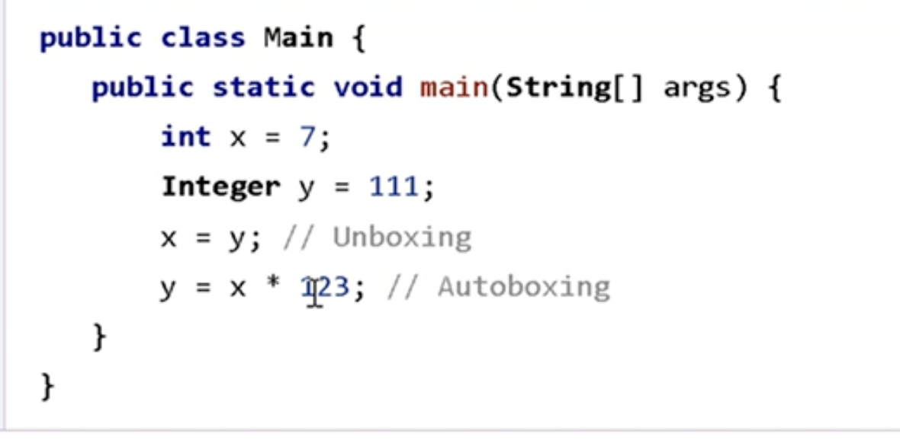

# Clase Nivelación 2: Conceptos Básicos de Programación

## Pensamiento Lógico y Estructuras de Control

### Pensamiento lógico

Es la capacidad de estructurar pasos de forma ordenada para resolver problemas:

```text
Entrada → Proceso → Salida (opcional)
```

### Estructuras de control

Son mecanismos que permiten:

- Tomar decisiones (condicionales: `if`, `else`, `switch`)
- Repetir acciones (bucles: `for`, `while`, `do-while`)
- Controlar el flujo de ejecución del programa

## Algoritmos y Complejidad

### ¿Qué es un algoritmo?

Es una secuencia finita de pasos bien definidos para llevar a cabo una tarea o resolver un problema.

**Características de un buen algoritmo:**

- **Finito:** Debe terminar después de un número determinado de pasos
- **Definido:** Cada paso debe estar claramente especificado
- **Efectivo:** Cada paso debe ser realizable
- **Entrada:** Puede tener cero o más entradas
- **Salida:** Debe producir al menos un resultado

### ¿Qué es la complejidad algorítmica?

Es una medida del tiempo o espacio (memoria) que requiere un algoritmo para ejecutarse en función del tamaño de la entrada.

**Tipos de complejidad:**

- **Complejidad temporal:** Tiempo que tarda en ejecutarse
- **Complejidad espacial:** Memoria que utiliza durante la ejecución

### Big O Notation

Es una notación matemática estándar utilizada para describir la complejidad algorítmica en el peor caso.

**Complejidades más comunes (de mejor a peor):**

| Notación | Nombre | Ejemplo |
|----------|--------|---------|
| O(1) | Constante | Acceder a un elemento de un array por índice |
| O(log n) | Logarítmica | Búsqueda binaria |
| O(n) | Lineal | Recorrer un array |
| O(n log n) | Lineal-logarítmica | Merge sort, Quick sort |
| O(n²) | Cuadrática | Bubble sort, dos bucles anidados |
| O(2ⁿ) | Exponencial | Recursión sin optimizar (Fibonacci) |
| O(n!) | Factorial | Problema del viajante (fuerza bruta) |

## Ejercicios Prácticos

### Ejercicio 1: Estructuras condicionales

**Objetivo:** Determinar si un número es positivo, negativo o cero, y si es par o impar.

```java
import java.util.Scanner;

public class Main {
  public static void main(String[] args) {
    Scanner sc = new Scanner(System.in);
    System.out.print("Ingrese un número: ");
    int num = sc.nextInt();

    // Verificar si es positivo, negativo o cero
    if (num > 0) {
      System.out.println("El número es positivo");
    } else if (num < 0) {
      System.out.println("El número es negativo");
    } else {
      System.out.println("El número es cero");
    }
    
    // Verificar si es par o impar
    if (num % 2 == 0) {
      System.out.println("El número es par");
    } else {
      System.out.println("El número es impar");
    }
  }
}
```

### Ejercicio 2: Autoboxing vs Unboxing

**Contexto:** En Java existen tipos de datos primitivos y sus equivalentes como objetos envoltorio (Wrapper classes).

#### Tipos primitivos vs Clases envoltorio

| Primitivo | Clase envoltorio | Descripción |
|-----------|------------------|-------------|
| `int` | `Integer` | Número entero |
| `double` | `Double` | Número decimal |
| `boolean` | `Boolean` | Valor verdadero/falso |
| `char` | `Character` | Carácter |
| `long` | `Long` | Número entero largo |

#### Conceptos clave

**Autoboxing:** Conversión automática de un tipo primitivo a su clase envoltorio

```java
int a = 5;           // primitivo
Integer b = a;       // autoboxing: int → Integer
```

**Unboxing:** Conversión automática de una clase envoltorio a su tipo primitivo

```java
Integer x = 10;      // objeto envoltorio
int y = x;           // unboxing: Integer → int
```

#### Ejemplo práctico

```java
public class AutoboxingDemo {
  public static void main(String[] args) {
    int a = 5;
    Integer b = a; // autoboxing
    
    System.out.println("Comparación con == : " + (a == b));
    System.out.println("Comparación con equals : " + b.equals(a));
  }
}
```

**Explicación del código:**

- Java convierte automáticamente entre primitivos y objetos (autoboxing/unboxing)
- `==` compara referencias en memoria (para objetos) o valores (para primitivos)
- `.equals()` compara el valor contenido en los objetos
- En este caso, ambos retornan `true` debido al autoboxing automático

#### Ejemplo extra



**Puntos importantes:**

- **Autoboxing:** Facilita el uso de primitivos donde se esperan objetos (ej: colecciones como `ArrayList<Integer>`)
- **Unboxing:** Permite usar objetos donde se esperan primitivos
- **Precaución:** El unboxing puede causar `NullPointerException` si el objeto envoltorio es `null`

## POO Esencial y Excepciones

### Pilares de la Programación Orientada a Objetos (POO)

| Concepto | Explicación |
| :--- | :--- |
| **Clase** | Plantilla o molde que define los atributos (estado) y métodos (comportamiento) comunes a un tipo de objeto. |
| **Objeto** | Instancia concreta de una clase. Tiene su propio estado y puede ejecutar los comportamientos definidos en su clase. |
| **Encapsulación** | Oculta los detalles internos de un objeto y expone solo lo necesario a través de una interfaz pública (getters y setters). Protege la integridad de los datos. |
| **Herencia** | Permite que una clase (subclase) herede atributos y métodos de otra (superclase), fomentando la reutilización de código. |
| **Polimorfismo** | Capacidad de los objetos de diferentes clases para responder al mismo mensaje (método) de maneras específicas. Se manifiesta a través de la sobrecarga y la anulación de métodos. |

### Manejo de Excepciones

Una **excepción** es un evento que ocurre durante la ejecución de un programa y que interrumpe el flujo normal de instrucciones. El manejo de excepciones permite capturar y gestionar estos errores de forma controlada.

**Bloques clave en Java:**

- **`try`**: Envuelve el código que podría generar una excepción.
- **`catch`**: Captura y maneja la excepción si ocurre. Se ejecuta solo si se produce un error en el bloque `try`.
- **`finally`**: Contiene código que se ejecutará siempre, haya o no una excepción. Es ideal para liberar recursos.

#### Ejemplo de Excepciones

```java
public class ExcepcionesDemo {
    public static void main(String[] args) {
        try {
            // Este código puede lanzar una ArithmeticException
            int resultado = 10 / 0;
            System.out.println("El resultado es: " + resultado);
        } catch (ArithmeticException e) {
            // Se captura el error y se muestra un mensaje amigable
            System.out.println("Error: No se puede dividir por cero.");
        } finally {
            // Este bloque se ejecuta siempre
            System.out.println("La operación ha finalizado.");
        }
    }
}
```

### Temas Adicionales Vistos en Clase

Durante la sesión, se abordaron de manera extensa los siguientes temas complementarios:

- **Repaso de POO:** Se dedicó una parte considerable de la clase (~1h 20m) a profundizar en los conceptos de la programación orientada a objetos.
- **Pruebas Unitarias:** Se introdujo el concepto y la importancia de las pruebas unitarias para verificar el correcto funcionamiento de pequeñas unidades de código.
- **TDD (Test-Driven Development):** Se mencionó el Desarrollo Guiado por Pruebas como una metodología donde las pruebas se escriben antes que el código de producción.
- **Herramientas y Buenas Prácticas:**
  - **GitHub:** Se destacó su rol en el versionado de código y en la integración de flujos de trabajo.
  - **Code Smells:** Se introdujo la idea de "olores de código" como indicadores de posibles problemas en el diseño del software.
  - Se dijo que "las pruebas unitarias tienen sentido cuando las configuramos en GitHub o una herramienta que nos diga si pasaron".

Google Doc con lo visto en esta clase: <https://docs.google.com/document/d/1nQ1fGeUnOv6WV4-QNfjaMuG9R7RnrhiWA0-sd27PqQ0/edit?pli=1&tab=t.0>
