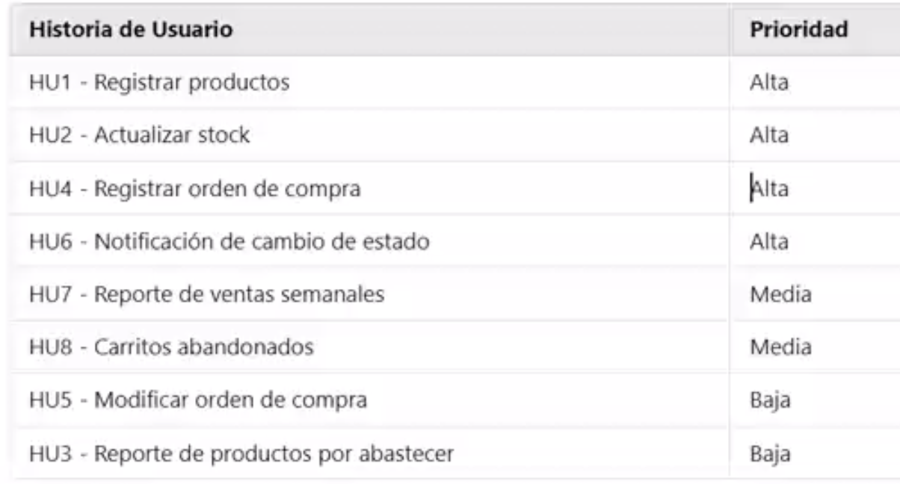
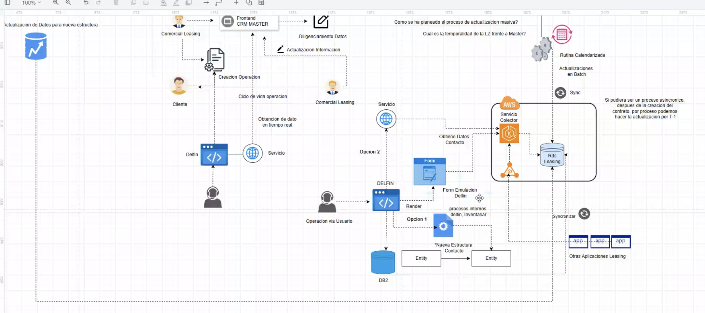

# Clase 1 - Introducción al proyecto

## Contexto del proyecto

Arka es una empresa de ventas de equipo de tecnologías, que quiere migrar sus operaciones a la web, por ejemplo:

- Gestión de inventario
- Gestión de pedidos

Se debe crear un canal digital / sitio de compras / marketplace
Su propósito es pasar del mundo físico al virtual
El proyecto es individual

### Documentación del Proyecto

- [Backlog del proyecto Java Backend Arka](assets/PDFs/Backlog%20del%20proyecto%20Java%20Backend%20Arka.pdf)
- [Proyecto Arka - Versión 1](assets/PDFs/Proyecto%20Arka%201.pdf)
- [Proyecto Java Backend Reto - Versión 2](assets/PDFs/Proyecto%20Java%20Backend%20Reto%20V2.pdf)

### Consejos del proyecto con base a HUs

- El “Maestro” del campo de categoría sería una Tabla/Clase de Categoría
- Como se deben vender cosas, hay que considerar atributos adicionales a los criterios de aceptación escritos en el pdf:
  - Moneda
  - Impuestos
  - Entero, Decimal
  - Costo != Precio (costo de compra, precio de venta)
- Considerar Validaciones adicionales, como:
  - Precio > Costo
  - Precio NO vacío
- Puntos de re-orden: se debe automatizar que cuando hayan X unidades, se debe emitir una alerta
- Para restar inventario, se puede dar por compras de clientes o por “mermas”, que son daños de producto, robo, etc
- Para validar la disponibilidad del stock, se recomienda implementar un sistema de reserva del Stock, pero con tiempo límite
- Máquina de estados: Se deben diseñar los diferentes estados de un pedido, como:
  - Pendiente
  - Confirmado
  - En despacho / distribución
  - Entregado
- Total de ventas en dinero y # de productos, se contabiliza con productos con estado CONFIRMADO
- Cómo se maneja la rentabilidad en reportes periódicos, cuando se base en variables dinámicas como el costo, que por ejemplo, puede cambiar de lunes a jueves
  - En Retail, hay un concepto de Costo promedio, se hacen las cuentas con un costo promedio dentro del periodo analizado
- Aporta mucho valor revisar los carritos de compra abandonados, para contactar a los clientes y recuperar ventas
  - Se debe determinar el Tiempo a esperar para que un carrito se considere abandonado

### Recomendación de orden de HUs

### Diagramas en el proyecto

- Diagrama de Base de datos
- Diagrama de Infraestructura
- Diagrama de Arquitectura

#### Diagramas adicionales

- Diagrama de clases
- Diagrama de despliegue
- Diagrama de DDD

## Ciclo de Vida del Desarrollo de Software (SDLC)

El ciclo de vida del desarrollo de software es un proceso estructurado que se utiliza para diseñar, desarrollar y probar software de alta calidad. A continuación se describen las principales fases:

### 1. Planificación

En esta fase inicial se definen los objetivos del proyecto, se estiman los recursos necesarios y se establece el cronograma.

**Preguntas clave:**

- ¿Cómo se planifican o estiman plazos sin el análisis previo?
  - Normalmente, hay apoyo de personas con mucha experiencia que se han enfrentado a muchos proyectos similares y pueden estimar "a ojo", de manera preliminar, basándose en su experiencia.

### 2. Análisis (del Negocio)

Se estudian las necesidades del negocio y se definen los requisitos del sistema. Es crucial entender el dominio del problema.

**Estrategias y herramientas:**

- **DDD (Domain-Driven Design):** Enfoque de desarrollo guiado por el dominio del negocio
- **Diagramas de flujo:** Ayudan a visualizar procesos
  - **Diagrama de ojo de pez:** Para análisis de causa-efecto
  - **Diagrama BPMN (Business Process Model and Notation):** Estándar internacional para diagramar procesos de negocio. **ESTUDIAR**

### 3. Diseño

Se crea la arquitectura del sistema y se definen los componentes técnicos.

**Herramientas:**

- **Diagramas UML:** Para modelar la estructura y comportamiento del sistema
- Diagramas de base de datos
- Diagramas de arquitectura

### 4. Desarrollo

Fase de implementación donde se escribe el código según las especificaciones del diseño.

### 5. Pruebas

Se verifica que el software funcione correctamente y cumpla con los requisitos establecidos.

**Tipos de pruebas:**

- Unitarias
- Integración
- Sistema
- Aceptación

### 6. Implementación

Se despliega el software en el ambiente de producción para que los usuarios finales puedan utilizarlo.

### 7. Mantenimiento

Se realizan actualizaciones, correcciones de errores y mejoras continuas del sistema.

## Pilares de la Comunicación

- Contrastar el mensaje con el emisor: “Parafrasear”

---

> A las 7:30pm, no se ha dado comienzo al contenido de la clase, ya que se están aclarando discrepancias entre el pensum del profe y el de los estudiantes; además, se sigue buscando los recursos del proyecto Arka para presentarse

> Se sugiere nutrirse del nicho de negocio, en este caso, se debería estudiar a profundidad sobre Retail

> Esta clase se enfocó muy fuertemente en negocio, más allá de lo técnico

> Los Cron Jobs son el mecanismo más común para automatizar acciones periódicas en un micro-servicio
