# Clase 2 - Java

## Índice

1. [Generalidades del lenguaje](#generalidades-del-lenguaje)
2. [Paradigma POO](#paradigma-poo)
3. [Utilidades de String](#utilidades-de-string)
4. [Modificador Static](#modificador-static)
5. [Pattern Matching en Java](#pattern-matching-en-java)
6. [Excepciones](#excepciones)

## Resumen

Clase enfocada en los fundamentos de **Java**: generalidades del lenguaje (compilado vs interpretado, JVM, JRE, JDK, licencias), el paradigma de **Programación Orientada a Objetos** (abstracción, encapsulamiento, herencia, polimorfismo), utilidades de `String`, el modificador `static`, **Pattern Matching** moderno (Java 14+), y el manejo de **excepciones**.

---

## Generalidades del lenguaje

- Altamente tipado
- Es un lenguaje independiente de plataformas
- Principalmente se centra en el paradigma de Programación Orientada a Objetos
- Su mayor ventaja es la portabilidad (WORA= Write Once, Run Anywhere)

### Lenguajes Compilados vs Interpretados

#### Lenguajes Compilados

- El código fuente se traduce completamente a código máquina antes de la ejecución
- El resultado es un archivo ejecutable nativo del sistema operativo
- Mayor velocidad de ejecución
- Ejemplos: C, C++, Go, Rust
- Ventajas:
  - Rendimiento superior
  - Detección de errores en tiempo de compilación
  - No requiere intérprete en el sistema destino
- Desventajas:
  - Menos portabilidad (un ejecutable por plataforma)
  - Proceso de compilación puede ser lento

#### Lenguajes Interpretados

- El código se ejecuta línea por línea en tiempo de ejecución
- Requiere un intérprete instalado en el sistema
- Mayor flexibilidad y facilidad de depuración
- Ejemplos: Python, JavaScript, Ruby
- Ventajas:
  - Portabilidad del código fuente
  - Desarrollo más rápido e iterativo
  - Más fácil de depurar
- Desventajas:
  - Menor rendimiento
  - Requiere el intérprete instalado

#### Java: Un Enfoque Híbrido

Java combina ambos enfoques:

1. **Compilación**: El código fuente (.java) se compila a bytecode (.class)
2. **Interpretación**: La JVM interpreta el bytecode en tiempo de ejecución
3. **JIT Compiler**: Optimiza partes críticas compilándolas a código nativo durante la ejecución

Esto le da a Java:

- La portabilidad de los lenguajes interpretados (bytecode multiplataforma)
- El rendimiento cercano a los lenguajes compilados (gracias al JIT)

### JVM - Java Virtual Machine

Es un componente diseñado en cada sistema operativo para interpretar el compilado de Java, lo que lo hace portable:

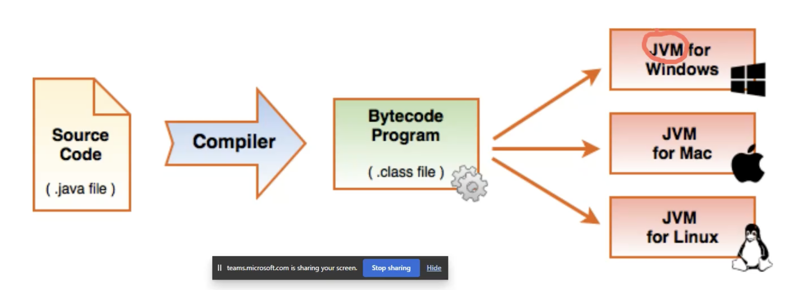

### JRE - Java Runtime Environment

- Incluye librerías de Java como:
  - java.lang.Math
  - java.util.Arrays
  - Etc
- El JRE ya incluye la JVM
- Con la JRE podemos EJECUTAR cualquier programa Java

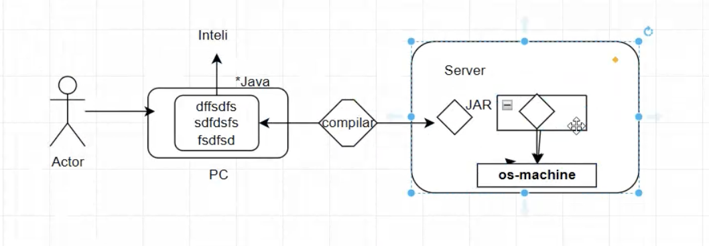

> JAR: Java Archive = es la extensión del compilado de Java

### JDK - Java Development Kit

Es un paquete que trae herramientas para que el desarrollo en Java sea más cómodo

Incluye:

- El compilador -> Javac (Java Compiler)
- Debugger
- Lenguaje de programación
- Incluye JRE y por consiguiente la JVM
- Podemos CREAR y EJECUTAR cualquier programa

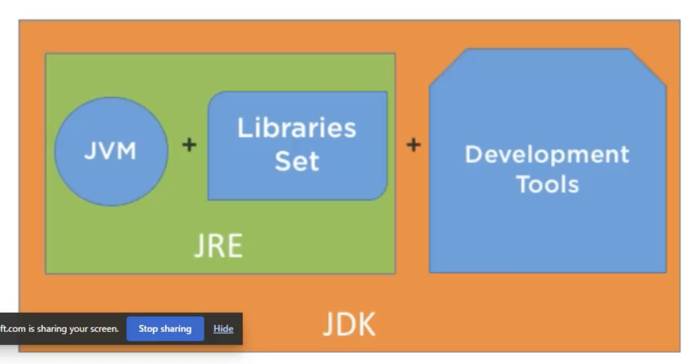

#### ¿En qué se diferencia el JDK con un JRE?

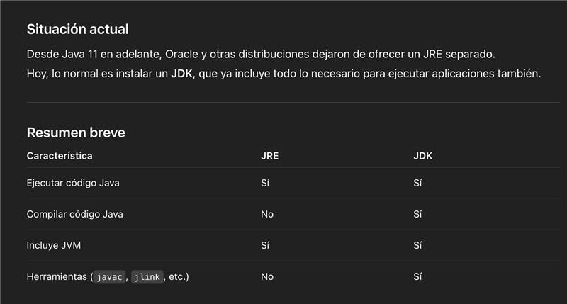

#### Licencias en Java

Hay versiones pagas del JDK como Oracle JDK, y otras abiertas como OpenJDK o Amazon Corretto.

##### Historia de Java y sus Licencias

**Evolución de la propiedad:**

- **1995**: Sun Microsystems crea Java
- **2009**: Oracle Corporation adquiere Sun Microsystems por $7.4 billones
- **2010**: Oracle se convierte en el propietario oficial de Java

**Cambios en el modelo de licenciamiento:**

- **Hasta Java 8 (2014)**: Java era completamente gratuito para uso comercial
- **Java 9-10 (2017-2018)**: Periodo de transición
- **Java 11+ (2018)**: Oracle introduce cambios significativos en el licenciamiento

**Modelo actual de Oracle:**

- Oracle ofrece Java bajo la licencia **NFTC (Oracle Technology Network License Agreement)**
- Oracle JDK es gratuito para:
  - Desarrollo
  - Pruebas
  - Prototipos
- Para **uso en producción comercial**, Oracle JDK requiere una suscripción paga
- Las actualizaciones de seguridad de versiones LTS (Long Term Support) también requieren licencia comercial

##### Diferencias: Oracle JDK vs Amazon Corretto vs OpenJDK

| Característica                   | Oracle JDK                   | Amazon Corretto                          | OpenJDK                           |
| -------------------------------- | ---------------------------- | ---------------------------------------- | --------------------------------- |
| **Licencia**                     | NFTC (pago para producción)  | GPL v2 + CPE (100% gratuito)             | GPL v2 (gratuito)                 |
| **Soporte**                      | Pago (Oracle Support)        | Gratuito por Amazon                      | Comunidad                         |
| **Actualizaciones de seguridad** | Solo con suscripción         | Gratis, largo plazo                      | Variables según distribución      |
| **Optimizaciones**               | Incluye Java Flight Recorder | Optimizado para AWS                      | Estándar                          |
| **Rendimiento**                  | Alto                         | Alto (optimizaciones AWS)                | Alto                              |
| **Uso recomendado**              | Empresas con contrato Oracle | Producción general, especialmente en AWS | Desarrollo, proyectos open source |
| **Certificación TCK**            | Sí                           | Sí                                       | Sí (base de referencia)           |

**¿Por qué usar Amazon Corretto?**

- Totalmente gratuito incluso en producción
- Soporte a largo plazo sin costo
- Optimizaciones específicas para entornos cloud
- Respaldado por Amazon
- Compatible con aplicaciones Java estándar

## Paradigma POO

Es un paradigma de programación que busca modelar comportamientos de la vida real por medio de objetos

- Un objeto tiene propiedades y comportamientos, que modelamos como atributos y métodos
- Las clases funcionan como plantilla para crear nuevos objetos
- Se abstrae entonces la vida real a una simplificación basada en clases y sus instancias, objetos
- Al ‘instanciar’ una clase, se crea un objeto que reproduce los atributos y métodos de una clase que se reserva en memoria

### Pilares POO

La Programación Orientada a Objetos se sustenta en cuatro pilares fundamentales que permiten crear código organizado, reutilizable y mantenible:

1. **Abstracción**: Simplificar la complejidad mostrando solo lo esencial
2. **Encapsulamiento**: Proteger los datos internos del objeto
3. **Herencia**: Reutilizar código mediante relaciones padre-hijo
4. **Polimorfismo**: Permitir que objetos de diferentes tipos sean tratados de manera uniforme

#### Abstracción

Oculta los detalles internos y solo muestra lo necesario. Permite definir el qué pero no el cómo
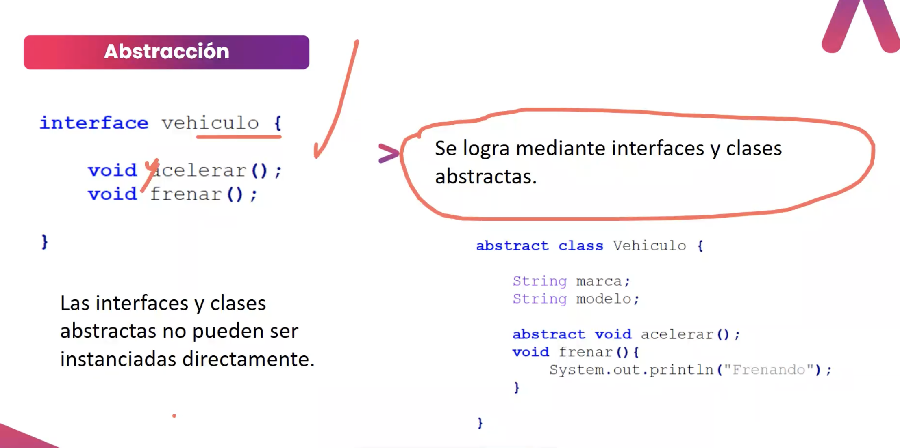

##### Extends vs Implements en Java

**EXTENDS** - Herencia de Clases:

- Permite heredar los atributos y métodos de una clase padre
- Una clase hija obtiene todo el comportamiento implementado de la clase padre
- Java solo permite **herencia simple** (extends de una sola clase)
- La clase hija puede sobrescribir (override) métodos del padre
- Usa `super` para acceder a métodos/constructores del padre

```java
public class Animal {
    protected String nombre;

    public void comer() {
        System.out.println("El animal está comiendo");
    }
}

public class Perro extends Animal {
    // Hereda 'nombre' y 'comer()'

    @Override
    public void comer() {
        System.out.println("El perro está comiendo croquetas");
    }

    public void ladrar() {
        System.out.println("Guau guau!");
    }
}
```

**IMPLEMENTS** - Implementación de Interfaces:

- Obliga a implementar un contrato definido por una interfaz
- La interfaz solo define **qué** debe hacerse, no **cómo**
- Una clase puede implementar **múltiples interfaces** (herencia múltiple de comportamiento)
- Todos los métodos de la interfaz deben ser implementados (excepto los default)
- Las interfaces pueden contener:
  - Métodos abstractos (sin implementación)
  - Métodos default (con implementación por defecto)
  - Constantes (public static final)
  - Métodos estáticos

```java
public interface Volador {
    void volar();
    void aterrizar();
}

public interface Nadador {
    void nadar();
}

public class Pato extends Animal implements Volador, Nadador {
    // Hereda de Animal
    // Debe implementar todos los métodos de Volador y Nadador

    @Override
    public void volar() {
        System.out.println("El pato vuela");
    }

    @Override
    public void aterrizar() {
        System.out.println("El pato aterriza");
    }

    @Override
    public void nadar() {
        System.out.println("El pato nada en el lago");
    }
}
```

**Comparativa:**

| Aspecto              | EXTENDS                       | IMPLEMENTS                          |
| -------------------- | ----------------------------- | ----------------------------------- |
| **Tipo de relación** | "es un" (is-a)                | "puede hacer" (can-do)              |
| **Qué hereda**       | Implementación completa       | Solo la definición (contrato)       |
| **Cantidad**         | Solo una clase                | Múltiples interfaces                |
| **Métodos**          | Pueden estar implementados    | Deben implementarse (abstractos)    |
| **Atributos**        | Hereda atributos del padre    | Solo constantes (static final)      |
| **Obligación**       | Opcional sobrescribir métodos | Obligatorio implementar todos       |
| **Uso típico**       | Reutilización de código       | Definir capacidades/comportamientos |
| **Ejemplo**          | `Perro extends Animal`        | `List implements Collection`        |

###### Interfaz vs Clase Abstracta

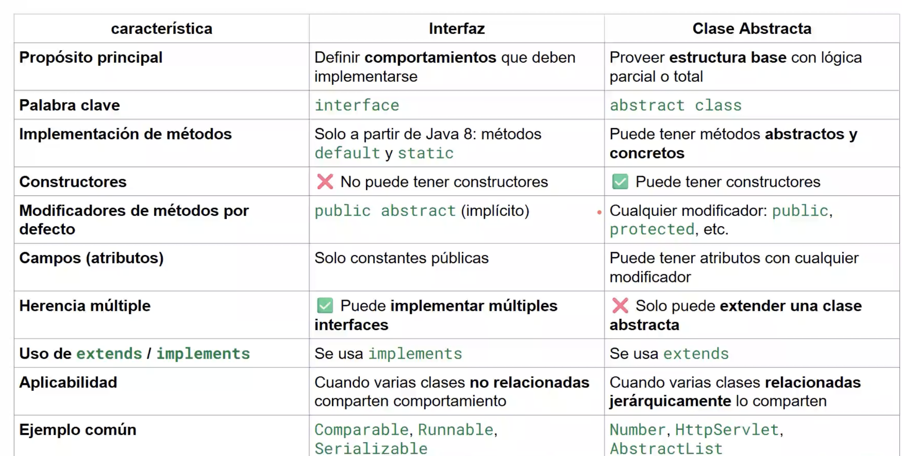

#### Encapsulamiento

Protege los datos internos de una clase y los expone solo mediante métodos controlados

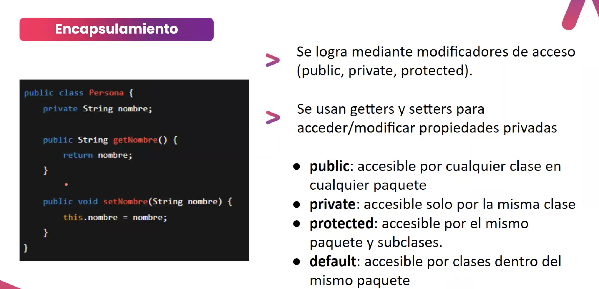

#### Herencia

Permite la reutilización de código, al extender atributos o métodos a clases hijas

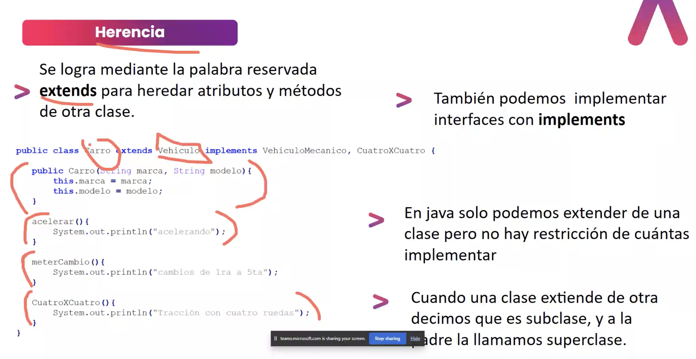

#### Polimorfismo

Un mismo método puede comportarse de forma diferente según el objeto que lo invoque.

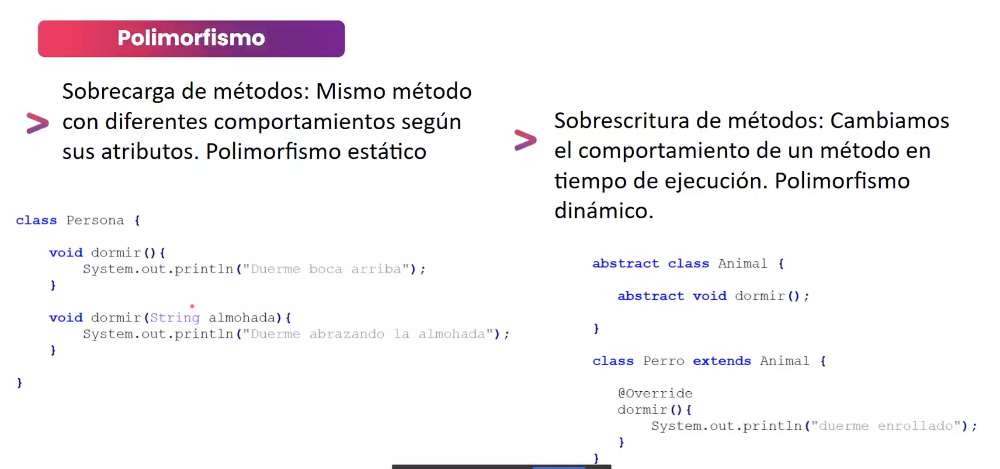

Existen dos tipos principales de polimorfismo en Java:

##### 1. Polimorfismo en Tiempo de Compilación (Sobrecarga - Overloading)

**Sobrecarga de Métodos** permite tener múltiples métodos con el **mismo nombre** pero con **diferentes parámetros** en la misma clase.

**Características:**

- Mismo nombre de método
- Diferente número, tipo o orden de parámetros
- Puede tener diferentes tipos de retorno (pero esto solo no es suficiente)
- Se resuelve en tiempo de compilación (estático)

**Ejemplo de sobrecarga:**

```java
public class Calculadora {
    // Sobrecarga por número de parámetros
    public int sumar(int a, int b) {
        return a + b;
    }

    public int sumar(int a, int b, int c) {
        return a + b + c;
    }

    // Sobrecarga por tipo de parámetros
    public double sumar(double a, double b) {
        return a + b;
    }

    // Sobrecarga por orden de parámetros
    public String sumar(String a, int b) {
        return a + b;
    }

    public String sumar(int a, String b) {
        return a + b;
    }
}

// Uso:
Calculadora calc = new Calculadora();
calc.sumar(5, 3);           // Llama al primer método: 8
calc.sumar(5, 3, 2);        // Llama al segundo método: 10
calc.sumar(5.5, 3.2);       // Llama al tercer método: 8.7
calc.sumar("Total: ", 10);  // Llama al cuarto método: "Total: 10"
```

**¿Por qué es útil la sobrecarga?**

- Proporciona flexibilidad al llamar métodos
- Hace el código más legible (mismo nombre para operaciones similares)
- Facilita el uso de la API (no necesitas recordar nombres diferentes)

##### 2. Polimorfismo en Tiempo de Ejecución (Sobrescritura - Overriding)

**Sobrescritura de Métodos** permite que una clase hija redefina un método heredado de la clase padre.

**Características:**

- Mismo nombre, mismos parámetros, mismo tipo de retorno (o covariante)
- Se usa la anotación `@Override`
- Se resuelve en tiempo de ejecución (dinámico)
- El método en la clase hija "reemplaza" al del padre

**Ejemplo de sobrescritura:**

```java
public class Animal {
    public void hacerSonido() {
        System.out.println("El animal hace un sonido");
    }
}

public class Perro extends Animal {
    @Override
    public void hacerSonido() {
        System.out.println("El perro ladra: Guau!");
    }
}

public class Gato extends Animal {
    @Override
    public void hacerSonido() {
        System.out.println("El gato maúlla: Miau!");
    }
}

// Uso - Polimorfismo en acción:
Animal miAnimal1 = new Perro();
Animal miAnimal2 = new Gato();

miAnimal1.hacerSonido(); // Imprime: "El perro ladra: Guau!"
miAnimal2.hacerSonido(); // Imprime: "El gato maúlla: Miau!"
```

###### Comparativa: Sobrecarga vs Sobrescritura

| Aspecto                   | Sobrecarga (Overloading) | Sobrescritura (Overriding)         |
| ------------------------- | ------------------------ | ---------------------------------- |
| **Ocurre en**             | Misma clase              | Clase padre e hija                 |
| **Nombre del método**     | Igual                    | Igual                              |
| **Parámetros**            | Diferentes               | Iguales                            |
| **Tipo de retorno**       | Puede variar             | Debe ser igual o covariante        |
| **Momento de resolución** | Compilación (estático)   | Ejecución (dinámico)               |
| **Anotación**             | No tiene                 | @Override                          |
| **Propósito**             | Flexibilidad de uso      | Especialización del comportamiento |

## Utilidades de String

### isEmpty() vs isBlank()

Java proporciona dos métodos para verificar si un String está vacío, pero con diferencias importantes:

| Método      | Descripción                                               | Ejemplo                    |
| ----------- | --------------------------------------------------------- | -------------------------- |
| `isEmpty()` | Verifica si `length() == 0`                               | `"".isEmpty()` → `true`    |
| `isBlank()` | Verifica si está vacío O solo contiene espacios en blanco | `"   ".isBlank()` → `true` |

**Ejemplos:**

```java
String vacio = "";
String espacios = "   ";
String texto = "Hola";

// isEmpty()
vacio.isEmpty();     // true
espacios.isEmpty();  // false (tiene caracteres, aunque sean espacios)
texto.isEmpty();     // false

// isBlank()
vacio.isBlank();     // true
espacios.isBlank();  // true (solo espacios)
texto.isBlank();     // false
```

**¿Cuándo usar cada uno?**

- **`isEmpty()`**: Cuando solo necesitas verificar si el String tiene longitud 0
- **`isBlank()`**: Cuando quieres considerar Strings con solo espacios como "vacíos" (más común en validaciones)

---

## Modificador Static

El modificador **`static`** en Java permite que variables y métodos pertenezcan a la clase en lugar de a instancias individuales.

### Variables Static

Las **variables estáticas** (también llamadas variables de clase) se comparten entre todas las instancias de una clase.

**Características:**

- Se almacenan en memoria una sola vez, independientemente del número de objetos creados
- Todas las instancias comparten el mismo valor
- Se pueden acceder directamente desde la clase sin crear un objeto
- Se pueden modificar sin necesidad de setters, y el cambio afecta a todos los objetos

**Ejemplo:**

```java
public class Contador {
    // Variable static compartida por todas las instancias
    public static int totalObjetos = 0;

    // Variable de instancia (única por objeto)
    private int id;

    public Contador() {
        totalObjetos++;  // Se incrementa para todos los objetos
        this.id = totalObjetos;
    }

    public void mostrarInfo() {
        System.out.println("ID: " + id + ", Total objetos: " + totalObjetos);
    }
}

// Uso
Contador c1 = new Contador();
Contador c2 = new Contador();
Contador c3 = new Contador();

c1.mostrarInfo();  // ID: 1, Total objetos: 3
c2.mostrarInfo();  // ID: 2, Total objetos: 3
c3.mostrarInfo();  // ID: 3, Total objetos: 3

// Acceso directo sin crear objeto
System.out.println(Contador.totalObjetos);  // 3

// Modificación afecta a todos
Contador.totalObjetos = 100;
c1.mostrarInfo();  // ID: 1, Total objetos: 100
```

### Métodos Static

Los **métodos estáticos** pertenecen a la clase y pueden ser llamados sin crear una instancia.

**Características:**

- No pueden acceder a variables de instancia (no-static)
- Solo pueden acceder a otras variables y métodos static
- Se usan para operaciones que no dependen del estado de un objeto

**Ejemplo:**

```java
public class Utilidades {

    // Método static - no necesita instancia
    public static int sumar(int a, int b) {
        return a + b;
    }

    public static double calcularIVA(double precio) {
        return precio * 0.19;
    }
}

// Uso sin crear objeto
int resultado = Utilidades.sumar(5, 3);  // 8
double iva = Utilidades.calcularIVA(100);  // 19.0
```

### Constantes Static Final

La combinación `static final` se usa para definir constantes globales:

```java
public class Configuracion {
    // Constante compartida e inmutable
    public static final String NOMBRE_APP = "MiAplicacion";
    public static final int MAX_USUARIOS = 100;
    public static final double PI = 3.14159;
}

// Uso
System.out.println(Configuracion.NOMBRE_APP);
```

### Bloques Static

Los **bloques de inicialización estáticos** se ejecutan una sola vez cuando la clase se carga:

```java
public class BaseDatos {
    private static Connection conexion;

    // Bloque static - se ejecuta al cargar la clase
    static {
        System.out.println("Inicializando conexión a BD...");
        conexion = crearConexion();
    }

    private static Connection crearConexion() {
        // Lógica de conexión
        return null;
    }
}
```

### Cuándo Usar Static

| Usar Static                       | No Usar Static                              |
| --------------------------------- | ------------------------------------------- |
| Métodos utilitarios (Math.sqrt()) | Métodos que dependen del estado del objeto  |
| Constantes globales (Math.PI)     | Atributos únicos por instancia              |
| Contadores compartidos            | Cuando necesitas polimorfismo               |
| Factory methods                   | Cuando necesitas herencia de comportamiento |

### Ventajas y Desventajas

**✅ Ventajas:**

- Ahorro de memoria (una sola copia compartida)
- Acceso directo sin crear objetos
- Útil para constantes y utilidades

**❌ Desventajas:**

- Dificulta el testing (estado global)
- Rompe encapsulamiento si se abusa
- No soporta polimorfismo
- Puede causar problemas en aplicaciones multi-hilo

> 💡 **Buena práctica:** Usa `static` para constantes y métodos utilitarios, pero evita el abuso de variables estáticas mutables ya que crean estado global difícil de mantener.

---

## Pattern Matching en Java

Java moderno (desde Java 14+) introduce **Pattern Matching**, que permite escribir código más expresivo y conciso, especialmente con `switch`.

### Switch Expressions (Java 14+)

La sintaxis moderna de `switch` permite usar expresiones con la flecha `->`:

```java
String option = "1";

switch (option) {
    case "1" -> simpleChat(simpleChatUseCase, scanner);
    case "2" -> chatWithContext(simpleChatUseCase, scanner);
    case "3" -> chatWithHistory(simpleChatUseCase, scanner);
    case "4" -> {
        System.out.println("\n Saliendo...");
        scanner.close();
        System.exit(0);
    }
    default -> System.out.println("Opción no válida");
}
```

**Ventajas sobre el switch tradicional:**

- No necesita `break` (no hay fall-through)
- Más conciso y legible
- Puede retornar valores directamente
- Soporta bloques de código con `{}`

### Pattern Matching con instanceof (Java 16+)

Permite detectar tipos y asignar variables en una sola línea:

```java
// ❌ Forma antigua
if (obj instanceof String) {
    String s = (String) obj;
    System.out.println(s.toUpperCase());
}

// ✅ Pattern Matching
if (obj instanceof String s) {
    System.out.println(s.toUpperCase());
}
```

### Pattern Matching en Switch (Java 21+)

Combina `switch` con detección de tipos y condiciones:

```java
// Detectar tipos con instanceof
Object obj = ...;

String resultado = switch (obj) {
    case Integer i -> "Número entero: " + i.doubleValue();
    case String s when s.length() > 0 -> "String no vacío: " + s;
    case String s -> "String vacío";
    case null -> "Valor nulo";
    default -> "Tipo desconocido";
};
```

### Ejemplo Práctico: Refactorización con Pattern Matching

**Antes (código verboso):**

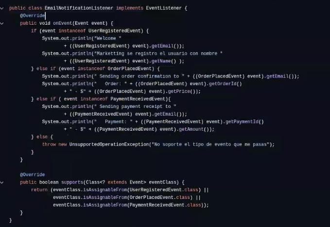

**Después (con Pattern Matching):**

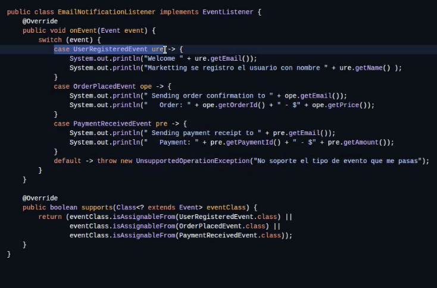

El código refactorizado:

- Usa `switch` con pattern matching
- Detecta el tipo de evento con `instanceof`
- Llama a métodos privados especializados para cada tipo
- Es más legible y mantenible

**Beneficios:**

✅ Menos código boilerplate  
✅ Más expresivo y legible  
✅ Type-safe (el compilador verifica los tipos)  
✅ Facilita el mantenimiento

---

## Excepciones

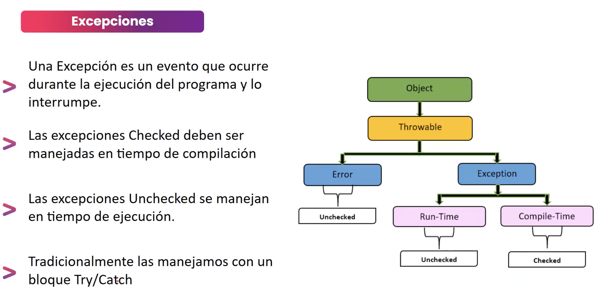

Las excepciones en Java son eventos que interrumpen el flujo normal de ejecución de un programa. Java proporciona un mecanismo robusto para manejar errores y situaciones excepcionales.

### Jerarquía de Excepciones

- **Throwable**: Clase base para todos los errores y excepciones
  - **Error**: Problemas graves del sistema (no deberían ser capturados)
    - OutOfMemoryError
    - StackOverflowError
  - **Exception**: Condiciones que un programa debería capturar
    - **Checked Exceptions** (verificadas en compilación): IOException, SQLException
    - **Unchecked Exceptions** (RuntimeException): NullPointerException, ArrayIndexOutOfBoundsException

### Manejo de Excepciones

```java
try {
    // Código que puede lanzar una excepción
    int resultado = 10 / 0;
} catch (ArithmeticException e) {
    // Manejo específico de ArithmeticException
    System.out.println("Error: División por cero");
} catch (Exception e) {
    // Manejo genérico de otras excepciones
    System.out.println("Error general: " + e.getMessage());
} finally {
    // Se ejecuta siempre, haya o no excepción
    System.out.println("Limpieza de recursos");
}
```

### Try-with-resources (Java 7+)

```java
try (FileReader fr = new FileReader("archivo.txt")) {
    // El recurso se cierra automáticamente
    int data = fr.read();
} catch (IOException e) {
    e.printStackTrace();
}
```
