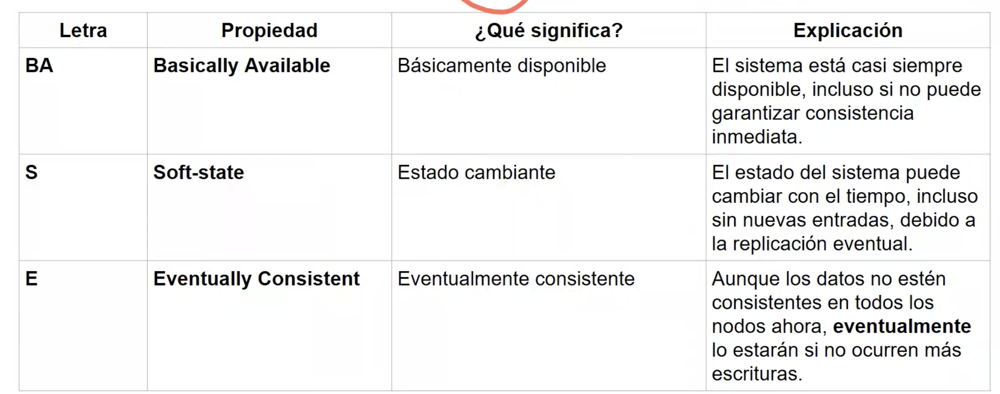
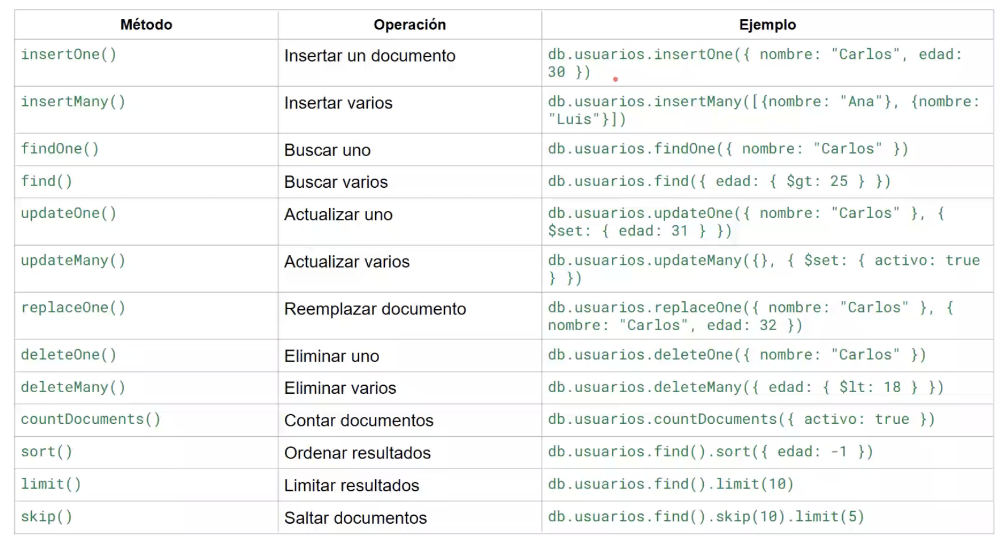
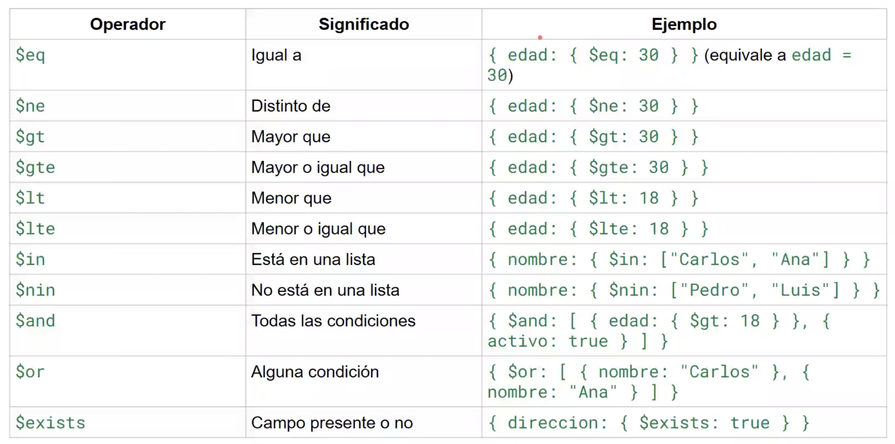
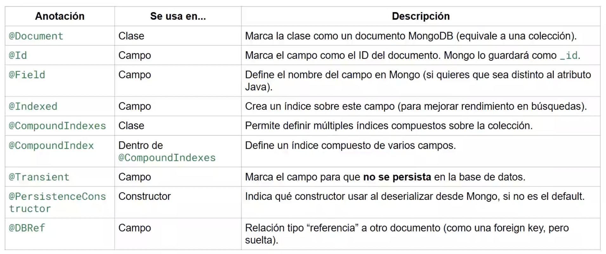

# Clase 5 - Bases de datos NO relacionales

---

## Índice

1. [1. Bases de Datos Relacionales vs No Relacionales](#1-bases-de-datos-relacionales-vs-no-relacionales)
2. [2. Tipos de Bases de Datos NoSQL](#2-tipos-de-bases-de-datos-nosql)
3. [3. Escalamiento Vertical vs Horizontal](#3-escalamiento-vertical-vs-horizontal)
4. [4. Propiedad BASE](#4-propiedad-base)
5. [5. ¿Cuándo usar SQL o NoSQL?](#5-cuándo-usar-sql-o-nosql)
6. [6. MongoDB](#6-mongodb)
7. [7. Ejercicio Práctico: Biblioteca](#7-ejercicio-práctico-biblioteca)
8. [8. Puntos Clave y Recursos](#8-puntos-clave-y-recursos)

## Resumen

Introducción a las **bases de datos NoSQL**: comparativa con SQL, tipos (llave-valor, documental, columnar, grafos), escalamiento horizontal vs vertical, propiedades **BASE** (vs ACID), y práctica con **MongoDB** (documentos, colecciones, operadores, integración con Spring Data).

---

## 1. Bases de Datos Relacionales vs No Relacionales

### Características de Bases de Datos Relacionales (SQL)

| Característica    | Descripción                                          |
| ----------------- | ---------------------------------------------------- |
| **Estructura**    | Tablas con filas y columnas, esquema rígido          |
| **Escalabilidad** | Vertical (más recursos al mismo servidor)            |
| **Propiedades**   | ACID (Atomicity, Consistency, Isolation, Durability) |
| **Caso de uso**   | Sistemas de Información **TRANSACCIONALES**          |
| **Ejemplos**      | MySQL, PostgreSQL, Oracle, SQL Server                |

### Características de Bases de Datos No Relacionales (NoSQL)

| Característica    | Descripción                                                   |
| ----------------- | ------------------------------------------------------------- |
| **Estructura**    | Flexible, sin esquema fijo                                    |
| **Escalabilidad** | Horizontal (distribuir en múltiples nodos)                    |
| **Propiedades**   | BASE (Basically Available, Soft-state, Eventually Consistent) |
| **Caso de uso**   | Big Data, tiempo real, alta disponibilidad                    |

---

## 2. Tipos de Bases de Datos NoSQL

### Estructuras y Ejemplos

| Tipo                   | Descripción                                             | Ejemplos de BD                                  | Caso de uso típico                                            |
| ---------------------- | ------------------------------------------------------- | ----------------------------------------------- | ------------------------------------------------------------- |
| **Llave-Valor**        | Almacena pares clave-valor simples, como un diccionario | **Redis**, **Amazon DynamoDB**, Memcached, Riak | Caché, sesiones de usuario, carritos de compra                |
| **Documental**         | Almacena documentos (similar a JSON/BSON)               | **MongoDB**, CouchDB, Amazon DocumentDB         | Catálogos, gestión de contenido, perfiles de usuario          |
| **Basada en Columnas** | Organiza datos por columnas en lugar de filas           | **Apache Cassandra**, HBase, Amazon Redshift    | Analítica, data warehousing, series temporales                |
| **Basada en Grafos**   | Modela relaciones entre entidades como nodos y aristas  | **Neo4j**, Amazon Neptune, ArangoDB             | Redes sociales, motores de recomendación, detección de fraude |

### ¿Qué son los archivos AVRO?

**Apache Avro** es un sistema de serialización de datos desarrollado por Apache. Sus características principales son:

- **Formato binario compacto**: Optimizado para almacenamiento y transmisión eficiente
- **Esquema incluido**: El esquema se almacena junto con los datos (en JSON)
- **Evolución de esquemas**: Permite cambios en el esquema sin romper compatibilidad
- **Independiente del lenguaje**: Soporta múltiples lenguajes de programación
- **Muy usado en**: Apache Kafka, Apache Spark, Hadoop ecosystem

```json
// Ejemplo de esquema AVRO
{
  "type": "record",
  "name": "Usuario",
  "fields": [
    { "name": "id", "type": "long" },
    { "name": "nombre", "type": "string" },
    { "name": "email", "type": ["null", "string"] }
  ]
}
```

---

## 3. Escalamiento Vertical vs Horizontal

| Aspecto             | Escalamiento Vertical ⬆️                               | Escalamiento Horizontal ↔️                  |
| ------------------- | ------------------------------------------------------ | ------------------------------------------- |
| **Definición**      | Aumentar recursos del mismo servidor (CPU, RAM, disco) | Añadir más servidores/nodos al sistema      |
| **También llamado** | "Scale Up"                                             | "Scale Out"                                 |
| **Límite**          | Limitado por hardware máximo disponible                | Prácticamente ilimitado                     |
| **Costo**           | Exponencial (hardware potente es muy caro)             | Lineal (servidores commodity)               |
| **Complejidad**     | Baja (un solo servidor)                                | Alta (requiere coordinación entre nodos)    |
| **Downtime**        | Requiere apagar para actualizar                        | Sin downtime (se agregan nodos en caliente) |
| **Consistencia**    | Fácil de mantener                                      | Más compleja (CAP theorem)                  |
| **Ideal para**      | SQL tradicional, aplicaciones monolíticas              | NoSQL, microservicios, alta disponibilidad  |

### ¿Por qué NoSQL escala horizontalmente?

> Debido a que sus datos **no necesitan consistencia relacional** (no deben estar relacionados entre sí), se puede **partir la información en nodos independientes**.
>
> **Ejemplo:** Un clúster de MongoDB con un nodo por cada año de datos históricos.

---

## 4. Propiedad BASE

Mientras que las bases de datos SQL siguen el modelo **ACID**, las NoSQL siguen el modelo **BASE**:

| Propiedad                     | Significado               | Explicación                                                                                                                      |
| ----------------------------- | ------------------------- | -------------------------------------------------------------------------------------------------------------------------------- |
| **BA** - Basically Available  | Básicamente Disponible    | El sistema garantiza disponibilidad según el teorema CAP. Siempre responde, aunque sea con datos no actualizados o error parcial |
| **S** - Soft-state            | Estado Suave              | El estado del sistema puede cambiar con el tiempo, incluso sin nuevas entradas, debido a la consistencia eventual                |
| **E** - Eventually Consistent | Eventualmente Consistente | El sistema será consistente en algún momento futuro, no inmediatamente después de una escritura                                  |

### Diagrama de Propiedad BASE



### ACID vs BASE

| ACID (SQL)                         | BASE (NoSQL)                                    |
| ---------------------------------- | ----------------------------------------------- |
| Consistencia fuerte e inmediata    | Consistencia eventual                           |
| Transacciones aisladas             | Disponibilidad sobre consistencia               |
| Ideal para datos críticos (bancos) | Ideal para alta disponibilidad (redes sociales) |

---

## 5. ¿Cuándo usar SQL o NoSQL?

### ✅ Usar **SQL** cuando

| Caso de uso                        | Ejemplo                        |
| ---------------------------------- | ------------------------------ |
| Transacciones críticas             | Sistemas bancarios, pagos      |
| Integridad referencial obligatoria | ERP, sistemas de inventario    |
| Datos altamente estructurados      | Contabilidad, recursos humanos |
| Consultas complejas con JOINs      | Reportes financieros           |
| ACID es obligatorio                | Reservas de vuelos, e-commerce |

### ✅ Usar **NoSQL** cuando

| Caso de uso                          | Ejemplo                         | Tipo recomendado |
| ------------------------------------ | ------------------------------- | ---------------- |
| Alto volumen de datos (Big Data)     | Logs, IoT, sensores             | Columnar         |
| Datos semi-estructurados o variables | Catálogos de productos          | Documental       |
| Baja latencia y alta velocidad       | Caché, sesiones, gaming         | Llave-Valor      |
| Relaciones complejas entre entidades | Redes sociales, recomendaciones | Grafos           |
| Escalabilidad masiva                 | Aplicaciones globales           | Cualquiera       |
| Prototipos rápidos                   | Startups, MVPs                  | Documental       |
| Contenido multimedia                 | Netflix, Spotify                | Documental       |
| Series temporales                    | Métricas, monitoreo             | Columnar         |

---

## 6. MongoDB

### Conceptos Fundamentales

| Concepto SQL  | Equivalente MongoDB     |
| ------------- | ----------------------- |
| Base de datos | Base de datos           |
| Tabla         | **Colección**           |
| Fila/Registro | **Documento**           |
| Columna       | Campo                   |
| Primary Key   | **\_id** (automático)   |
| JOIN          | Embedding / Referencias |

### Características

- Es una BD NoSQL de tipo **Documental**
- Almacena documentos en formato **BSON** (Binary JSON)
- A cada documento se le asigna automáticamente un `_id` único
- Esquema flexible: cada documento puede tener campos diferentes

> ⚠️ **Importante:** A diferencia de las relacionales, **no hay un estándar como SQL** que unifique la manera de interactuar con distintos motores NoSQL. Cada uno tiene su propia sintaxis.

### Consultas en MongoDB



#### Ejemplos de consultas básicas

```javascript
// Insertar documento
db.usuarios.insertOne({
  nombre: "Juan",
  email: "juan@email.com",
  edad: 25,
});

// Buscar documentos
db.usuarios.find({ edad: { $gte: 18 } });

// Actualizar documento
db.usuarios.updateOne({ nombre: "Juan" }, { $set: { edad: 26 } });

// Eliminar documento
db.usuarios.deleteOne({ nombre: "Juan" });
```

### Operadores de MongoDB



#### Operadores más comunes

| Tipo              | Operador         | Descripción                     |
| ----------------- | ---------------- | ------------------------------- |
| **Comparación**   | `$eq`, `$ne`     | Igual, No igual                 |
|                   | `$gt`, `$gte`    | Mayor que, Mayor o igual        |
|                   | `$lt`, `$lte`    | Menor que, Menor o igual        |
|                   | `$in`, `$nin`    | Está en array, No está en array |
| **Lógicos**       | `$and`, `$or`    | Y lógico, O lógico              |
|                   | `$not`, `$nor`   | Negación, Ni uno ni otro        |
| **Actualización** | `$set`           | Establece valor de campo        |
|                   | `$unset`         | Elimina campo                   |
|                   | `$inc`           | Incrementa valor numérico       |
|                   | `$push`, `$pull` | Añade/elimina de array          |

### Anotaciones de Spring Data MongoDB



#### Anotaciones principales

```java
@Document(collection = "usuarios")  // Define la colección
public class Usuario {

    @Id                              // Campo identificador
    private String id;

    @Field("nombre_completo")        // Nombre del campo en MongoDB
    private String nombre;

    @Indexed                         // Crea índice para búsquedas
    private String email;

    @DBRef                           // Referencia a otro documento
    private Departamento departamento;

    @Transient                       // No se persiste en BD
    private String campoTemporal;
}
```

---

## 7. Ejercicio Práctico: Biblioteca

### Enunciado


### Solución en MongoDB

#### Diseño de Colecciones

```javascript
// Colección: libros
{
  _id: ObjectId("..."),
  titulo: "Cien años de soledad",
  autor: "Gabriel García Márquez",
  isbn: "978-0307474728",
  genero: "Realismo mágico",
  año_publicacion: 1967,
  copias_disponibles: 3,
  copias_totales: 5
}

// Colección: usuarios
{
  _id: ObjectId("..."),
  nombre: "María López",
  email: "maria@email.com",
  telefono: "3001234567",
  direccion: {
    calle: "Calle 50 #30-20",
    ciudad: "Medellín"
  },
  fecha_registro: ISODate("2024-01-15"),
  prestamos_activos: []
}

// Colección: prestamos
{
  _id: ObjectId("..."),
  usuario_id: ObjectId("..."),
  libro_id: ObjectId("..."),
  fecha_prestamo: ISODate("2024-11-01"),
  fecha_devolucion_esperada: ISODate("2024-11-15"),
  fecha_devolucion_real: null,
  estado: "activo",  // activo, devuelto, vencido
  multa: 0
}
```

#### Consultas comunes

```javascript
// 1. Buscar libros disponibles por género
db.libros.find({
  genero: "Realismo mágico",
  copias_disponibles: { $gt: 0 },
});

// 2. Ver préstamos activos de un usuario
db.prestamos.find({
  usuario_id: ObjectId("..."),
  estado: "activo",
});

// 3. Registrar un nuevo préstamo
db.prestamos.insertOne({
  usuario_id: ObjectId("usuario_id"),
  libro_id: ObjectId("libro_id"),
  fecha_prestamo: new Date(),
  fecha_devolucion_esperada: new Date(Date.now() + 14 * 24 * 60 * 60 * 1000),
  fecha_devolucion_real: null,
  estado: "activo",
  multa: 0,
});

// 4. Actualizar copias disponibles al prestar
db.libros.updateOne(
  { _id: ObjectId("libro_id") },
  { $inc: { copias_disponibles: -1 } },
);

// 5. Devolver un libro
db.prestamos.updateOne(
  { _id: ObjectId("prestamo_id") },
  {
    $set: {
      estado: "devuelto",
      fecha_devolucion_real: new Date(),
    },
  },
);

// 6. Buscar préstamos vencidos
db.prestamos.find({
  estado: "activo",
  fecha_devolucion_esperada: { $lt: new Date() },
});
```

### Solución con Spring Boot

```java
// Entidad Libro
@Document(collection = "libros")
public class Libro {
    @Id
    private String id;
    private String titulo;
    private String autor;
    @Indexed(unique = true)
    private String isbn;
    private String genero;
    private int añoPublicacion;
    private int copiasDisponibles;
    private int copiasTotales;
    // getters y setters
}

// Repositorio
public interface LibroRepository extends MongoRepository<Libro, String> {
    List<Libro> findByGeneroAndCopiasDisponiblesGreaterThan(String genero, int copias);
    Optional<Libro> findByIsbn(String isbn);
}

// Servicio
@Service
public class BibliotecaService {
    @Autowired
    private LibroRepository libroRepository;
    @Autowired
    private PrestamoRepository prestamoRepository;

    public Prestamo realizarPrestamo(String usuarioId, String libroId) {
        Libro libro = libroRepository.findById(libroId)
            .orElseThrow(() -> new RuntimeException("Libro no encontrado"));

        if (libro.getCopiasDisponibles() <= 0) {
            throw new RuntimeException("No hay copias disponibles");
        }

        libro.setCopiasDisponibles(libro.getCopiasDisponibles() - 1);
        libroRepository.save(libro);

        Prestamo prestamo = new Prestamo();
        prestamo.setUsuarioId(usuarioId);
        prestamo.setLibroId(libroId);
        prestamo.setFechaPrestamo(LocalDate.now());
        prestamo.setFechaDevolucionEsperada(LocalDate.now().plusDays(14));
        prestamo.setEstado("activo");

        return prestamoRepository.save(prestamo);
    }
}
```

---

## 8. Puntos Clave y Recursos

### Conceptos Principales

| Tema               | Concepto Principal                                                       |
| ------------------ | ------------------------------------------------------------------------ |
| **SQL vs NoSQL**   | SQL = ACID, transaccional, vertical / NoSQL = BASE, flexible, horizontal |
| **Tipos NoSQL**    | Llave-valor, Documental, Columnar, Grafos                                |
| **Escalamiento**   | Vertical (más potencia) vs Horizontal (más nodos)                        |
| **BASE**           | Disponibilidad sobre consistencia inmediata                              |
| **MongoDB**        | BD documental, usa BSON, colecciones y documentos                        |
| **Spring + Mongo** | Usa `@Document`, `@Id`, `@Field`, `@DBRef`                               |

### Tips de Estudio

1. **Practica con MongoDB Atlas** (gratis en la nube)
2. **Compara siempre** con lo que ya sabes de SQL
3. **Entiende el teorema CAP** para profundizar en consistencia vs disponibilidad

### Recursos Adicionales

- [Documentación oficial MongoDB](https://docs.mongodb.com/)
- [Spring Data MongoDB](https://spring.io/projects/spring-data-mongodb)
- [MongoDB University](https://university.mongodb.com/) - Cursos gratuitos
