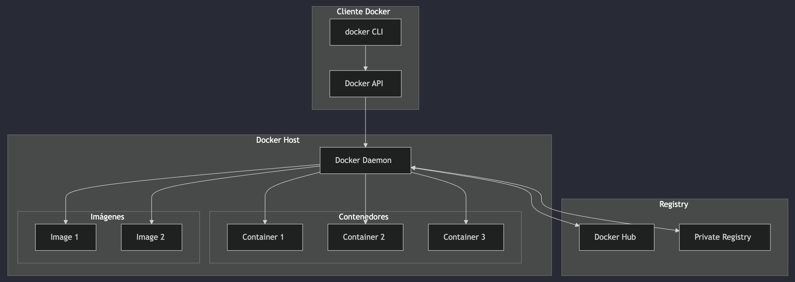
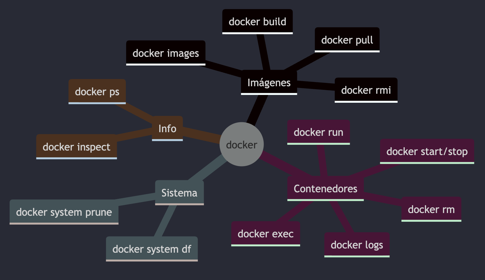
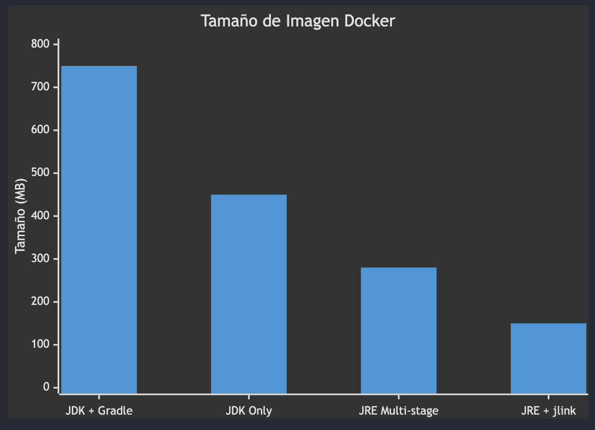
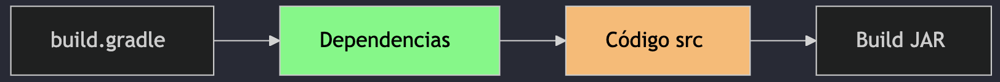
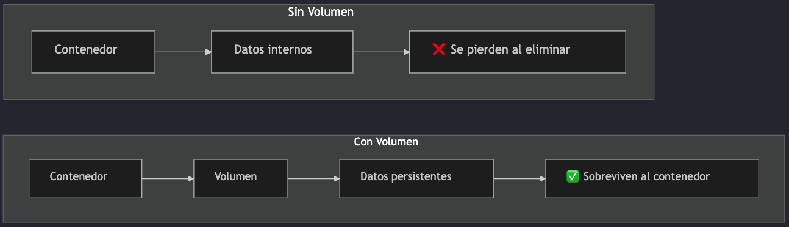
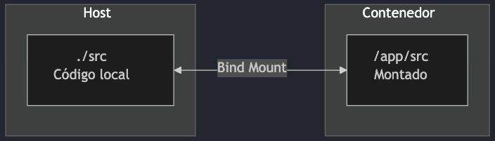
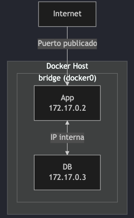
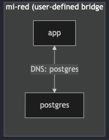
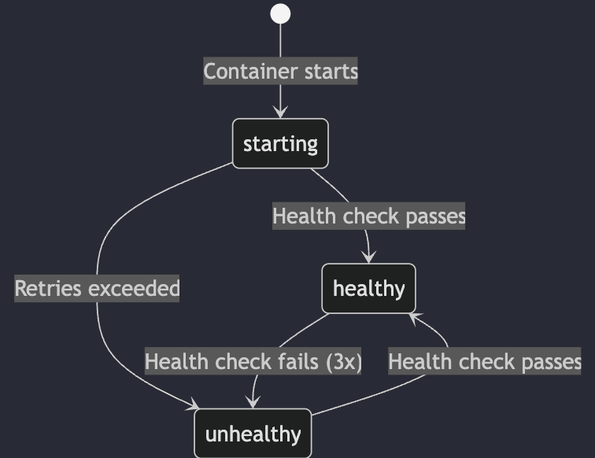
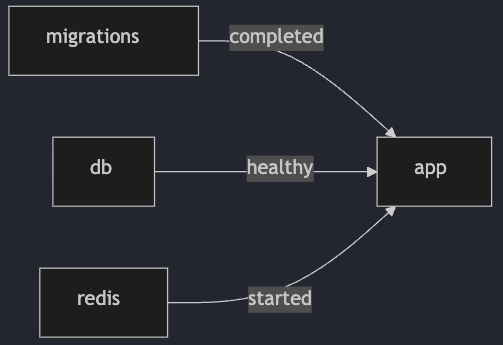

# Clase 13 - Docker & Docker Compose

**Recursos:**

- [Diapositivas](https://manulasker.github.io/enyoi_java_slides/clase_22_23_docker/#/title-slide)
- [Repositorio de práctica](https://github.com/Saisho137/docker-practice-java-scaffold-enyoi)
- [Laboratorio LocalStack](https://manulasker.github.io/enyoi_java_slides/lab_1_docker_localstack/)

---

## Índice

1. [Resumen](#resumen)
2. [Introducción a Docker](#introducción-a-docker)
3. [Conceptos Fundamentales](#conceptos-fundamentales)
4. [Dockerfile](#dockerfile)
5. [Optimización de Imágenes](#optimización-de-imágenes)
6. [Volúmenes](#volúmenes)
7. [Networking](#networking)
8. [Variables de Entorno](#variables-de-entorno)
9. [Health Checks](#health-checks)
10. [Docker Compose](#docker-compose)
11. [Recursos Adicionales](#recursos-adicionales)

---

## Resumen

Docker es una plataforma de contenedorización que resuelve el problema de "en mi máquina funciona" mediante contenedores que empaquetan aplicaciones con todas sus dependencias. Los conceptos clave incluyen: imágenes (plantillas), contenedores (instancias ejecutables), Dockerfile (instrucciones de construcción), multi-stage builds (reducción ~60% tamaño), volúmenes (persistencia de datos), networking (comunicación entre contenedores), health checks (monitoreo de salud), y Docker Compose (orquestación multi-contenedor).

---

## Introducción a Docker

Docker es una plataforma de contenedorización que permite empaquetar aplicaciones con todas sus dependencias en unidades estandarizadas llamadas **contenedores**.

### Por qué Docker

**Problemas que resuelve:**

| Sin Docker                              | Con Docker                  |
| --------------------------------------- | --------------------------- |
| "En mi máquina funciona"                | Ambientes reproducibles     |
| Instalación manual de dependencias      | Aislamiento de aplicaciones |
| Configuraciones diferentes por ambiente | Portabilidad total          |
| Conflictos de versiones                 | Consistencia dev → prod     |
| Despliegues inconsistentes              | Infraestructura como código |

### Arquitectura Docker



**Componentes principales:**

- **Docker Client**: Interfaz de línea de comandos (CLI)
- **Docker Daemon**: Servicio que gestiona contenedores e imágenes
- **Docker Registry**: Repositorio de imágenes (Docker Hub, registries privados)
- **Contenedores**: Instancias ejecutables aisladas
- **Imágenes**: Plantillas inmutables para crear contenedores

---

## Conceptos Fundamentales

### Imagen vs Contenedor

| Concepto       | Descripción                                                          | Analogía            |
| -------------- | -------------------------------------------------------------------- | ------------------- |
| **Imagen**     | Plantilla de solo lectura con el sistema de archivos y configuración | Clase en Java       |
| **Contenedor** | Instancia ejecutable de una imagen                                   | Objeto/Instancia    |
| **Dockerfile** | Archivo con instrucciones para construir una imagen                  | Código fuente       |
| **Registry**   | Repositorio de imágenes                                              | Maven Central / npm |

### Primer Contenedor

```bash
# Descargar y ejecutar imagen de Java
docker run -it eclipse-temurin:21-jdk java --version

# Ejecutar contenedor en segundo plano (daemon)
docker run -d --name mi-postgres postgres:16

# Ver contenedores en ejecución
docker ps

# Ver todos los contenedores (incluidos detenidos)
docker ps -a

# Detener y eliminar contenedor
docker stop mi-postgres
docker rm mi-postgres
```

> **Flags importantes:**
>
> - `-it` = interactivo + TTY (terminal)
> - `-d` = daemon (segundo plano)
> - `--name` = asignar nombre al contenedor
> - `-p` = mapear puertos (host:contenedor)

### Comandos Esenciales



**Gestión de imágenes:**

```bash
docker images                    # Listar imágenes locales
docker pull <imagen>             # Descargar imagen
docker rmi <imagen>              # Eliminar imagen
docker build -t <tag> .          # Construir imagen
docker history <imagen>          # Ver capas de la imagen
```

**Gestión de contenedores:**

```bash
docker ps                        # Contenedores activos
docker ps -a                     # Todos los contenedores
docker start <contenedor>        # Iniciar contenedor
docker stop <contenedor>         # Detener contenedor
docker rm <contenedor>           # Eliminar contenedor
docker logs -f <contenedor>      # Ver logs en tiempo real
docker exec -it <contenedor> /bin/bash  # Acceder al contenedor
```

---

## Dockerfile

Un Dockerfile es un archivo de texto con instrucciones para construir una imagen Docker de forma automatizada y reproducible.

### Instrucciones Básicas

| Instrucción  | Descripción                          | Ejemplo                           |
| ------------ | ------------------------------------ | --------------------------------- |
| `FROM`       | Imagen base                          | `FROM eclipse-temurin:21-jdk`     |
| `WORKDIR`    | Directorio de trabajo                | `WORKDIR /app`                    |
| `COPY`       | Copiar archivos locales              | `COPY build/libs/*.jar app.jar`   |
| `RUN`        | Ejecutar comando al construir        | `RUN apt-get update`              |
| `ENV`        | Variable de entorno                  | `ENV JAVA_OPTS="-Xmx512m"`        |
| `EXPOSE`     | Puerto que expone el contenedor      | `EXPOSE 8080`                     |
| `CMD`        | Comando al iniciar contenedor        | `CMD ["java", "-jar", "app.jar"]` |
| `ENTRYPOINT` | Punto de entrada (no se sobrescribe) | `ENTRYPOINT ["java", "-jar"]`     |

### Dockerfile Simple para Java

```dockerfile
# Imagen base con JDK 21
FROM eclipse-temurin:21-jdk

# Directorio de trabajo dentro del contenedor
WORKDIR /app

# Copiar el JAR compilado
COPY build/libs/mi-aplicacion.jar app.jar

# Puerto que expone la aplicación
EXPOSE 8080

# Variables de entorno
ENV JAVA_OPTS="-Xmx512m -Xms256m"

# Comando para ejecutar la aplicación
CMD ["sh", "-c", "java $JAVA_OPTS -jar app.jar"]
```

---

## Optimización de Imágenes

### Problema: Imágenes Pesadas


**Problema:** Incluimos herramientas de compilación (JDK, Gradle, Maven) que NO necesitamos en producción.

**Solución:** Multi-stage builds

### Multi-Stage Build para Java

```dockerfile
# ============================================
# Stage 1: Build (Construcción)
# ============================================
FROM amazoncorretto:21-alpine AS builder
VOLUME /tmp
WORKDIR /home/work

# Copiar solo archivos de configuración de Gradle
COPY build.gradle settings.gradle main.gradle gradle.properties lombok.config gradlew ./
COPY gradle ./gradle
COPY applications ./applications
COPY domain ./domain
COPY infrastructure ./infrastructure

# Construir la aplicación
RUN ./gradlew bootJar --info


# ============================================
# Stage 2: Runtime (Ejecución)
# ============================================
FROM eclipse-temurin:21-jre-alpine
VOLUME /tmp
WORKDIR /app

# Copiar SOLO el JAR desde el stage anterior
COPY --from=builder /home/work/applications/app-service/build/libs/*.jar docker-example.jar

# Configuración de JVM optimizada para contenedores
ENV JAVA_OPTS="-XX:+UseContainerSupport -XX:MaxRAMPercentage=70 -Djava.security.egd=file:/dev/./urandom"

EXPOSE 8080

# Crear usuario no-root por seguridad
RUN adduser -D -u 1001 appuser
USER appuser

# Punto de entrada
ENTRYPOINT [ "/bin/sh", "-c", "/opt/java/openjdk/bin/java $JAVA_OPTS -jar ./docker-example.jar" ]
```

**Ventajas del multi-stage build:**

- ✅ Imagen final solo contiene JRE (no JDK completo)
- ✅ No incluye herramientas de build (Gradle, Maven)
- ✅ Reducción de ~60% en tamaño
- ✅ Menor superficie de ataque (seguridad)
- ✅ Despliegues más rápidos

### Comparación de Tamaños



| Tipo de Imagen             | Tamaño Aproximado |
| -------------------------- | ----------------- |
| JDK completo + build tools | ~500-700 MB       |
| Multi-stage + JRE          | ~200-300 MB       |
| **Reducción**              | **~60%**          |

### Optimización de Capas

Docker utiliza un sistema de capas (layers) con caché. Cada instrucción en el Dockerfile crea una capa.

**❌ MAL:** Invalida cache en cada cambio de código

```dockerfile
COPY . .
RUN ./gradlew bootJar
```

**✅ BIEN:** Aprovecha cache de dependencias

```dockerfile
# 1. Copiar solo archivos de configuración (cambian poco)
COPY build.gradle settings.gradle gradlew ./
COPY gradle ./gradle

# 2. Descargar dependencias (se cachea si no cambian)
RUN ./gradlew dependencies --no-daemon

# 3. Copiar código fuente (cambia frecuentemente)
COPY src ./src

# 4. Compilar aplicación
RUN ./gradlew bootJar --no-daemon
```



**Principio:** Las capas que no cambian se reutilizan del cache, acelerando builds subsecuentes.

### Construir y Ejecutar

```bash
# Construir imagen con tag
docker build -t mi-app:1.0 .

# Ver capas de la imagen
docker history mi-app:1.0

# Ejecutar contenedor
docker run -d -p 8080:8080 --name mi-app-container mi-app:1.0

# Ver logs en tiempo real
docker logs -f mi-app-container

# Ejecutar comando dentro del contenedor
docker exec -it mi-app-container /bin/bash

# Inspeccionar contenedor
docker inspect mi-app-container
```

---

## Volúmenes

Los volúmenes permiten **persistir datos** y **compartir archivos** entre el host y los contenedores. Sin volúmenes, los datos se pierden cuando el contenedor se elimina.

### Por qué usar Volúmenes



**Problema:** Los datos dentro del contenedor son efímeros. Al eliminar el contenedor, se pierden todos los datos.

**Solución:** Usar volúmenes para persistir datos fuera del ciclo de vida del contenedor.

### Tipos de Volúmenes

| Tipo             | Sintaxis                  | Uso Principal                      |
| ---------------- | ------------------------- | ---------------------------------- |
| **Named Volume** | `myvolume:/app/data`      | Persistencia gestionada por Docker |
| **Bind Mount**   | `./local:/container/path` | Desarrollo, compartir código       |
| **tmpfs**        | `--tmpfs /tmp`            | Datos temporales en memoria        |

### Named Volumes

```bash
# Crear volumen
docker volume create postgres-data

# Usar volumen en contenedor
docker run -d \
  --name postgres \
  -v postgres-data:/var/lib/postgresql/data \
  -e POSTGRES_PASSWORD=secret \
  postgres:16

# Listar volúmenes
docker volume ls

# Inspeccionar volumen
docker volume inspect postgres-data

# Eliminar volumen
docker volume rm postgres-data
```

> **Nota:** Los named volumes sobreviven a los contenedores y son respaldados por Docker.
>
> **Ubicación:** En Linux: `/var/lib/docker/volumes/<nombre>/_data`. Usa `docker volume inspect <nombre>` para ver la ruta exacta.

### Bind Mounts para Desarrollo

```bash
# Montar código fuente local en el contenedor
docker run -d \
  --name dev-app \
  -v $(pwd)/src:/app/src \
  -v $(pwd)/build.gradle.kts:/app/build.gradle.kts \
  -p 8080:8080 \
  mi-app:dev

# Hot-reload: cambios locales se reflejan inmediatamente
```



**Ventajas:**

- ✅ Cambios en el host se reflejan inmediatamente
- ✅ Ideal para desarrollo con hot-reload
- ✅ No requiere reconstruir la imagen

### Permisos en Volúmenes

```dockerfile
# Crear usuario con UID específico
RUN groupadd -g 1000 appgroup && \
    useradd -u 1000 -g appgroup appuser

# Crear directorio para datos
RUN mkdir -p /app/data && chown -R appuser:appgroup /app/data

# Cambiar a usuario no-root
USER appuser

# Definir volumen
VOLUME /app/data
```

> **Problema común:** Permisos 755 del host vs usuario del contenedor.
>
> **Solución:** Usa `--user $(id -u):$(id -g)` en desarrollo para mapear tu usuario.

---

## Networking

Docker proporciona diferentes drivers de red para la comunicación entre contenedores y con el mundo exterior.

### Drivers de Red

| Driver      | Descripción               | Caso de Uso                |
| ----------- | ------------------------- | -------------------------- |
| **bridge**  | Red aislada por defecto   | Contenedores en mismo host |
| **host**    | Comparte red del host     | Rendimiento máximo         |
| **none**    | Sin red                   | Aislamiento total          |
| **overlay** | Red entre múltiples hosts | Docker Swarm / Kubernetes  |

### Red Bridge por Defecto



> **Limitación:** Los contenedores en la red bridge por defecto se comunican por IP, **no por nombre**.

### Redes Personalizadas

```bash
# Crear red personalizada
docker network create mi-red

# Conectar contenedores a la red
docker run -d --name postgres --network mi-red postgres:16
docker run -d --name app --network mi-red mi-app:1.0

# Los contenedores se resuelven por NOMBRE
# Desde 'app': jdbc:postgresql://postgres:5432/db
```



> **Ventaja:** Redes personalizadas proporcionan **resolución DNS automática** por nombre de contenedor.

### Publicar Puertos

| Sintaxis                 | Significado                |
| ------------------------ | -------------------------- |
| `-p 8080:8080`           | Host 8080 → Container 8080 |
| `-p 3000:8080`           | Host 3000 → Container 8080 |
| `-p 127.0.0.1:8080:8080` | Solo localhost             |

```bash
# Mapear puerto específico
docker run -p 8080:8080 mi-app

# Mapear a puerto aleatorio del host
docker run -p 8080 mi-app

# Mapear solo a localhost (más seguro)
docker run -p 127.0.0.1:8080:8080 mi-app

# Mapear múltiples puertos
docker run -p 8080:8080 -p 5005:5005 mi-app
```

### Comunicación entre Contenedores

```bash
# Crear red
docker network create arka-network

# PostgreSQL
docker run -d \
  --name arka-db \
  --network arka-network \
  -e POSTGRES_USER=arka \
  -e POSTGRES_PASSWORD=secret \
  -e POSTGRES_DB=arka \
  postgres:16

# Aplicación Java
docker run -d \
  --name arka-api \
  --network arka-network \
  -e DATABASE_URL=jdbc:postgresql://arka-db:5432/arka \
  -e DATABASE_USER=arka \
  -e DATABASE_PASSWORD=secret \
  -p 8080:8080 \
  arka-api:1.0
```

---

## Variables de Entorno

Las variables de entorno permiten configurar aplicaciones sin modificar el código ni la imagen.

### Métodos para definir Variables

```bash
# 1. Línea de comando (-e)
docker run -e DATABASE_URL=jdbc:postgresql://db:5432/app mi-app

# 2. Archivo de variables (--env-file)
docker run --env-file .env mi-app

# 3. En Dockerfile (ENV) - valor por defecto
ENV JAVA_OPTS="-Xmx512m"
```

### Archivo .env

```bash
# .env - Variables de entorno
DATABASE_URL=jdbc:postgresql://localhost:5432/arka
DATABASE_USER=arka
DATABASE_PASSWORD=supersecret
JAVA_OPTS=-Xmx512m -Xms256m
SPRING_PROFILES_ACTIVE=development
```

> **Seguridad:** NUNCA commits `.env` con secretos reales. Usa `.env.example` como plantilla.

### ARG vs ENV

| Característica         | ARG                        | ENV                  |
| ---------------------- | -------------------------- | -------------------- |
| Disponible en build    | ✅ Sí                      | ✅ Sí                |
| Disponible en runtime  | ❌ No                      | ✅ Sí                |
| Override en docker run | ❌ No                      | ✅ Sí                |
| Caso de uso            | Versiones, tokens de build | Configuración de app |

```dockerfile
# ARG: solo en tiempo de build
ARG JAR_VERSION=1.0.0

# ENV: disponible en el contenedor
ENV APP_VERSION=$JAR_VERSION
ENV SPRING_PROFILES_ACTIVE=production
```

### Variables en Spring Boot

```yaml
# application.yml
spring:
  datasource:
    url: ${DATABASE_URL:jdbc:postgresql://localhost:5432/arka}
    username: ${DATABASE_USER:arka}
    password: ${DATABASE_PASSWORD:}

server:
  port: ${SERVER_PORT:8080}

logging:
  level:
    root: ${LOG_LEVEL:INFO}
```

> **Tip:** Spring Boot automáticamente mapea `SPRING_DATASOURCE_URL` → `spring.datasource.url`

---

## Health Checks

Los health checks permiten a Docker verificar si un contenedor está funcionando correctamente.

### HEALTHCHECK en Dockerfile

```dockerfile
FROM eclipse-temurin:21-jre

WORKDIR /app
COPY build/libs/*.jar app.jar

# Health check con curl
HEALTHCHECK --interval=30s --timeout=10s --start-period=60s --retries=3 \
  CMD curl -f http://localhost:8080/actuator/health || exit 1

EXPOSE 8080
CMD ["java", "-jar", "app.jar"]
```

### Parámetros de HEALTHCHECK

| Parámetro        | Descripción                 | Default |
| ---------------- | --------------------------- | ------- |
| `--interval`     | Tiempo entre checks         | 30s     |
| `--timeout`      | Tiempo máximo de espera     | 30s     |
| `--start-period` | Tiempo inicial sin checks   | 0s      |
| `--retries`      | Intentos antes de unhealthy | 3       |

### Estados de Salud



**Estados posibles:**

- **starting**: Contenedor iniciando (dentro del `start-period`)
- **healthy**: Health check exitoso
- **unhealthy**: Health check falló después de `retries` intentos

```bash
# Ver estado de salud
docker ps
# CONTAINER ID   STATUS
# abc123         Up 5 min (healthy)
# def456         Up 2 min (unhealthy)

# Detalles del health check
docker inspect --format='{{json .State.Health}}' mi-app | jq
```

### Spring Boot Actuator

```groovy
// build.gradle
dependencies {
    implementation 'org.springframework.boot:spring-boot-starter-actuator'
}
```

```yaml
# application.yml
management:
  endpoints:
    web:
      exposure:
        include: health,info,metrics
  endpoint:
    health:
      show-details: when_authorized
      probes:
        enabled: true
```

**Endpoints disponibles:**

- `/actuator/health` - Estado general
- `/actuator/health/liveness` - ¿Está vivo?
- `/actuator/health/readiness` - ¿Listo para recibir tráfico?

---

## Docker Compose

Docker Compose permite definir y ejecutar aplicaciones multi-contenedor usando un archivo YAML declarativo.

### Por qué Docker Compose

**Sin Compose:**

```bash
docker network create app-net
docker run -d --name db \
  --network app-net \
  -e POSTGRES_PASSWORD=secret \
  -v pgdata:/var/lib/postgresql/data \
  postgres:16
docker run -d --name app \
  --network app-net \
  -e DATABASE_URL=... \
  -p 8080:8080 \
  mi-app:1.0
```

**Con Compose:**

```bash
docker compose up -d
```

✅ Un solo comando  
✅ Versionado en Git  
✅ Reproducible

### Estructura docker-compose.yml

```yaml
# Versión del formato (opcional en v2+)
version: "3.9"

services: # Contenedores a ejecutar
  app: ...
  db: ...

networks: # Redes personalizadas
  app-network: ...

volumes: # Volúmenes persistentes
  postgres-data: ...
```

### Ejemplo: Java + PostgreSQL

```yaml
version: "3.9"

services:
  app:
    build: .
    ports:
      - "8080:8080"
    environment:
      - DATABASE_URL=jdbc:postgresql://db:5432/arka
      - DATABASE_USER=arka
      - DATABASE_PASSWORD=${DB_PASSWORD}
    depends_on:
      db:
        condition: service_healthy
    networks:
      - arka-network

  db:
    image: postgres:16
    environment:
      - POSTGRES_USER=arka
      - POSTGRES_PASSWORD=${DB_PASSWORD}
      - POSTGRES_DB=arka
    volumes:
      - postgres-data:/var/lib/postgresql/data
    healthcheck:
      test: ["CMD-SHELL", "pg_isready -U arka"]
      interval: 10s
      timeout: 5s
      retries: 5
    networks:
      - arka-network

networks:
  arka-network:
    driver: bridge

volumes:
  postgres-data:
```

### Comandos Docker Compose

```bash
# Iniciar todos los servicios
docker compose up -d

# Ver logs de todos los servicios
docker compose logs -f

# Ver logs de un servicio específico
docker compose logs -f app

# Estado de los servicios
docker compose ps

# Detener servicios
docker compose stop

# Detener y eliminar contenedores, redes
docker compose down

# Eliminar también volúmenes
docker compose down -v

# Reconstruir imágenes
docker compose build
docker compose up -d --build
```

### depends_on Avanzado

```yaml
services:
  app:
    depends_on:
      db:
        condition: service_healthy # Esperar health check
      redis:
        condition: service_started # Solo que inicie
      migrations:
        condition: service_completed_successfully # Que termine OK
```



**Condiciones disponibles:**

- `service_started`: Contenedor iniciado (no garantiza que esté listo)
- `service_healthy`: Health check exitoso
- `service_completed_successfully`: Contenedor terminó con exit code 0

### Profiles para Ambientes

```yaml
services:
  app:
    # Siempre activo
    build: .
    ...

  db:
    # Siempre activo
    image: postgres:16
    ...

  pgadmin:
    # Solo en desarrollo
    profiles: ["dev"]
    image: dpage/pgadmin4
    ports:
      - "5050:80"
    ...

  prometheus:
    # Solo en monitoreo
    profiles: ["monitoring"]
    image: prom/prometheus
    ...
```

```bash
# Solo servicios base
docker compose up -d

# Con herramientas de desarrollo
docker compose --profile dev up -d

# Con monitoreo
docker compose --profile monitoring up -d
```

### Variables y Archivos .env

```bash
# .env
POSTGRES_VERSION=16
DB_PASSWORD=supersecret
APP_PORT=8080
```

```yaml
# docker-compose.yml
services:
  db:
    image: postgres:${POSTGRES_VERSION}
    environment:
      POSTGRES_PASSWORD: ${DB_PASSWORD}

  app:
    ports:
      - "${APP_PORT}:8080"
```

> **Nota:** Docker Compose lee automáticamente `.env` del directorio actual.

### Extender Configuraciones

```yaml
# docker-compose.yml (base)
services:
  app:
    build: .
    environment:
      - SPRING_PROFILES_ACTIVE=default
```

```yaml
# docker-compose.override.yml (desarrollo - auto-cargado)
services:
  app:
    volumes:
      - ./src:/app/src
    environment:
      - SPRING_PROFILES_ACTIVE=dev
      - DEBUG=true
```

```yaml
# docker-compose.prod.yml (producción)
services:
  app:
    image: registry.example.com/arka-api:${VERSION}
    environment:
      - SPRING_PROFILES_ACTIVE=prod
    deploy:
      replicas: 3
```

```bash
# Desarrollo (usa override automáticamente)
docker compose up -d

# Producción
docker compose -f docker-compose.yml -f docker-compose.prod.yml up -d
```

---

## Recursos Adicionales

### Tabla Resumen

| Concepto           | Qué Aprendimos                            |
| ------------------ | ----------------------------------------- |
| **Docker**         | Contenedorización, imágenes, contenedores |
| **Dockerfile**     | Multi-stage builds, optimización de capas |
| **Volúmenes**      | Named volumes, bind mounts, persistencia  |
| **Networking**     | Bridge, redes personalizadas, DNS interno |
| **Variables**      | ENV, ARG, .env files, secretos            |
| **Health Checks**  | Monitoreo de salud, Spring Actuator       |
| **Docker Compose** | Orquestación multi-contenedor, profiles   |

### Enlaces Útiles

- [Documentación oficial Docker](https://docs.docker.com/)
- [Docker Compose file reference](https://docs.docker.com/compose/compose-file/)
- [LocalStack Documentation](https://docs.localstack.cloud/)
- [Spring Boot Docker Guide](https://spring.io/guides/topicals/spring-boot-docker)

### Herramientas LocalStack

**LocalStack** permite emular servicios de AWS localmente para desarrollo y testing.

**Instalación de herramientas (macOS):**

```bash
# Instalar AWS CLI v1
brew install awscli@1
brew link --overwrite awscli@1
aws --version

# Instalar awslocal (wrapper para LocalStack)
brew install awscli-local
```

**Acceso:**

- [LocalStack Getting Started](https://app.localstack.cloud/getting-started)
- Conecta el navegador al contenedor LocalStack activo para gestión visual
