# Clase 14 - Patrones de Arquitectura de Microservicios & EDA

Diseñando Sistemas Distribuidos Resilientes - Arka

Diapositivas: <https://manulasker.github.io/enyoi_java_slides/clase_24_25_patrones_arquitectura_microservicios/#/title-slide>

## Índice

1. [De Monolito a Microservicios](#de-monolito-a-microservicios)
2. [Patrones de Comunicación](#patrones-de-comunicación)
3. [API Gateway Pattern](#api-gateway-pattern)
4. [Service Discovery](#service-discovery)
5. [Circuit Breaker Pattern](#circuit-breaker-pattern)
6. [Database per Service](#database-per-service)
7. [Event Driven Architecture (EDA)](#event-driven-architecture-eda)
8. [Patrón Saga](#patrón-saga)

## Resumen

Los microservicios representan una arquitectura donde aplicaciones se descomponen en servicios pequeños e independientes que se comunican entre sí. Esta clase cubre los patrones fundamentales para diseñar sistemas distribuidos resilientes: comunicación síncrona/asíncrona, API Gateway y BFF, service discovery, circuit breaker para tolerancia a fallos, database per service, arquitectura dirigida por eventos (EDA) con Event Sourcing y CQRS, y el patrón Saga para transacciones distribuidas (coreografía vs orquestación).

## De Monolito a Microservicios

Entendiendo por qué y cuándo descomponer un sistema monolítico en servicios independientes.

### Qué es un Monolito

Un sistema donde toda la lógica (UI, negocio, datos) vive en un solo desplegable.

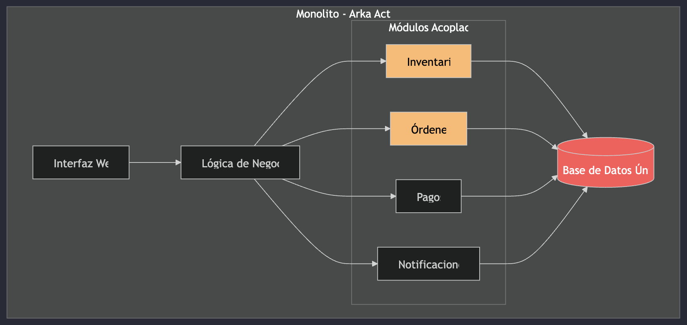

> Problema Arka: Ventas concurrentes causan race conditions → stock negativo (sobreventa).

### Qué son los Microservicios

Arquitectura donde la aplicación se compone de servicios pequeños, autónomos que se comunican entre sí.

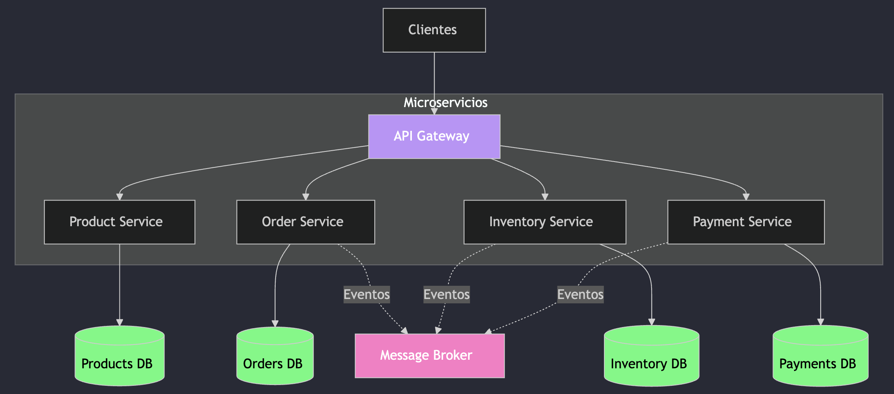

### Monolito vs Microservicios

| Característica | Monolito                            | Microservicios                                |
| -------------- | ----------------------------------- | --------------------------------------------- |
| Despliegue     | Todo junto                          | Independiente por servicio                    |
| Escalabilidad  | Vertical (más recursos al servidor) | Horizontal (más instancias del servicio)      |
| Tecnología     | Un solo stack                       | Polyglot (cada servicio puede usar diferente) |
| Base de datos  | Compartida                          | Una por servicio                              |
| Equipo         | Un equipo grande                    | Equipos pequeños por servicio                 |
| Fallo          | Un error tumba todo                 | Fallo aislado por servicio                    |
| Complejidad    | Simple al inicio                    | Complejidad operacional alta                  |
| Transacciones  | ACID fácil                          | Consistencia eventual                         |

> No todo debe ser microservicios. “Monolith First” es una estrategia válida (Martin Fowler).

### Cuándo Migrar

**SÍ migrar cuando:**

- El equipo crece y hay conflictos en el código
- Necesitas escalar partes específicas
- Los deploys son lentos y riesgosos
- **Caso Arka:** Necesitas manejar concurrencia a nivel de servicio

**NO migrar cuando:**

- Equipo pequeño (< 5 devs)
- El dominio no está bien entendido
- No tienes infraestructura de CI/CD
- La aplicación es simple y funcional

> Regla de oro: Si no puedes gestionar un monolito bien, los microservicios lo harán 10x peor.

## Patrones de Comunicación

¿Cómo se hablan los microservicios entre sí?

### Comunicación Síncrona

El servicio que llama espera la respuesta antes de continuar.

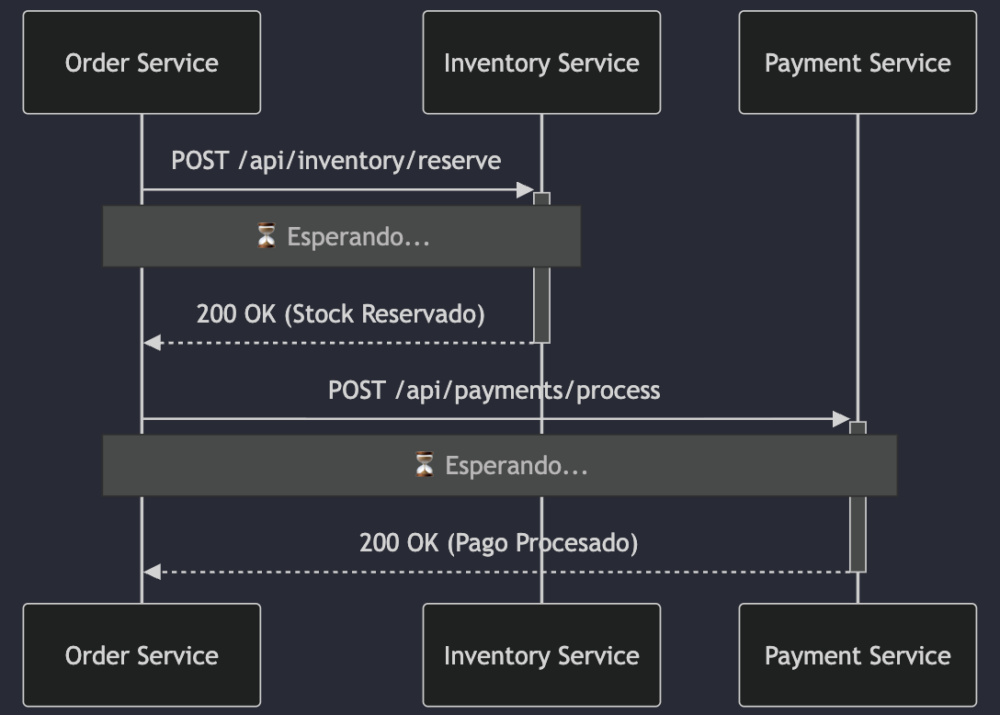

**Protocolos comunes:** REST (HTTP/JSON), gRPC (HTTP/2 + Protobuf)

> Riesgo: Si un servicio está lento o caído, el que llama se bloquea → cascading failure.

### Comunicación Asíncrona

El servicio emisor publica un evento y continúa sin esperar respuesta.

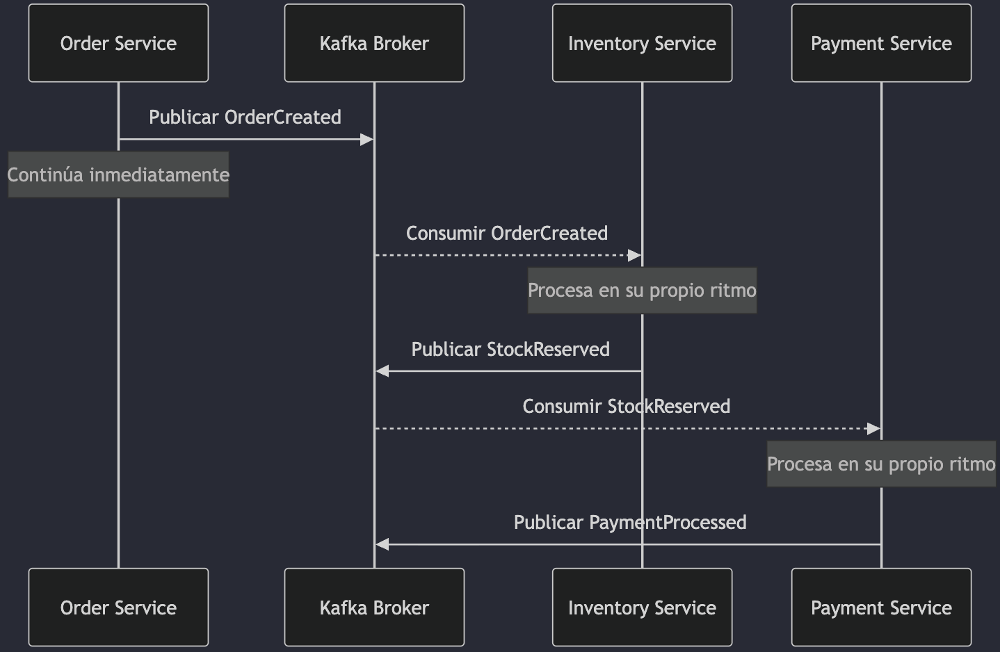

> Ventaja: Desacoplamiento total. Los servicios no necesitan conocerse entre sí.

### Comparativa de Comunicación

| Aspecto       | Síncrona                   | Asíncrona                |
| ------------- | -------------------------- | ------------------------ |
| Acoplamiento  | Temporal (espera)          | Desacoplado              |
| Latencia      | Suma de todas las llamadas | Solo la publicación      |
| Confiabilidad | Cadena de dependencias     | Tolerante a fallos       |
| Complejidad   | Fácil de entender          | Más difícil de debuggear |
| Consistencia  | Inmediata                  | Eventual                 |
| Caso de uso   | Consultas, validaciones    | Comandos, notificaciones |

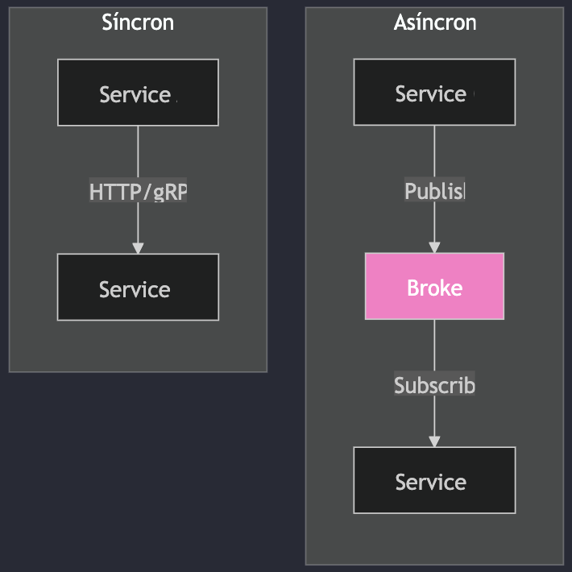

## Api Gateway Pattern

### Qué es el ApiGateway

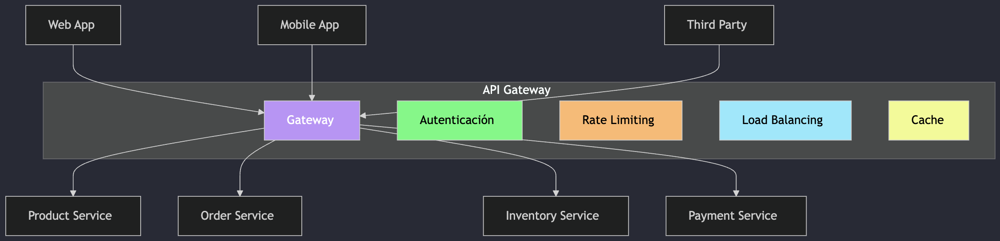

> Normalmente, se usa el Algoritmo Round Robin para Load Balancing

### Responsabilidades del Gateway

| Función                    | Descripción                             |
| -------------------------- | --------------------------------------- |
| Routing                    | Dirige la petición al servicio correcto |
| Autenticación/Autorización | Valida tokens JWT, API Keys             |
| Rate Limiting              | Limita peticiones por cliente           |
| Load Balancing             | Distribuye carga entre instancias       |
| Circuit Breaking           | Protege contra servicios caídos         |
| Transformación             | Adapta request/response                 |
| Caching                    | Cache de respuestas frecuentes          |
| Logging/Monitoring         | Observabilidad centralizada             |

**Herramientas populares:** Spring Cloud Gateway, Kong, NGINX, AWS API Gateway

### Backend for Frontend

Variante donde cada tipo de cliente tiene su propio gateway optimizado.

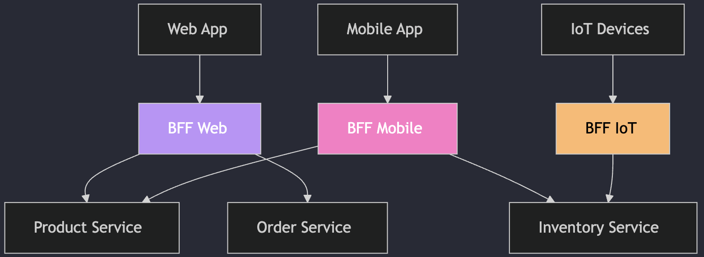

> BFF permite optimizar la respuesta para cada cliente: el móvil recibe menos datos, la web más.

### Api Gateway vs BFF

| Característica | API Gateway                       | Backend for Frontend (BFF)                  |
| -------------- | --------------------------------- | ------------------------------------------- |
| Enfoque        | Único punto de entrada para todos | Múltiples gateways, uno por tipo de cliente |
| Adaptabilidad  | "Talla única" (One size fits all) | A medida para cada cliente (Tailored)       |
| Propiedad      | Equipo de Plataforma / Backend    | Equipo de Frontend / Producto               |
| Ventaja        | Simplicidad y centralización      | Optimización de UX y performance            |
| Riesgo         | Cuello de botella (Bottleneck)    | Duplicación de lógica y complejidad         |

> El BFF no reemplaza necesariamente al API Gateway; a menudo coexisten. El API Gateway maneja cross-cutting concerns (SSL, Auth) y enruta a los BFFs.

## Service Discovery

¿Cómo encuentra un servicio la dirección de otro servicio?

### El Problema

En un entorno dinámico (contenedores, auto-scaling), las IPs y puertos cambian constantemente.

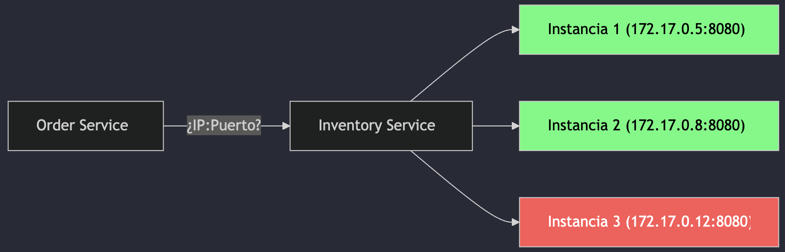

> Hardcodear URLs (<http://192.168.1.100:8080>) es frágil y no escala.

### Client-Side vs Server-Side

> Docker Compose ya provee service discovery básico con DNS por nombre de servicio.

#### Client Side Discovery

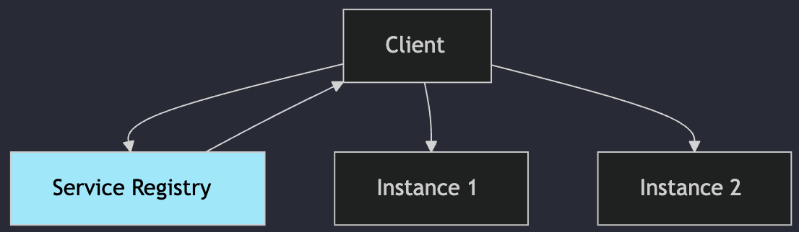

El cliente consulta el registro y decide qué instancia llamar.

**Ejemplo:** Netflix Eureka, Spring Cloud

#### Server Side Discovery

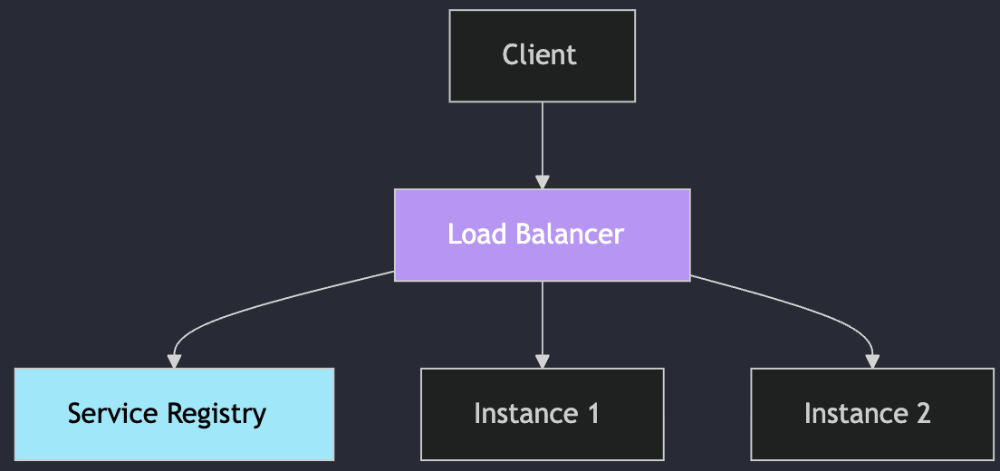

Un load balancer consulta el registro y rutea al cliente.

**Ejemplo:** Kubernetes Services, AWS ELB

## Circuit Breaker Pattern

Protección contra fallos en cascada en sistemas distribuidos.

### El Problema: Cascading Failures

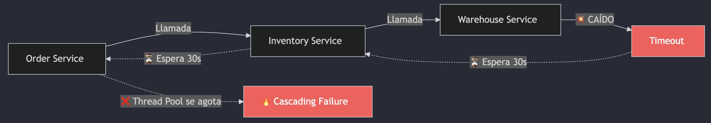

> Un solo servicio lento/caído puede tumbar toda la cadena de llamadas.

### Estados del Circuit Breaker

| Estado    | Comportamiento                                  |
| --------- | ----------------------------------------------- |
| Closed    | Todo funciona normal, se cuentan fallos         |
| Open      | Todas las peticiones son rechazadas (fail-fast) |
| Half-Open | Se permiten pocas peticiones de prueba          |

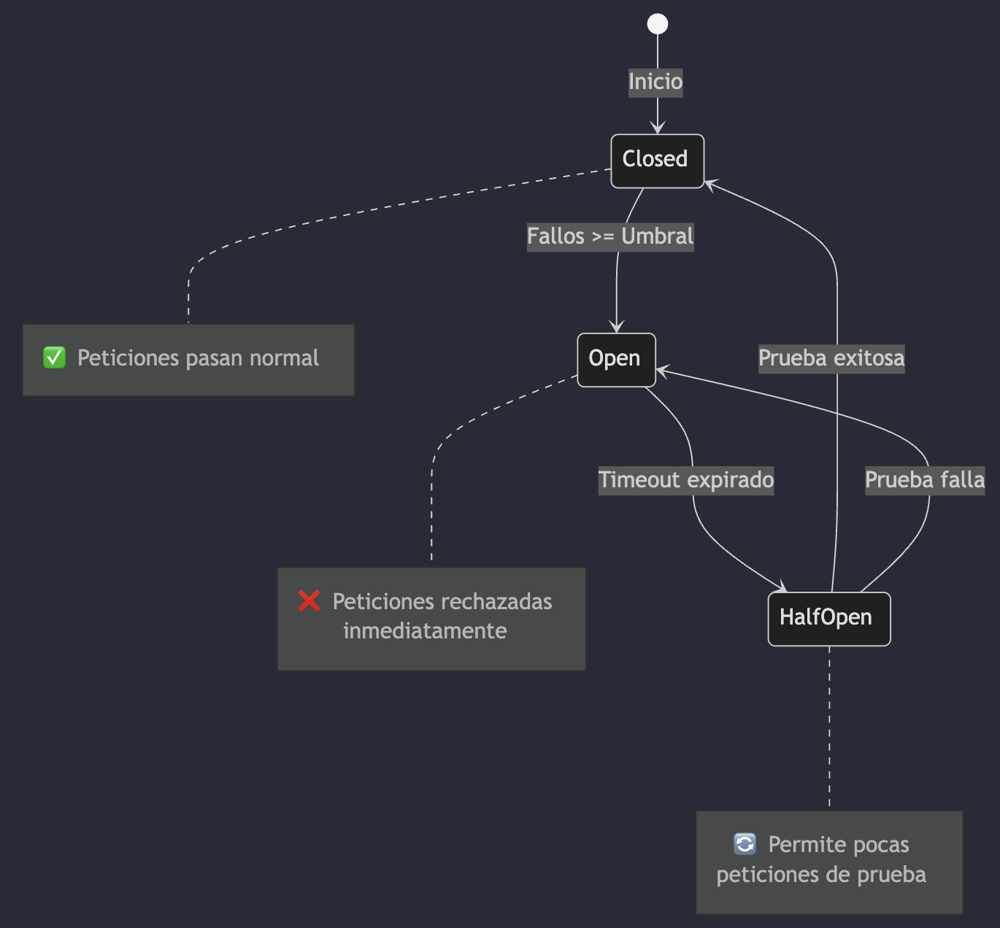

#### Ejemplo con Resilience4j

```java
// Configuración del Circuit Breaker
@Bean
public CircuitBreakerConfig circuitBreakerConfig() {
    return CircuitBreakerConfig.custom()
        .failureRateThreshold(50)        // 50% de fallos activa el breaker
        .waitDurationInOpenState(Duration.ofSeconds(30)) // Espera antes de Half-Open
        .slidingWindowSize(10)           // Ventana de evaluación
        .minimumNumberOfCalls(5)         // Mínimo de llamadas para evaluar
        .build();
}
```

```java
// Uso en un servicio reactivo
@Service
public class InventoryClient {
    private final CircuitBreaker circuitBreaker;
    private final WebClient webClient;

    public Mono<StockResponse> checkStock(String sku) {
        return webClient.get()
            .uri("/api/inventory/{sku}", sku)
            .retrieve()
            .bodyToMono(StockResponse.class)
            .transformDeferred(CircuitBreakerOperator.of(circuitBreaker))
            .onErrorResume(e -> Mono.just(StockResponse.unavailable()));
    }
}
```

> Fallback: Cuando el circuit breaker está abierto, retornar una respuesta por defecto en vez de fallar.

## Database per Service

Cada microservicio posee y gestiona su propia base de datos.

### Shared DB vs DB per Service

#### Base de Datos Compartida

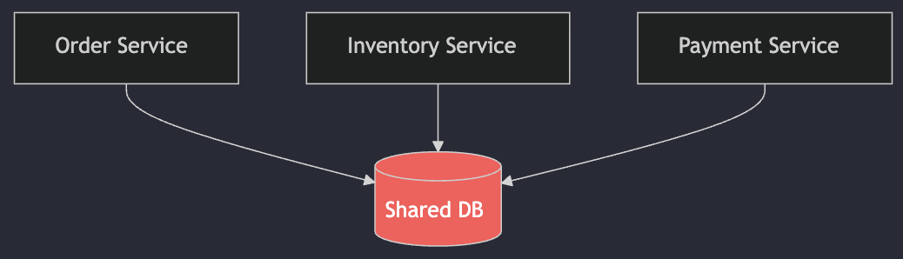

- Acoplamiento a nivel de datos
- Un cambio de schema afecta todos
- No puedes escalar independientemente

#### Patrón Database per Service

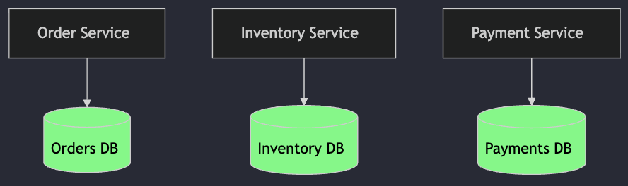

- Autonomía total por servicio
- Cada equipo elige su tecnología
- Escala independientemente

### El Gran Desafío: Consultas Cruzadas

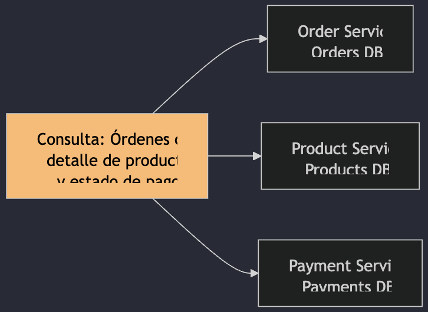

¿Cómo hacer JOINs entre servicios? No puedes hacer SELECT ... JOIN entre bases de datos separadas. Necesitas otras estrategias:

| Estrategia      | Descripción                                        |
| --------------- | -------------------------------------------------- |
| API Composition | Un servicio agrega datos de múltiples servicios    |
| CQRS            | Modelo de lectura separado, alimentado por eventos |
| Saga            | Transacciones distribuidas por pasos               |

#### Api Composition

Un servicio agregador consulta múltiples servicios y combina las respuestas.

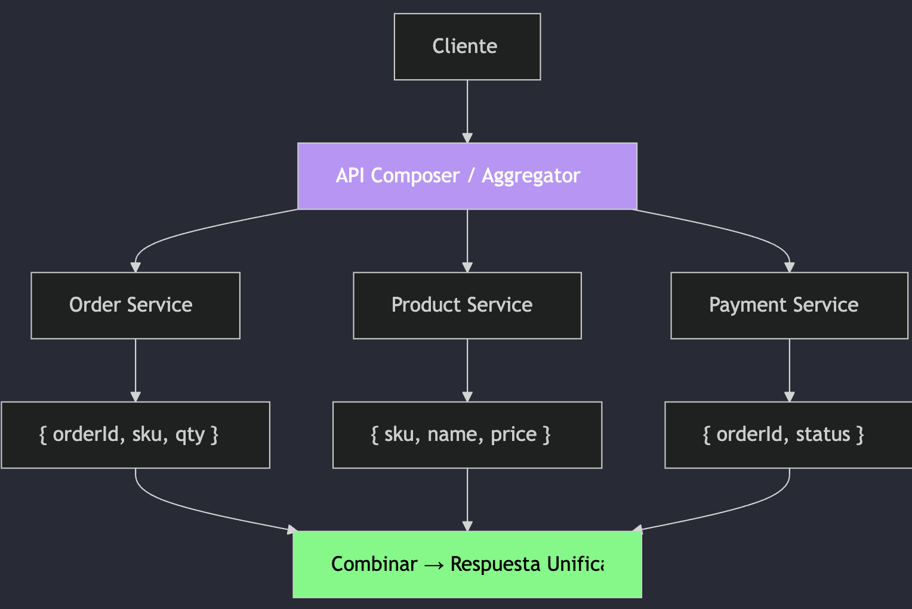

| Ventaja                           | Desventaja                            |
| --------------------------------- | ------------------------------------- |
| Simple de implementar             | Latencia = suma de todas las llamadas |
| No requiere infraestructura extra | El agregador puede ser un bottleneck  |
| Consistencia en tiempo real       | Falla si algún servicio no responde   |

> La consistencia eventual reemplaza las transacciones ACID en microservicios.

## Event Driven Architecture (EDA)

Arquitectura donde los componentes se comunican a través de eventos de forma asíncrona y desacoplada.

### Qué es EDA

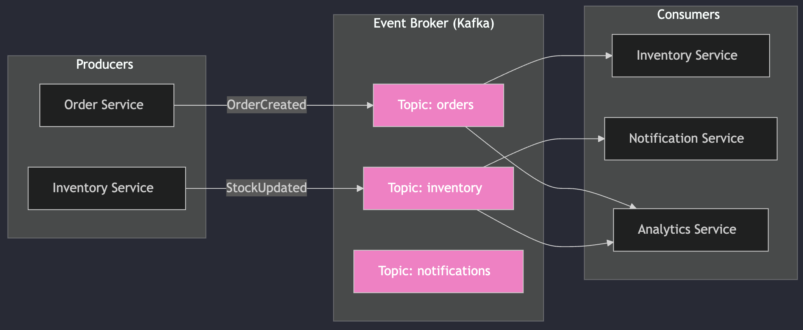

> EDA = Los servicios reaccionan a hechos que ocurrieron (eventos), no a comandos directos.

### Componentes de EDA

| Componente  | Rol                              | Ejemplo                                      |
| ----------- | -------------------------------- | -------------------------------------------- |
| Producer    | Emite eventos cuando algo ocurre | Order Service publica OrderCreated           |
| Consumer    | Reacciona a eventos de interés   | Inventory Service escucha OrderCreated       |
| Broker      | Canal que transporta eventos     | Apache Kafka, RabbitMQ, AWS SQS              |
| Topic/Queue | Categoría del evento             | orders, inventory, notifications             |
| Event       | Hecho inmutable que ocurrió      | { "type": "ProductCreated", "sku": "A-123" } |

### Domain Events vs Integration Events

#### Domain Events

Ocurren dentro de un Bounded Context.

```java
// Dentro del servicio de inventario
record StockDecremented(
    String sku,
    int quantity,
    int remainingStock,
    Instant timestamp
) {}
```

- Lenguaje del dominio
- Usados internamente
- Pueden ser muy detallados

#### Integration Events

Se publican hacia afuera para otros servicios.

```java
// Publicado a Kafka
record ProductCreatedEvent(
    String eventId,
    String eventType,
    ProductPayload payload,
    Instant timestamp
) {}
```

- Contrato público
- Versionables
- Mínimo de información necesaria

### Eventos en el Caso de Arka

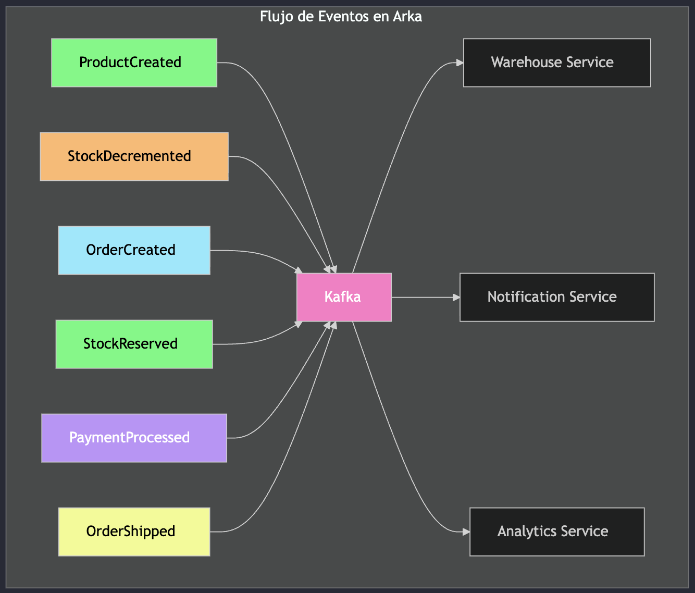

```json
{
  "eventId": "uuid-123",
  "eventType": "ProductCreated",
  "payload": {
    "sku": "GPU-RTX4090",
    "name": "NVIDIA RTX 4090",
    "initialStock": 50,
    "price": 1599.99
  },
  "timestamp": "2025-02-15T10:00:00Z"
}
```

### Event Sourcing

Con CRUD, un UPDATE destruye el estado anterior. Event Sourcing cambia el enfoque: guardamos todos los eventos que produjeron el estado actual.

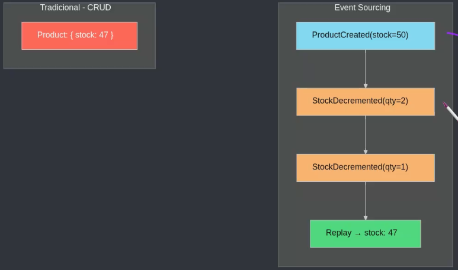

#### Ventajas de Event Sourcing

| Ventaja            | Descripción                                     |
| ------------------ | ----------------------------------------------- |
| Auditoría completa | Historial de cada cambio                        |
| Debugging          | Puedes "rebobinar" al estado en cualquier punto |
| Reconstrucción     | Recalcular vistas desde los eventos             |
| Temporal queries   | "¿Cuál era el stock el martes?"                 |

> Complejidad: Requiere manejo de snapshots y versionado de eventos.

### Patrón CQRS: Command Query Responsibility Segregation

Separar el modelo de escritura (Commands) del modelo de lectura (Queries).

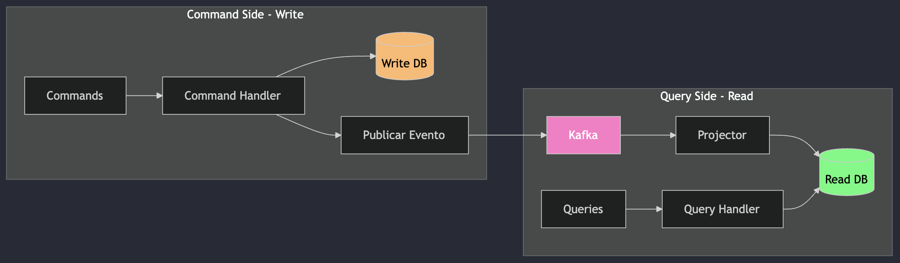

#### Por qué CQRS

**El problema sin CQRS:**

Un solo modelo para leer y escribir genera conflictos:

- Escritura necesita normalización (evitar duplicados)
- Lectura necesita desnormalización (JOINs son lentos)
- Escalar lectura y escritura juntas es ineficiente

**Con CQRS en Arka:**

| Lado  | BD                  | Optimización             |
| ----- | ------------------- | ------------------------ |
| Write | PostgreSQL (R2DBC)  | Normalizada, consistente |
| Read  | Vista materializada | Desnormalizada, rápida   |

Los eventos en Kafka alimentan el modelo de lectura automáticamente.

> La BD de lectura puede ser una vista desnormalizada, un cache Redis, o un índice Elasticsearch — cada una optimizada para su caso de uso.

## Patrón Saga

Transacciones distribuidas en el mundo de los microservicios.

### Problema: Transacciones Distribuidas

En un monolito, una transacción ACID es simple:

- **Atomicidad:** Se ejecuta todo o nada
- **Consistencia:** Los datos pasan de un estado válido a otro
- **Isolation (Aislamiento):** Las transacciones concurrentes no interfieren entre sí
- **Durabilidad:** Una vez confirmada, la transacción persiste incluso ante fallos

```java
@Transactional
public void processOrder(Order order) {
    orderRepository.save(order);          // 1. Guardar orden
    inventoryService.decrementStock(sku); // 2. Descontar stock
    paymentService.charge(order);         // 3. Cobrar
    // Si algo falla → ROLLBACK automático
}
```

### El Desafío en Microservicios

En microservicios, cada servicio tiene su propia BD:

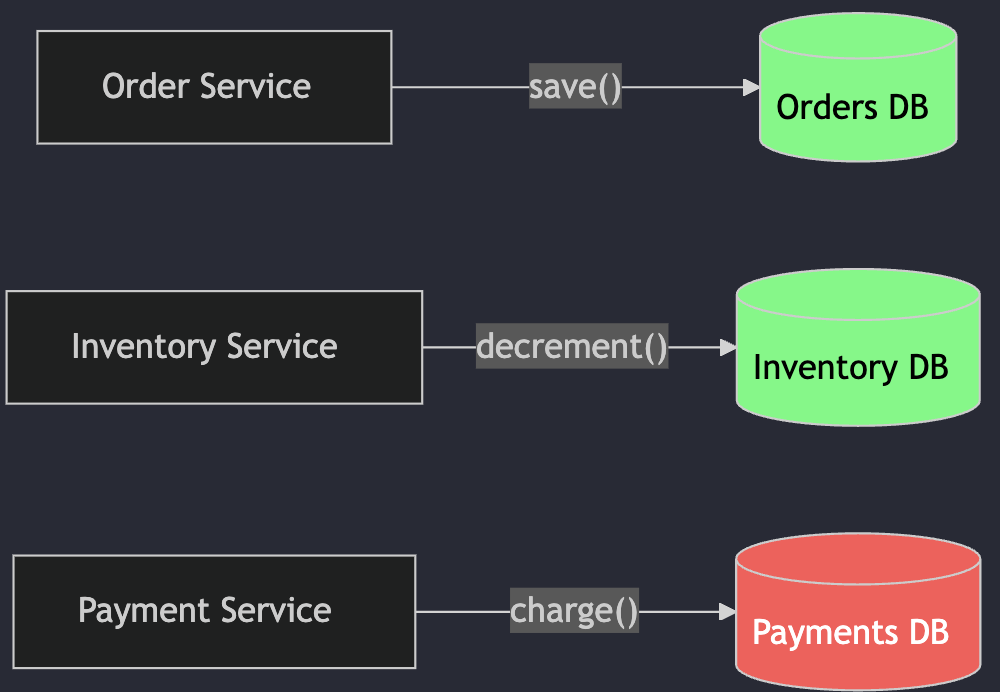

> No existe @Transactional entre bases de datos distintas. Si el pago falla después de descontar stock, ¿cómo se revierte?

### Qué es el Patrón Saga

Una Saga es una secuencia de transacciones locales, donde cada paso tiene una acción compensatoria en caso de fallo.

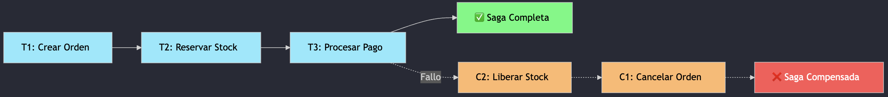

| Concepto              | Descripción                               |
| --------------------- | ----------------------------------------- |
| Transacción Local (T) | Acción que modifica datos en un servicio  |
| Compensación (C)      | Acción que revierte una transacción local |
| Saga                  | Secuencia: T1 → T2 → T3… o C3 → C2 → C1   |

### Saga Coreografiada

Cada servicio emite un evento y los demás reaccionan. No hay un coordinador central.

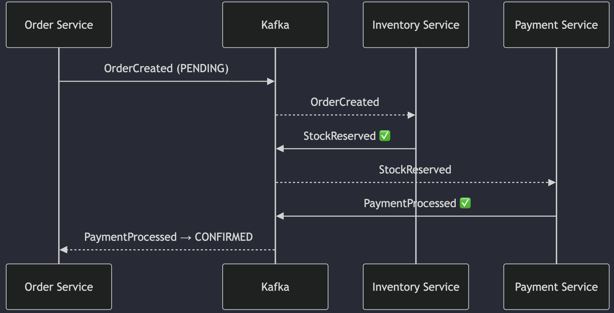

#### Coreografia: Caso de Fallo

¿Qué pasa si el pago falla?

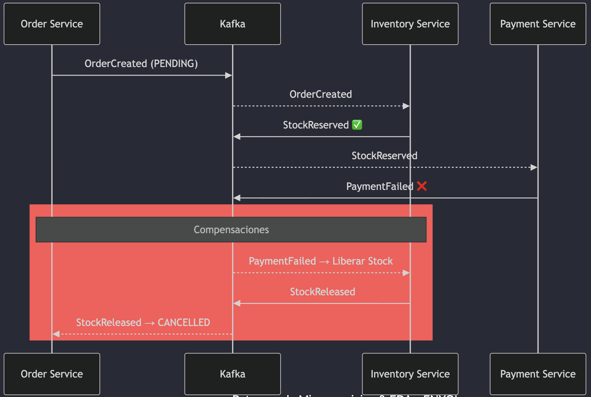

### Saga Orquestada

Un microservicio dedicado (o componente dentro del Order Service) que actúa como "director de orquesta":

- Conoce todos los pasos de la transacción
- Llama a cada servicio en orden
- Decide qué compensar si algo falla
- Los demás servicios no se conocen entre sí — solo responden al orquestador

> A diferencia de la coreografía, aquí hay un punto central de control. Más fácil de entender y debuggear, pero introduce más acoplamiento.

#### Saga Orquestada: Flujos

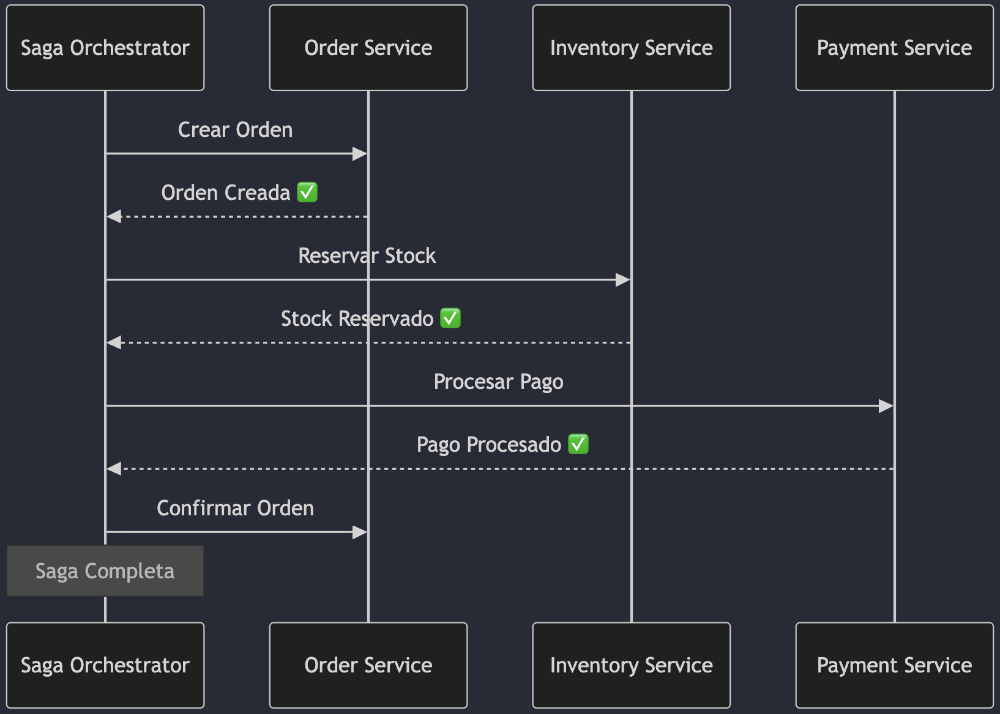

#### Orquestación: Caso de Fallo

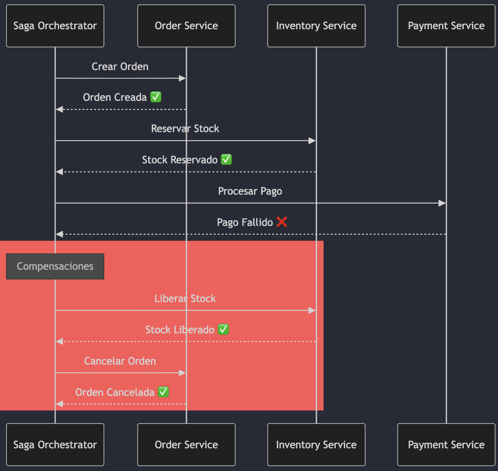

> El orquestador mantiene el estado de la saga y sabe exactamente qué pasos compensar.

### Coreografia vs Orquestación

| Aspecto        | Coreografía                        | Orquestación                          |
| -------------- | ---------------------------------- | ------------------------------------- |
| Coordinador    | No hay (descentralizado)           | Sí (orquestador central)              |
| Acoplamiento   | Bajo (solo eventos)                | Medio (orquestador conoce los pasos)  |
| Complejidad    | Crece con más servicios            | Centralizada y manejable              |
| Visibilidad    | Difícil de rastrear flujo completo | Fácil, el orquestador tiene el estado |
| Punto de fallo | Distribuido                        | Si cae el orquestador, se detiene     |
| Ideal para     | Sagas simples (2-3 pasos)          | Sagas complejas (4+ pasos)            |
| Testing        | Más difícil                        | Más fácil                             |

### Saga Arka

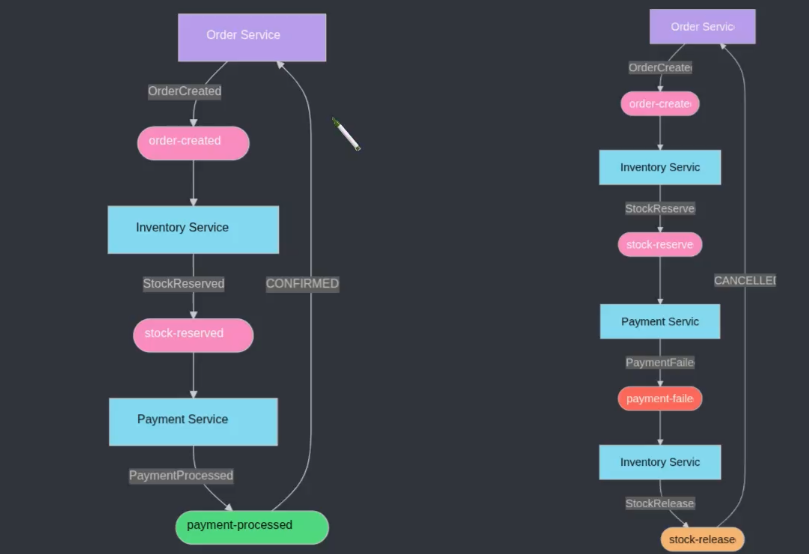

#### Estados de la Orden en la Saga

```java
public enum OrderStatus {
    PENDING,           // Orden creada, esperando reserva de stock
    STOCK_RESERVED,    // Stock reservado, esperando pago
    CONFIRMED,         // Pago exitoso → Saga completa ✅
    STOCK_RELEASED,    // Compensación: stock liberado
    CANCELLED          // Orden cancelada → Saga compensada ❌
}
```

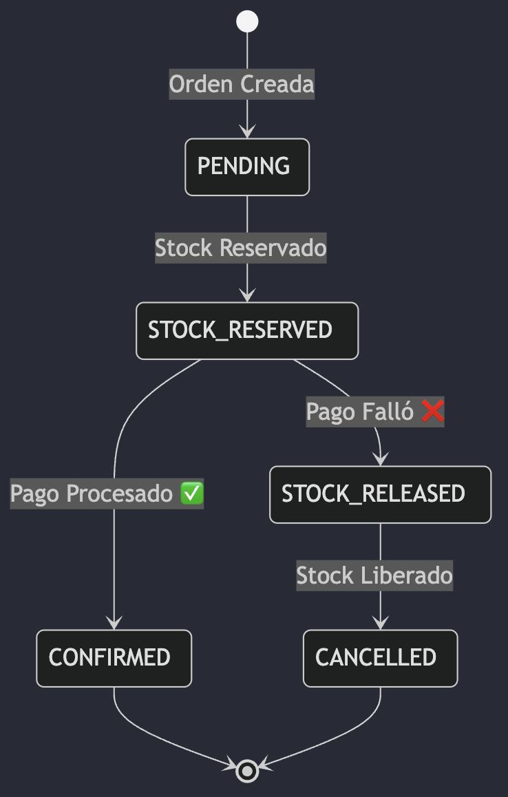

#### Implementación Reactiva de la Saga

```java
// Inventory Service - Consumer
@KafkaListener(topics = "order-created")
public Mono<Void> onOrderCreated(OrderCreatedEvent event) {
    return inventoryRepository.findBySku(event.sku())
        .flatMap(product -> {
            if (product.getStock() >= event.quantity()) {
                product.setStock(product.getStock() - event.quantity());
                return inventoryRepository.save(product)
                    .then(kafkaProducer.send("stock-reserved",
                        new StockReservedEvent(event.orderId(), event.sku())));
            } else {
                return kafkaProducer.send("stock-reserve-failed",
                    new StockReserveFailedEvent(event.orderId(), "Stock insuficiente"));
            }
        });
}
```

> Idempotencia: El consumer debe manejar eventos duplicados. Usar eventId para detectar si ya se procesó.

## Outbox Pattern

Garantizar consistencia entre escritura en BD y publicación de eventos.

### El Problema: Dual Write

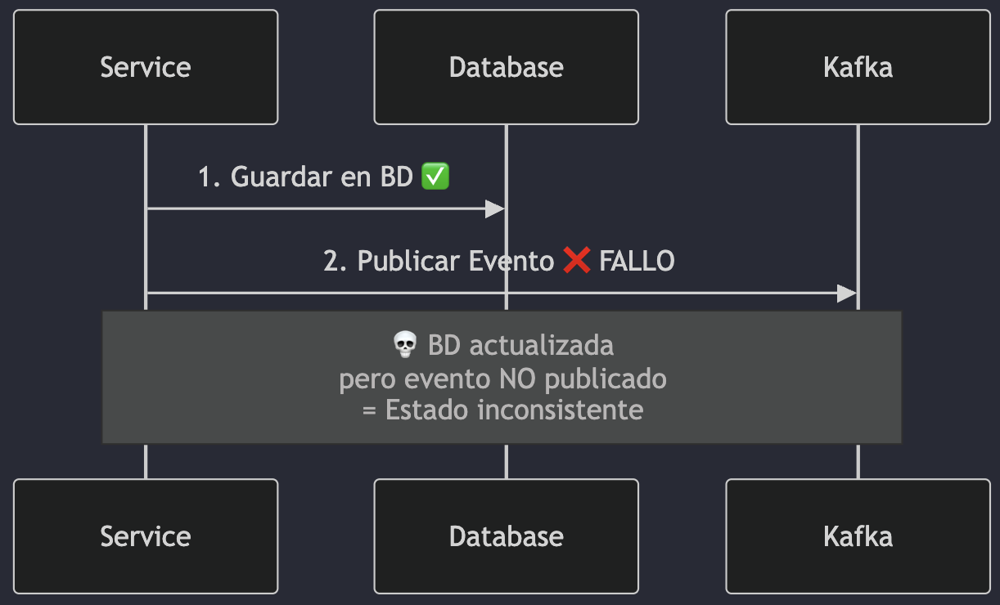

> Dual Write: Escribir en BD y en Kafka no es atómico. Si uno falla sin el otro, quedamos inconsistentes.

### Solución: Transactional Outbox

El patrón Transactional Outbox garantiza consistencia usando una tabla intermedia (`outbox_events`) dentro de la misma transacción de negocio. Ambas escrituras (datos + evento) ocurren de forma atómica.

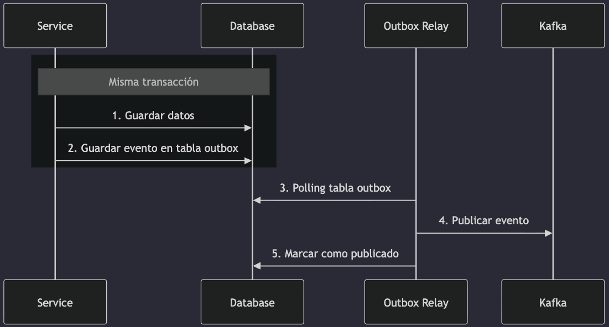

**Flujo:**

1. Servicio guarda datos en su tabla principal
2. En la misma transacción, guarda el evento en la tabla `outbox_events`
3. Un relay lee los eventos pendientes y los publica a Kafka
4. Marca los eventos como publicados

### Qué es el Outbox Relay

No es un microservicio separado.
Es un componente dentro del mismo servicio — un job en background que corre periódicamente:

- Lee eventos pendientes de la tabla `outbox_events`
- Los publica en Kafka
- Los marca como `PUBLISHED`

**Puede implementarse de dos formas:**

| Enfoque    | Cómo funciona                  | Cuándo usarlo                  |
| ---------- | ------------------------------ | ------------------------------ |
| @Scheduled | Polling periódico a la BD      | Simple, sin dependencias extra |
| Debezium   | Lee el WAL de PostgreSQL (CDC) | Alta frecuencia, sin polling   |

> Debezium (Change Data Capture) es más eficiente: reacciona a los cambios en la BD en tiempo real sin hacer queries repetitivas.

### Outbox Relay: Implementación

```java
@Component
public class OutboxRelay {

    private final OutboxRepository outboxRepo;
    private final KafkaProducer kafkaProducer;

    @Scheduled(fixedDelay = 5000) // Corre cada 5 segundos
    public void relay() {
        outboxRepo.findByStatus(PENDING)   // Flux<OutboxEvent>
            .flatMap(event ->
                kafkaProducer.send(
                    event.getTopic(),      // ej: "stock-reserved"
                    event.getPayload()     // JSON del evento
                )
                .then(outboxRepo.markAsPublished(event.getId()))
            )
            .subscribe();
    }
}
```

> findByStatus(PENDING) devuelve un Flux — procesa todos los eventos pendientes en paralelo con flatMap.

### Tabla Outbox

```sql
CREATE TABLE outbox_events (
    id          UUID PRIMARY KEY DEFAULT gen_random_uuid(),
    event_type  VARCHAR(100) NOT NULL,     -- 'ProductCreated'
    payload     JSONB NOT NULL,            -- El evento serializado
    topic       VARCHAR(100) NOT NULL,     -- 'product-created'
    created_at  TIMESTAMP DEFAULT NOW(),
    published   BOOLEAN DEFAULT FALSE,
    published_at TIMESTAMP
);
```

```java
// Dentro de la misma transacción
@Transactional
public Mono<Product> createProduct(Product product) {
    return productRepository.save(product)
        .flatMap(saved -> {
            OutboxEvent event = new OutboxEvent(
                "ProductCreated",
                toJson(new ProductCreatedEvent(saved)),
                "product-created"
            );
            return outboxRepository.save(event)
                .thenReturn(saved);
        });
}
```

## Resumen Final

### Mapa de Patrones

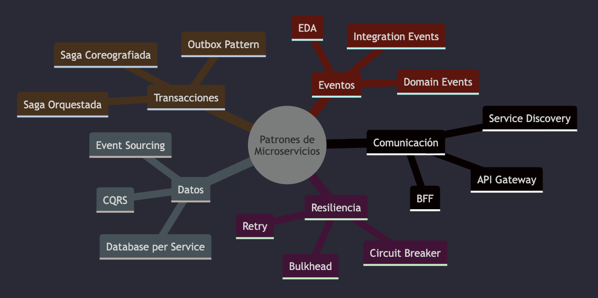

### Resumen de Patrones

| Patrón               | Problema que Resuelve         | Aplicación en Arka                |
| -------------------- | ----------------------------- | --------------------------------- |
| API Gateway          | Punto de entrada único        | Gateway para clientes web/mobile  |
| Service Discovery    | Encontrar servicios dinámicos | Docker Compose DNS                |
| Circuit Breaker      | Cascading failures            | Proteger llamadas a inventario    |
| Database per Service | Acoplamiento de datos         | Cada servicio con su PostgreSQL   |
| EDA                  | Comunicación acoplada         | Kafka como event backbone         |
| CQRS                 | Lecturas vs escrituras        | Consultas de catálogo optimizadas |
| Saga                 | Transacciones distribuidas    | Flujo Orden → Stock → Pago        |
| Outbox               | Dual-write inconsistency      | Garantizar publicación de eventos |

### Próximo paso: Lab práctico

En el laboratorio implementaremos:

1. Inventory Service con Spring WebFlux + R2DBC
2. Order Service con máquina de estados de la Saga
3. Kafka como message broker para eventos
4. Docker Compose para la infraestructura completa
5. Patrón Saga Coreografiada para el flujo de órdenes
6. Outbox Pattern para garantizar consistencia

> Todo el stack: Java 17+ / Spring WebFlux / R2DBC / PostgreSQL / Kafka / Docker

### Recursos

1. [Microservices Patterns - Chris Richardson](https://microservices.io/patterns/)
2. [Event-Driven Microservices - O'Reilly](https://www.oreilly.com/library/view/building-event-driven-microservices/9781492057888/)
3. [Saga Pattern - Microsoft](https://learn.microsoft.com/en-us/azure/architecture/patterns/saga)
4. [CQRS Journey - Microsoft](<https://learn.microsoft.com/en-us/previous-versions/msp-n-p/jj554200(v=pandp.10)>)
5. [Clean Architecture Plugin - Bancolombia](https://github.com/bancolombia/scaffold-clean-architecture)
6. [Resilience4j Documentation](https://resilience4j.readme.io/)
7. [Apache Kafka Documentation](https://kafka.apache.org/42/getting-started/introduction/)

---

## Notas Adicionales

### Observabilidad en Arquitecturas de Microservicios

**Caso Bancolombia:**

- Migración de CloudWatch a Grafana debido a mejor integración con Kafka y microservicios en EKS
- Dynatrace se utiliza para agregación y análisis de logs distribuidos

### Manejo de Timeouts en API Gateway

Cuando ocurren timeouts a nivel de infraestructura (ej: API Gateway) y no del microservicio:

**Estrategias:**

1. **Sincronización de timeouts:** Alinear timeouts del microservicio con la infraestructura
2. **Compensación reactiva:** Detectar errores de timeout del API Gateway y ejecutar rollbacks
3. **Circuit breaker:** Implementar lógica de circuit breaking a nivel de gateway

---

## Preguntas de Reflexión

### Consistencia Eventual vs Transacciones

**❌ Mito:** La consistencia eventual puede reemplazar transacciones ACID en todos los casos

**✅ Realidad:** Hay escenarios donde se requiere consistencia fuerte (ej: transferencias bancarias, facturación). En estos casos:

- Considerar mantener el proceso en un solo servicio
- Usar Saga con cuidado y validaciones estrictas
- Evaluar si realmente se necesita microservicios para ese dominio

### Resiliencia y Dependencias

**Problema:** ¿Qué hacer cuando una orden depende de que el servicio de Inventario responda?

**Soluciones:**

- **Circuit Breaker:** Evitar cascading failures
- **Retry con backoff:** Reintentos exponenciales
- **Fallback:** Respuesta por defecto (ej: "stock no disponible temporalmente")
- **Async processing:** Cola de órdenes pendientes que se procesan cuando el servicio vuelve

### Relaciones entre Bases de Datos

**Desafío:** Cómo manejar relaciones entre entidades de diferentes microservicios en bases de datos SQL separadas

**Estrategias:**

1. **API Composition:** El servicio agregador hace múltiples llamadas
2. **Data Duplication:** Cada servicio mantiene copia de datos que necesita (consistencia eventual)
3. **CQRS + Event Sourcing:** Vista de lectura desnormalizada alimentada por eventos
4. **Saga Pattern:** Para transacciones que abarcan múltiples servicios
5. **Reconsiderar boundaries:** Si dos entidades siempre se consultan juntas, quizá pertenecen al mismo servicio
