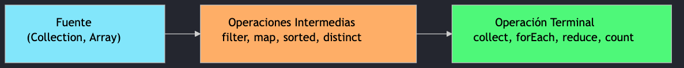
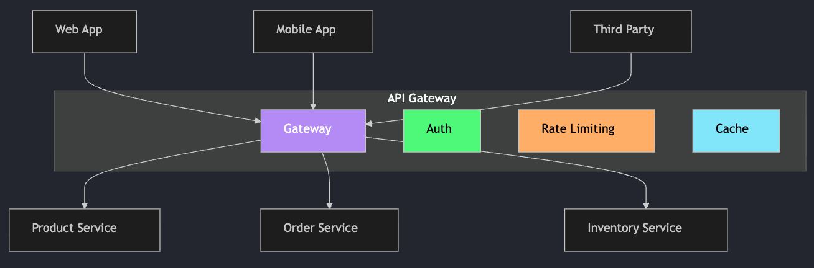
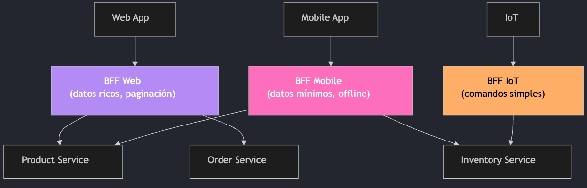
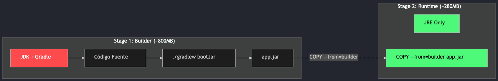
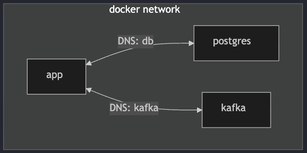
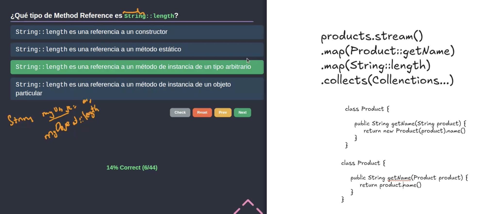

# Clase 16 - Repaso: Programación Funcional, Docker y BFF

> Diapositivas: <https://manulasker.github.io/enyoi_java_slides/clase_26_repaso_quiz_4/#/title-slide>

---

## Índice

1. [Programación Funcional en Java](#programación-funcional-en-java)
2. [Backend for Frontend (BFF)](#backend-for-frontend-bff)
3. [Docker](#docker)
4. [Resumen Final](#resumen-final)
5. [Extra](#extra)

## Resumen

Sesión de repaso que integra tres temas clave: **Programación Funcional en Java** (interfaces funcionales, lambdas, Stream API, Optional), el patrón **Backend for Frontend (BFF)** y su diferencia con API Gateway, y conceptos esenciales de **Docker** (Dockerfile, multi-stage builds, Docker Compose, volúmenes y networking).

---

## Programación Funcional en Java

Paradigma que produce código **declarativo** (describe _qué_ hacer, no _cómo_) usando lambdas, Streams y Optional.

### Interfaces Funcionales

Una **interfaz funcional** tiene exactamente un método abstracto (SAM — Single Abstract Method).
La anotación `@FunctionalInterface` lo verifica en tiempo de compilación.

| Interfaz            | Método       | Firma         | Uso típico              |
| ------------------- | ------------ | ------------- | ----------------------- |
| `Function<T,R>`     | `apply(T)`   | `T → R`       | Transformar un objeto   |
| `Predicate<T>`      | `test(T)`    | `T → boolean` | Filtrar elementos       |
| `Consumer<T>`       | `accept(T)`  | `T → void`    | Imprimir, persistir     |
| `Supplier<T>`       | `get()`      | `() → T`      | Crear objetos           |
| `UnaryOperator<T>`  | `apply(T)`   | `T → T`       | Modificar el mismo tipo |
| `BiFunction<T,U,R>` | `apply(T,U)` | `(T,U) → R`   | Combinar dos valores    |

```java
Function<String, Integer> longitud   = s -> s.length();
Predicate<Integer>        esPar      = n -> n % 2 == 0;
Consumer<String>          imprimir   = s -> System.out.println(s);
Supplier<List<String>>    crearLista = ArrayList::new;
```

### Expresiones Lambda y Method References

Una **lambda** es una función anónima que implementa una interfaz funcional.

```java
// Sintaxis completa
(String nombre) -> { return "Hola " + nombre; }

// Sintaxis simplificada (tipo inferido, return implícito)
nombre -> "Hola " + nombre
```

**Evolución: clase anónima → lambda → method reference:**

```java
// Java 7 — clase anónima
Collections.sort(lista, new Comparator<String>() {
    @Override
    public int compare(String a, String b) {
        return a.compareTo(b);
    }
});

// Java 8+ — lambda
lista.sort((a, b) -> a.compareTo(b));

// Java 8+ — method reference (atajo cuando la lambda solo delega a un método existente)
lista.sort(String::compareTo);
```

> **Effectively final:** una variable local usada en una lambda que no se declara `final` queda _implícitamente_ final — no puede ser reasignada.

### Stream API

Un **Stream** es una secuencia de elementos con operaciones de procesamiento declarativas encadenadas (pipeline).



| Tipo            | Operaciones                                                      | Comportamiento                                   |
| --------------- | ---------------------------------------------------------------- | ------------------------------------------------ |
| **Intermedias** | `filter`, `map`, `flatMap`, `sorted`, `distinct`, `peek`         | _Lazy_ — no se ejecutan hasta haber una terminal |
| **Terminales**  | `collect`, `forEach`, `reduce`, `count`, `findFirst`, `anyMatch` | Desencadenan la ejecución del pipeline           |

#### Ejemplos

```java
List<Product> products = getProducts();

// Filtrar, transformar y recolectar
List<String> nombresCaros = products.stream()
        .filter(p -> p.getPrice() > 1000)          // Predicate
        .map(Product::getName)                      // Function
        .sorted()
        .collect(Collectors.toList());              // Terminal

// Reducir a un valor
double totalVentas = products.stream()
        .mapToDouble(Product::getPrice)
        .sum();

// Agrupar por categoría
Map<String, List<Product>> porCategoria = products.stream()
        .collect(Collectors.groupingBy(Product::getCategory));

// flatMap: Stream<Stream<T>> → Stream<T>
List<String> todasLasTags = products.stream()
        .flatMap(p -> p.getTags().stream())
        .distinct()
        .collect(Collectors.toList());
```

### Optional

`Optional<T>` es un contenedor que puede o no tener valor. Elimina null checks encadenados y previene `NullPointerException`.

```java
// Sin Optional — null checks explícitos
Product p = findById(id);
if (p != null) {
    String name = p.getName();
    if (name != null) return name.toUpperCase();
}
return "UNKNOWN";

// Con Optional — encadenamiento funcional
return findById(id)
        .map(Product::getName)
        .map(String::toUpperCase)
        .orElse("UNKNOWN");
```

| Método              | Descripción                                         |
| ------------------- | --------------------------------------------------- |
| `of(value)`         | Crea Optional; lanza `NullPointerException` si null |
| `ofNullable(value)` | Crea Optional vacío si null                         |
| `isPresent()`       | `true` si tiene valor                               |
| `map(Function)`     | Transforma el valor si existe                       |
| `flatMap(Function)` | Como `map`, pero la función ya retorna `Optional`   |
| `orElse(default)`   | Retorna el valor o el default si vacío              |
| `orElseThrow()`     | Lanza excepción si vacío                            |

> Quiz: <https://manulasker.github.io/enyoi_java_slides/clase_26_repaso_quiz_4/#/quiz-programaci%C3%B3n-funcional>

---

## Backend for Frontend (BFF)

### API Gateway

Un **API Gateway** es el único punto de entrada para todos los clientes hacia los microservicios internos.



**Responsabilidades:** routing, auth, rate limiting, load balancing, circuit breaking.

### Qué es BFF

**Backend for Frontend:** variante del API Gateway donde cada tipo de cliente tiene su propio backend optimizado.



> Cada BFF adapta las respuestas a su cliente: la web puede recibir más datos; el móvil recibe payloads más ligeros.

### API Gateway vs BFF

| Característica | API Gateway                  | BFF                              |
| -------------- | ---------------------------- | -------------------------------- |
| Enfoque        | Único punto de entrada       | Múltiples gateways por cliente   |
| Adaptabilidad  | "Talla única"                | A medida para cada cliente       |
| Propiedad      | Equipo de Plataforma         | Equipo de Frontend/Producto      |
| Ventaja        | Simplicidad y centralización | Optimización de UX y performance |
| Riesgo         | Cuello de botella            | Duplicación de lógica            |
| Evolución      | Centralizada                 | Independiente por BFF            |

> El BFF **no reemplaza** al API Gateway; suelen coexistir. El Gateway maneja cross-cutting concerns (TLS, auth global) y enruta hacia los BFFs.

### Cuándo usar BFF

**Usar BFF cuando:**

- Múltiples tipos de clientes con necesidades muy diferentes.
- El equipo de frontend necesita autonomía para evolucionar su API.
- Se requiere optimizar payloads por plataforma (SSR en web, REST ligero en móvil).

**No usar BFF cuando:**

- Solo hay un tipo de cliente.
- Los clientes consumen datos similares.
- El equipo es pequeño y el overhead de mantener N backends no se justifica.

> Quiz: <https://manulasker.github.io/enyoi_java_slides/clase_26_repaso_quiz_4/#/quiz-bff>

---

## Docker

### Dockerfile

| Instrucción  | Qué hace                                    | Ejemplo                           |
| ------------ | ------------------------------------------- | --------------------------------- |
| `FROM`       | Imagen base                                 | `FROM eclipse-temurin:21-jre`     |
| `WORKDIR`    | Directorio de trabajo                       | `WORKDIR /app`                    |
| `COPY`       | Copiar archivos al contenedor               | `COPY build/libs/*.jar app.jar`   |
| `RUN`        | Ejecutar comando en _build time_            | `RUN apt-get update`              |
| `ENV`        | Variable de entorno (persiste en ejecución) | `ENV JAVA_OPTS="-Xmx512m"`        |
| `EXPOSE`     | Documenta el puerto (no lo publica)         | `EXPOSE 8080`                     |
| `CMD`        | Comando por defecto al iniciar              | `CMD ["java", "-jar", "app.jar"]` |
| `ENTRYPOINT` | Ejecutable principal                        | `ENTRYPOINT ["java"]`             |
| `ARG`        | Variable **solo** en build time             | `ARG JAR_VERSION=1.0`             |

> `ARG` desaparece tras el build. `ENV` persiste en el contenedor en ejecución.

### Multi-Stage Build

Separa la fase de compilación de la de ejecución, produciendo imágenes finales más pequeñas y seguras.



> La imagen final no incluye JDK, Gradle ni código fuente — únicamente el JRE y el JAR compilado.

### Docker Compose

Orquesta múltiples contenedores con un solo archivo `compose.yml`.

| Clave             | Propósito                                          |
| ----------------- | -------------------------------------------------- |
| `services`        | Define cada contenedor                             |
| `build` / `image` | Construir desde Dockerfile o usar imagen existente |
| `ports`           | Mapeo `host:contenedor`                            |
| `environment`     | Variables de entorno                               |
| `depends_on`      | Orden de inicio (con `condition` opcional)         |
| `volumes`         | Persistencia de datos                              |
| `healthcheck`     | Verificar que el servicio esté listo               |
| `networks`        | Redes personalizadas                               |

```yaml
services:
  app:
    build: .
    ports:
      - "8080:8080"
    environment:
      - DATABASE_URL=jdbc:postgresql://db:5432/arka
    depends_on:
      db:
        condition: service_healthy

  db:
    image: postgres:16
    environment:
      POSTGRES_PASSWORD: secret
    volumes:
      - pgdata:/var/lib/postgresql/data
    healthcheck:
      test: ["CMD-SHELL", "pg_isready"]
      interval: 10s

volumes:
  pgdata:
```

### Volúmenes y Networking

**Tipos de volúmenes:**

| Tipo         | Uso                        |
| ------------ | -------------------------- |
| Named Volume | Persistencia en producción |
| Bind Mount   | Desarrollo con hot-reload  |
| `tmpfs`      | Datos temporales en RAM    |

```bash
# Named Volume
-v pgdata:/var/lib/postgresql/data

# Bind Mount
-v $(pwd)/src:/app/src
```

**Networking:**



- Las redes custom permiten resolución DNS por nombre de servicio.
- En Compose, cada servicio es accesible por su nombre dentro de la red del proyecto.
- Red manual: `docker network create mi-red`.

### Comandos Esenciales

```bash
# Docker
docker build -t mi-app:1.0 .              # Construir imagen
docker run -d -p 8080:8080 mi-app:1.0     # Ejecutar contenedor en background
docker ps                                  # Listar contenedores activos
docker logs -f <container>                # Ver logs en tiempo real
docker exec -it <container> /bin/bash     # Shell dentro del contenedor

# Docker Compose
docker compose up -d                      # Iniciar todos los servicios
docker compose down                       # Detener y eliminar contenedores
docker compose logs -f <service>          # Logs de un servicio específico
docker compose ps                         # Estado de los servicios
docker compose up -d --scale app=3        # Escalar un servicio a 3 réplicas
```

> Quiz: <https://manulasker.github.io/enyoi_java_slides/clase_26_repaso_quiz_4/#/quiz-docker>

---

## Resumen Final

| Tema                | Conceptos clave                                                                                                                                       |
| ------------------- | ----------------------------------------------------------------------------------------------------------------------------------------------------- |
| **Prog. Funcional** | Interfaces funcionales, lambdas, method references, Stream API (intermedias vs terminales), Optional                                                  |
| **BFF**             | API Gateway como base, BFF por tipo de cliente, cuándo usarlo, coexistencia con Gateway, ownership del equipo de frontend                             |
| **Docker**          | Imagen vs contenedor, Dockerfile (instrucciones clave), multi-stage builds, Compose (services/volumes/networks), tipos de volúmenes, networking y DNS |

---

## Extra

**Pregunta 6 — explicación:**



**Pregunta 11 — explicación:**
Al usar una variable **no declarada como `final`** dentro de una lambda, esta queda _implícitamente_ final — el compilador no permite reasignarla.
