# Clase 18 - Spring Boot (Parte 1)

Diapositivas parte 1: <https://manulasker.github.io/enyoi_java_slides/clase_27_28_spring_boot_parte_1/#/title-slide>

---

## Resumen

Spring Boot simplifica el desarrollo de aplicaciones Java empresariales basadas en Spring. Elimina la configuración manual mediante **auto-configuración**, incluye un **servidor embebido** (Tomcat/Netty) y gestiona dependencias vía **Starters**. Su núcleo se apoya en **IoC/DI** para desacoplar componentes. Esta parte cubre: la arquitectura interna, estereotipos y scopes de beans, Lombok para eliminar boilerplate, configuración por perfiles, construcción de APIs REST con Spring MVC, y persistencia con Spring Data JPA.

---

## Índice

1. [Introducción a Spring Boot](#introducción-a-spring-boot)
2. [Primer Proyecto con Spring Boot](#primer-proyecto-con-spring-boot)
3. [Arquitectura Interna de Spring Boot](#arquitectura-interna-de-spring-boot)
4. [IoC & Inyección de Dependencias en Detalle](#ioc--dependency-injection-en-detalle)
5. [Lombok: Adiós al Boilerplate](#lombok-adiós-al-boilerplate)
6. [Configuración en Spring Boot](#configuración-en-spring-boot)
7. [Spring MVC & REST Controllers](#spring-mvc--rest-controllers)
8. [Spring Data JPA](#spring-data-jpa)
9. [Cierre de la Parte 1](#cierre-de-la-parte-1)
10. [Notas Complementarias](#notas-complementarias)

---

## Introducción a Spring Boot

Spring Boot es un framework que simplifica la creación de aplicaciones Java basadas en Spring, eliminando la configuración manual y permitiendo enfocarse en la lógica de negocio.

### Qué es Spring

Spring Framework es un framework de desarrollo Java empresarial creado por Rod Johnson en 2003. Su núcleo se basa en dos principios:

| Principio                          | Descripción                                                                    |
| ---------------------------------- | ------------------------------------------------------------------------------ |
| **IoC** (Inversión de Control)     | El framework controla el ciclo de vida de los objetos, no el desarrollador     |
| **DI** (Inyección de Dependencias) | Las dependencias se "inyectan" en los objetos en lugar de crearlas manualmente |

> Spring eliminó la necesidad de EJBs (Enterprise JavaBeans), simplificando drásticamente el desarrollo Java empresarial.

### El problema que Spring resuelve

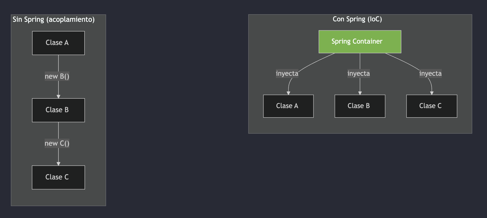

### Spring vs Spring Boot

**Spring Framework (puro):**

- Mayor configuración manual (XML/Java Config)
- Configurar infraestructura explícitamente
- Múltiples archivos de configuración
- Gestión de dependencias más detallada
- Despliegue tradicional en servidor (normalmente WAR)

**Spring Boot:**

- Auto-configuración inteligente
- Servidor embebido (Tomcat/Netty)
- `application.properties` / `.yml`
- Starters gestionan dependencias
- JAR ejecutable independiente

> Spring Boot no reemplaza a Spring, lo potencia eliminando la complejidad de configuración.

#### Ejemplo: Spring vs Spring Boot

Spring Framework puro:

```xml
<!-- Configuración tradicional -->
<bean id="dataSource"
        class="org.apache.commons.dbcp2.BasicDataSource">
    <property name="driverClassName"
            value="com.mysql.cj.jdbc.Driver"/>
    <property name="url"
            value="jdbc:mysql://localhost:3306/db"/>
</bean>
```

Spring Boot:

```yaml
# application.yml
spring:
  datasource:
    url: jdbc:mysql://localhost:3306/db
    driver-class-name: com.mysql.cj.jdbc.Driver
```

### Filosofía de Spring Boot

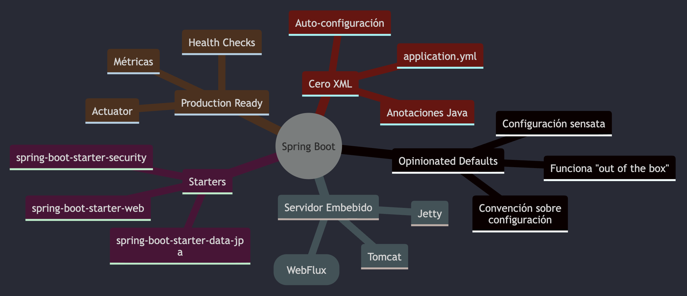

### Evolución y Versiones

| Versión    | Año   | Hitos Principales                                                       |
| ---------- | ----- | ----------------------------------------------------------------------- |
| 1.0        | 2014  | Primera versión, auto-configuración básica                              |
| 2.0        | 2018  | Spring WebFlux (reactivo), Kotlin support                               |
| 2.7        | 2022  | Última versión 2.x LTS                                                  |
| 3.0        | 2022  | Java 17+, Jakarta EE 9+, GraalVM Native                                 |
| 3.2        | 2023  | Virtual Threads (Project Loom), RestClient                              |
| 3.x actual | 2024+ | Mejoras continuas en rendimiento, observabilidad y developer experience |

> Spring Boot 3.x requiere Java 17+ y migró de `javax.*` a `jakarta.*` (Jakarta EE).

---

## Primer Proyecto con Spring Boot

### Spring Initializr

Spring Initializr ([start.spring.io](https://start.spring.io)) es la herramienta oficial para generar proyectos Spring Boot.

**Configuración básica:**

| Campo       | Valor                                            |
| ----------- | ------------------------------------------------ |
| Project     | Gradle - Groovy/Kotlin                           |
| Language    | Java                                             |
| Spring Boot | Versión 3.x que genere el scaffold (Bancolombia) |
| Packaging   | JAR                                              |
| Java        | 17 o 21                                          |

**Starters comunes:**

- `spring-boot-starter-web`
- `spring-boot-starter-data-jpa`
- `spring-boot-starter-validation`
- `spring-boot-starter-security`
- `spring-boot-starter-actuator`
- `spring-boot-starter-test`

```bash
# También puedes crear un proyecto desde la terminal
curl https://start.spring.io/starter.zip \
  -d dependencies=web,data-jpa,actuator \
  -d javaVersion=21 \
  -d type=gradle-project \
  -o mi-proyecto.zip
```

### Estructura del Proyecto

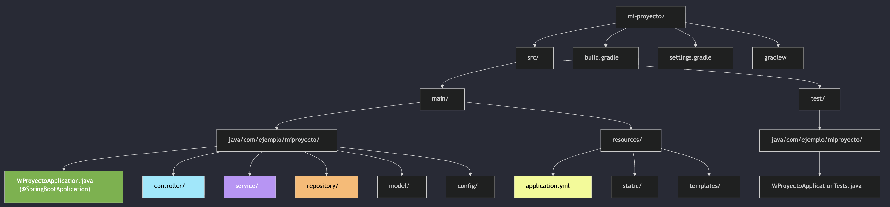

### @SpringBootApplication

```java
@SpringBootApplication // ← Esta anotación lo hace todo
public class MiProyectoApplication {
    public static void main(String[] args) {
        SpringApplication.run(MiProyectoApplication.class, args);
    }
}
```

`@SpringBootApplication` es una meta-anotación que combina tres anotaciones:

| Anotación                  | Función                                                                   |
| -------------------------- | ------------------------------------------------------------------------- |
| `@SpringBootConfiguration` | Marca la clase como fuente de configuración (equivale a `@Configuration`) |
| `@EnableAutoConfiguration` | Activa la auto-configuración de Spring Boot                               |
| `@ComponentScan`           | Escanea el paquete actual y sub-paquetes buscando componentes             |

#### @SpringBootApplication: Composición

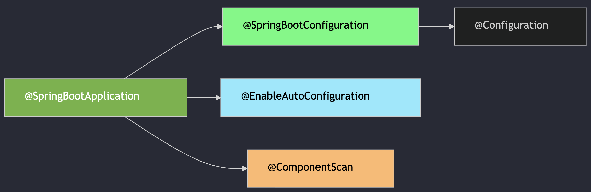

> `@ComponentScan` solo escanea el paquete de la clase principal y sus sub-paquetes. Si colocas beans en un paquete diferente, Spring no los encontrará.

### build.gradle

```groovy
plugins {
    id 'java'
    id 'org.springframework.boot' version '<versión-generada-por-scaffold>'
    id 'io.spring.dependency-management' version '1.1.6'
}

group = 'com.ejemplo'
version = '0.0.1-SNAPSHOT'
java { toolchain { languageVersion = JavaLanguageVersion.of(21) } }

repositories { mavenCentral() }

dependencies {
    implementation 'org.springframework.boot:spring-boot-starter-web'
    implementation 'org.springframework.boot:spring-boot-starter-data-jpa'
    implementation 'org.springframework.boot:spring-boot-starter-actuator'
    runtimeOnly 'org.postgresql:postgresql'
    testImplementation 'org.springframework.boot:spring-boot-starter-test'
}

tasks.named('test') { useJUnitPlatform() }
```

> Los Starters incluyen todas las dependencias transitivas — no declaras versiones individuales. Usa la misma versión que genere el scaffold de Bancolombia.

### Ejecutar la aplicación

```bash
# Desarrollo
./gradlew bootRun

# Compilar JAR ejecutable
./gradlew bootJar

# Ejecutar el JAR
java -jar build/libs/mi-proyecto-0.0.1-SNAPSHOT.jar

# Con perfil específico
java -jar mi-proyecto.jar --spring.profiles.active=dev
```

> `bootRun` para desarrollo rápido, `bootJar` para generar el artefacto desplegable.

### Qué pasa al ejecutar

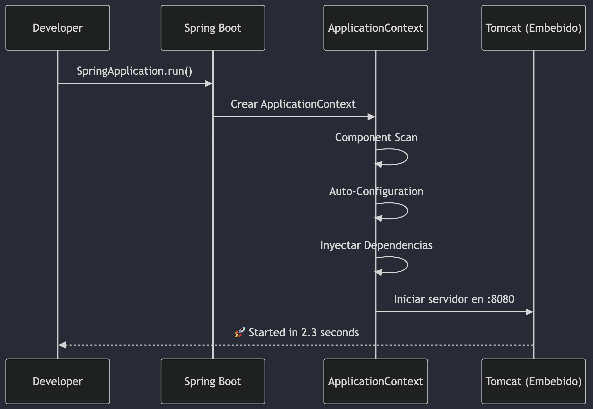

---

## Arquitectura Interna de Spring Boot

### Auto-Configuración

Spring Boot examina las dependencias en el classpath y configura automáticamente los beans necesarios.

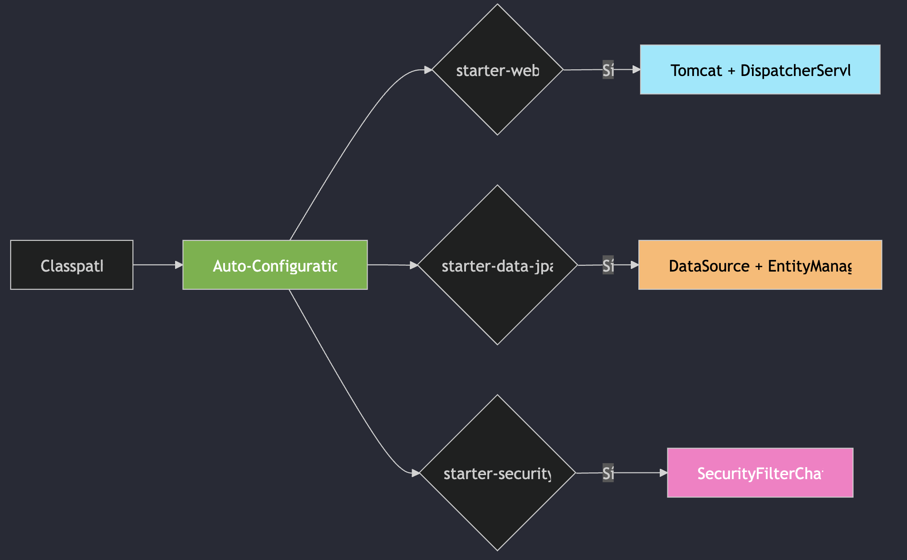

#### Cómo funciona la Auto-Configuración

```java
// Ejemplo simplificado de una auto-configuración
@AutoConfiguration
@ConditionalOnClass(DataSource.class)         // Solo si DataSource está en classpath
@ConditionalOnMissingBean(DataSource.class)   // Solo si el usuario no definió uno
@EnableConfigurationProperties(DataSourceProperties.class)
public class DataSourceAutoConfiguration {

    @Bean
    @ConfigurationProperties("spring.datasource")
    public DataSource dataSource(DataSourceProperties properties) {
        return DataSourceBuilder.create()
            .url(properties.getUrl())
            .username(properties.getUsername())
            .password(properties.getPassword())
            .build();
    }
}
```

| Anotación Condicional          | Se aplica cuando…                       |
| ------------------------------ | --------------------------------------- |
| `@ConditionalOnClass`          | Una clase está en el classpath          |
| `@ConditionalOnMissingBean`    | No existe un bean del tipo dado         |
| `@ConditionalOnProperty`       | Una propiedad tiene un valor específico |
| `@ConditionalOnWebApplication` | Es una aplicación web                   |

### Starters: Paquetes de Dependencias

Un Starter es un conjunto curado de dependencias para un propósito específico.

| Starter                        | Incluye                                        |
| ------------------------------ | ---------------------------------------------- |
| `spring-boot-starter-web`      | Spring MVC, Tomcat, Jackson, Validation        |
| `spring-boot-starter-data-jpa` | Spring Data JPA, Hibernate, HikariCP           |
| `spring-boot-starter-webflux`  | Spring WebFlux, Reactor Netty, Project Reactor |
| `spring-boot-starter-security` | Spring Security, crypto                        |
| `spring-boot-starter-test`     | JUnit 5, Mockito, AssertJ, MockMvc             |
| `spring-boot-starter-actuator` | Micrometer, Health endpoints                   |

> Los Starters siguen la convención `spring-boot-starter-{nombre}`. Starters de terceros usan `{nombre}-spring-boot-starter`.

### Servidor Embebido

Spring Boot incluye un servidor HTTP embebido — no necesitas instalar Tomcat externamente.

**Tradicional:**

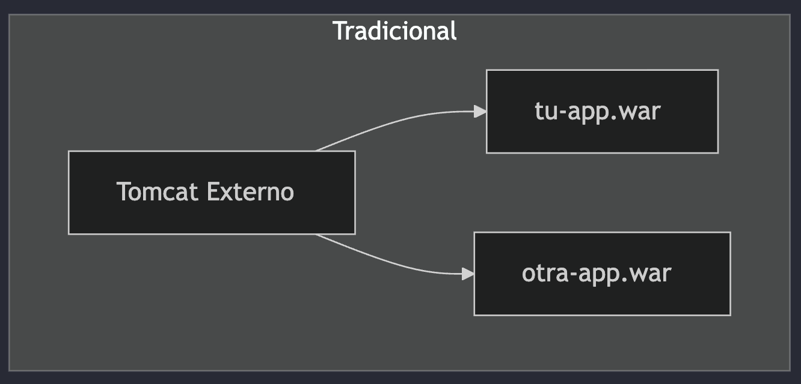

- Instalar y configurar Tomcat
- Desplegar WAR files
- Gestionar servidor por separado

**Spring Boot:**

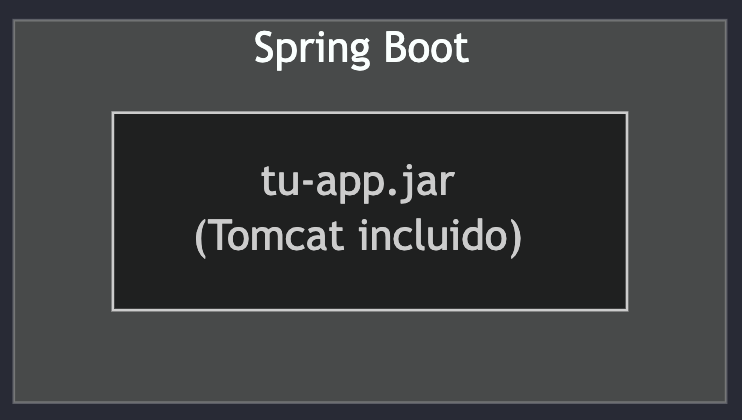

- `java -jar tu-app.jar`
- Todo en un solo artefacto
- Ideal para contenedores Docker

#### Servidores Disponibles

| Servidor | Stack                    | Uso                            |
| -------- | ------------------------ | ------------------------------ |
| Tomcat   | Spring MVC (default)     | Aplicaciones web tradicionales |
| Jetty    | Spring MVC (alternativa) | Menor footprint                |
| Netty    | Spring WebFlux (default) | Aplicaciones reactivas         |
| Undertow | Spring MVC (alternativa) | Alto rendimiento               |

```groovy
// Cambiar de Tomcat a Undertow en build.gradle
dependencies {
    implementation('org.springframework.boot:spring-boot-starter-web') {
        exclude group: 'org.springframework.boot',
                module: 'spring-boot-starter-tomcat'
    }
    implementation 'org.springframework.boot:spring-boot-starter-undertow'
}
```

> Tomcat es el default para MVC. Solo cámbialo si tienes requisitos específicos de rendimiento o footprint.

---

## IoC & Dependency Injection en Detalle

El corazón de Spring: cómo el framework gestiona tus objetos y sus dependencias.

### Qué es IoC

Inversión de Control (IoC) significa que el framework controla la creación y el ciclo de vida de los objetos, no el desarrollador.

**Sin IoC (control manual):**

```java
public class OrderService {
    // TÚ creas las dependencias
    private final OrderRepository repo =
        new OrderRepository();
    private final PaymentService payment =
        new PaymentService(new PaymentGateway());
    private final EmailService email =
        new EmailService(new SmtpConfig());
}
```

Problemas:

- Acoplamiento fuerte
- Difícil de testear (no puedes mockear)
- Difícil de cambiar implementaciones

**Con IoC (Spring gestiona):**

```java
@Service
public class OrderService {
    // Spring INYECTA las dependencias
    private final OrderRepository repo;
    private final PaymentService payment;
    private final EmailService email;

    public OrderService(
        OrderRepository repo,
        PaymentService payment,
        EmailService email) {
        this.repo = repo;
        this.payment = payment;
        this.email = email;
    }
}
```

### El ApplicationContext (Contenedor IoC)

El `ApplicationContext` es el contenedor IoC de Spring. Gestiona todos los beans de tu aplicación.

| Origen             | Acción                   | Ejemplo de Bean                                     |
| ------------------ | ------------------------ | --------------------------------------------------- |
| `@ComponentScan`   | Descubre automáticamente | `OrderService`, `OrderRepository`, `PaymentService` |
| Auto-Configuration | Crea por classpath       | `DataSource`                                        |
| `@Configuration`   | Define manualmente       | `SecurityConfig`                                    |

> Un **Bean** es un objeto gestionado por el contenedor de Spring. Spring lo crea, configura e inyecta donde se necesite.

#### ApplicationContext: Diagrama

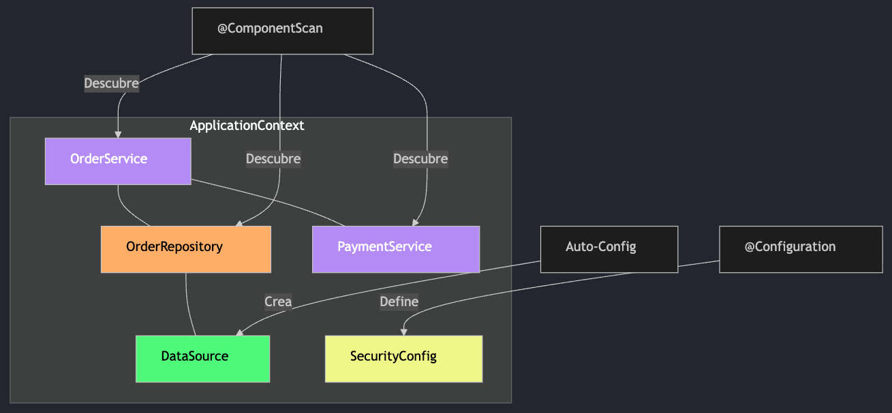

### Estereotipos: @Component y Especializaciones

Spring define estereotipos para clasificar beans según su rol arquitectónico:

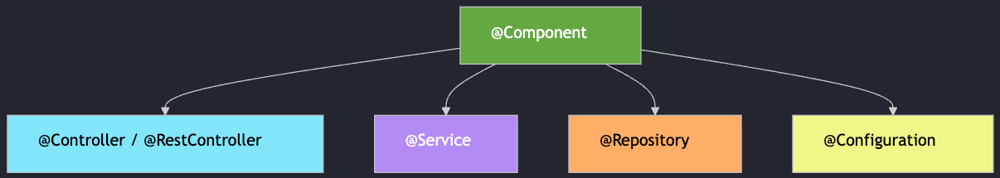

#### Tabla de Referencia de Estereotipos

| Anotación         | Capa         | Función                                        |
| ----------------- | ------------ | ---------------------------------------------- |
| `@Component`      | Cualquiera   | Bean genérico                                  |
| `@Controller`     | Presentación | Peticiones HTTP → vistas HTML                  |
| `@RestController` | Presentación | `@Controller` + `@ResponseBody` → JSON/XML     |
| `@Service`        | Negocio      | Semántico, sin magia extra                     |
| `@Repository`     | Datos        | Traduce excepciones BD → `DataAccessException` |
| `@Configuration`  | Config       | Define beans con `@Bean`                       |

> Todos heredan de `@Component`. La diferencia es semántica (claridad) excepto `@Repository` que sí traduce excepciones.

##### @Component en Detalle

`@Component` marca una clase para que Spring la detecte automáticamente durante el component scan y la registre como bean.

```java
// Spring detecta esta clase y crea una instancia (bean) automáticamente
@Component
public class EmailNotifier {
    public void send(String to, String message) {
        // lógica de envío de email...
    }
}

// Puedes dar un nombre personalizado al bean
@Component("smsNotifier")
public class SmsNotificationService {
    public void send(String phone, String message) {
        // lógica de envío de SMS...
    }
}
```

> Si no especificas nombre, Spring usa el nombre de la clase en camelCase: `EmailNotifier` → `emailNotifier`.

##### @Service en Detalle

`@Service` es semánticamente un `@Component` para lógica de negocio. No añade magia extra, pero comunica intención.

```java
@Service
public class OrderService {
    private final OrderRepository orderRepository;
    private final InventoryService inventoryService;
    private final PaymentService paymentService;

    public OrderService(OrderRepository orderRepository,
                        InventoryService inventoryService,
                        PaymentService paymentService) {
        this.orderRepository = orderRepository;
        this.inventoryService = inventoryService;
        this.paymentService = paymentService;
    }

    @Transactional
    public Order createOrder(CreateOrderRequest request) {
        inventoryService.reserveStock(request.getSku(), request.getQty());
        Order saved = orderRepository.save(new Order(request.getSku(), request.getQty()));
        paymentService.processPayment(saved);
        return saved;
    }
}
```

> `@Service` vs `@Component`: claridad arquitectónica. Un `@Service` comunica "aquí vive la lógica de negocio".

##### @Repository en Detalle

`@Repository` sí añade funcionalidad extra: traduce excepciones de persistencia a `DataAccessException` de Spring.

```java
@Repository
public class JdbcOrderRepository implements OrderRepository {
    private final JdbcTemplate jdbcTemplate;

    public JdbcOrderRepository(JdbcTemplate jdbcTemplate) {
        this.jdbcTemplate = jdbcTemplate;
    }

    @Override
    public Order findById(Long id) {
        // Si la BD lanza SQLException, Spring la traduce
        // a DataAccessException (unchecked)
        return jdbcTemplate.queryForObject(
            "SELECT * FROM orders WHERE id = ?",
            this::mapRow, id);
    }
}
```

> Con Spring Data JPA, tus interfaces extienden `JpaRepository` y Spring genera la implementación `@Repository` automáticamente.

###### Traducción de Excepciones de @Repository

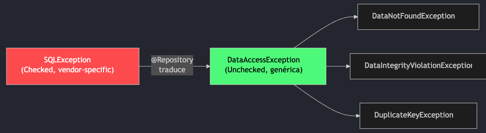

| Excepción Spring                  | Causa típica                           |
| --------------------------------- | -------------------------------------- |
| `DataNotFoundException`           | Registro no encontrado                 |
| `DataIntegrityViolationException` | Violación de constraint (FK, NOT NULL) |
| `DuplicateKeyException`           | Clave duplicada (UNIQUE)               |

> Al usar `@Repository`, no necesitas hacer try/catch de `SQLException` específicas de cada BD. Spring las unifica.

#### @Controller vs @RestController

**@Controller** — Retorna vistas (HTML):

```java
@Controller
public class WebController {

    @GetMapping("/home")
    public String home(Model model) {
        model.addAttribute("name", "ENYOI");
        return "home"; // → templates/home.html
    }
}
```

Usa `Model` para pasar datos y retorna el nombre de la vista (Thymeleaf, etc.)

**@RestController** — Retorna datos (JSON):

```java
@RestController
@RequestMapping("/api")
public class ApiController {

    @GetMapping("/products")
    public List<Product> getProducts() {
        return productService.findAll();
        // → Serializado a JSON automáticamente
    }
}
```

`@RestController` = `@Controller` + `@ResponseBody`

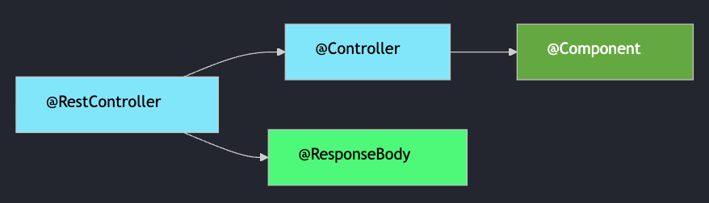

#### @Configuration & @Bean

`@Configuration` define una clase de configuración. `@Bean` registra beans manualmente en el contenedor.

```java
@Configuration
public class AppConfig {
    @Bean // Registra este objeto como bean con nombre "objectMapper"
    public ObjectMapper objectMapper() {
        return new ObjectMapper()
            .registerModule(new JavaTimeModule())
            .disable(SerializationFeature.WRITE_DATES_AS_TIMESTAMPS);
    }
    @Bean // Útil para beans de librerías externas que no puedes anotar
    public RestTemplate restTemplate() {
        return new RestTemplateBuilder()
            .setConnectTimeout(Duration.ofSeconds(5))
            .setReadTimeout(Duration.ofSeconds(10))
            .build();
    }
    @Bean @Profile("dev") // Solo se crea en perfil "dev"
    public DataSource devDataSource() {
        return new EmbeddedDatabaseBuilder()
            .setType(EmbeddedDatabaseType.H2).build();
    }
}
```

> Usa `@Bean` para objetos de librerías externas (no puedes ponerles `@Component`).

### Formas de Inyección de Dependencias

**Constructor (recomendado):**

```java
@Service
public class OrderService {
    private final OrderRepo repo;
    // Spring inyecta aquí
    public OrderService(OrderRepo repo) {
        this.repo = repo;
    }
}
```

- Inmutable (`final`)
- Fácil de testear
- Falla rápido

**Setter:**

```java
@Service
public class OrderService {
    private OrderRepo repo;
    @Autowired
    public void setRepo(OrderRepo repo) {
        this.repo = repo;
    }
}
```

- Mutable
- Dependencias opcionales
- Menos seguro

**Field (evitar):**

```java
@Service
public class OrderService {
    @Autowired
    private OrderRepo repo;
    // No hay constructor
    // ni setter explícito
}
```

- No testeable fácilmente
- Oculta dependencias
- Usa reflection

> Siempre usa inyección por constructor. Con un solo constructor, `@Autowired` es opcional.

### @Qualifier y @Primary

Cuando hay múltiples beans del mismo tipo, Spring no sabe cuál inyectar. Usa `@Qualifier` o `@Primary` para resolver la ambigüedad.

```java
public interface NotificationService {
    void send(String to, String message);
}

@Service("email")
public class EmailNotificationService implements NotificationService {
    public void send(String to, String message) { /* email */ }
}

@Service("sms")
@Primary // ← Este se inyecta por defecto
public class SmsNotificationService implements NotificationService {
    public void send(String to, String message) { /* sms */ }
}
```

```java
@Service
public class AlertService {
    // Opción 1: @Qualifier selecciona uno específico
    public AlertService(@Qualifier("email") NotificationService notification) { }

    // Opción 2: Sin @Qualifier, se inyecta el @Primary (sms)
    public AlertService(NotificationService notification) { }

    // Opción 3: Inyectar TODOS
    public AlertService(List<NotificationService> notifications) { }
}
```

### Scopes de Beans

| Scope                 | Descripción                                 | Instancias    |
| --------------------- | ------------------------------------------- | ------------- |
| `singleton` (default) | Una sola instancia por `ApplicationContext` | 1             |
| `prototype`           | Nueva instancia cada vez que se solicita    | N             |
| `request`             | Una instancia por petición HTTP             | 1 por request |
| `session`             | Una instancia por sesión HTTP               | 1 por sesión  |

> El 99% de los beans son singleton. Usa `prototype` solo cuando necesites estado independiente por uso.

#### Scope: Singleton (default)

Una única instancia compartida por todo el `ApplicationContext`. Es el scope por defecto.

```java
@Service // Por defecto: singleton
public class SingletonService { }
```

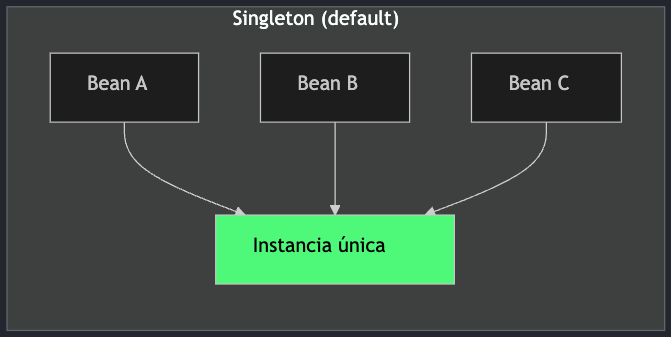

> Todos los beans `@Service`, `@Repository`, `@Controller` son singleton por defecto. Spring reutiliza la misma instancia.

#### Scope: Prototype

Spring crea una nueva instancia cada vez que se solicita el bean.

```java
@Service
@Scope("prototype") // Nueva instancia cada vez
public class PrototypeService { }
```

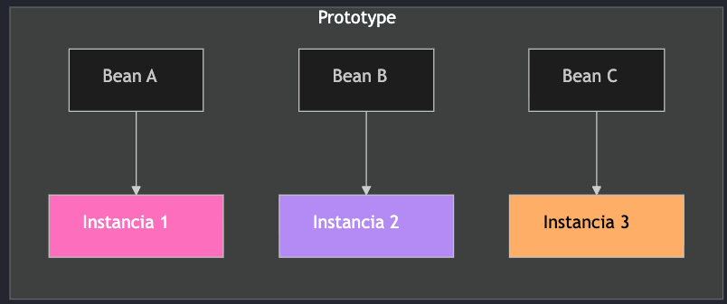

> Spring no gestiona el ciclo de vida completo de beans prototype — no llama `@PreDestroy`. Úsalo para objetos con estado propio.

#### Scope: Request & Session

Scopes exclusivos de aplicaciones web — ligados al ciclo de vida HTTP.

```java
@Component
@Scope(value = "request", proxyMode = ScopedProxyMode.TARGET_CLASS)
public class RequestScopedBean { }

@Component
@Scope(value = "session", proxyMode = ScopedProxyMode.TARGET_CLASS)
public class SessionScopedBean { }
```

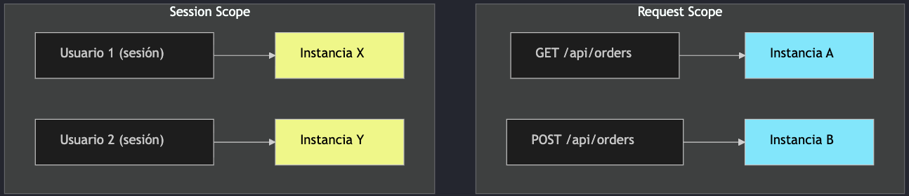

> `proxyMode` es necesario para inyectar beans request/session en beans singleton.

### Ciclo de Vida de un Bean

Spring gestiona el ciclo de vida completo de los beans. Puedes engancharte con callbacks.

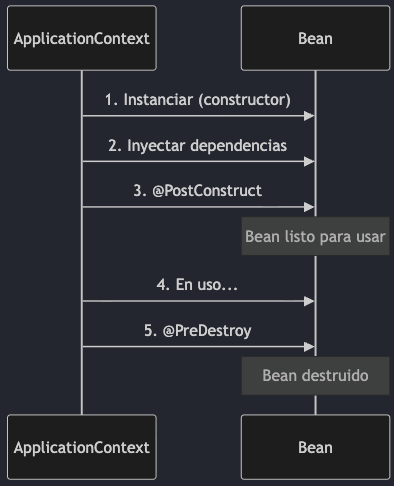

> Beans prototype no reciben `@PreDestroy`. Beans session se destruyen al expirar la sesión HTTP.

#### Ciclo de Vida: Ejemplo Práctico

```java
@Component
@Scope(value = "session", proxyMode = ScopedProxyMode.TARGET_CLASS)
public class ShoppingCart {
    private final List<Item> items = new ArrayList<>();

    @PostConstruct  // Se ejecuta al crear la sesión del usuario
    public void init() {
        log.info("Carrito creado para sesión");
    }

    @PreDestroy     // Se ejecuta al expirar/cerrar la sesión
    public void cleanup() {
        log.info("Carrito destruido, {} items", items.size());
    }
}
```

> `@PostConstruct` y `@PreDestroy` funcionan con todos los scopes (excepto `@PreDestroy` en prototype). Útiles para inicializar recursos o liberar conexiones.

---

## Lombok: Adiós al Boilerplate

Elimina código repetitivo con anotaciones en tiempo de compilación.

### Qué es Lombok

Project Lombok genera código repetitivo (boilerplate) automáticamente mediante anotaciones procesadas en tiempo de compilación.

**Sin Lombok (boilerplate manual):**

```java
public class Product {
    private Long id;
    private String name;
    private BigDecimal price;

    public Product() {}
    public Product(Long id, String name,
                   BigDecimal price) {
        this.id = id;
        this.name = name;
        this.price = price;
    }
    public Long getId() { return id; }
    public void setId(Long id) { this.id = id; }
    public String getName() { return name; }
    public void setName(String n) { this.name = n; }
    // ... + toString, equals, hashCode
}
```

**Con Lombok (cero boilerplate):**

```java
@Getter
@Setter
@NoArgsConstructor
@AllArgsConstructor
@ToString
@EqualsAndHashCode
public class Product {
    private Long id;
    private String name;
    private BigDecimal price;
}
```

> Lombok genera el mismo bytecode que escribirías a mano. No hay penalización en runtime.

### Instalación

```groovy
// build.gradle
dependencies {
    compileOnly 'org.projectlombok:lombok'
    annotationProcessor 'org.projectlombok:lombok'

    // También para tests
    testCompileOnly 'org.projectlombok:lombok'
    testAnnotationProcessor 'org.projectlombok:lombok'
}
```

> En IntelliJ IDEA necesitas instalar el plugin de Lombok y habilitar Annotation Processing en Settings → Build → Compiler.
>
> El scaffold de Bancolombia ya incluye Lombok como dependencia por defecto.

### @Getter y @Setter

Generan getters y setters automáticamente. Se pueden aplicar a nivel de clase o campo individual.

```java
// A nivel de clase: todos los campos
@Getter
@Setter
public class Product {
    private Long id;
    private String name;
    private BigDecimal price;
}
```

```java
// A nivel de campo: control granular
public class User {
    @Getter
    private Long id;          // solo getter

    @Getter @Setter
    private String name;      // getter + setter

    @Setter(AccessLevel.PROTECTED)
    private String password;  // setter protected
}
```

Lo que Lombok genera:

```java
public Long getId() { return this.id; }
public void setId(Long id) { this.id = id; }
public String getName() { return this.name; }
public void setName(String name) {
    this.name = name;
}
public BigDecimal getPrice() {
    return this.price;
}
public void setPrice(BigDecimal price) {
    this.price = price;
}
```

> `AccessLevel` permite controlar la visibilidad: `PUBLIC`, `PROTECTED`, `PACKAGE`, `PRIVATE`, `NONE`.

### @ToString y @EqualsAndHashCode

**@ToString:**

```java
@ToString
public class Product {
    private Long id;
    private String name;
    private BigDecimal price;
}
// → Product(id=1, name=RTX 4090, price=1599.99)

// Excluir campos sensibles
@ToString(exclude = "password")
public class User {
    private Long id;
    private String email;
    private String password;
}

// Solo incluir ciertos campos
@ToString(onlyExplicitlyIncluded = true)
public class Order {
    @ToString.Include
    private Long id;
    @ToString.Include
    private String status;
    private List<OrderItem> items; // excluido
}
```

**@EqualsAndHashCode:**

```java
@EqualsAndHashCode
public class Product {
    private Long id;
    private String name;
}

// Solo comparar por ID (entidades JPA)
@EqualsAndHashCode(onlyExplicitlyIncluded = true)
public class Product {
    @EqualsAndHashCode.Include
    private Long id;
    private String name;
    private BigDecimal price;
}
```

> En entidades JPA, **nunca** uses `@EqualsAndHashCode` con todos los campos. Compara solo por `@Id` o clave de negocio para evitar problemas con lazy loading.

### Constructores: @NoArgs, @AllArgs, @RequiredArgs

| Anotación                  | Genera constructor con…            |
| -------------------------- | ---------------------------------- |
| `@NoArgsConstructor`       | Sin argumentos (requerido por JPA) |
| `@AllArgsConstructor`      | Todos los campos                   |
| `@RequiredArgsConstructor` | Solo campos `final` y `@NonNull`   |

```java
@Getter
@NoArgsConstructor          // Product() — JPA lo necesita
@AllArgsConstructor         // Product(id, sku, name, price, stock)
public class Product {
    private Long id;
    private String sku;
    private String name;
    private BigDecimal price;
    private Integer stock;
}
```

```java
@Service
@RequiredArgsConstructor    // Genera: OrderService(OrderRepository, PaymentService)
public class OrderService {
    private final OrderRepository orderRepository;  // final → incluido
    private final PaymentService paymentService;    // final → incluido
    private String tempValue;                       // no final → excluido
}
```

> `@RequiredArgsConstructor` es el mejor amigo de la inyección por constructor en Spring — elimina constructores manuales.

### @Builder

Genera un patrón Builder fluido para construir objetos paso a paso.

```java
@Builder
@Getter
public class ProductResponse {
    private Long id;
    private String name;
    private String sku;
    private BigDecimal price;
    private int stock;
    private Instant createdAt;
}
```

```java
// Uso fluido
ProductResponse response = ProductResponse.builder()
    .id(1L)
    .name("RTX 4090")
    .sku("GPU-4090")
    .price(new BigDecimal("1599.99"))
    .stock(25)
    .createdAt(Instant.now())
    .build();
```

```java
// @Builder con valores por defecto
@Builder
@Getter
public class OrderConfig {
    @Builder.Default
    private int maxRetries = 3;

    @Builder.Default
    private Duration timeout =
        Duration.ofSeconds(30);

    private String endpoint;
}
```

```java
// Solo estableces lo que necesitas
OrderConfig config = OrderConfig.builder()
    .endpoint("/api/orders")
    .build();
// maxRetries=3, timeout=30s (defaults)
```

> Usa `@Builder.Default` para campos con valores por defecto. Sin esta anotación, el builder los inicializa en null/0.

### @Data vs @Value

| Aspecto    | `@Data` (mutable)                                                               | `@Value` (inmutable)                                                                              |
| ---------- | ------------------------------------------------------------------------------- | ------------------------------------------------------------------------------------------------- |
| Incluye    | `@Getter` `@Setter` `@ToString` `@EqualsAndHashCode` `@RequiredArgsConstructor` | `@Getter` `@ToString` `@EqualsAndHashCode` `@AllArgsConstructor` + campos `final` + clase `final` |
| Setters    | Sí                                                                              | No                                                                                                |
| Ideal para | DTOs mutables, formularios                                                      | Value Objects, DTOs inmutables                                                                    |

```java
@Data // Mutable
public class ProductDto {
    private Long id;
    private String name;
    private BigDecimal price;
}
```

```java
@Value // Inmutable, campos final
public class Money {
    BigDecimal amount;
    String currency;
}
```

> **Nunca** uses `@Data` en entidades JPA — `@EqualsAndHashCode` con todos los campos causa problemas con lazy loading y proxies de Hibernate.

### @Slf4j y Otras Utilidades

**@Slf4j** — Logger automático:

```java
@Slf4j
@Service
public class OrderService {
    public Order createOrder(CreateOrderRequest req) {
        log.info("Creando orden para SKU: {}",
                 req.getSku());
        // ...
        log.debug("Orden {} guardada", order.getId());
        return order;
    }
}
// Equivale a:
// private static final Logger log =
//   LoggerFactory.getLogger(OrderService.class);
```

**@NonNull** — Validación de nulos:

```java
public class UserService {
    public User findByEmail(
            @NonNull String email) {
        // Lombok genera check de null
        // lanza NullPointerException si null
    }
}
```

**@Cleanup** — Cierre automático:

```java
public void readFile() throws IOException {
    @Cleanup InputStream in =
        new FileInputStream("data.csv");
    // Lombok genera try-finally con close()
}
```

**@SneakyThrows** — Checked exceptions:

```java
@SneakyThrows  // Evita declarar throws
public String readConfig() {
    return Files.readString(
        Path.of("config.yml"));
    // IOException se lanza sin declarar
}
```

> Usa `@SneakyThrows` con precaución — oculta excepciones del compilador. Prefiere manejarlas explícitamente.

### Lombok + Spring Boot: Ejemplo Completo

**Entity (JPA):**

```java
@Entity
@Table(name = "products")
@Getter @Setter
@NoArgsConstructor
@EqualsAndHashCode(onlyExplicitlyIncluded = true)
@ToString(exclude = "items")
public class Product {
    @Id @GeneratedValue(strategy = IDENTITY)
    @EqualsAndHashCode.Include
    private Long id;
    @Column(nullable = false, unique = true)
    private String sku;
    @Column(nullable = false)
    private String name;
    private BigDecimal price;
    @OneToMany(mappedBy = "product")
    private List<OrderItem> items;
}
```

**Service (Spring):**

```java
@Slf4j
@Service
@RequiredArgsConstructor
public class ProductService {
    private final ProductRepository repo;

    public Product create(CreateProductRequest r) {
        log.info("Creando producto: {}", r.sku());
        Product p = new Product();
        p.setSku(r.sku());
        p.setName(r.name());
        p.setPrice(r.price());
        return repo.save(p);
    }
}
```

> **Patrón JPA recomendado:** `@Getter` `@Setter` `@NoArgsConstructor` + `@EqualsAndHashCode(onlyExplicitlyIncluded = true)`. Nunca `@Data` en entidades.

---

## Configuración en Spring Boot

### application.properties vs application.yml

**application.properties:**

```properties
server.port=8080
spring.datasource.url=jdbc:postgresql://localhost:5432/db
spring.datasource.username=admin
spring.datasource.password=secret
spring.jpa.hibernate.ddl-auto=update
spring.jpa.show-sql=true
logging.level.root=INFO
logging.level.com.ejemplo=DEBUG
```

**application.yml (recomendado):**

```yaml
server:
  port: 8080

spring:
  datasource:
    url: jdbc:postgresql://localhost:5432/db
    username: admin
    password: secret
  jpa:
    hibernate:
      ddl-auto: update
    show-sql: true

logging:
  level:
    root: INFO
    com.ejemplo: DEBUG
```

> YAML es más legible por su estructura jerárquica. Ambos formatos son equivalentes.

### @Value y @ConfigurationProperties

**@Value** — Propiedades individuales:

```java
@Service
public class NotificationService {
    @Value("${app.email.from}")
    private String fromEmail;

    @Value("${app.email.enabled:true}")
    private boolean enabled; // default: true

    @Value("${app.max-retries:3}")
    private int maxRetries;
}
```

**@ConfigurationProperties** — Grupo de configuración:

```java
@ConfigurationProperties(prefix = "app.email")
public record EmailProperties(
    String from,
    boolean enabled,
    int maxRetries,
    List<String> cc
) {}
```

```yaml
app:
  email:
    from: noreply@arka.com
    enabled: true
    max-retries: 3
    cc:
      - admin@arka.com
      - ops@arka.com
```

> Prefiere `@ConfigurationProperties` sobre `@Value`. Es type-safe, validable, y agrupa la configuración lógicamente.

### Profiles

Los profiles permiten tener configuraciones diferentes por entorno (dev, staging, prod).

```yaml
# application-dev.yml
spring:
  datasource:
    url: jdbc:postgresql://localhost:5432/arka_dev
  jpa:
    show-sql: true
logging:
  level:
    root: DEBUG
```

```yaml
# application-prod.yml
spring:
  datasource:
    url: jdbc:postgresql://db-prod:5432/arka
  jpa:
    show-sql: false
logging:
  level:
    root: WARN
```

```bash
# Activar perfil al ejecutar
java -jar app.jar --spring.profiles.active=prod
# O con variable de entorno
SPRING_PROFILES_ACTIVE=prod java -jar app.jar
```

> Evita fijar `spring.profiles.active` dentro del artefacto. Actívalo por env vars o CLI.

### Orden de Prioridad de Configuración

De menor a mayor prioridad:

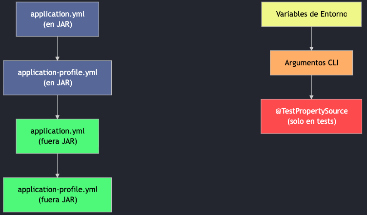

> Env vars y CLI siempre ganan sobre `.yml`. Spring mapea: `SPRING_DATASOURCE_URL` → `spring.datasource.url`

---

## Spring MVC & REST Controllers

### @RestController y Mappings

```java
@RestController
@RequestMapping("/api/v1/products")
public class ProductController {

    private final ProductService productService;

    public ProductController(ProductService productService) {
        this.productService = productService;
    }

    @GetMapping                      // GET /api/v1/products
    public List<Product> findAll() {
        return productService.findAll();
    }

    @GetMapping("/{id}")             // GET /api/v1/products/123
    public Product findById(@PathVariable Long id) {
        return productService.findById(id);
    }

    @PostMapping                     // POST /api/v1/products
    @ResponseStatus(HttpStatus.CREATED)
    public Product create(@Valid @RequestBody CreateProductRequest request) {
        return productService.create(request);
    }

    @PutMapping("/{id}")             // PUT /api/v1/products/123
    public Product update(@PathVariable Long id,
                          @Valid @RequestBody UpdateProductRequest request) {
        return productService.update(id, request);
    }

    @DeleteMapping("/{id}")          // DELETE /api/v1/products/123
    @ResponseStatus(HttpStatus.NO_CONTENT)
    public void delete(@PathVariable Long id) {
        productService.delete(id);
    }
}
```

### Anotaciones HTTP

| Anotación        | Método HTTP | Uso                         |
| ---------------- | ----------- | --------------------------- |
| `@GetMapping`    | GET         | Obtener recursos            |
| `@PostMapping`   | POST        | Crear recursos              |
| `@PutMapping`    | PUT         | Actualizar recurso completo |
| `@PatchMapping`  | PATCH       | Actualizar parcialmente     |
| `@DeleteMapping` | DELETE      | Eliminar recursos           |

| Anotación de Parámetro | Uso                          | Ejemplo                     |
| ---------------------- | ---------------------------- | --------------------------- |
| `@PathVariable`        | Variable en la URL           | `/products/{id}`            |
| `@RequestParam`        | Query parameter              | `/products?category=gpu`    |
| `@RequestBody`         | Cuerpo de la petición (JSON) | `{ "name": "RTX 4090" }`    |
| `@RequestHeader`       | Header HTTP                  | `Authorization: Bearer ...` |

### ResponseEntity

`ResponseEntity` permite controlar status code, headers y body de la respuesta.

```java
@RestController
@RequestMapping("/api/v1/products")
public class ProductController {

    @GetMapping("/{id}")
    public ResponseEntity<Product> findById(@PathVariable Long id) {
        return productService.findById(id)
            .map(ResponseEntity::ok)                          // 200 OK
            .orElse(ResponseEntity.notFound().build());       // 404 Not Found
    }

    @PostMapping
    public ResponseEntity<Product> create(@Valid @RequestBody CreateProductRequest req) {
        Product product = productService.create(req);
        URI location = URI.create("/api/v1/products/" + product.getId());
        return ResponseEntity
            .created(location)    // 201 Created + Location header
            .body(product);
    }

    @DeleteMapping("/{id}")
    public ResponseEntity<Void> delete(@PathVariable Long id) {
        productService.delete(id);
        return ResponseEntity.noContent().build();  // 204 No Content
    }
}
```

### DTOs y Records

DTOs separan la representación de la API del modelo de dominio. Los **records** son ideales: inmutables, concisos y con `equals`/`hashCode`/`toString` automáticos.

**Request DTO** (lo que el cliente envía):

```java
public record CreateProductRequest(
    @NotBlank String name,
    @NotBlank String sku,
    @Positive BigDecimal price,
    @PositiveOrZero int stock
) {}
```

**Response DTO** (lo que el cliente recibe):

```java
public record ProductResponse(
    Long id, String name, String sku,
    BigDecimal price, int stock,
    Instant createdAt
) {
    public static ProductResponse from(Product p) {
        return new ProductResponse(
            p.getId(), p.getName(), p.getSku(),
            p.getPrice(), p.getStock(),
            p.getCreatedAt());
    }
}
```

> **Nunca** expongas tus `@Entity` directamente en la API. Usa DTOs para controlar qué datos se envían/reciben.

---

## Spring Data JPA

### Entities (Entidades)

```java
@Entity
@Table(name = "products")
public class Product {
    @Id
    @GeneratedValue(strategy = GenerationType.IDENTITY)
    private Long id;
    @Column(nullable = false, unique = true)
    private String sku;
    @Column(nullable = false)
    private String name;
    @Column(nullable = false, precision = 10, scale = 2)
    private BigDecimal price;
    @Column(nullable = false)
    private Integer stock;
    @CreationTimestamp
    private Instant createdAt;
    @UpdateTimestamp
    private Instant updatedAt;
    @Enumerated(EnumType.STRING)
    private ProductStatus status = ProductStatus.ACTIVE;
    // Constructor, getters, setters...
}
```

| Anotación                 | Función                      |
| ------------------------- | ---------------------------- |
| `@Entity`                 | Clase → entidad JPA          |
| `@Table`                  | Nombre de tabla en BD        |
| `@Id` + `@GeneratedValue` | PK auto-generada             |
| `@Column`                 | Configuración de columna     |
| `@CreationTimestamp`      | Fecha de creación automática |
| `@UpdateTimestamp`        | Fecha de update automática   |
| `@Enumerated(STRING)`     | Enum como texto              |

> Cada `@Entity` necesita un `@Id`. Usa `GenerationType.IDENTITY` para auto-incremento en PostgreSQL.

### Repositories

Spring Data JPA genera implementaciones automáticamente a partir de interfaces.

```java
public interface ProductRepository extends JpaRepository<Product, Long> {
    // Query Methods - Spring genera el SQL automáticamente
    List<Product> findByStatus(ProductStatus status);
    Optional<Product> findBySku(String sku);
    List<Product> findByPriceBetween(BigDecimal min, BigDecimal max);
    List<Product> findByNameContainingIgnoreCase(String keyword);
    boolean existsBySku(String sku);

    @Query("SELECT p FROM Product p WHERE p.stock < :threshold")
    List<Product> findLowStock(@Param("threshold") int threshold);

    @Query(value = "SELECT * FROM products WHERE stock > 0 ORDER BY price ASC",
           nativeQuery = true)
    List<Product> findAvailableOrderByPrice();

    // Paginación y ordenamiento
    Page<Product> findByStatus(ProductStatus status, Pageable pageable);
}
```

> Solo defines la interfaz — Spring Data genera la implementación `@Repository` automáticamente.

#### Jerarquía de Repositories

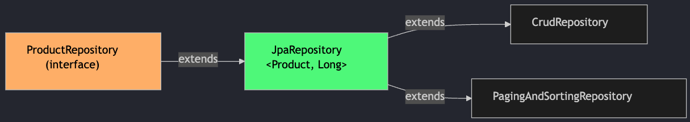

| Interfaz                     | Métodos que hereda                                         |
| ---------------------------- | ---------------------------------------------------------- |
| `CrudRepository`             | `save()`, `findById()`, `findAll()`, `delete()`, `count()` |
| `PagingAndSortingRepository` | `findAll(Pageable)`, `findAll(Sort)`                       |
| `JpaRepository`              | `flush()`, `saveAndFlush()`, `deleteInBatch()`             |

> Con `JpaRepository` heredas +20 métodos sin escribir una sola línea de implementación.

#### Query Methods: Convención de Nombres

Spring Data interpreta el nombre del método y genera la query automáticamente.

| Método                            | SQL Generado                            |
| --------------------------------- | --------------------------------------- |
| `findByName(String name)`         | `WHERE name = ?1`                       |
| `findByNameAndPrice(n, p)`        | `WHERE name = ?1 AND price = ?2`        |
| `findByPriceGreaterThan(p)`       | `WHERE price > ?1`                      |
| `findByNameContaining(s)`         | `WHERE name LIKE %?1%`                  |
| `findByStatusOrderByPriceDesc(s)` | `WHERE status = ?1 ORDER BY price DESC` |
| `countByStatus(s)`                | `SELECT COUNT(*) WHERE status = ?1`     |
| `deleteByStatus(s)`               | `DELETE WHERE status = ?1`              |
| `existsBySku(s)`                  | `SELECT EXISTS(... WHERE sku = ?1)`     |

> Para queries complejas, usa `@Query` con JPQL o SQL nativo en vez de nombres kilométricos.

### Relaciones entre Entidades

```java
@Entity
public class Order {
    @Id @GeneratedValue(strategy = GenerationType.IDENTITY)
    private Long id;

    @ManyToOne(fetch = FetchType.LAZY)  // Muchas órdenes → 1 cliente
    @JoinColumn(name = "customer_id")
    private Customer customer;

    @OneToMany(mappedBy = "order", cascade = CascadeType.ALL)
    private List<OrderItem> items = new ArrayList<>(); // 1 orden → muchos items
}

@Entity
public class OrderItem {
    @Id @GeneratedValue(strategy = GenerationType.IDENTITY)
    private Long id;

    @ManyToOne(fetch = FetchType.LAZY)
    @JoinColumn(name = "order_id")
    private Order order;

    @ManyToOne(fetch = FetchType.LAZY)
    @JoinColumn(name = "product_id")
    private Product product;

    private Integer quantity;
}
```

> Siempre usa `fetch = FetchType.LAZY` para evitar cargar datos innecesarios (N+1 problem).

---

## Cierre de la Parte 1

En esta sesión cubrimos:

- Fundamentos de Spring Boot y auto-configuración
- IoC/DI y estereotipos principales
- Configuración por propiedades y perfiles
- APIs REST con Spring MVC
- Persistencia con Spring Data JPA

**En la Parte 2:** validación y errores, seguridad con Spring Security, testing por capas, actuator y WebFlux intermedio.

---

## Notas Complementarias

### Servidores Bloqueantes vs No-Bloqueantes (Servlet vs Reactive)

**WSGI** (Web Server Gateway Interface) y **ASGI** (Asynchronous Server Gateway Interface) son estándares del ecosistema Python para la comunicación entre servidores web y aplicaciones. La analogía en Java es directa:

| Concepto Python | Equivalente Java                   | Modelo                         | Servidor                |
| --------------- | ---------------------------------- | ------------------------------ | ----------------------- |
| WSGI            | Servlet API (Jakarta Servlet)      | Bloqueante: thread-per-request | Tomcat, Jetty, Undertow |
| ASGI            | Reactive Streams (Project Reactor) | No-bloqueante: event-loop      | Netty                   |

**Modelo Bloqueante (Servlet / análogo a WSGI):**

- Cada petición HTTP ocupa un thread del pool durante toda su vida.
- Si el thread hace I/O (query a DB, llamada HTTP externa), se **bloquea** hasta recibir respuesta.
- El tamaño del pool de threads limita la concurrencia máxima (ej.: 200 threads = 200 peticiones simultáneas).
- **Stack en Spring:** Spring MVC + Tomcat (default).

**Modelo No-Bloqueante (Reactive / análogo a ASGI):**

- Un número reducido de threads (event-loop threads, típicamente = cantidad de CPU cores) manejan todas las peticiones.
- Las operaciones I/O se delegan y se completan con callbacks/reactive streams, **liberando el thread inmediatamente**.
- Puede manejar miles de conexiones concurrentes con pocos threads.
- **Stack en Spring:** Spring WebFlux + Netty (default).

> **Regla crítica:** dentro de un contexto reactivo, **todas** las operaciones deben ser no-bloqueantes. Una sola operación bloqueante (JDBC tradicional, `Thread.sleep()`, I/O síncrono) bloquea el event-loop y degrada el rendimiento de **todo** el microservicio reactivo — incluyendo DB, Controller y llamadas HTTP externas.
