# Clase 18 - Spring Extras & Spring Cloud

> Diapositivas: <https://manulasker.github.io/enyoi_java_slides/clase_29_30_spring_extras_cloud/#/title-slide>

---

## Índice

1. [Spring Extras](#spring-extras)
   - [Scheduling](#scheduling)
   - [Caching](#caching)
   - [Eventos de Aplicación](#eventos-de-aplicación)
   - [AOP (Programación Orientada a Aspectos)](#aop-programación-orientada-a-aspectos)
2. [Spring Cloud](#spring-cloud)
   - [Qué es Spring Cloud](#qué-es-spring-cloud)
   - [Ecosistema](#ecosistema)
   - [Discovery Service](#discovery-service)
   - [Config Server](#config-server)
   - [API Gateway](#api-gateway)
   - [Circuit Breaker / Resilience4j](#circuit-breaker--resilience4j)
   - [Cloud Functions](#cloud-functions)
   - [Cloud Stream (Kafka/RabbitMQ)](#cloud-stream-kafkarabbitmq)
   - [OpenFeign](#openfeign)
   - [Spring Security + JWT](#spring-security--jwt)
   - [Spring AI](#spring-ai)
   - [Observabilidad Distribuida](#observabilidad-distribuida)
3. [Resumen & Mapa Conceptual](#resumen--mapa-conceptual)
4. [Cierre & Referencia Rápida](#cierre--referencia-rápida)

## Resumen

Spring Boot ofrece funcionalidades avanzadas para apps profesionales: **Scheduling** para automatizar tareas periódicas, **Caching** para reducir latencia con anotaciones simples, **Eventos** para desacoplar componentes internos y **AOP** para centralizar preocupaciones transversales (logging, métricas, seguridad). Spring Cloud extiende esto al ecosistema distribuido, proveyendo herramientas para comunicación, configuración centralizada, resiliencia y observabilidad en microservicios.

---

## Spring Extras

Funcionalidades avanzadas de Spring Boot para aplicaciones profesionales.

---

### Scheduling

Ejecutar tareas de forma automática y periódica sin depender de scripts externos.

#### Habilitando Scheduling

```java
@Configuration
@EnableScheduling // ← Activa el sistema de tareas programadas
public class SchedulingConfig {

    @Bean
    public TaskScheduler taskScheduler() {
        ThreadPoolTaskScheduler scheduler = new ThreadPoolTaskScheduler();
        scheduler.setPoolSize(5);
        scheduler.setThreadNamePrefix("scheduled-");
        return scheduler;
    }
}
```

> Sin `@EnableScheduling`, las anotaciones `@Scheduled` se ignoran silenciosamente.

#### Estrategias de @Scheduled

| Estrategia     | Ejemplo               | Comportamiento                                       |
| -------------- | --------------------- | ---------------------------------------------------- |
| `fixedDelay`   | `30000`               | Espera 30s **después** de terminar la tarea anterior |
| `fixedRate`    | `60000`               | Ejecuta cada 60s sin importar si la anterior terminó |
| `cron`         | `"0 0 6 * * MON-FRI"` | Expresión cron: `seg min hora día mes díaSemana`     |
| `initialDelay` | `5000`                | Espera 5s antes de la primera ejecución              |

> **Cuidado con `fixedRate`:** si la tarea dura más que el intervalo, puede haber solapamiento. Usa `fixedDelay` si la tarea es costosa.

```java
@Service
public class InventorySyncService {

    @Scheduled(fixedDelay = 30_000)
    public void syncInventory() { ... }

    @Scheduled(fixedRate = 60_000)
    public void generateReport() { ... }

    @Scheduled(cron = "0 0 6 * * MON-FRI")
    public void morningCleanup() { ... }
}
```

#### Cron Externalizado

Buena práctica: extraer la expresión cron a configuración para cambiarla sin recompilar.

```java
@Scheduled(cron = "${app.inventory.sync-cron}")
public void syncInventory() { ... }
```

```yaml
# application.yml
app:
  inventory:
    sync-cron: "0 */15 * * * *" # Cada 15 minutos
```

---

### Caching

Reducir latencia y carga almacenando resultados de operaciones costosas.

#### Habilitando Caché

```java
@Configuration
@EnableCaching
public class CacheConfig {}
```

#### Proveedores

| Proveedor            | Tipo                          | Uso típico                    |
| -------------------- | ----------------------------- | ----------------------------- |
| `ConcurrentMapCache` | En memoria (default)          | Desarrollo, apps pequeñas     |
| Caffeine             | En memoria (alto rendimiento) | Apps medianas                 |
| Redis                | Distribuido                   | Microservicios, producción    |
| Hazelcast            | Distribuido                   | Clusters, alta disponibilidad |

#### Anotaciones

| Anotación     | Efecto                                                               |
| ------------- | -------------------------------------------------------------------- |
| `@Cacheable`  | Si el resultado ya está en caché, lo devuelve sin ejecutar el método |
| `@CachePut`   | Siempre ejecuta el método y actualiza el caché                       |
| `@CacheEvict` | Elimina una entrada (o todas) del caché                              |

```java
@Service
public class ProductService {

    @Cacheable(value = "products", key = "#id")
    public Product findById(Long id) { ... }

    @CachePut(value = "products", key = "#product.id")
    public Product update(Product product) { ... }

    @CacheEvict(value = "products", key = "#id")
    public void delete(Long id) { ... }

    @CacheEvict(value = "products", allEntries = true)
    public void clearCache() { ... }
}
```

#### Flujo de @Cacheable

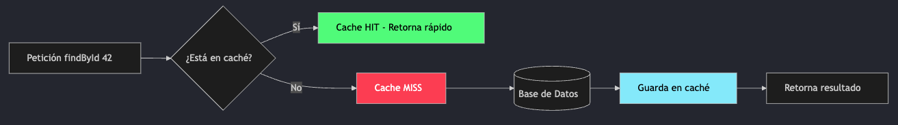

Primera llamada → va a la BD y guarda en caché. Llamadas siguientes con el mismo ID → responde directo del caché.

#### Caché con Redis

```yaml
# application.yml
spring:
  cache:
    type: redis
  data:
    redis:
      host: localhost
      port: 6379
      password: secret
```

```java
@Cacheable(
    value = "products",
    key = "#id",
    unless = "#result == null",  // evalúa después (acceso a #result)
    condition = "#id > 0")       // evalúa antes de ejecutar el método
public Product findById(Long id) { ... }
```

> `unless` evalúa **después** de la ejecución. `condition` evalúa **antes**.

---

### Eventos de Aplicación

Comunicación desacoplada entre componentes dentro de la misma aplicación.

**Objetivos:**

- Desacoplar procesos dentro del mismo servicio.
- Reaccionar a cambios sin dependencias directas entre clases.
- Preparar el paso a mensajería distribuida.

#### Flujo: Definir → Publicar → Escuchar

```java
// 1. Definir el evento
public record OrderCreatedEvent(Long orderId, String sku, int quantity) {}

// 2. Publicar
@Service
public class OrderService {
    private final ApplicationEventPublisher eventPublisher;

    public Order createOrder(CreateOrderRequest req) {
        Order order = orderRepository.save(toEntity(req));
        eventPublisher.publishEvent(
            new OrderCreatedEvent(order.getId(), order.getSku(), order.getQty()));
        return order;
    }
}

// 3. Escuchar
@Component
public class InventoryEventListener {

    @EventListener
    public void onOrderCreated(OrderCreatedEvent event) {
        inventoryService.reserveStock(event.sku(), event.quantity());
    }
}
```

#### Eventos Asíncronos y Transaccionales

```java
// Asíncrono: ejecuta en otro thread
@Configuration
@EnableAsync
public class AsyncConfig {}

@Component
public class NotificationListener {

    @Async
    @EventListener
    public void onOrderCreated(OrderCreatedEvent event) {
        emailService.sendConfirmation(event.orderId());
    }
}

// Transaccional: solo se ejecuta si el commit fue exitoso
@Component
public class AuditListener {

    @TransactionalEventListener(phase = TransactionPhase.AFTER_COMMIT)
    public void onOrderCommitted(OrderCreatedEvent event) {
        auditService.log("Order created: " + event.orderId());
    }
}
```

> `@TransactionalEventListener` evita procesar eventos de transacciones que hicieron rollback.

---

### AOP (Programación Orientada a Aspectos)

Separar preocupaciones transversales (logging, seguridad, métricas) del código de negocio.

#### El problema que resuelve

Sin AOP, cada servicio repite las mismas preocupaciones. Con AOP, un `Aspect` las centraliza:

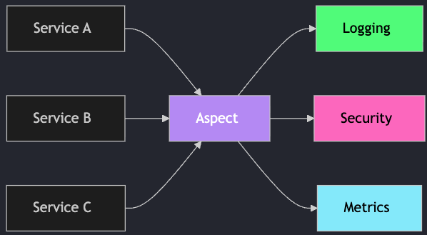

#### Tipos de Advice

| Tipo              | Cuándo se ejecuta           | Uso típico                       |
| ----------------- | --------------------------- | -------------------------------- |
| `@Before`         | Antes del método            | Validación, logging de entrada   |
| `@After`          | Después (siempre)           | Limpieza de recursos             |
| `@AfterReturning` | Solo si no hubo excepción   | Auditoría de resultados          |
| `@AfterThrowing`  | Solo si hubo excepción      | Logging de errores               |
| `@Around`         | Envuelve el método completo | Métricas de tiempo, retry, caché |

> `@Around` es el advice más poderoso: controla si el método se ejecuta y puede modificar argumentos y resultado.

#### Ejemplo: Logging con @Around

```java
@Aspect
@Component
public class LoggingAspect {

    @Around("execution(* com.arka.*.service.*.*(..))")
    public Object logExecution(ProceedingJoinPoint joinPoint) throws Throwable {
        String method = joinPoint.getSignature().toShortString();
        long start = System.currentTimeMillis();
        log.info("→ Entrando a {}", method);
        try {
            Object result = joinPoint.proceed();
            log.info("← {} completado en {}ms", method, System.currentTimeMillis() - start);
            return result;
        } catch (Exception e) {
            log.error("✗ {} falló: {}", method, e.getMessage());
            throw e;
        }
    }
}
```

#### Ejemplo: Anotación Personalizada + Aspect (Rate Limiting)

```java
// Anotación personalizada
@Target(ElementType.METHOD)
@Retention(RetentionPolicy.RUNTIME)
public @interface RateLimited {
    int maxCalls() default 100;
    int periodSeconds() default 60;
}

// Uso en controller
@RateLimited(maxCalls = 50)
@GetMapping("/api/products")
public List<Product> findAll() { ... }

// Aspect que lo implementa
@Aspect
@Component
public class RateLimitAspect {
    private final Map<String, AtomicInteger> counters = new ConcurrentHashMap<>();

    @Around("@annotation(rateLimited)")
    public Object enforce(ProceedingJoinPoint jp, RateLimited rateLimited) throws Throwable {
        String key = jp.getSignature().toShortString();
        AtomicInteger counter = counters.computeIfAbsent(key, k -> new AtomicInteger(0));
        if (counter.incrementAndGet() > rateLimited.maxCalls()) {
            throw new TooManyRequestsException("Rate limit exceeded");
        }
        return jp.proceed();
    }
}
```

---

> **Resumen Spring Extras:** Scheduling, Caching, Eventos y AOP mejoran apps monolíticas y preparan el salto a arquitectura distribuida.

## Spring Cloud

El ecosistema para construir microservicios distribuidos en la nube.

### Qué es Spring Cloud

Spring Cloud proporciona implementaciones listas para los patrones más comunes en sistemas distribuidos: comunicación, configuración centralizada, resiliencia y observabilidad.

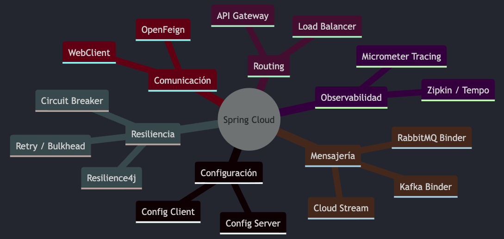

### Ecosistema

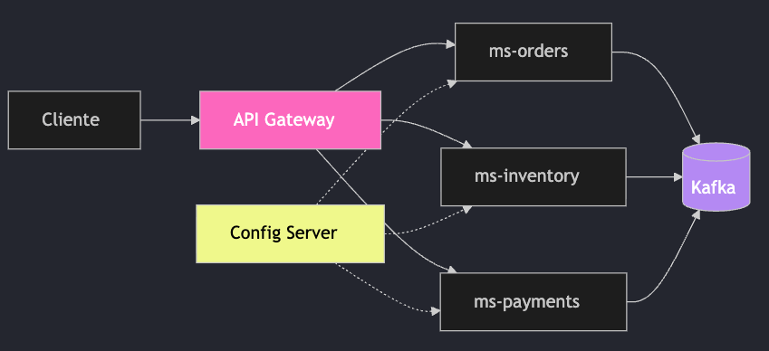

---

### Discovery Service

Registro y descubrimiento de servicios para evitar IPs fijas.

#### Objetivo: Discovery Service

- Resolver el problema de “¿dónde está mi servicio?”.
- Habilitar escalado sin reconfigurar clientes.
- Ser la base del routing dinámico en Gateway.

#### Discovery + Gateway Routing

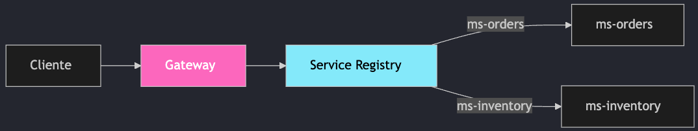

El Gateway consulta el registro para resolver instancias disponibles.

#### Discovery Client en Java

```java
@RestController
@RequestMapping("/api/discovery")
public class DiscoveryController {

  private final DiscoveryClient discoveryClient;

  public DiscoveryController(DiscoveryClient discoveryClient) {
    this.discoveryClient = discoveryClient;
  }

  @GetMapping("/services")
  public List<String> services() {
    return discoveryClient.getServices();
  }
}
```

> Con Eureka: agrega spring-cloud-starter-netflix-eureka-client y registra el servicio automáticamente.

### Config Server

Configuración centralizada y externalizada para todos los microservicios.

#### Objetivo: Config Server

- Centralizar configuraciones en un repositorio seguro.
- Cambiar parámetros sin redeploy.
- Mantener consistencia entre ambientes.

#### Arquitectura de Config Server

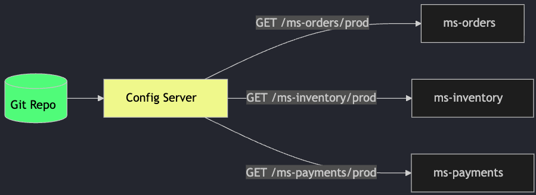

El Config Server sirve configuraciones por aplicación y perfil desde un repositorio Git.

#### Config Server: Implementación

```java
// Config Server (microservicio dedicado)
@SpringBootApplication
@EnableConfigServer // ← Una sola anotación
public class ConfigServerApplication {
    public static void main(String[] args) {
        SpringApplication.run(ConfigServerApplication.class, args);
    }
}
```

```yaml
# application.yml del Config Server
server:
  port: 8888

spring:
  cloud:
    config:
      server:
        git:
          uri: https://github.com/arka/config-repo
          default-label: main
          search-paths: "{application}"
```

#### Config Client: Consumir Configuración

```yaml
# application.yml del microservicio (ms-orders)
spring:
  application:
    name: ms-orders   # ← Identifica qué config pedir
  config:
    import: configserver:http://config-server:8888

# En el repo Git: ms-orders.yml
spring:
  datasource:
    url: jdbc:postgresql://db-orders:5432/orders
    username: ${DB_USER}
    password: ${DB_PASS}

app:
  inventory:
    url: http://ms-inventory:8080
```

> Con @RefreshScope + endpoint /actuator/refresh puedes recargar configuración sin reiniciar el servicio.

#### Refresh Dinámico con @RefreshScope

```java
@RestController
@RefreshScope // ← Recrea el bean al hacer POST /actuator/refresh
public class FeatureFlagController {

    @Value("${app.feature.new-checkout:false}")
    private boolean newCheckoutEnabled;

    @GetMapping("/api/features/checkout")
    public Map<String, Boolean> checkoutFlag() {
        return Map.of("newCheckout", newCheckoutEnabled);
    }
}
```

```bash
# Cambiar valor en Git repo, luego:
curl -X POST http://ms-orders:8080/actuator/refresh
# Respuesta: ["app.feature.new-checkout"]
```

#### Flujo de Refresh de Configuración

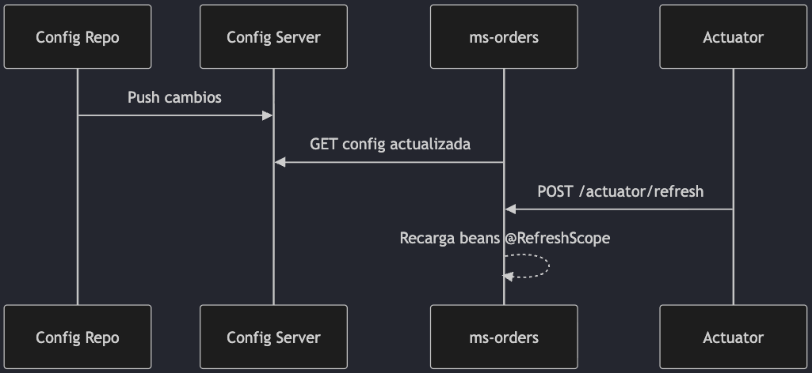

### API Gateway

Punto de entrada único para todos los microservicios.

#### Objetivo: API Gateway

- Centralizar routing y políticas de seguridad.
- Simplificar el acceso del cliente a un solo endpoint.
- Aplicar filtros y observabilidad de forma consistente.

#### ¿Por qué un API Gateway?

Un Gateway actúa como punto de entrada único para todos los microservicios.

Sin Gateway
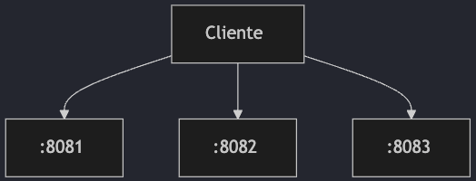

Con Gateway
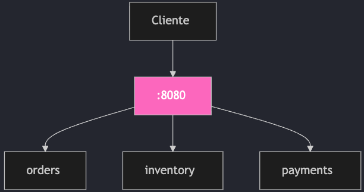

#### Ventajas del API Gateway

| Aspecto       | Sin Gateway                  | Con Gateway                |
| ------------- | ---------------------------- | -------------------------- |
| URLs          | Cliente conoce N puertos/IPs | Cliente conoce 1 URL       |
| Auth          | Duplicada en cada servicio   | Centralizada en el Gateway |
| Rate Limiting | Implementado por servicio    | Un solo punto de control   |
| CORS          | Configurado en cada servicio | Centralizado               |
| SSL           | Terminado por servicio       | Terminado en el Gateway    |
| Logging       | Disperso                     | Centralizado               |

> Spring Cloud Gateway está construido sobre WebFlux (reactivo) — alto rendimiento y soporte nativo para filtros.

#### Configuración del Gateway

```yaml
# application.yml del Gateway
spring:
  cloud:
    gateway:
      routes:
        - id: orders-service
          uri: http://ms-orders:8080
          predicates:
            - Path=/api/orders/**

        - id: inventory-service
          uri: http://ms-inventory:8080
          predicates:
            - Path=/api/inventory/**
          filters:
            - name: CircuitBreaker
              args:
                name: inventoryCB
                fallbackUri: forward:/fallback/inventory

        - id: payments-service
          uri: http://ms-payments:8080
          predicates:
            - Path=/api/payments/**
```

#### Filtros del Gateway

```java
@Component
public class CorrelationIdFilter
        implements GlobalFilter, Ordered {

    @Override
    public Mono<Void> filter(
            ServerWebExchange exchange,
            GatewayFilterChain chain) {
        String corrId = exchange.getRequest()
            .getHeaders().getFirst("X-Correlation-Id");
        if (corrId == null) {
            corrId = UUID.randomUUID().toString();
        }
        exchange.getRequest().mutate()
            .header("X-Correlation-Id", corrId);

        final String id = corrId;
        return chain.filter(exchange)
            .then(Mono.fromRunnable(() ->
                exchange.getResponse().getHeaders()
                    .add("X-Correlation-Id", id)));
    }

    @Override
    public int getOrder() { return -1; }
}
```

### Circuit Breaker / Resilience4j

Proteger tus servicios contra fallos en cascada.

#### Objetivo: Circuit Breaker

- Cortar llamadas a servicios inestables.
- Evitar cascadas de fallos y tiempos de espera.
- Definir fallbacks y reintentos controlados.

#### Estados del Circuit Breaker

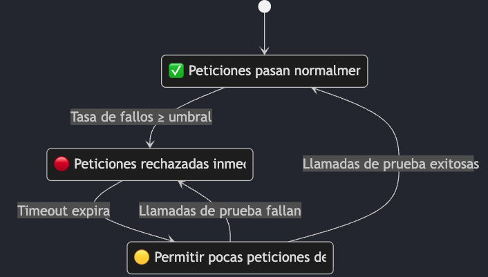

| Estado      | Comportamiento                                       |
| ----------- | ---------------------------------------------------- |
| `CLOSED`    | Todo funciona, las llamadas pasan                    |
| `OPEN`      | Servicio caído, retorna fallback o error inmediato   |
| `HALF_OPEN` | Prueba con pocas llamadas si el servicio se recuperó |

#### Configuración de Resilience4j

```yaml
# application.yml
resilience4j:
  circuitbreaker:
    instances:
      inventoryService:
        slidingWindowSize: 10 # Últimas 10 llamadas
        failureRateThreshold: 50 # Abre si 50% fallan
        waitDurationInOpenState: 10s # Espera 10s antes de HALF_OPEN
        permittedNumberOfCallsInHalfOpenState: 3 # 3 llamadas de prueba
        slowCallRateThreshold: 80 # 80% llamadas lentas = fallo
        slowCallDurationThreshold: 2s # >2s = llamada lenta

  retry:
    instances:
      inventoryService:
        maxAttempts: 3
        waitDuration: 1s
        retryExceptions:
          - java.io.IOException
          - java.util.concurrent.TimeoutException
```

#### Usando Resilience4j en Código

```java
@Service
public class InventoryClient {

    private final WebClient webClient;

    @CircuitBreaker(name = "inventoryService", fallbackMethod = "fallbackStock")
    @Retry(name = "inventoryService")
    public Mono<StockResponse> checkStock(String sku) {
        return webClient.get()
            .uri("/api/inventory/{sku}", sku)
            .retrieve()
            .bodyToMono(StockResponse.class)
            .timeout(Duration.ofSeconds(3));
    }

    // Fallback: se ejecuta cuando el circuito está OPEN o hay error
    private Mono<StockResponse> fallbackStock(String sku, Throwable t) {
        log.warn("Fallback para sku={}: {}", sku, t.getMessage());
        return Mono.just(new StockResponse(sku, 0, false,
            "Servicio temporalmente no disponible"));
    }
}
```

> El método fallback debe tener la misma firma + Throwable como último parámetro.

#### Patrones de Resilience4j

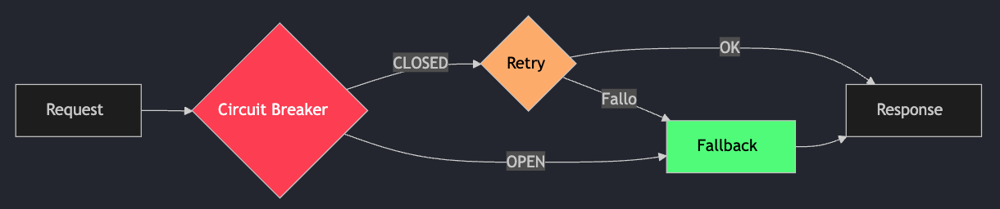

#### Resumen de Patrones

| Patrón          | Propósito                      |
| --------------- | ------------------------------ |
| Circuit Breaker | Abrir circuito ante fallos     |
| Retry           | Reintentar fallos transitorios |
| Bulkhead        | Limitar concurrencia           |
| Rate Limiter    | Limitar llamadas/seg           |
| Time Limiter    | Timeout por llamada            |

### Cloud Functions

Modelo unificado para exponer logica de negocio como funciones.

#### Objetivo: Cloud Function

- Encapsular lógica en funciones reutilizables.
- Exponerla en múltiples plataformas sin reescribir.
- Facilitar testing y composición funcional.

#### Función en Java

```java
@Configuration
public class PricingFunctions {

    @Bean
    public Function<OrderRequest, OrderPrice> priceOrder(PricingService pricing) {
        return req -> pricing.calculate(req);
    }
}
```

```yaml
# application.yml (exponer funcion por HTTP)
spring:
  cloud:
    function:
      definition: priceOrder
```

> La misma función puede recibir mensajes en Kafka o invocarse via HTTP.

### Cloud Stream (Kafka/RabbitMQ)

Abstracción para mensajería event-driven con Kafka o RabbitMQ.

#### Objetivo: Cloud Stream

- Enviar y recibir eventos sin acoplarse al broker.
- Escalar consumidores con grupos.
- Construir flujos event-driven confiables.

#### Arquitectura de Cloud Stream


| Concepto       | Descripción                                        |
| -------------- | -------------------------------------------------- |
| Binder         | Integración con el broker (Kafka, RabbitMQ)        |
| Binding        | Puente entre código de la app y el broker          |
| Message        | Datos estructurados (headers + payload)            |
| Consumer Group | Asegurar que solo 1 instancia procese cada mensaje |

#### Productor y Consumidor con Cloud Stream

```java
// Productor: publica eventos
@Service
public class OrderEventPublisher {

    private final StreamBridge streamBridge;

    public void publishOrderCreated(Order order) {
        OrderCreatedEvent event = new OrderCreatedEvent(
            order.getId(), order.getSku(), order.getQuantity());
        streamBridge.send("order-events-out-0", event);
    }
}

// Consumidor: procesa eventos (enfoque funcional)
@Configuration
public class InventoryEventConsumer {

    @Bean
    public Consumer<OrderCreatedEvent> processOrderCreated(InventoryService service) {
        return event -> {
            log.info("Recibido evento: orderId={}", event.orderId());
            service.reserveStock(event.sku(), event.quantity());
        };
    }
}
```

#### Configuración Cloud Stream con Kafka

```yaml
spring:
  cloud:
    stream:
      bindings:
        order-events-out-0: # Nombre del binding de salida
          destination: order-created # Topic de Kafka
          content-type: application/json

        processOrderCreated-in-0: # Input (nombre del @Bean + -in-0)
          destination: order-created # Mismo topic
          group: inventory-service # Consumer group
          content-type: application/json

      kafka:
        binder:
          brokers: kafka:9092
          auto-create-topics: true
          replication-factor: 1
```

> Convención de nombres: <nombreBean>-in-0 para input, <nombreBean>-out-0 para output.

#### Flujo SAGA con Cloud Stream

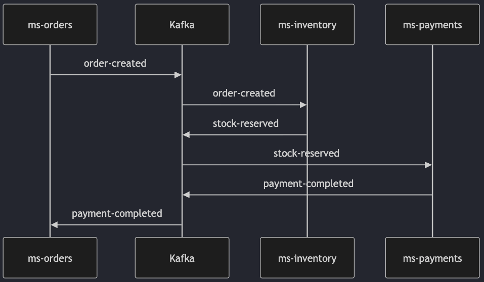

### OpenFeign

Llamadas HTTP entre microservicios sin boilerplate.

#### Objetivo: OpenFeign

- Declarar clientes HTTP con interfaces simples.
- Integrar balanceo y resiliencia sin código extra.
- Reducir boilerplate de consumo de APIs internas.

#### Feign vs WebClient

| Aspecto     | OpenFeign                                  | WebClient                   |
| ----------- | ------------------------------------------ | --------------------------- |
| Estilo      | Declarativo (interfaz)                     | Imperativo/Funcional        |
| Stack       | Bloqueante (servlet)                       | No-bloqueante (reactivo)    |
| Boilerplate | Mínimo                                     | Más control manual          |
| Integración | Load Balancer, Circuit Breaker automáticos | Manual                      |
| Cuándo usar | MVC + CRUD simple entre servicios          | WebFlux + alta concurrencia |

#### Usando OpenFeign

```java
// 1. Habilitar Feign en la app
@SpringBootApplication
@EnableFeignClients
public class OrdersApplication {}

// 2. Definir el cliente (solo interfaz)
@FeignClient(name = "ms-inventory", url = "${app.inventory.url}",
    fallback = InventoryFallback.class)
public interface InventoryClient {

    @GetMapping("/api/inventory/{sku}")
    StockResponse checkStock(@PathVariable String sku);

    @PostMapping("/api/inventory/reserve")
    ReservationResponse reserveStock(@RequestBody ReserveRequest request);
}

// 3. Fallback para Circuit Breaker
@Component
public class InventoryFallback implements InventoryClient {
    public StockResponse checkStock(String sku) {
        return new StockResponse(sku, 0, false, "Servicio no disponible");
    }
    public ReservationResponse reserveStock(ReserveRequest request) {
        return ReservationResponse.failed("Servicio no disponible");
    }
}
```

#### Feign: Interceptores y Config

```java
// Interceptor: agregar auth header a todas las llamadas Feign
@Configuration
public class FeignConfig {

    @Bean
    public RequestInterceptor authInterceptor() {
        return template -> {
            String token = SecurityContextHolder.getContext()
                .getAuthentication().getCredentials().toString();
            template.header("Authorization", "Bearer " + token);
        };
    }
}
```

```yaml
# Configuración de timeouts y logging
spring:
  cloud:
    openfeign:
      client:
        config:
          ms-inventory:
            connect-timeout: 3000
            read-timeout: 5000
            logger-level: BASIC
      micrometer:
        enabled: true # Métricas automáticas
```

### Spring Security + JWT

Seguridad centralizada con filtros y configuraciones declarativas.

#### Objetivo: Spring Security

- Proteger endpoints con autenticación y autorización.
- Aplicar politicas por ruta o rol.
- Integrar JWT para APIs stateless.

#### Configuración Básica

```java
@Configuration
public class SecurityConfig {

  @Bean
  public SecurityFilterChain securityFilterChain(HttpSecurity http) throws Exception {
    return http
      .csrf(csrf -> csrf.disable())
      .authorizeHttpRequests(auth -> auth
        .requestMatchers("/api/auth/**").permitAll()
        .anyRequest().authenticated())
      .build();
  }
}
```

#### Objetivo: JWT + Refresh Token

- Mantener APIs stateless con tokens cortos.
- Renovar sesiones sin re-login constante.
- Reducir riesgo con rotación de refresh tokens.

#### JWT + Refresh Token

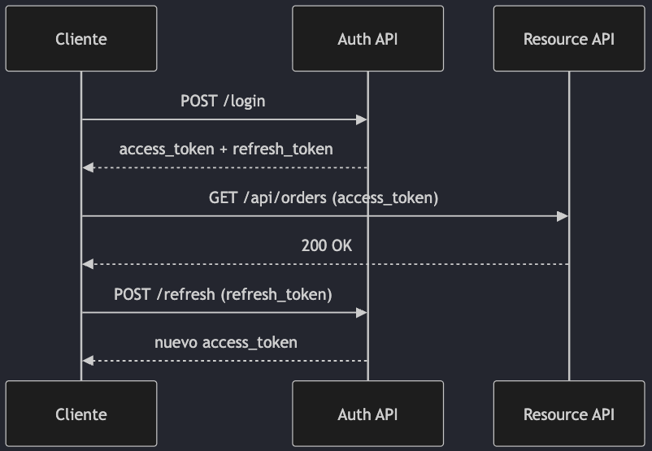

#### Filtro JWT en Java

```java
@Component
public class JwtAuthFilter extends OncePerRequestFilter {

  private final JwtService jwtService;

  @Override
  protected void doFilterInternal(HttpServletRequest request,
                  HttpServletResponse response,
                  FilterChain filterChain) throws ServletException, IOException {
    String auth = request.getHeader("Authorization");
    if (auth != null && auth.startsWith("Bearer ")) {
      String token = auth.substring(7);
      Authentication authentication = jwtService.toAuthentication(token);
      SecurityContextHolder.getContext().setAuthentication(authentication);
    }
    filterChain.doFilter(request, response);
  }
}
```

> Usa access tokens cortos (ej. 10-15 min) y refresh tokens con rotacion.

### Spring AI

Integración de IA generativa con el ecosistema Spring.

#### Objetivo: Spring AI

- Conectar modelos de lenguaje desde Spring Boot.
- Centralizar prompts y respuestas en servicios.
- Integrar IA en flujos existentes de negocio.

#### Ejemplo Básico con ChatClient

```java
@Service
public class AssistantService {

  private final ChatClient chatClient;

  public AssistantService(ChatClient chatClient) {
    this.chatClient = chatClient;
  }

  public String resumenPedido(String texto) {
    return chatClient.prompt()
      .user("Resume este pedido: " + texto)
      .call()
      .content();
  }
}
```

### Observabilidad Distribuida

Tracing distribuido para seguir una petición a través de múltiples servicios.

#### Objetivo: Observabilidad

- Rastrear solicitudes end-to-end.
- Correlacionar logs entre servicios.
- Visualizar latencias y cuellos de botella.

#### Trace Context: El Hilo Conductor

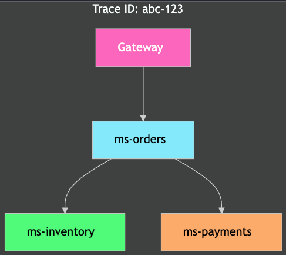

Concepto
Descripción
Trace
Historia completa de un request
Span
Operación individual dentro del trace
Trace ID
ID que viaja por TODOS los servicios
Span ID
ID de cada operación

#### Configuración con Micrometer Tracing

```yaml
# application.yml (en cada microservicio)
management:
  tracing:
    sampling:
      probability: 1.0 # 100% en dev, ~10% en producción
  zipkin:
    tracing:
      endpoint: http://zipkin:9411/api/v2/spans

logging:
  pattern:
    level: "%5p [${spring.application.name:},%X{traceId:-},%X{spanId:-}]"
```

```xml
<!-- Dependencias clave (pom.xml) -->
<dependency>
    <groupId>io.micrometer</groupId>
    <artifactId>micrometer-tracing-bridge-otel</artifactId>
</dependency>
<dependency>
    <groupId>io.opentelemetry</groupId>
    <artifactId>opentelemetry-exporter-zipkin</artifactId>
</dependency>
```

#### Log Correlacionado

Con Micrometer Tracing, los logs incluyen automáticamente el Trace ID:

```text
INFO [ms-orders,abc123def456,span-001] Creando orden SKU=GPU-4090
INFO [ms-inventory,abc123def456,span-002] Reservando stock para GPU-4090
INFO [ms-payments,abc123def456,span-003] Procesando pago para orden #42
```

Todos comparten el mismo Trace ID → puedes buscar abc123def456 en tu agregador de logs y ver todo el flujo.

> En producción, exporta traces a Zipkin, Jaeger o Grafana Tempo para visualización.

## Resumen & Mapa Conceptual

### Mapa Completo Spring Cloud

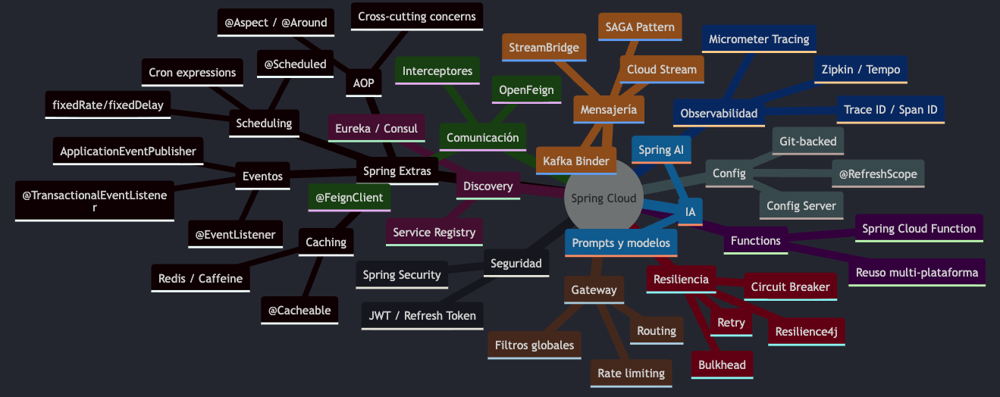

## Cierre & Referencia Rápida

### Tabla Resumen de Componentes

| Componente         | Starter                                            | Problema que resuelve      |
| ------------------ | -------------------------------------------------- | -------------------------- |
| Discovery (Eureka) | `spring-cloud-starter-netflix-eureka-client`       | Registro y descubrimiento  |
| Config Server      | `spring-cloud-config-server`                       | Config centralizada        |
| API Gateway        | `spring-cloud-starter-gateway`                     | Routing + seguridad        |
| Resilience4j       | `spring-cloud-starter-circuitbreaker-resilience4j` | Fallos en cascada          |
| Cloud Function     | `spring-cloud-function-context`                    | Lógica reutilizable        |
| Cloud Stream       | `spring-cloud-starter-stream-kafka`                | Mensajería event-driven    |
| OpenFeign          | `spring-cloud-starter-openfeign`                   | Clientes HTTP declarativos |
| Spring Security    | `spring-boot-starter-security`                     | Autenticación              |
| JWT                | `jjwt-api` / `nimbus-jose-jwt`                     | Tokens stateless           |
| Micrometer Tracing | `micrometer-tracing-bridge-otel`                   | Tracing distribuido        |
| Spring AI          | `spring-ai-openai-spring-boot-starter`             | Integración IA             |

### ¿Cuándo usar cada componente?

| Si necesitas…                              | Usa                               |
| ------------------------------------------ | --------------------------------- |
| Encontrar instancias disponibles           | Discovery Service (Eureka/Consul) |
| Cambiar config sin reiniciar               | Config Server + `@RefreshScope`   |
| Un solo punto de entrada para clientes     | API Gateway                       |
| Proteger contra servicios caídos           | Circuit Breaker / Resilience4j    |
| Reutilizar lógica en HTTP y eventos        | Spring Cloud Function             |
| Comunicación async entre servicios         | Cloud Stream (Kafka/RabbitMQ)     |
| Llamar otros servicios por HTTP (MVC)      | OpenFeign                         |
| Llamar otros servicios por HTTP (Reactivo) | WebClient                         |
| Proteger APIs con JWT                      | Spring Security + JWT             |
| Seguir un request cruzando servicios       | Micrometer Tracing                |
| Agregar IA generativa al negocio           | Spring AI                         |
| Ejecutar tareas periódicas                 | `@Scheduled`                      |
| Reducir latencia con caché                 | `@Cacheable` con Redis            |

### Recursos Oficiales

- <https://spring.io/projects/spring-cloud>
- <https://spring.io/projects/spring-cloud-netflix>
- <https://docs.spring.io/spring-cloud-config/reference/>
- <https://docs.spring.io/spring-cloud-gateway/reference/>
- <https://docs.spring.io/spring-cloud-circuitbreaker/reference/>
- <https://spring.io/projects/spring-cloud-function>
- <https://docs.spring.io/spring-cloud-stream/reference/>
- <https://docs.spring.io/spring-cloud-openfeign/reference/>
- <https://spring.io/projects/spring-security>
- <https://spring.io/projects/spring-ai>
- <https://micrometer.io/docs/tracing>
- <https://resilience4j.readme.io/docs/getting-started>
