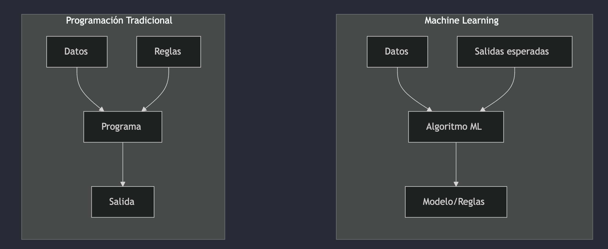
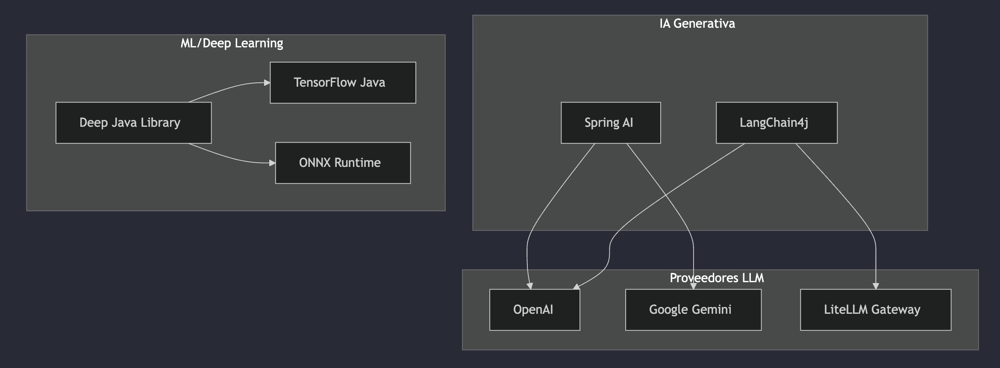
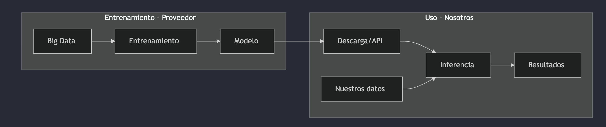
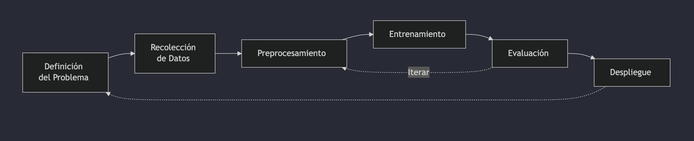
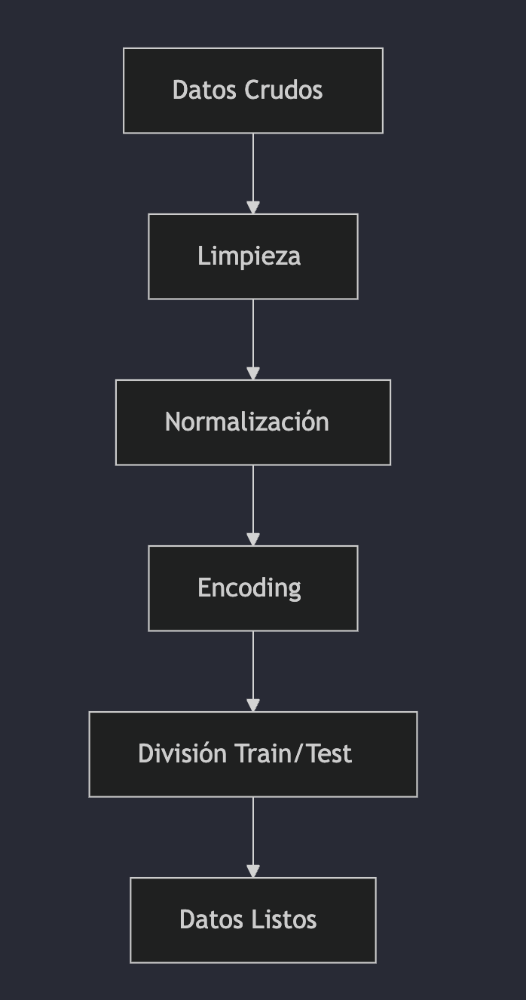
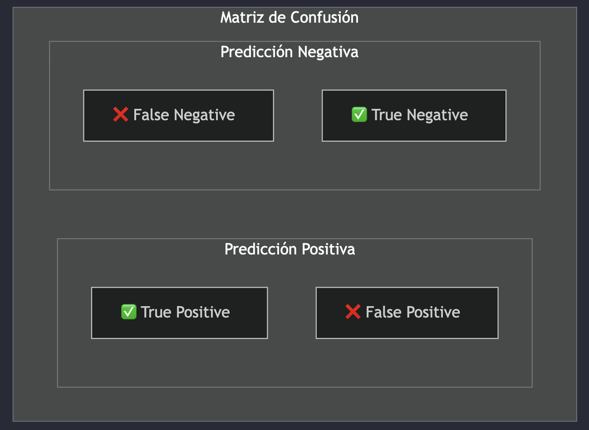
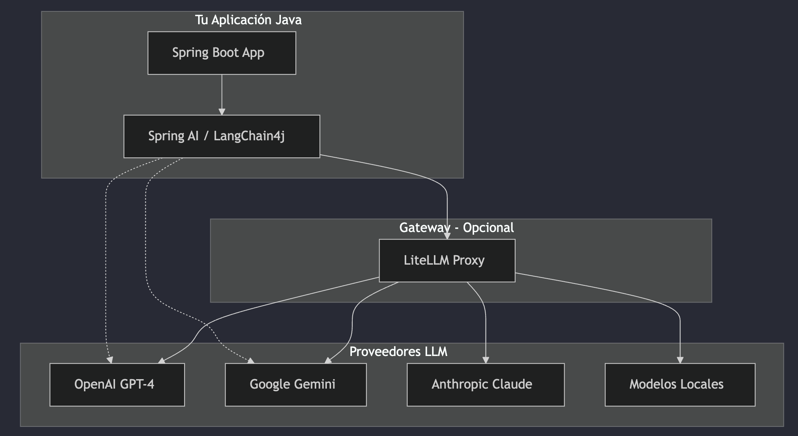
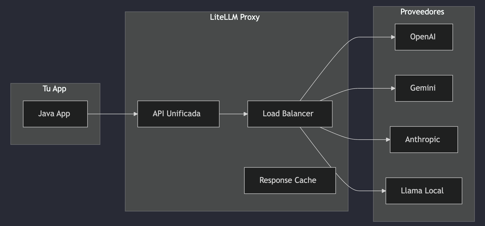
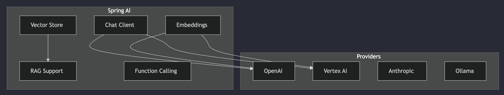

# Clase 10 - IA & Machine Learning en Java

> **Fuente:** [Diapositivas del curso](https://manulasker.github.io/enyoi_java_slides/clase_12_13_14_temas_faltantes_ia/#/qu%C3%A9-es-machine-learning)

---

## Índice

1. [Introducción a IA y ML](#introducción-a-ia-y-ml)
2. [Configuración del Ecosistema](#configuración-del-ecosistema)
3. [Modelos Preentrenados](#modelos-preentrenados)
4. [Ciclo de Vida de un Modelo ML](#ciclo-de-vida-de-un-modelo-ml)
5. [Preprocesamiento de Datos](#preprocesamiento-de-datos)
6. [Implementación con DJL](#implementación-con-djl)
7. [Evaluación de Modelos](#evaluación-de-modelos)
8. [Integración con APIs de IA Generativa](#integración-con-apis-de-ia-generativa)

---

## Introducción a IA y ML

La IA está transformando el desarrollo de software. Java, con su robustez empresarial, es una opción sólida para implementar soluciones de IA, aunque la comunidad está más centrada en Python y JavaScript.

### Machine Learning vs Programación Tradicional



- **Programación tradicional:** Reglas definidas manualmente → salida determinista
- **Machine Learning:** Algoritmo que aprende las reglas a partir de los datos

### IA Generativa vs ML Tradicional

| Aspecto | ML Tradicional | IA Generativa |
|---------|----------------|---------------|
| **Objetivo** | Clasificar, predecir | Crear contenido nuevo |
| **Salida** | Etiquetas, números | Texto, imágenes, código |
| **Ejemplos** | Spam filter, recomendaciones | ChatGPT, DALL-E, Gemini |
| **Entrenamiento** | Dataset específico | Enormes corpus de datos |
| **Uso en Java** | DJL, Weka, Smile | Spring AI, LangChain4j |

### Casos de Uso en Java

| ML Tradicional | IA Generativa |
|----------------|---------------|
| Detección de fraudes | Chatbots inteligentes |
| Sistemas de recomendación | Generación de documentación |
| Predicción de demanda | Asistentes de código |
| Análisis de sentimientos | Resumen de textos |
| Visión por computadora | Análisis de documentos |

### Ecosistema Java para IA



---

## Configuración del Ecosistema

### Dependencias Gradle

```groovy
// build.gradle
plugins {
    id 'java'
    id 'org.springframework.boot' version '3.3.0'
    id 'io.spring.dependency-management' version '1.1.5'
}

dependencies {
    // Spring AI para IA Generativa
    implementation 'org.springframework.ai:spring-ai-openai-spring-boot-starter:1.0.0'

    // LangChain4j
    implementation 'dev.langchain4j:langchain4j:0.35.0'
    implementation 'dev.langchain4j:langchain4j-open-ai:0.35.0'

    // Deep Java Library (DJL)
    implementation 'ai.djl:api:0.29.0'
    runtimeOnly 'ai.djl.pytorch:pytorch-engine:0.29.0'
}
```

### Documentación de Librerías

| Librería | Documentación | Repositorio |
|----------|---------------|-------------|
| Spring AI | [docs.spring.io/spring-ai](https://docs.spring.io/spring-ai) | [GitHub](https://github.com/spring-projects/spring-ai) |
| LangChain4j | [docs.langchain4j.dev](https://docs.langchain4j.dev) | [GitHub](https://github.com/langchain4j/langchain4j) |
| DJL | [djl.ai/docs](https://djl.ai/docs) | [GitHub](https://github.com/deepjavalibrary/djl) |
| OpenAI Java | [platform.openai.com/docs](https://platform.openai.com/docs) | [GitHub](https://github.com/openai/openai-java) |
| Google Gemini | [ai.google.dev](https://ai.google.dev) | [Maven](https://mvnrepository.com/artifact/com.google.cloud/google-cloud-vertexai) |

### Configuración Spring Boot

```yaml
# application.yml
spring:
  ai:
    openai:
      api-key: ${OPENAI_API_KEY}
      chat:
        options:
          model: gpt-4
          temperature: 0.7

    # Para Google Gemini
    vertex:
      ai:
        project-id: ${GCP_PROJECT_ID}
        location: us-central1
```

---

## Modelos Preentrenados

Permiten usar IA sin entrenar desde cero.



**Ventajas:** Sin costo de entrenamiento, resultados inmediatos, expertise incorporado.

### Fuentes de Modelos

| Fuente | Tipo | Ejemplos |
|--------|------|----------|
| Hugging Face* | Open Source | BERT, GPT-2, Llama |
| OpenAI API | Comercial | GPT-4, DALL-E |
| Google | Comercial | Gemini, PaLM |
| DJL Model Zoo | Open Source | ResNet, BERT |

> *Repositorio recomendado por el profe.

---

## Ciclo de Vida de un Modelo ML



| Fase | Descripción |
|------|-------------|
| **1. Definición del Problema** | ¿Qué predecir? ¿Métricas de éxito? |
| **2. Recolección de Datos** | Fuentes, calidad y cantidad |
| **3. Preprocesamiento** | Limpieza y transformaciones |
| **4. Entrenamiento** | Selección de algoritmo, ajuste de hiperparámetros |
| **5. Evaluación** | Métricas (accuracy, F1), validación cruzada |
| **6. Despliegue** | API REST, batch processing |

---

## Preprocesamiento de Datos

Los datos crudos raramente están listos para usar en modelos de ML.



### Ejemplo con DJL

```java
public class ImagePreprocessor {

    public Image preprocess(Image image) {
        return ImageFactory.getInstance()
            .fromImage(image)
            .resize(224, 224)      // Redimensionar
            .toTensor()            // Convertir a tensor
            .normalize(            // Normalizar valores
                new float[]{0.485f, 0.456f, 0.406f},  // mean
                new float[]{0.229f, 0.224f, 0.225f}   // std
            );
    }
}
```

---

## Implementación con DJL

DJL (Deep Java Library) es un framework de deep learning para Java desarrollado por AWS.

### Clasificación de Imágenes

```java
public class ImageClassifier {

    public Classifications classify(Path imagePath) throws Exception {
        Image image = ImageFactory.getInstance().fromFile(imagePath);

        Criteria<Image, Classifications> criteria = Criteria.builder()
            .setTypes(Image.class, Classifications.class)
            .optArtifactId("resnet")
            .optProgress(new ProgressBar())
            .build();

        try (ZooModel<Image, Classifications> model = criteria.loadModel();
             Predictor<Image, Classifications> predictor = model.newPredictor()) {
            return predictor.predict(image);
        }
    }
}
```

### Detección de Objetos

```java
public class ObjectDetector {

    public DetectedObjects detect(Path imagePath) throws Exception {
        Image image = ImageFactory.getInstance().fromFile(imagePath);

        Criteria<Image, DetectedObjects> criteria = Criteria.builder()
            .setTypes(Image.class, DetectedObjects.class)
            .optArtifactId("ssd")  // Single Shot Detector
            .optFilter("backbone", "mobilenet")
            .build();

        try (ZooModel<Image, DetectedObjects> model = criteria.loadModel();
             Predictor<Image, DetectedObjects> predictor = model.newPredictor()) {

            DetectedObjects detected = predictor.predict(image);

            for (DetectedObjects.DetectedObject obj : detected.items()) {
                System.out.printf("Objeto: %s, Confianza: %.2f%%\n",
                    obj.getClassName(), obj.getProbability() * 100);
            }
            return detected;
        }
    }
}
```

---

## Evaluación de Modelos

### Métricas Principales

| Métrica | Uso | Fórmula |
|---------|-----|---------|
| **Accuracy** | Clasificación general | (TP + TN) / Total |
| **Precision** | Minimizar falsos positivos | TP / (TP + FP) |
| **Recall** | Minimizar falsos negativos | TP / (TP + FN) |
| **F1-Score** | Balance precision/recall | 2 × (P × R) / (P + R) |

### Matriz de Confusión



> **Ejemplo médico:** Un falso negativo (no detectar enfermedad) es más grave que un falso positivo.

---

## Integración con APIs de IA Generativa

### Arquitectura General



---

### OpenAI

#### Configuración

```java
@Configuration
public class OpenAIConfig {

    @Value("${spring.ai.openai.api-key}")
    private String apiKey;

    @Bean
    public OpenAiChatModel chatModel() {
        return new OpenAiChatModel(
            new OpenAiApi(apiKey),
            OpenAiChatOptions.builder()
                .withModel("gpt-4")
                .withTemperature(0.7f)
                .withMaxTokens(2000)
                .build()
        );
    }
}
```

#### Chat Simple

```java
@Service
public class ChatService {

    private final OpenAiChatModel chatModel;

    public ChatService(OpenAiChatModel chatModel) {
        this.chatModel = chatModel;
    }

    public String chat(String userMessage) {
        Prompt prompt = new Prompt(userMessage);
        ChatResponse response = chatModel.call(prompt);
        return response.getResult().getOutput().getContent();
    }

    // Con System Prompt
    public String chatWithContext(String systemPrompt, String userMessage) {
        List<Message> messages = List.of(
            new SystemMessage(systemPrompt),
            new UserMessage(userMessage)
        );
        Prompt prompt = new Prompt(messages);
        return chatModel.call(prompt).getResult().getOutput().getContent();
    }
}
```

#### Streaming

```java
@Service
public class StreamingChatService {

    private final OpenAiChatModel chatModel;

    public Flux<String> streamChat(String userMessage) {
        Prompt prompt = new Prompt(userMessage);
        return chatModel.stream(prompt)
            .map(response -> response.getResult().getOutput().getContent())
            .filter(content -> content != null);
    }
}

// Controller
@GetMapping(value = "/chat/stream", produces = MediaType.TEXT_EVENT_STREAM_VALUE)
public Flux<String> streamChat(@RequestParam String message) {
    return streamingChatService.streamChat(message);
}
```

> El streaming mejora la UX al mostrar respuestas progresivamente.

#### Function Calling

```java
public record WeatherFunction(
    @JsonProperty("location") String location,
    @JsonProperty("unit") String unit
) {}

@Service
public class FunctionCallingService {

    @Bean
    public FunctionCallback weatherFunction() {
        return FunctionCallback.builder()
            .function("getWeather", (WeatherFunction request) -> {
                return "El clima en " + request.location() + " es soleado, 25°C";
            })
            .description("Obtiene el clima actual de una ubicación")
            .inputType(WeatherFunction.class)
            .build();
    }

    public String chatWithFunctions(String userMessage) {
        OpenAiChatOptions options = OpenAiChatOptions.builder()
            .withFunctions(Set.of("getWeather"))
            .build();
        Prompt prompt = new Prompt(userMessage, options);
        return chatModel.call(prompt).getResult().getOutput().getContent();
    }
}
```

---

### Google Gemini

#### Configuración

```java
@Configuration
public class GeminiConfig {

    @Bean
    public VertexAiGeminiChatModel geminiChatModel() {
        return new VertexAiGeminiChatModel(
            VertexAiGeminiChatOptions.builder()
                .withModel("gemini-pro")
                .withTemperature(0.7f)
                .build()
        );
    }
}
```

#### Multimodal (Imágenes + Texto)

```java
@Service
public class GeminiMultimodalService {

    private final VertexAiGeminiChatModel geminiModel;

    public String analyzeImage(byte[] imageBytes, String question) {
        UserMessage userMessage = new UserMessage(
            question,
            List.of(new Media(MimeTypeUtils.IMAGE_PNG, imageBytes))
        );
        Prompt prompt = new Prompt(List.of(userMessage));
        return geminiModel.call(prompt).getResult().getOutput().getContent();
    }

    public String describeProduct(Path imagePath) throws IOException {
        byte[] imageBytes = Files.readAllBytes(imagePath);
        return analyzeImage(
            imageBytes,
            "Describe este producto para un e-commerce. " +
            "Incluye características, materiales y posibles usos."
        );
    }
}
```

### Gemini vs OpenAI

| Característica | OpenAI GPT-4 | Google Gemini |
|----------------|--------------|---------------|
| **Multimodal** | GPT-4V (imágenes) | Nativo (imágenes, video) |
| **Contexto** | 128K tokens | 1M tokens (Gemini 1.5) |
| **Velocidad** | Medio | Rápido |
| **Costo** | $$$$ | $$$ |
| **Integración GCP** | Manual | Nativa |
| **Fortaleza** | Razonamiento | Contexto largo |

---

### LiteLLM - Gateway Unificado

Proxy que unifica múltiples proveedores de LLM bajo una sola API.



#### Configuración

```yaml
# config.yaml para LiteLLM
model_list:
  - model_name: gpt-4
    litellm_params:
      model: openai/gpt-4
      api_key: ${OPENAI_API_KEY}

  - model_name: gemini-pro
    litellm_params:
      model: gemini/gemini-pro
      api_key: ${GOOGLE_API_KEY}

  - model_name: claude-3
    litellm_params:
      model: anthropic/claude-3-opus
      api_key: ${ANTHROPIC_API_KEY}

general_settings:
  master_key: sk-your-proxy-key
```

```bash
# Iniciar LiteLLM
pip install litellm[proxy]
litellm --config config.yaml
```

#### Integración Java

```java
@Configuration
public class LiteLLMConfig {

    @Bean
    public OpenAiChatModel litellmChatModel() {
        // LiteLLM expone API compatible con OpenAI
        return new OpenAiChatModel(
            new OpenAiApi("http://localhost:4000", "sk-your-proxy-key"),
            OpenAiChatOptions.builder()
                .withModel("gpt-4")  // o "gemini-pro", "claude-3"
                .build()
        );
    }
}

@Service
public class UnifiedChatService {

    private final OpenAiChatModel chatModel;

    public String chat(String message, String modelName) {
        OpenAiChatOptions options = OpenAiChatOptions.builder()
            .withModel(modelName)  // "gpt-4", "gemini-pro", "claude-3"
            .build();
        Prompt prompt = new Prompt(message, options);
        return chatModel.call(prompt).getResult().getOutput().getContent();
    }
}
```

#### Ventajas de LiteLLM

| Operacionales | Desarrollo |
|---------------|------------|
| API unificada (OpenAI compatible) | Cambiar proveedor sin cambiar código |
| Fallback automático entre proveedores | A/B testing de modelos |
| Load balancing | Logging centralizado |
| Caché de respuestas | Control de costos |
| Rate limiting | Soporte para modelos locales |

---

### Spring AI - Framework Oficial



#### Chat Client Fluent API

```java
@Service
public class SpringAIChatService {

    private final ChatClient chatClient;

    public SpringAIChatService(ChatClient.Builder builder) {
        this.chatClient = builder
            .defaultSystem("Eres un asistente experto en programación Java.")
            .build();
    }

    public String generateCode(String description) {
        return chatClient.prompt()
            .user(u -> u.text("Genera código Java para: {description}")
                        .param("description", description))
            .call()
            .content();
    }

    public String chatWithHistory(List<Message> history, String newMessage) {
        return chatClient.prompt()
            .messages(history)
            .user(newMessage)
            .call()
            .content();
    }
}
```

#### Output Parsing

```java
public record ProductAnalysis(
    String name,
    String category,
    List<String> features,
    double estimatedPrice
) {}

@Service
public class StructuredOutputService {

    private final ChatClient chatClient;

    public ProductAnalysis analyzeProduct(String description) {
        return chatClient.prompt()
            .user("Analiza este producto: " + description)
            .call()
            .entity(ProductAnalysis.class);  // Parseo automático a Java Record
    }

    public List<ProductAnalysis> analyzeProducts(String catalog) {
        return chatClient.prompt()
            .user("Analiza estos productos: " + catalog)
            .call()
            .entity(new ParameterizedTypeReference<List<ProductAnalysis>>() {});
    }
}
```

---

### LangChain4j

Port de LangChain a Java con características avanzadas.

#### Configuración Básica

```java
ChatLanguageModel model = OpenAiChatModel.builder()
    .apiKey(System.getenv("OPENAI_API_KEY"))
    .modelName("gpt-4")
    .temperature(0.7)
    .build();

String response = model.generate("Explica qué es Spring Boot");
```

#### AI Services (Interfaces Declarativas)

```java
public interface CodeAssistant {

    @SystemMessage("Eres un experto en Java y Spring Boot")
    String answerQuestion(String question);

    @SystemMessage("""
        Genera código Java limpio y documentado.
        Sigue las mejores prácticas de Spring Boot.
        """)
    @UserMessage("Crea un {{component}} para {{functionality}}")
    String generateCode(@V("component") String component,
                        @V("functionality") String functionality);
}

// Uso
CodeAssistant assistant = AiServices.builder(CodeAssistant.class)
    .chatLanguageModel(model)
    .build();

String code = assistant.generateCode("Repository", "gestionar usuarios");
```

#### Memory (Memoria de Conversación)

```java
public interface ConversationalAssistant {
    String chat(String message);
}

ChatMemory chatMemory = MessageWindowChatMemory.withMaxMessages(20);

ConversationalAssistant assistant = AiServices.builder(ConversationalAssistant.class)
    .chatLanguageModel(model)
    .chatMemory(chatMemory)
    .build();

assistant.chat("Me llamo Juan");
assistant.chat("¿Cómo me llamo?");  // "Te llamas Juan"

// Memoria persistente con base de datos
ChatMemoryStore store = new PersistentChatMemoryStore(jdbcTemplate);
ChatMemory persistentMemory = MessageWindowChatMemory.builder()
    .chatMemoryStore(store)
    .maxMessages(100)
    .build();
```

#### Tools (Herramientas para el LLM)

```java
public class CalculatorTool {

    @Tool("Suma dos números")
    public double add(double a, double b) {
        return a + b;
    }

    @Tool("Consulta el precio de un producto en la base de datos")
    public double getProductPrice(String productId) {
        return productRepository.findById(productId)
            .map(Product::getPrice)
            .orElse(0.0);
    }
}

Assistant assistant = AiServices.builder(Assistant.class)
    .chatLanguageModel(model)
    .tools(new CalculatorTool())
    .build();

// El LLM decide cuándo usar las herramientas
assistant.chat("¿Cuánto cuesta el producto ABC-123?");
// Internamente llama a getProductPrice("ABC-123")
```

---

## Extra

**Log Prob:** Opción que ofrecen los vendors para ver la probabilidad de cada token durante el procesamiento. Se activa mediante un header específico en la petición.

---

## Resumen

Esta clase cubre la integración de IA/ML en aplicaciones Java empresariales. Los puntos clave son:

- **DJL** para ML tradicional (clasificación, detección de objetos)
- **Spring AI** como framework oficial de Spring para IA generativa
- **LangChain4j** como alternativa con AI Services, Memory y Tools
- **LiteLLM** como gateway unificado para múltiples proveedores
- Las métricas de evaluación (Accuracy, Precision, Recall, F1) son fundamentales para validar modelos
