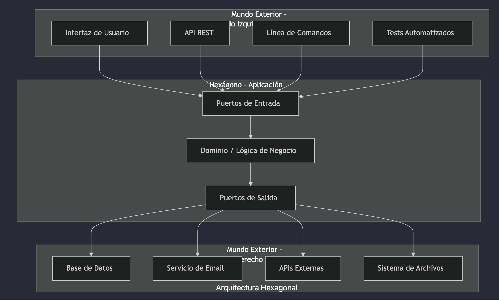
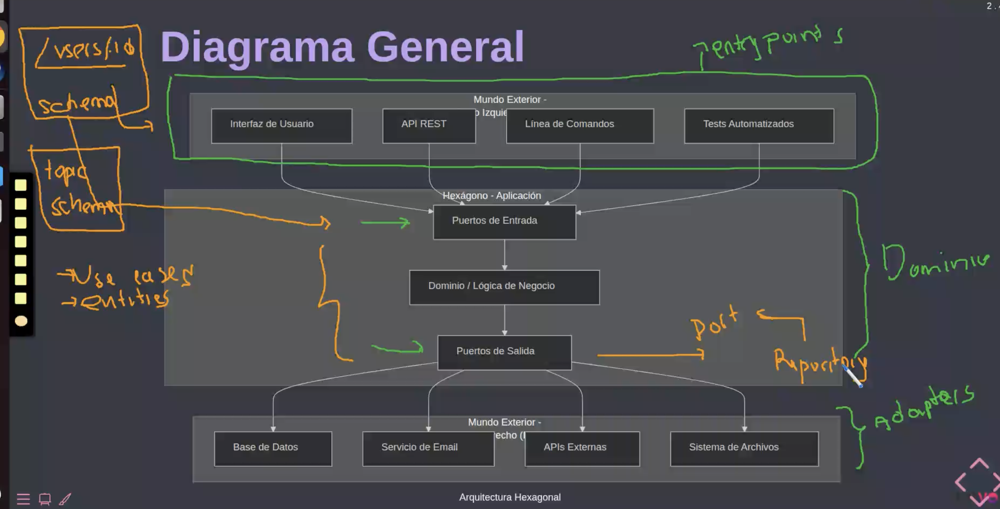
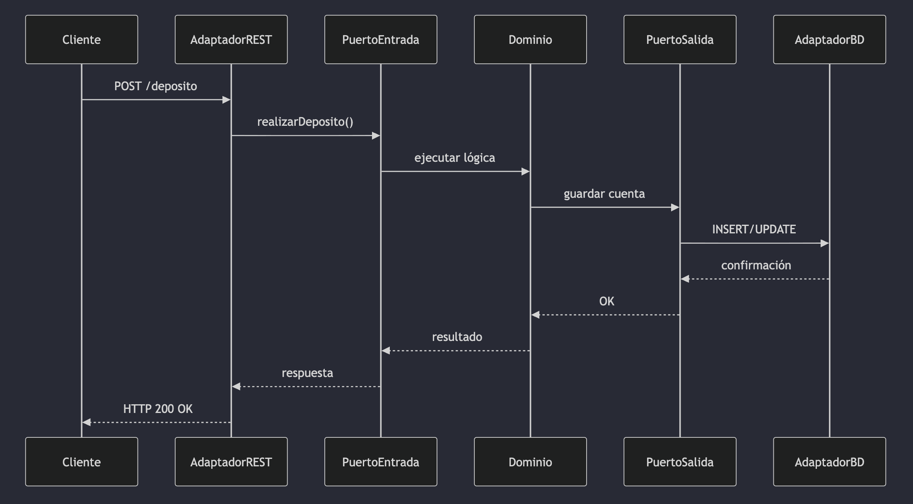
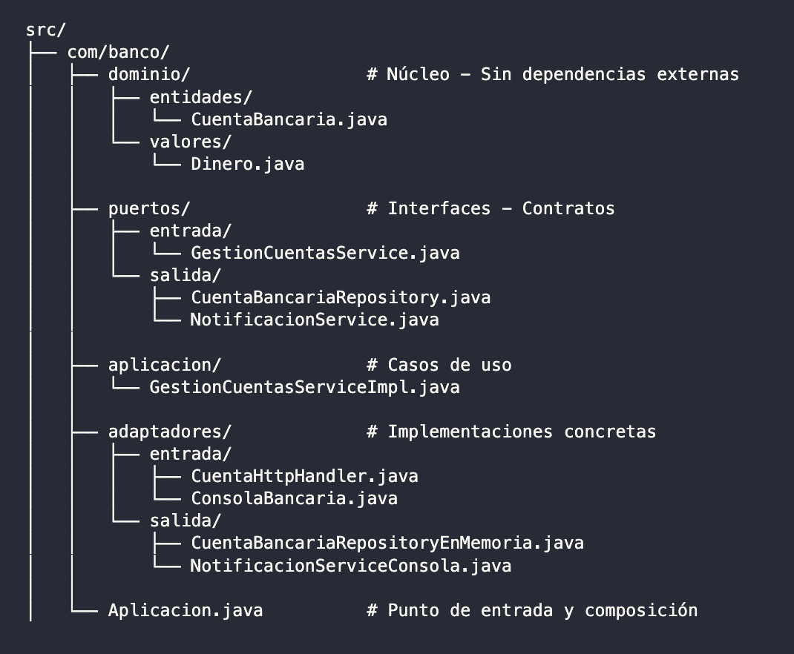
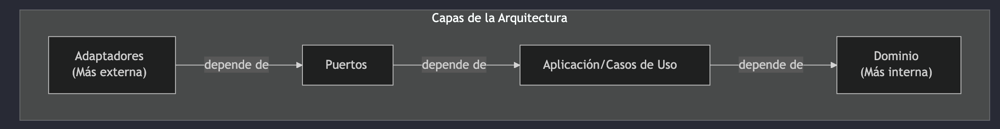
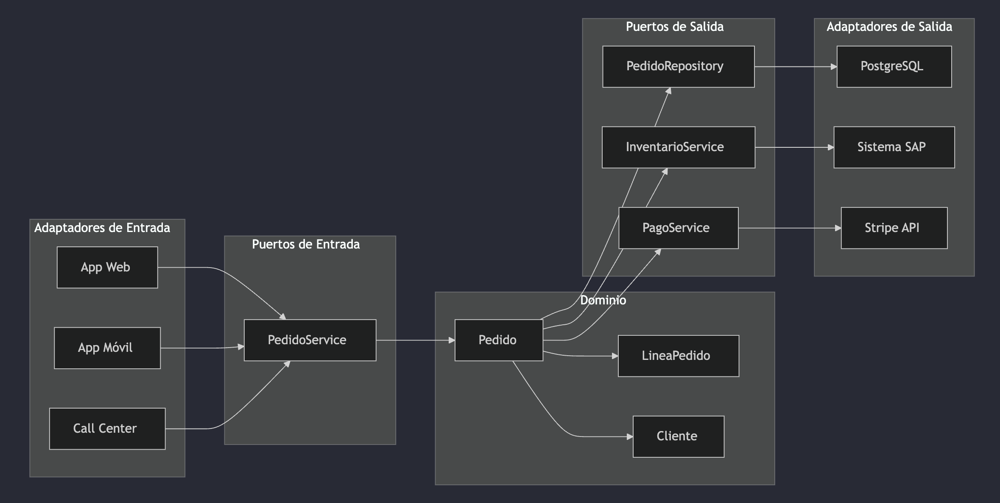
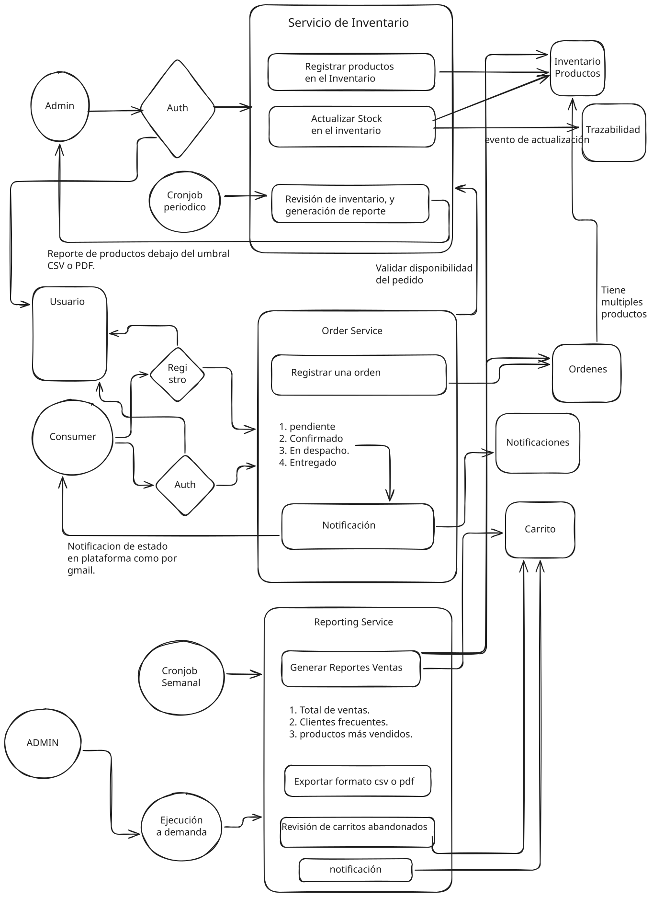

# Clase 11 - Arquitectura Hexagonal

> Diapositivas: https://manulasker.github.io/enyoi_java_slides/clase_15_16_17_arquitectura_hexagonal/#/title-slide
> Repositorio: https://github.com/Saisho137/arka-hexagonal-simple-enyoi

## Índice

1. [Introducción](#introducción)
2. [El Dominio](#1-el-dominio)
3. [Los Puertos](#2-los-puertos)
4. [Los Adaptadores](#3-los-adaptadores)
5. [Composición y Estructura](#composición-conectando-todo)
6. [Regla de Dependencia](#regla-de-dependencia)
7. [Testing](#testing-la-gran-ventaja)
8. [Ejemplo: Sistema de Pedidos](#ejemplo-sistema-de-pedidos)
9. [Beneficios y Errores Comunes](#beneficios)
10. [Cuándo Usar](#cuándo-usar-arquitectura-hexagonal)
11. [Resumen](#resumen-de-conceptos)

---

## Introducción

La **Arquitectura Hexagonal** (Ports and Adapters) fue propuesta por Alistair Cockburn en 2005. Su objetivo: crear aplicaciones independientes de mecanismos de entrega y tecnologías de infraestructura.

### El Problema que Resuelve

En aplicaciones tradicionales:

- La lógica de negocio está mezclada con código de base de datos
- Los cambios en la UI afectan la lógica de negocio
- Es difícil probar sin levantar toda la infraestructura
- Cambiar de tecnología requiere reescribir gran parte del código

### Analogía: Un Negocio Real

Imagina una tienda física:

- **Corazón del negocio**: Vender productos, gestionar inventario, calcular precios
- **Canales de venta**: Mostrador, teléfono, página web, app móvil
- **Proveedores**: Almacén propio, distribuidores, importadores

> El negocio funciona igual sin importar cómo llegue el cliente o de dónde venga el producto.

### Diagrama General





### Los Tres Componentes Principales

| Componente           | Descripción                                        |
| -------------------- | -------------------------------------------------- |
| **Dominio (Núcleo)** | La lógica de negocio pura                          |
| **Puertos**          | Interfaces que definen cómo se comunica el dominio |
| **Adaptadores**      | Implementaciones concretas de los puertos          |

---

## 1. El Dominio

El dominio es el corazón de la aplicación. Contiene:

- **Entidades**: Objetos con identidad y ciclo de vida
- **Objetos de Valor**: Objetos inmutables que representan aspectos descriptivos del dominio sin identidad propia. Se definen por sus atributos (no por ID), considerándose iguales si sus valores coinciden
- **Reglas de Negocio**: La lógica que hace única a tu aplicación
- **Servicios de Dominio**: Operaciones que no pertenecen a una entidad específica

### Ejemplo: Entidad de Dominio

```java
package com.banco.dominio.entidades;

public class CuentaBancaria {
    private final String numeroCuenta;
    private String titular;
    private double saldo;
    private boolean activa;

    public CuentaBancaria(String numeroCuenta, String titular, double saldoInicial) {
        if (numeroCuenta == null || numeroCuenta.isEmpty()) {
            throw new IllegalArgumentException("El número de cuenta es obligatorio");
        }
        if (saldoInicial < 0) {
            throw new IllegalArgumentException("El saldo inicial no puede ser negativo");
        }
        this.numeroCuenta = numeroCuenta;
        this.titular = titular;
        this.saldo = saldoInicial;
        this.activa = true;
    }

    // Getters
    public String getNumeroCuenta() { return numeroCuenta; }
    public String getTitular() { return titular; }
    public double getSaldo() { return saldo; }
    public boolean isActiva() { return activa; }

    // Reglas de Negocio
    public void depositar(double monto) {
        validarCuentaActiva();
        if (monto <= 0) {
            throw new IllegalArgumentException("El monto debe ser mayor a cero");
        }
        this.saldo += monto;
    }

    public void retirar(double monto) {
        validarCuentaActiva();
        if (monto <= 0) {
            throw new IllegalArgumentException("El monto debe ser mayor a cero");
        }
        if (monto > this.saldo) {
            throw new IllegalStateException("Saldo insuficiente para realizar el retiro");
        }
        this.saldo -= monto;
    }

    private void validarCuentaActiva() {
        if (!this.activa) {
            throw new IllegalStateException("La cuenta está inactiva");
        }
    }

    public void desactivar() {
        this.activa = false;
    }
}
```

### Ejemplo: Objeto de Valor

> Los objetos de valor son inmutables y se comparan por sus atributos.

```java
package com.banco.dominio.valores;

public final class Dinero {
    private final double cantidad;
    private final String moneda;

    public Dinero(double cantidad, String moneda) {
        if (cantidad < 0) {
            throw new IllegalArgumentException("La cantidad no puede ser negativa");
        }
        this.cantidad = cantidad;
        this.moneda = moneda;
    }

    public Dinero sumar(Dinero otro) {
        if (!this.moneda.equals(otro.moneda)) {
            throw new IllegalArgumentException("No se pueden sumar monedas diferentes");
        }
        return new Dinero(this.cantidad + otro.cantidad, this.moneda);
    }

    public double getCantidad() { return cantidad; }
    public String getMoneda() { return moneda; }
}
```

### Analogía: Sistema de Hospital

| Tipo                  | Ejemplos                                                                                                                                                        |
| --------------------- | --------------------------------------------------------------------------------------------------------------------------------------------------------------- |
| **Entidades**         | Paciente, Doctor, Cita, HistorialMedico                                                                                                                         |
| **Objetos de Valor**  | Direccion, Telefono, Diagnostico                                                                                                                                |
| **Reglas de Negocio** | Un doctor no puede tener más de 8 citas al día; Un paciente debe tener historial antes de ser operado; Las recetas deben ser firmadas por un doctor certificado |

---

## 2. Los Puertos

Los puertos son **interfaces** que definen los contratos de comunicación.

| Tipo                                     | Descripción                                     |
| ---------------------------------------- | ----------------------------------------------- |
| **Puertos de Entrada** (Driving/Primary) | Definen qué operaciones ofrece la aplicación    |
| **Puertos de Salida** (Driven/Secondary) | Definen qué necesita la aplicación del exterior |

### Puerto de Entrada

> Define las operaciones que la aplicación expone.

```java
package com.banco.puertos.entrada;

import com.banco.dominio.entidades.CuentaBancaria;

public interface GestionCuentasService {
    CuentaBancaria crearCuenta(String titular, double saldoInicial);
    void realizarDeposito(String numeroCuenta, double monto);
    void realizarRetiro(String numeroCuenta, double monto);
    void transferir(String cuentaOrigen, String cuentaDestino, double monto);
    double consultarSaldo(String numeroCuenta);
    CuentaBancaria obtenerCuenta(String numeroCuenta);
}
```

### Puerto de Salida: Repository

> Define cómo la aplicación accede a datos persistidos.

```java
package com.banco.puertos.salida;

import com.banco.dominio.entidades.CuentaBancaria;
import java.util.List;
import java.util.Optional;

public interface CuentaBancariaRepository {
    void guardar(CuentaBancaria cuenta);
    Optional<CuentaBancaria> buscarPorNumero(String numeroCuenta);
    List<CuentaBancaria> buscarPorTitular(String titular);
    List<CuentaBancaria> obtenerTodas();
    void actualizar(CuentaBancaria cuenta);
    void eliminar(String numeroCuenta);
    boolean existe(String numeroCuenta);
}
```

### Puerto de Salida: Notificaciones

```java
package com.banco.puertos.salida;

public interface NotificacionService {
    void enviarNotificacionDeposito(String numeroCuenta, double monto);
    void enviarNotificacionRetiro(String numeroCuenta, double monto);
    void enviarNotificacionTransferencia(String cuentaOrigen, String cuentaDestino, double monto);
    void enviarAlertaSaldoBajo(String numeroCuenta, double saldoActual);
}
```

### Analogía: Restaurante

| Puerto                | Analogía                                 |
| --------------------- | ---------------------------------------- |
| **Entrada**           | El menú (define qué platos puedes pedir) |
| **Salida (cocina)**   | Pedidos de ingredientes al proveedor     |
| **Salida (clientes)** | Sistema de entrega (mesero, delivery)    |

> El chef (dominio) no necesita saber si el cliente ordenó por teléfono o en persona.

---

## 3. Los Adaptadores

Los adaptadores son **implementaciones concretas** de los puertos.

| Tipo                     | Función                         | Ejemplos                                                                           |
| ------------------------ | ------------------------------- | ---------------------------------------------------------------------------------- |
| **Primarios** (Driving)  | Reciben peticiones del exterior | Controladores REST, Interfaces gráficas, Comandos de consola, Handlers de mensajes |
| **Secundarios** (Driven) | Conectan con servicios externos | Repositorios de BD, Clientes de APIs externas, Servicios de email/SMS              |

### Diagrama de Flujo



### Adaptador Primario: REST Controller

```java
package com.banco.adaptadores.entrada;

import com.banco.puertos.entrada.GestionCuentasService;
import com.sun.net.httpserver.HttpExchange;
import com.sun.net.httpserver.HttpHandler;
import java.io.IOException;
import java.io.OutputStream;

public class CuentaHttpHandler implements HttpHandler {
    private final GestionCuentasService servicio;

    public CuentaHttpHandler(GestionCuentasService servicio) {
        this.servicio = servicio;
    }

    @Override
    public void handle(HttpExchange exchange) throws IOException {
        String path = exchange.getRequestURI().getPath();
        String method = exchange.getRequestMethod();

        if (method.equals("GET") && path.startsWith("/cuenta/saldo/")) {
            manejarConsultaSaldo(exchange);
        } else if (method.equals("POST") && path.equals("/cuenta/deposito")) {
            manejarDeposito(exchange);
        }
    }

    private void manejarConsultaSaldo(HttpExchange exchange) throws IOException {
        String numeroCuenta = exchange.getRequestURI().getPath()
            .replace("/cuenta/saldo/", "");

        try {
            double saldo = servicio.consultarSaldo(numeroCuenta);
            String respuesta = "{\"numeroCuenta\":\"" + numeroCuenta +
                              "\",\"saldo\":" + saldo + "}";
            enviarRespuesta(exchange, 200, respuesta);
        } catch (Exception e) {
            enviarRespuesta(exchange, 404, "{\"error\":\"Cuenta no encontrada\"}");
        }
    }

    private void enviarRespuesta(HttpExchange exchange, int codigo, String cuerpo)
            throws IOException {
        exchange.getResponseHeaders().set("Content-Type", "application/json");
        exchange.sendResponseHeaders(codigo, cuerpo.length());
        try (OutputStream os = exchange.getResponseBody()) {
            os.write(cuerpo.getBytes());
        }
    }
}
```

### Adaptador Secundario: Notificaciones por Email

```java
package com.banco.adaptadores.salida;

import com.banco.puertos.salida.NotificacionService;
import java.util.HashMap;
import java.util.Map;

public class NotificacionServiceEmail implements NotificacionService {
    private final String smtpHost;
    private final String remitente;
    private final Map<String, String> emailsPorCuenta;

    public NotificacionServiceEmail(String smtpHost, String remitente) {
        this.smtpHost = smtpHost;
        this.remitente = remitente;
        this.emailsPorCuenta = new HashMap<>();
    }

    @Override
    public void enviarNotificacionDeposito(String numeroCuenta, double monto) {
        String email = emailsPorCuenta.get(numeroCuenta);
        String asunto = "Depósito realizado";
        String cuerpo = "Se ha depositado $" + monto + " en su cuenta.";
        enviarEmail(email, asunto, cuerpo);
    }
    // ... implementación de enviarEmail y demás métodos
}
```

### Implementación del Caso de Uso

```java
package com.banco.aplicacion;

import com.banco.dominio.entidades.CuentaBancaria;
import com.banco.puertos.entrada.GestionCuentasService;
import com.banco.puertos.salida.CuentaBancariaRepository;
import com.banco.puertos.salida.NotificacionService;
import java.util.UUID;

public class GestionCuentasServiceImpl implements GestionCuentasService {
    private final CuentaBancariaRepository repositorio;
    private final NotificacionService notificaciones;
    private static final double SALDO_MINIMO_ALERTA = 100.0;

    public GestionCuentasServiceImpl(
            CuentaBancariaRepository repositorio,
            NotificacionService notificaciones) {
        this.repositorio = repositorio;
        this.notificaciones = notificaciones;
    }

    @Override
    public CuentaBancaria crearCuenta(String titular, double saldoInicial) {
        String numeroCuenta = generarNumeroCuenta();
        CuentaBancaria cuenta = new CuentaBancaria(numeroCuenta, titular, saldoInicial);
        repositorio.guardar(cuenta);
        return cuenta;
    }
    // ... demás métodos
}
```

---

## Composición: Conectando Todo

```java
package com.banco;

import com.banco.adaptadores.entrada.*;
import com.banco.adaptadores.salida.*;
import com.banco.aplicacion.*;
import com.banco.puertos.entrada.*;
import com.banco.puertos.salida.*;

public class Aplicacion {
    public static void main(String[] args) {
        // 1. Crear adaptadores de salida (infraestructura)
        CuentaBancariaRepository repositorio = new CuentaBancariaRepositoryEnMemoria();
        NotificacionService notificaciones = new NotificacionServiceConsola();

        // 2. Crear el servicio de aplicación (casos de uso)
        GestionCuentasService servicio = new GestionCuentasServiceImpl(
            repositorio,
            notificaciones
        );

        // 3. Crear adaptador de entrada (interfaz de usuario)
        ConsolaBancaria consola = new ConsolaBancaria(servicio);

        // 4. Iniciar la aplicación
        consola.iniciar();
    }
}
```

### Estructura de Carpetas



---

## Regla de Dependencia



> **Las dependencias siempre apuntan hacia adentro.** El dominio no conoce nada del exterior.

---

## Testing: La Gran Ventaja

```java
package com.banco.test;

import com.banco.adaptadores.salida.*;
import com.banco.aplicacion.*;
import com.banco.puertos.salida.*;

public class TestGestionCuentas {
    public static void main(String[] args) {
        // Adaptadores de prueba (fakes)
        CuentaBancariaRepository repoFake = new CuentaBancariaRepositoryEnMemoria();
        NotificacionService notifFake = new NotificacionServiceConsola();

        // Servicio real con dependencias falsas
        GestionCuentasServiceImpl servicio = new GestionCuentasServiceImpl(
            repoFake, notifFake
        );

        // Ejecutar pruebas
        testCrearCuenta(servicio);
        testDeposito(servicio);
        testRetiro(servicio);
        testTransferencia(servicio);

        System.out.println("Todas las pruebas pasaron correctamente");
    }
}
```

---

## Ejemplo: Sistema de Pedidos



### Puerto de Inventario

```java
package com.tienda.puertos.salida;

public interface InventarioService {
    boolean verificarDisponibilidad(String codigoProducto, int cantidad);
    void reservarProducto(String codigoProducto, int cantidad, String idPedido);
    void liberarReserva(String codigoProducto, int cantidad, String idPedido);
    void confirmarSalida(String codigoProducto, int cantidad, String idPedido);
    int obtenerStockDisponible(String codigoProducto);
}
```

### Puerto de Pagos

```java
package com.tienda.puertos.salida;

public interface PagoService {
    ResultadoPago procesarPago(DatosPago datos);
    ResultadoPago reembolsar(String idTransaccion, double monto);
    EstadoPago consultarEstado(String idTransaccion);
}

public class DatosPago {
    private String idPedido;
    private double monto;
    private String metodoPago;
    private Map<String, String> datosMetodo;
    // getters y setters
}

public class ResultadoPago {
    private boolean exitoso;
    private String idTransaccion;
    private String mensajeError;
    // getters y setters
}
```

---

## Beneficios

| Beneficio              | Descripción                                                          |
| ---------------------- | -------------------------------------------------------------------- |
| **Intercambiabilidad** | Cambiar de PostgreSQL a MongoDB solo requiere un nuevo adaptador     |
| **Testabilidad**       | Probar la lógica de pedidos sin Stripe real ni base de datos         |
| **Mantenibilidad**     | Cambios en la UI no afectan la lógica de negocio                     |
| **Escalabilidad**      | Agregar un nuevo canal de venta (ej: WhatsApp) es crear un adaptador |

## Errores Comunes a Evitar

| Error                              | Problema                                                |
| ---------------------------------- | ------------------------------------------------------- |
| Lógica de negocio en adaptadores   | Los adaptadores solo traducen, no deciden               |
| Dominio que conoce infraestructura | El dominio no debe importar clases de BD                |
| Puertos demasiado específicos      | Los puertos deben ser abstractos                        |
| Saltarse las capas                 | No llamar directamente del adaptador al repositorio     |
| Entidades anémicas                 | Las entidades deben tener comportamiento, no solo datos |

---

## Cuándo Usar Arquitectura Hexagonal

| ✅ Recomendado                      | ⚠️ Quizás excesivo            |
| ----------------------------------- | ----------------------------- |
| Lógica de negocio compleja          | Prototipos rápidos            |
| Se anticipa cambio de tecnología    | CRUD simples sin lógica       |
| Alta cobertura de pruebas requerida | Scripts de una sola ejecución |
| Equipo mediano o grande             |                               |
| Proyecto de larga vida              |                               |

---

## Resumen de Conceptos

| Componente           | Responsabilidad             | Ejemplo                    |
| -------------------- | --------------------------- | -------------------------- |
| Dominio              | Lógica de negocio pura      | `CuentaBancaria`, `Pedido` |
| Puerto Entrada       | Define qué hace la app      | `GestionCuentasService`    |
| Puerto Salida        | Define qué necesita la app  | `CuentaBancariaRepository` |
| Adaptador Primario   | Recibe peticiones externas  | `HttpHandler`, `Consola`   |
| Adaptador Secundario | Conecta con infraestructura | `RepositorioEnMemoria`     |

---

## Conclusión

La Arquitectura Hexagonal organiza el código para que:

- El negocio esté protegido de cambios tecnológicos
- Las pruebas sean simples y rápidas
- Los cambios estén localizados
- El código sea más fácil de entender

> **La clave está en invertir las dependencias**: el dominio define qué necesita, y la infraestructura se adapta.

---

## Extra

### Diseño Alto Nivel Arka - Profesor


