# Clase 12 - Domain-Driven Design (DDD)

**Diapositivas:** <https://manulasker.github.io/enyoi_java_slides/clase_18_19_ddd_eventos_servicios_dominio/>

## Índice

1. [Introducción](#introducción)
2. [Pilares de DDD](#pilares-de-ddd)
   - Lenguaje Ubicuo
   - Patrones Estratégicos (Bounded Contexts, Context Maps)
   - Patrones Tácticos (Building Blocks, Servicios de Dominio, Eventos de Dominio)
3. [Modelo de Dominio](#modelo-de-dominio)
   - Entidades
   - Value Objects
   - Agregados
4. [Casos de Uso](#integrando-todo-use-case)
5. [Estructura de Paquetes DDD](#estructura-de-paquetes-ddd)
6. [Conceptos Adicionales](#extra)
   - Idempotencia
   - 4 Señales Doradas de SRE

## Resumen

Domain-Driven Design (DDD) es un enfoque de desarrollo de software que coloca el dominio del negocio en el centro de la arquitectura. Propone un lenguaje común entre desarrolladores y expertos del dominio (Lenguaje Ubicuo), modelos ricos en comportamiento, y separación clara de responsabilidades mediante patrones estratégicos (Bounded Contexts, Context Maps) y tácticos (Entidades, Value Objects, Agregados, Servicios de Dominio, Eventos de Dominio). Este documento utiliza el proyecto Arka como caso de estudio para ilustrar la aplicación práctica de DDD.

---

## Introducción

Domain-Driven Design (Diseño Guiado por el Dominio) es un enfoque de desarrollo de software que prioriza el dominio del negocio como el centro de la arquitectura. Fue introducido por Eric Evans en su libro "Domain-Driven Design: Tackling Complexity in the Heart of Software" (2003).

### ¿Por qué DDD?

**Problemas comunes:**

- Código que no refleja el negocio
- Comunicación difícil entre desarrolladores y expertos del dominio
- Lógica de negocio dispersa
- Software difícil de mantener y evolucionar

**DDD propone:**

- El dominio es el corazón del software
- Lenguaje común (Ubiquitous Language)
- Modelos ricos en comportamiento
- Separación clara de responsabilidades

### Caso de Estudio: Proyecto Arka

Arka es una empresa colombiana de distribución de accesorios para PC que enfrenta:

- Administración manual ineficiente del inventario
- Incidentes de sobreventa por alta concurrencia
- Falta de información estratégica y reportes

**Objetivo:** Sistema backend robusto para automatizar procesos y permitir autogestión de clientes.

#### Módulos del Sistema Arka

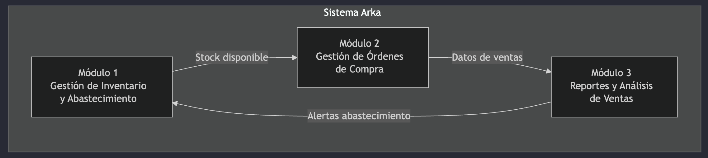

---

## Pilares de DDD

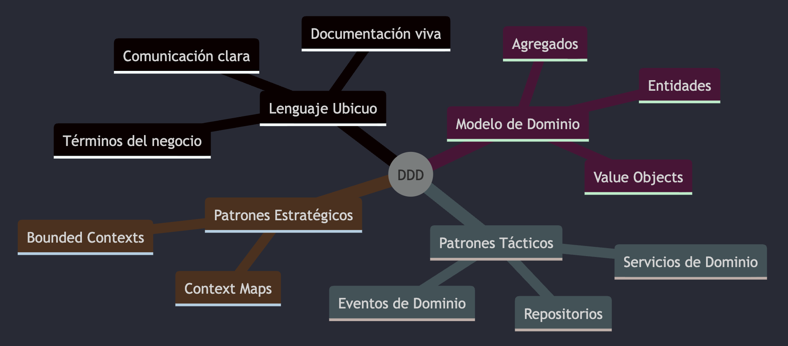

### Lenguaje Ubicuo

El Lenguaje Ubicuo (Ubiquitous Language) es un vocabulario común compartido entre desarrolladores y expertos del dominio. Es la base de DDD: si no hablamos el mismo idioma, no podemos construir el software correcto.

#### Ejemplo: Vocabulario Arka

| Término del Negocio | Significado en el Sistema                       |
| ------------------- | ----------------------------------------------- |
| Producto            | Accesorio para PC con stock, precio y atributos |
| Orden de Compra     | Pedido de un cliente con múltiples productos    |
| Stock               | Cantidad disponible de un producto              |
| Umbral de Stock     | Cantidad mínima antes de generar alerta         |
| Carrito Abandonado  | Orden en estado pendiente sin actividad         |
| Despacho            | Proceso de envío de una orden confirmada        |

#### Del Negocio al Código

**Experto del dominio dice:**
"Cuando un cliente confirma una orden, debemos validar que haya stock suficiente de cada producto. Si hay stock, reservamos los productos y notificamos al cliente."

**En código esto se traduce a:**

```java
public class OrdenDeCompra {
    public void confirmar(ServicioDeStock servicioStock) {
        validarStockDisponible(servicioStock);
        reservarProductos(servicioStock);
        cambiarEstadoAConfirmada();
        // Se dispara evento: OrdenConfirmadaEvent
    }
}
```

#### Importancia del Lenguaje Ubicuo

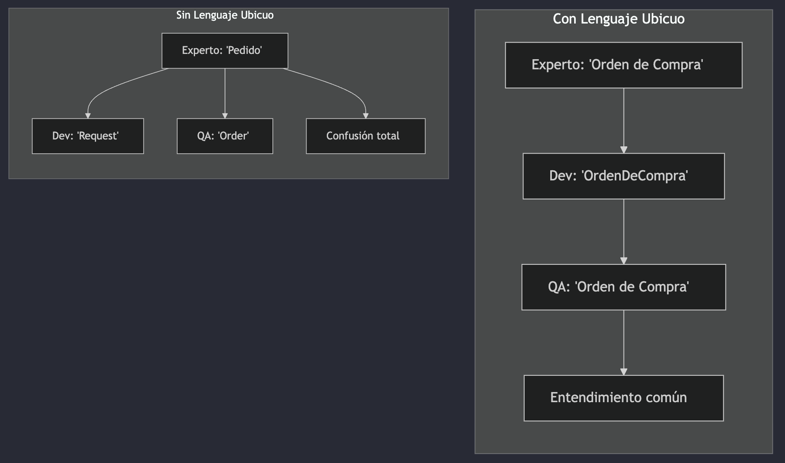

---

### Patrones Estratégicos

#### Bounded Contexts

Un Bounded Context (Contexto Delimitado) es una frontera explícita donde un modelo de dominio particular tiene significado. Dentro de cada contexto, los términos tienen un significado preciso y consistente.

##### Por qué Bounded Contexts

**El problema:**
Un mismo término puede significar cosas diferentes en distintas áreas del negocio.

- "Cliente" en Ventas = persona que compra
- "Cliente" en Soporte = ticket de ayuda
- "Cliente" en Facturación = entidad contable

**La solución:**

- Cada área tiene su propio modelo con sus propias definiciones
- No forzamos un modelo único para todo el sistema

##### Bounded Contexts en Arka

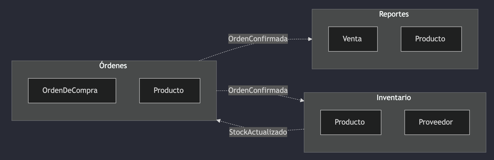

> Producto existe en los 3 contextos, pero con atributos diferentes en cada uno

###### Producto en Diferentes Contextos

| Atributo            | Inventario | Órdenes | Reportes |
| ------------------- | ---------- | ------- | -------- |
| ID                  | Sí         | Sí      | Sí       |
| Nombre              | Sí         | Sí      | Sí       |
| Stock actual        | Sí         | No      | No       |
| Umbral stock        | Sí         | No      | No       |
| Ubicación bodega    | Sí         | No      | No       |
| Precio venta        | No         | Sí      | No       |
| Cantidad en orden   | No         | Sí      | No       |
| Total vendido (mes) | No         | No      | Sí       |
| Categoría analytics | No         | No      | Sí       |

> Cada contexto tiene su propia vista del Producto, solo con los atributos necesarios

#### Context Maps

Un Context Map (Mapa de Contextos) documenta las relaciones entre los diferentes Bounded Contexts. Define cómo se comunican y qué tipo de relación tienen.

##### Patrones de Relación entre Contextos

| Patrón                | Descripción                      | Ejemplo en Arka                |
| --------------------- | -------------------------------- | ------------------------------ |
| Shared Kernel         | Comparten parte del modelo       | Entidades comunes (raro)       |
| Customer-Supplier     | Uno provee, otro consume         | Inventario → Órdenes           |
| Conformist            | Uno se adapta al modelo del otro | Reportes se adapta a Órdenes   |
| Anti-Corruption Layer | Traduce entre modelos            | Integración con sistema legacy |
| Published Language    | Lenguaje común documentado       | API pública                    |

##### Context Map de Arka

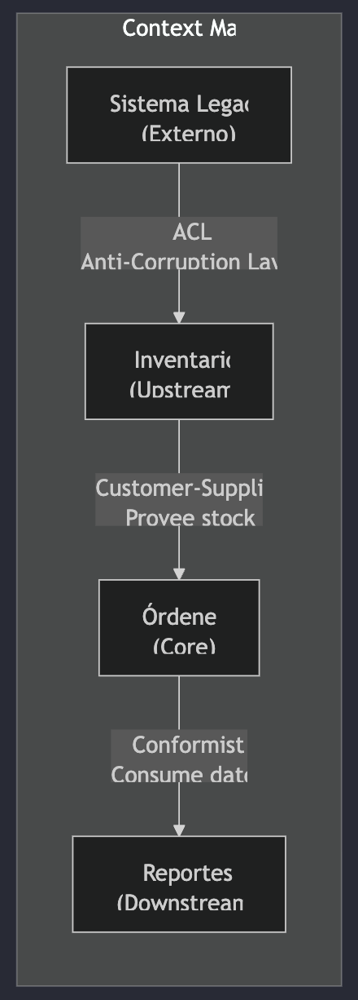

###### Anti-Corruption Layer (ACL)

Cuando integramos con sistemas externos o legacy, usamos una capa de traducción para proteger nuestro modelo.

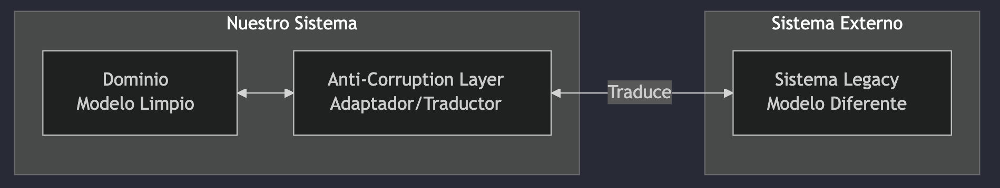

> El ACL evita que los conceptos del sistema externo "contaminen" nuestro modelo de dominio

---

### Patrones Tácticos

#### Building Blocks de DDD

Los Building Blocks son los bloques de construcción tácticos de DDD. Son los patrones que usamos para modelar el dominio.

##### Vista General Building Blocks

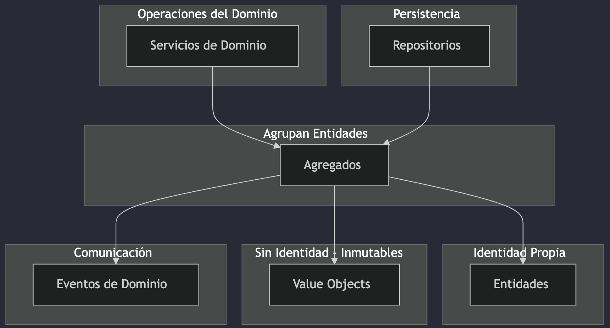

#### Servicios de Dominio

Los Servicios de Dominio son operaciones que no pertenecen naturalmente a ninguna Entidad o Value Object. Representan operaciones del dominio que involucran múltiples entidades o requieren coordinación.

##### Ejemplo: ValidacionStockService

```java
package com.arka.dominio.ordenes.servicios;

import com.arka.dominio.inventario.entidades.Producto;
import com.arka.dominio.ordenes.entidades.LineaOrden;
import com.arka.dominio.ordenes.entidades.OrdenDeCompra;

import java.util.ArrayList;
import java.util.List;
import java.util.Map;

/**
 * Servicio de Dominio: Valida que haya stock suficiente para una orden.
 *
 * ¿Por qué es un Servicio de Dominio?
 * - Involucra dos agregados: OrdenDeCompra y Producto
 * - Contiene regla de negocio: "No se puede confirmar sin stock"
 * - No pertenece naturalmente a ninguna de las entidades
 */
public class ValidacionStockService {

    public ResultadoValidacion validarDisponibilidad(
            OrdenDeCompra orden,
            Map<ProductoId, Producto> productosDisponibles) {

        List<String> errores = new ArrayList<>();

        for (LineaOrden linea : orden.getLineas()) {
            Producto producto = productosDisponibles.get(linea.getProductoId());

            if (producto == null) {
                errores.add("Producto no encontrado: " + linea.getProductoId());
                continue;
            }

            if (producto.getStockActual() < linea.getCantidad()) {
                errores.add(String.format(
                    "Stock insuficiente para '%s'. Disponible: %d, Solicitado: %d",
                    producto.getNombre(),
                    producto.getStockActual(),
                    linea.getCantidad()
                ));
            }
        }

        return new ResultadoValidacion(errores.isEmpty(), errores);
    }
}
```

##### Ejemplo: ReservaProductosService

```java
package com.arka.dominio.ordenes.servicios;

import com.arka.dominio.inventario.entidades.Producto;
import com.arka.dominio.ordenes.entidades.LineaOrden;
import com.arka.dominio.ordenes.entidades.OrdenDeCompra;

import java.util.ArrayList;
import java.util.List;
import java.util.Map;

/**
 * Servicio de Dominio: Reserva productos del inventario para una orden.
 *
 * Esta operación modifica múltiples agregados (Productos) basándose
 * en el contenido de otro agregado (OrdenDeCompra).
 */
public class ReservaProductosService {

    private final ValidacionStockService validacionStock;

    public ReservaProductosService(ValidacionStockService validacionStock) {
        this.validacionStock = validacionStock;
    }

    public List<Producto> reservar(
            OrdenDeCompra orden,
            Map<ProductoId, Producto> productos) {

        // Primero validamos
        ResultadoValidacion validacion = validacionStock.validarDisponibilidad(orden, productos);
        if (!validacion.esValido()) {
            throw new StockInsuficienteException(validacion.getMensajeError());
        }

        // Luego reservamos (reducimos stock)
        List<Producto> productosModificados = new ArrayList<>();

        for (LineaOrden linea : orden.getLineas()) {
            Producto producto = productos.get(linea.getProductoId());
            producto.reducirStock(linea.getCantidad());
            productosModificados.add(producto);
        }

        return productosModificados;
    }
}
```

##### Características de Servicios de Dominio

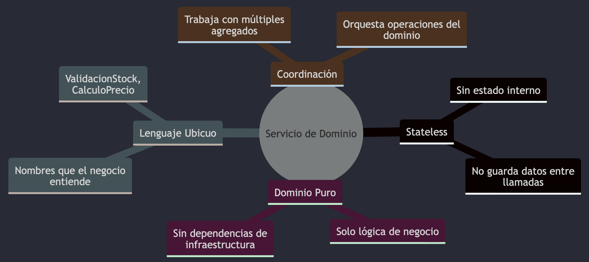

##### Cuándo usar Servicios de Dominio

**Usar cuando:**

- La operación involucra múltiples agregados
- Es una lógica de negocio que no pertenece a una entidad
- Requiere cálculos complejos
- Coordina acciones entre entidades

**NO usar cuando:**

- ❌ La lógica pertenece a una entidad
- ❌ Es infraestructura (email, BD)
- ❌ Es solo CRUD
- ❌ Es orquestación de aplicación

##### Servicio de Dominio vs Otros Servicios

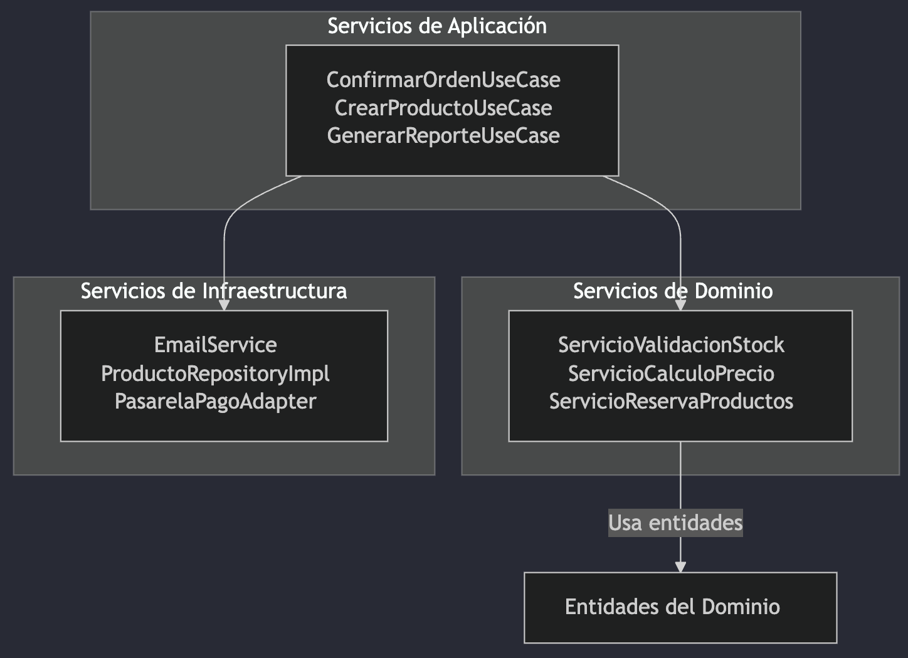

#### Eventos de Dominio

Un Evento de Dominio representa algo que ocurrió en el dominio que es relevante para el negocio. Los eventos permiten desacoplar partes del sistema y reaccionar a cambios de forma asíncrona.

##### Por qué Eventos de Dominio

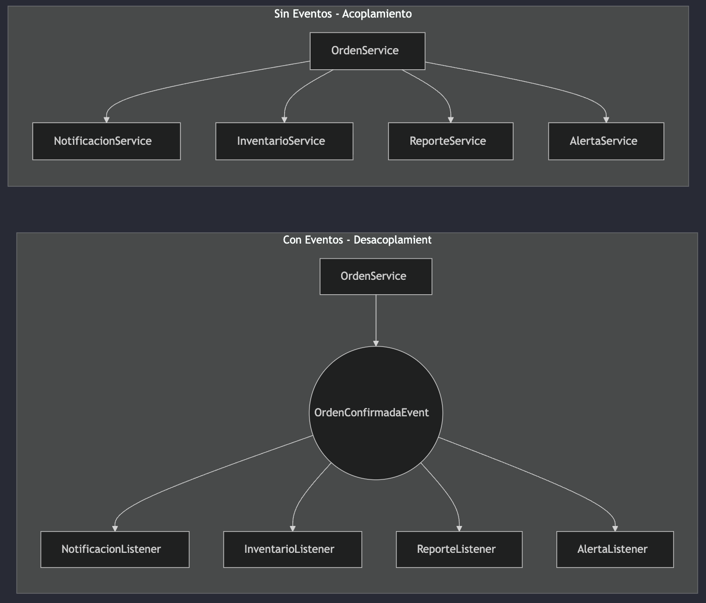

##### Beneficios de Eventos de Dominio

**Desacoplamiento:**

- Componentes independientes
- Fácil agregar nuevos listeners
- Cada módulo evoluciona solo

**Trazabilidad:**

- Historial de lo que pasó
- Auditoría natural
- Debug más fácil

**Escalabilidad:**

- Procesamiento asíncrono
- Distribución de carga

**Eventual Consistency:**

- Consistencia eventual entre módulos
- Mayor disponibilidad

##### Modelos de Consistencia

Cuando usamos eventos, debemos entender cómo se sincronizan los datos en el sistema.

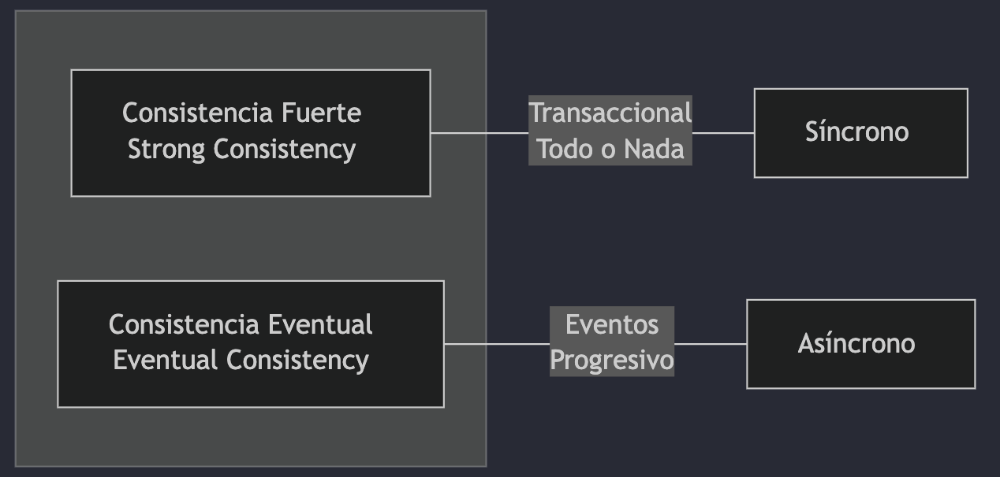

> La elección depende del caso de uso y los requisitos del negocio.

###### Consistencia Fuerte (Strong Consistency)

Todo ocurre en una sola transacción. Si algo falla, todo se revierte.

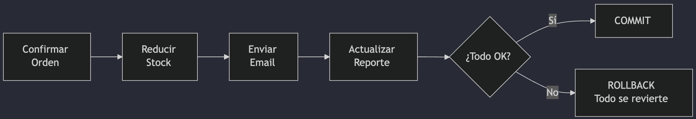

> Problema: Si el servidor de email está caído, ¡no puedo confirmar ninguna orden!

**Consistencia Fuerte - Características**

**Ventajas:**

- Datos siempre consistentes
- Fácil de razonar
- Sin estados intermedios

**Desventajas:**

- Más lento
- Menor disponibilidad
- Un fallo afecta todo

**Usar cuando:** Transferencias bancarias, pagos, operaciones que no pueden fallar parcialmente.

###### Consistencia Eventual (Eventual Consistency)

La operación principal se completa inmediatamente. Los efectos secundarios ocurren después vía eventos.

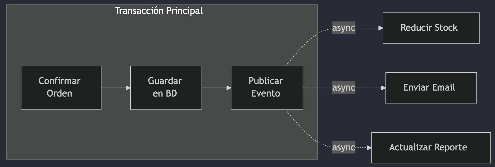

**Consistencia Eventual - Línea de Tiempo**

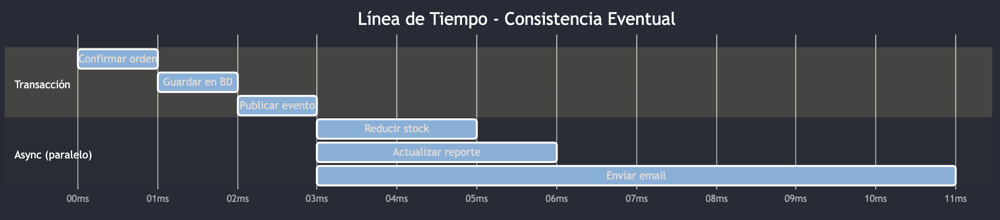

Durante ese tiempo el sistema está "eventualmente" llegando a consistencia total.

> Si el email falla, la orden ya está confirmada. El email puede reintentarse después.

**Consistencia Eventual - Características**

**Ventajas:**

- Más rápido (respuesta inmediata)
- Mayor disponibilidad
- Fallos aislados
- Escala mejor

**Desventajas:**

- Estados intermedios existen
- Más complejo de debuggear
- Requiere idempotencia

**Usar cuando:** Notificaciones, reportes, actualizaciones secundarias que pueden reintentar.

##### Comparativa: ¿Cuándo Usar Cada Una?

| Escenario                     | Fuerte | Eventual |
| ----------------------------- | ------ | -------- |
| Transferencia bancaria        | Sí     | No       |
| Pago con tarjeta              | Sí     | No       |
| Reservar stock                | Sí     | Depende  |
| Enviar email de confirmación  | No     | Sí       |
| Actualizar reportes/analytics | No     | Sí       |
| Notificar a otros sistemas    | No     | Sí       |

> **Reservar stock:** Depende del negocio. Si es crítico evitar sobreventa (ej: aerolíneas, conciertos), usa consistencia fuerte. Si puedes manejar compensaciones (ej: e-commerce con restock frecuente), puede ser eventual con verificación posterior.

##### Resumen Consistencia en DDD

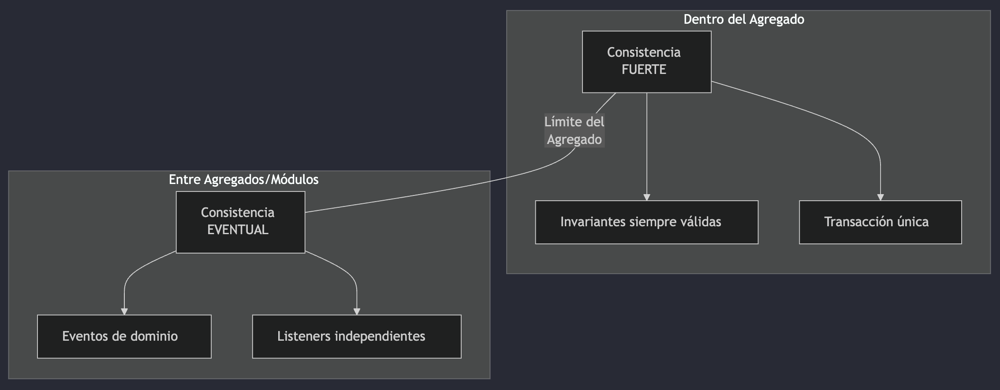

> Regla práctica: Consistencia fuerte dentro del agregado, consistencia eventual entre agregados.

##### Eventos en Arka

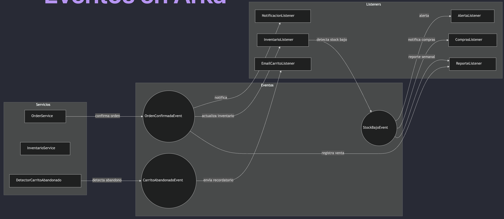

###### Evento: OrdenConfirmadaEvent

```java
package com.arka.dominio.ordenes.eventos;

import com.arka.dominio.compartido.eventos.EventoDominioBase;
import com.arka.dominio.compartido.valores.Dinero;
import com.arka.dominio.ordenes.valores.ClienteId;
import com.arka.dominio.ordenes.valores.OrdenId;

import java.util.List;

/**
 * Evento disparado cuando una orden es confirmada.
 *
 * Este evento es importante porque:
 * - El módulo de inventario debe reservar los productos
 * - El módulo de notificaciones debe informar al cliente
 * - El módulo de reportes debe registrar la venta
 */
public class OrdenConfirmadaEvent extends EventoDominioBase {

    private final OrdenId ordenId;
    private final ClienteId clienteId;
    private final List<ProductoConfirmado> productos;
    private final Dinero total;

    public OrdenConfirmadaEvent(OrdenId ordenId, ClienteId clienteId,
                                 List<ProductoConfirmado> productos, Dinero total) {
        super();
        this.ordenId = ordenId;
        this.clienteId = clienteId;
        this.productos = List.copyOf(productos);
        this.total = total;
    }

    public OrdenId getOrdenId() { return ordenId; }
    public ClienteId getClienteId() { return clienteId; }
    public List<ProductoConfirmado> getProductos() { return productos; }
    public Dinero getTotal() { return total; }
}
```

###### Clase auxiliar ProductoConfirmado

```java
package com.arka.dominio.ordenes.eventos;

import com.arka.dominio.inventario.valores.ProductoId;
import java.math.BigDecimal;

/**
 * Información de un producto confirmado en una orden.
 * Usado en eventos para transportar datos relevantes.
 */
public record ProductoConfirmado(
    ProductoId productoId,
    String nombreProducto,
    int cantidad,
    BigDecimal precioUnitario
) {
    public BigDecimal subtotal() {
        return precioUnitario.multiply(BigDecimal.valueOf(cantidad));
    }
}
```

###### Evento: StockBajoEvent

```java
package com.arka.dominio.inventario.eventos;

import com.arka.dominio.compartido.eventos.EventoDominioBase;
import com.arka.dominio.inventario.valores.ProductoId;

/**
 * Evento disparado cuando el stock de un producto cae bajo el umbral.
 *
 * Este evento permite:
 * - Generar alertas de reabastecimiento
 * - Notificar al equipo de compras
 * - Incluir el producto en el reporte semanal
 */
public class StockBajoEvent extends EventoDominioBase {

    private final ProductoId productoId;
    private final String nombreProducto;
    private final int stockActual;
    private final int umbral;

    public StockBajoEvent(ProductoId productoId, String nombreProducto,
                          int stockActual, int umbral) {
        super();
        this.productoId = productoId;
        this.nombreProducto = nombreProducto;
        this.stockActual = stockActual;
        this.umbral = umbral;
    }

    public ProductoId getProductoId() { return productoId; }
    public String getNombreProducto() { return nombreProducto; }
    public int getStockActual() { return stockActual; }
    public int getUmbral() { return umbral; }

    public int unidadesFaltantes() {
        return umbral - stockActual;
    }
}
```

#### Publicación de Eventos

Para que los eventos sean útiles, necesitamos un mecanismo para publicarlos y que los listeners los reciban.

##### Patrón: Publicador de Eventos

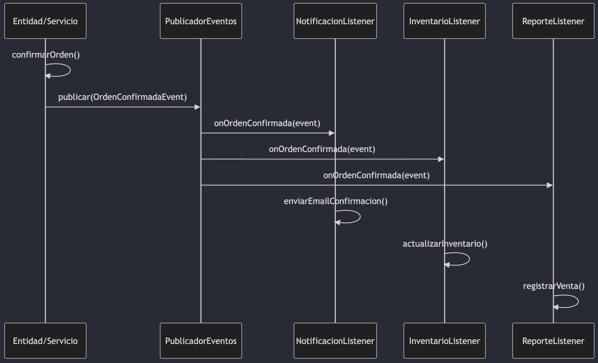

##### Entidad que Genera Eventos

```java
package com.arka.dominio.ordenes.entidades;

import com.arka.dominio.compartido.eventos.EventoDominio;
import java.util.ArrayList;
import java.util.Collections;
import java.util.List;

public class OrdenDeCompra {
    // ... campos anteriores ...

    private final List<EventoDominio> eventosGenerados = new ArrayList<>();

    public void confirmar(ValidacionStockService validacionStock,
                          CalculoPrecioService calculoPrecio,
                          Map<ProductoId, Producto> productos) {

        validarModificable();

        // Validar stock disponible
        ResultadoValidacion resultado = validacionStock.validarDisponibilidad(this, productos);
        if (!resultado.esValido()) {
            throw new StockInsuficienteException(resultado.getMensajeError());
        }

        // Cambiar estado
        this.estado = EstadoOrden.CONFIRMADA;
        this.fechaModificacion = LocalDateTime.now();

        // Generar evento
        Dinero total = calculoPrecio.calcularTotal(this);
        eventosGenerados.add(new OrdenConfirmadaEvent(
            this.id,
            this.clienteId,
            convertirAProductosConfirmados(productos),
            total
        ));
    }

    public List<EventoDominio> obtenerEventos() {
        return Collections.unmodifiableList(eventosGenerados);
    }

    public void limpiarEventos() {
        eventosGenerados.clear();
    }
}
```

##### Implementación Simple del Publicador

```java
package com.arka.infraestructura.eventos;

import com.arka.dominio.compartido.eventos.EventoDominio;
import com.arka.dominio.compartido.eventos.PublicadorEventos;

import java.util.ArrayList;
import java.util.List;
import java.util.Map;
import java.util.concurrent.ConcurrentHashMap;
import java.util.function.Consumer;

/**
 * Implementación simple en memoria del publicador de eventos.
 * Útil para desarrollo y testing.
 */
public class PublicadorEventosEnMemoria implements PublicadorEventos {

    private final Map<Class<?>, List<Consumer<EventoDominio>>> listeners =
        new ConcurrentHashMap<>();

    public <T extends EventoDominio> void registrar(
            Class<T> tipoEvento,
            Consumer<T> listener) {

        listeners.computeIfAbsent(tipoEvento, k -> new ArrayList<>())
                 .add(evento -> listener.accept((T) evento));
    }

    @Override
    public void publicar(EventoDominio evento) {
        System.out.println("Evento publicado: " + evento.getNombreEvento());

        List<Consumer<EventoDominio>> eventListeners =
            listeners.get(evento.getClass());

        if (eventListeners != null) {
            eventListeners.forEach(listener -> listener.accept(evento));
        }
    }
}
```

##### Implementación con Spring Events (Preview)

```java
package com.arka.infraestructura.eventos;

import com.arka.dominio.compartido.eventos.EventoDominio;
import com.arka.dominio.compartido.eventos.PublicadorEventos;
import org.springframework.context.ApplicationEventPublisher;
import org.springframework.stereotype.Component;

/**
 * Implementación usando Spring ApplicationEventPublisher.
 *
 * Nota: Veremos Spring Boot en detalle más adelante.
 * Por ahora, es importante entender el concepto.
 */
@Component
public class PublicadorEventosSpring implements PublicadorEventos {

    private final ApplicationEventPublisher publisher;

    public PublicadorEventosSpring(ApplicationEventPublisher publisher) {
        this.publisher = publisher;
    }

    @Override
    public void publicar(EventoDominio evento) {
        publisher.publishEvent(evento);
    }
}
```

###### Listener de Ejemplo (Preview Spring)

```java
package com.arka.infraestructura.eventos.listeners;

import com.arka.dominio.ordenes.eventos.OrdenConfirmadaEvent;
import org.springframework.context.event.EventListener;
import org.springframework.stereotype.Component;

/**
 * Listener que reacciona a órdenes confirmadas.
 * Envía notificación al cliente.
 */
@Component
public class NotificacionOrdenListener {

    private final ServicioEmail servicioEmail;

    public NotificacionOrdenListener(ServicioEmail servicioEmail) {
        this.servicioEmail = servicioEmail;
    }

    @EventListener
    public void onOrdenConfirmada(OrdenConfirmadaEvent evento) {
        System.out.println("📧 Enviando confirmación para orden: " + evento.getOrdenId());

        servicioEmail.enviar(
            evento.getClienteId(),
            "Tu orden ha sido confirmada",
            construirMensaje(evento)
        );
    }

    private String construirMensaje(OrdenConfirmadaEvent evento) {
        return String.format(
            "Tu orden %s ha sido confirmada. Total: %s",
            evento.getOrdenId(),
            evento.getTotal()
        );
    }
}
```

---

## Modelo de Dominio

### Entidades

Una Entidad es un objeto con identidad única que persiste a lo largo del tiempo. Dos entidades son iguales si tienen el mismo identificador, aunque sus atributos cambien.

#### Características de Entidades

**Tienen:**

- Identidad única (ID)
- Ciclo de vida
- Comportamiento (métodos)
- Estado mutable

**Ejemplos en Arka:**

- Producto (identificado por productoId)
- OrdenDeCompra (identificado por ordenId)
- Cliente (identificado por clienteId)

#### Entidad: Producto en Arka

```java
package com.arka.dominio.inventario.entidades;

import java.math.BigDecimal;
import java.util.UUID;

public class Producto {
    private final ProductoId id;
    private String nombre;
    private String descripcion;
    private BigDecimal precio;
    private int stockActual;
    private int umbralStock;
    private CategoriaId categoriaId;
    private MarcaId marcaId;
    private boolean activo;

    public Producto(String nombre, String descripcion,
                    BigDecimal precio, int stockInicial, int umbralStock,
                    CategoriaId categoriaId, MarcaId marcaId) {
        this.id = new ProductoId(UUID.randomUUID());
        this.nombre = nombre;
        this.descripcion = descripcion;
        this.precio = precio;
        this.stockActual = stockInicial;
        this.umbralStock = umbralStock;
        this.categoriaId = categoriaId;
        this.marcaId = marcaId;
        this.activo = true;
    }

    // Getters
    public ProductoId getId() { return id; }
    public String getNombre() { return nombre; }
    public int getStockActual() { return stockActual; }
}
```

##### Comportamiento en la Entidad

```java
// Continuación de Producto.java

public void reducirStock(int cantidad) {
    if (cantidad <= 0) {
        throw new IllegalArgumentException("La cantidad debe ser positiva");
    }
    if (cantidad > this.stockActual) {
        throw new StockInsuficienteException(
            "Stock insuficiente para " + nombre +
            ". Disponible: " + stockActual + ", Solicitado: " + cantidad
        );
    }
    this.stockActual -= cantidad;
}

public void agregarStock(int cantidad) {
    if (cantidad <= 0) {
        throw new IllegalArgumentException("La cantidad debe ser positiva");
    }
    this.stockActual += cantidad;
}

public boolean requiereReabastecimiento() {
    return this.stockActual <= this.umbralStock;
}

public void actualizarPrecio(BigDecimal nuevoPrecio) {
    if (nuevoPrecio.compareTo(BigDecimal.ZERO) <= 0) {
        throw new IllegalArgumentException("El precio debe ser mayor a cero");
    }
    this.precio = nuevoPrecio;
}
```

#### Entidad y Agregado: OrdenDeCompra

> ¿Por qué es un Agregado? Esta entidad es también un Aggregate Root porque agrupa y controla el acceso a las entidades LineaOrden

```java
package com.arka.dominio.ordenes.entidades;

import java.time.LocalDateTime;
import java.util.ArrayList;
import java.util.List;
import java.util.UUID;

public class OrdenDeCompra {
    private final OrdenId id;
    private final ClienteId clienteId;
    private List<LineaOrden> lineas;
    private EstadoOrden estado;
    private LocalDateTime fechaCreacion;
    private LocalDateTime fechaModificacion;

    public OrdenDeCompra(ClienteId clienteId) {
        this.id = new OrdenId(UUID.randomUUID());
        this.clienteId = clienteId;
        this.lineas = new ArrayList<>();
        this.estado = EstadoOrden.PENDIENTE;
        this.fechaCreacion = LocalDateTime.now();
        this.fechaModificacion = LocalDateTime.now();
    }

    public OrdenId getId() { return id; }
    public ClienteId getClienteId() { return clienteId; }
    public EstadoOrden getEstado() { return estado; }
    public List<LineaOrden> getLineas() {
        return List.copyOf(lineas); // Retorna copia inmutable
    }
}
```

##### Reglas de Negocio en OrdenDeCompra

```java
// Continuación de OrdenDeCompra.java

public void agregarProducto(ProductoId productoId, int cantidad, BigDecimal precioUnitario) {
    validarModificable();

    // Buscar si ya existe el producto en la orden
    LineaOrden lineaExistente = buscarLinea(productoId);
    if (lineaExistente != null) {
        lineaExistente.aumentarCantidad(cantidad);
    } else {
        lineas.add(new LineaOrden(productoId, cantidad, precioUnitario));
    }
    this.fechaModificacion = LocalDateTime.now();
}

public void eliminarProducto(ProductoId productoId) {
    validarModificable();
    lineas.removeIf(linea -> linea.getProductoId().equals(productoId));
    this.fechaModificacion = LocalDateTime.now();
}

private void validarModificable() {
    if (this.estado != EstadoOrden.PENDIENTE) {
        throw new OrdenNoModificableException(
            "Solo se pueden modificar órdenes en estado PENDIENTE. " +
            "Estado actual: " + this.estado
        );
    }
}

private LineaOrden buscarLinea(ProductoId productoId) {
    return lineas.stream()
        .filter(l -> l.getProductoId().equals(productoId))
        .findFirst()
        .orElse(null);
}
```

---

### Value Objects

Un Value Object (Objeto de Valor) es un objeto inmutable que se define por sus atributos, no por una identidad. Dos Value Objects son iguales si todos sus atributos son iguales.

#### Características de Value Objects

**Tienen:**

- Son inmutables
- Sin identidad
- Comparación por atributos
- Auto-validación

**Ejemplos en Arka:**

- ProductoId, OrdenId, ClienteId
- Dinero (monto + moneda)
- Direccion (para envíos)
- Email, Telefono

#### Value Object: ProductoId

```java
package com.arka.dominio.inventario.valores;

import java.util.Objects;
import java.util.UUID;

public final class ProductoId {
    private final UUID valor;

    public ProductoId(UUID valor) {
        if (valor == null) {
            throw new IllegalArgumentException("El ID del producto no puede ser nulo");
        }
        this.valor = valor;
    }

    public static ProductoId fromString(String id) {
        return new ProductoId(UUID.fromString(id));
    }

    public UUID getValor() { return valor; }

    @Override
    public boolean equals(Object o) {
        if (this == o) return true;
        if (o == null || getClass() != o.getClass()) return false;
        ProductoId that = (ProductoId) o;
        return Objects.equals(valor, that.valor);
    }

    @Override
    public int hashCode() {
        return Objects.hash(valor);
    }

    @Override
    public String toString() {
        return valor.toString();
    }
}
```

#### Value Object: Dinero

```java
package com.arka.dominio.compartido.valores;

import java.math.BigDecimal;
import java.math.RoundingMode;
import java.util.Objects;

public final class Dinero {
    private final BigDecimal monto;
    private final String moneda;

    public Dinero(BigDecimal monto, String moneda) {
        if (monto == null || monto.compareTo(BigDecimal.ZERO) < 0) {
            throw new IllegalArgumentException("El monto no puede ser negativo");
        }
        if (moneda == null || moneda.isBlank()) {
            throw new IllegalArgumentException("La moneda es requerida");
        }
        this.monto = monto.setScale(2, RoundingMode.HALF_UP);
        this.moneda = moneda.toUpperCase();
    }

    public static Dinero pesos(BigDecimal monto) {
        return new Dinero(monto, "COP");
    }

    public static Dinero dolares(BigDecimal monto) {
        return new Dinero(monto, "USD");
    }

    public BigDecimal getMonto() { return monto; }
    public String getMoneda() { return moneda; }
}
```

#### Entidad vs Value Object

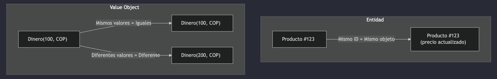

---

### Agregados

Un Agregado es un cluster de Entidades y Value Objects que se tratan como una unidad para propósitos de cambio de datos. El Aggregate Root (Raíz del Agregado) es la entidad principal que controla el acceso al agregado.

#### Características de Agregados

**Reglas:**

- Una raíz (Aggregate Root)
- Límite de consistencia
- Acceso solo por la raíz
- Transacciones atómicas

**En Arka:**

- Producto (raíz) + AtributoProducto
- OrdenDeCompra (raíz) + LineaOrden
- Cliente (raíz) + DireccionEnvio

#### Diagrama de Agregados en Arka

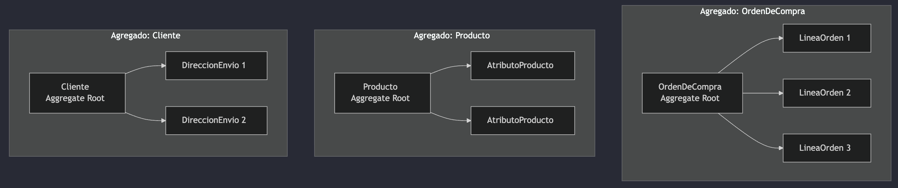

#### OrdenDeCompra como Agregado

Ya vimos la entidad OrdenDeCompra en la sección de Entidades.

**¿Qué la convierte en un Agregado?**

**Estructura del Agregado:**

- OrdenDeCompra → Aggregate Root
- LineaOrden → Entidad interna
- OrdenId, ClienteId → Value Objects

**Reglas que cumple:**

- `getLineas()` retorna copia inmutable
- LineaOrden solo se crea desde la raíz
- Validaciones centralizadas en la raíz
- Se persiste como una unidad

> Importante: Nunca expongas referencias mutables a las entidades internas. Esto rompería la encapsulación del agregado.

##### LineaOrden: Entidad interna del Agregado

```java
package com.arka.dominio.ordenes.entidades;

import java.math.BigDecimal;

public class LineaOrden {
    private final ProductoId productoId;
    private int cantidad;
    private final BigDecimal precioUnitario;

    public LineaOrden(ProductoId productoId, int cantidad, BigDecimal precioUnitario) {
        if (productoId == null) {
            throw new IllegalArgumentException("El productoId es requerido");
        }
        if (cantidad <= 0) {
            throw new IllegalArgumentException("La cantidad debe ser mayor a cero");
        }
        if (precioUnitario.compareTo(BigDecimal.ZERO) <= 0) {
            throw new IllegalArgumentException("El precio debe ser mayor a cero");
        }
        this.productoId = productoId;
        this.cantidad = cantidad;
        this.precioUnitario = precioUnitario;
    }

    public void aumentarCantidad(int cantidadAdicional) {
        if (cantidadAdicional <= 0) {
            throw new IllegalArgumentException("La cantidad adicional debe ser positiva");
        }
        this.cantidad += cantidadAdicional;
    }

    public BigDecimal calcularSubtotal() {
        return precioUnitario.multiply(BigDecimal.valueOf(cantidad));
    }

    // Getters
    public ProductoId getProductoId() { return productoId; }
    public int getCantidad() { return cantidad; }
    public BigDecimal getPrecioUnitario() { return precioUnitario; }
}
```

#### Reglas de Agregados

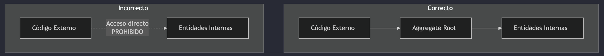

> Nunca accedas directamente a las entidades internas de un agregado. Siempre usa la raíz.
>
> Una manera de proteger completamente un Agregado "interno", es creándolo como una clase privada dentro del Aggregate Root.

---

## Integrando Todo: Use Case

Un Use Case (Caso de Uso) es un servicio de aplicación que orquesta la ejecución de una operación de negocio. Coordina entidades, servicios de dominio, eventos y servicios de infraestructura (repositorios, email, etc.) a través de puertos/interfaces.

### UseCase: Confirmar Orden

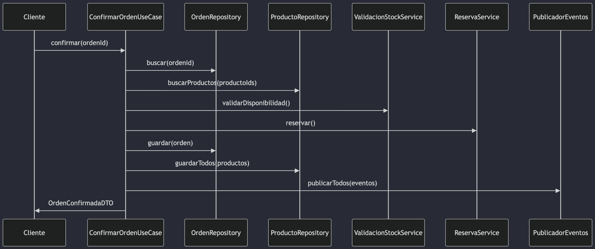

#### ConfirmarOrdenUseCase

```java
package com.arka.aplicacion.ordenes;

import com.arka.dominio.compartido.eventos.PublicadorEventos;
import com.arka.dominio.inventario.entidades.Producto;
import com.arka.dominio.inventario.puertos.ProductoRepository;
import com.arka.dominio.inventario.valores.ProductoId;
import com.arka.dominio.ordenes.entidades.OrdenDeCompra;
import com.arka.dominio.ordenes.entidades.LineaOrden;
import com.arka.dominio.ordenes.puertos.OrdenRepository;
import com.arka.dominio.ordenes.servicios.CalculoPrecioService;
import com.arka.dominio.ordenes.servicios.ReservaProductosService;
import com.arka.dominio.ordenes.servicios.ValidacionStockService;
import com.arka.dominio.ordenes.valores.OrdenId;

import java.util.List;
import java.util.Map;
import java.util.stream.Collectors;

/**
 * Caso de Uso: Confirmar una orden de compra.
 *
 * Responsabilidades:
 * 1. Obtener la orden y los productos necesarios
 * 2. Coordinar la validación y reserva de stock
 * 3. Persistir los cambios
 * 4. Publicar los eventos generados
 */
public class ConfirmarOrdenUseCase {

    private final OrdenRepository ordenRepository;
    private final ProductoRepository productoRepository;
    private final ValidacionStockService validacionStock;
    private final ReservaProductosService reservaService;
    private final CalculoPrecioService calculoPrecio;
    private final PublicadorEventos publicadorEventos;

    // Constructor con inyección de dependencias
    public ConfirmarOrdenUseCase(
            OrdenRepository ordenRepository,
            ProductoRepository productoRepository,
            ValidacionStockService validacionStock,
            ReservaProductosService reservaService,
            CalculoPrecioService calculoPrecio,
            PublicadorEventos publicadorEventos) {
        this.ordenRepository = ordenRepository;
        this.productoRepository = productoRepository;
        this.validacionStock = validacionStock;
        this.reservaService = reservaService;
        this.calculoPrecio = calculoPrecio;
        this.publicadorEventos = publicadorEventos;
    }

    public OrdenConfirmadaDTO ejecutar(OrdenId ordenId) {
        // 1. Obtener la orden
        OrdenDeCompra orden = ordenRepository.buscarPorId(ordenId)
            .orElseThrow(() -> new OrdenNoEncontradaException(ordenId));

        // 2. Obtener los productos de la orden
        List<ProductoId> productoIds = orden.getLineas().stream()
            .map(LineaOrden::getProductoId)
            .collect(Collectors.toList());

        Map<ProductoId, Producto> productos = productoRepository
            .buscarPorIds(productoIds)
            .stream()
            .collect(Collectors.toMap(Producto::getId, p -> p));

        // 3. Confirmar la orden (incluye validación)
        orden.confirmar(validacionStock, calculoPrecio, productos);

        // 4. Reservar stock (reduce inventario)
        List<Producto> productosModificados = reservaService.reservar(orden, productos);

        // 5. Persistir cambios
        ordenRepository.guardar(orden);
        productoRepository.guardarTodos(productosModificados);

        // 6. Publicar eventos
        publicadorEventos.publicarTodos(orden.obtenerEventos());
        orden.limpiarEventos();

        // 7. Verificar productos con stock bajo y publicar eventos
        verificarStockBajo(productosModificados);

        // 8. Retornar resultado
        return OrdenConfirmadaDTO.from(orden, calculoPrecio.calcularTotal(orden));
    }

    private void verificarStockBajo(List<Producto> productos) {
        for (Producto producto : productos) {
            if (producto.requiereReabastecimiento()) {
                publicadorEventos.publicar(new StockBajoEvent(
                    producto.getId(),
                    producto.getNombre(),
                    producto.getStockActual(),
                    producto.getUmbralStock()
                ));
            }
        }
    }

}

```

#### DTO de Respuesta

```java
package com.arka.aplicacion.ordenes.dto;

import com.arka.dominio.compartido.valores.Dinero;
import com.arka.dominio.ordenes.entidades.OrdenDeCompra;

import java.time.LocalDateTime;

public class OrdenConfirmadaDTO {
    private final String ordenId;
    private final String estado;
    private final String total;
    private final String moneda;
    private final LocalDateTime fechaConfirmacion;
    private final int cantidadProductos;

    private OrdenConfirmadaDTO(String ordenId, String estado, String total,
                               String moneda, LocalDateTime fechaConfirmacion,
                               int cantidadProductos) {
        this.ordenId = ordenId;
        this.estado = estado;
        this.total = total;
        this.moneda = moneda;
        this.fechaConfirmacion = fechaConfirmacion;
        this.cantidadProductos = cantidadProductos;
    }

    public static OrdenConfirmadaDTO from(OrdenDeCompra orden, Dinero total) {
        return new OrdenConfirmadaDTO(
            orden.getId().toString(),
            orden.getEstado().name(),
            total.getMonto().toString(),
            total.getMoneda(),
            LocalDateTime.now(),
            orden.getLineas().size()
        );
    }

    // Getters...
}
```

---

## Estructura de Paquetes DDD

Una buena estructura de paquetes refleja los conceptos de DDD y facilita la navegación del código.

### Estructura Recomendada para Arka

```text
com.arka/
├── dominio/                          # Capa de Dominio
│   ├── compartido/                   # Elementos compartidos
│   │   ├── eventos/
│   │   │   ├── EventoDominio.java
│   │   │   └── PublicadorEventos.java
│   │   └── valores/
│   │       ├── Dinero.java
│   │       └── Direccion.java
│   │
│   ├── inventario/                   # Bounded Context: Inventario
│   │   ├── entidades/
│   │   │   └── Producto.java
│   │   ├── valores/
│   │   │   └── ProductoId.java
│   │   ├── eventos/
│   │   │   └── StockBajoEvent.java
│   │   ├── servicios/
│   │   │   └── AlertaStockService.java
│   │   └── puertos/
│   │       └── ProductoRepository.java
│   │
│   └── ordenes/                      # Bounded Context: Órdenes
│       ├── entidades/
│       │   ├── OrdenDeCompra.java
│       │   └── LineaOrden.java
│       ├── valores/
│       │   ├── OrdenId.java
│       │   └── EstadoOrden.java
│       ├── eventos/
│       │   └── OrdenConfirmadaEvent.java
│       ├── servicios/
│       │   ├── ValidacionStockService.java
│       │   └── CalculoPrecioService.java
│       └── puertos/
│           └── OrdenRepository.java
│
├── aplicacion/                       # Capa de Aplicación
│   ├── ordenes/
│   │   ├── ConfirmarOrdenUseCase.java
│   │   ├── CrearOrdenUseCase.java
│   │   └── dto/
│   │       └── OrdenConfirmadaDTO.java
│   └── inventario/
│       ├── ActualizarStockUseCase.java
│       └── GenerarReporteStockUseCase.java
│
└── infraestructura/                  # Capa de Infraestructura
    ├── persistencia/
    │   ├── ProductoRepositoryImpl.java
    │   └── OrdenRepositoryImpl.java
    ├── eventos/
    │   ├── PublicadorEventosSpring.java
    │   └── listeners/
    │       ├── NotificacionOrdenListener.java
    │       └── AlertaStockListener.java
    └── web/
        └── OrdenesController.java
```

### Dependencias entre Capas

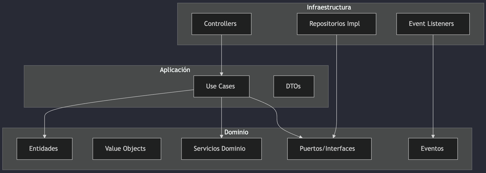

> El dominio no depende de nada externo. Todo depende del dominio.

---

## Flujo Completo del Sistema Arka

Veamos cómo fluyen los datos desde que un cliente confirma una orden hasta que se procesan todos los eventos.

### Diagrama de Flujo Completo

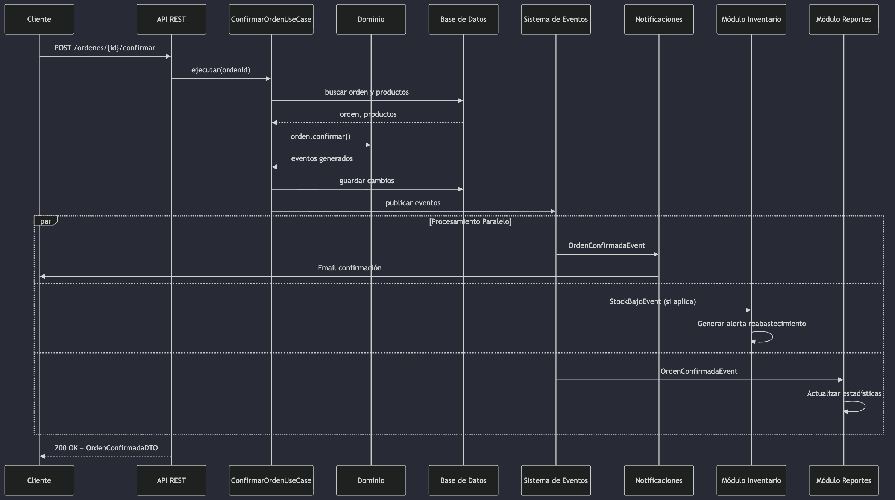

### Estados de una Orden en Arka

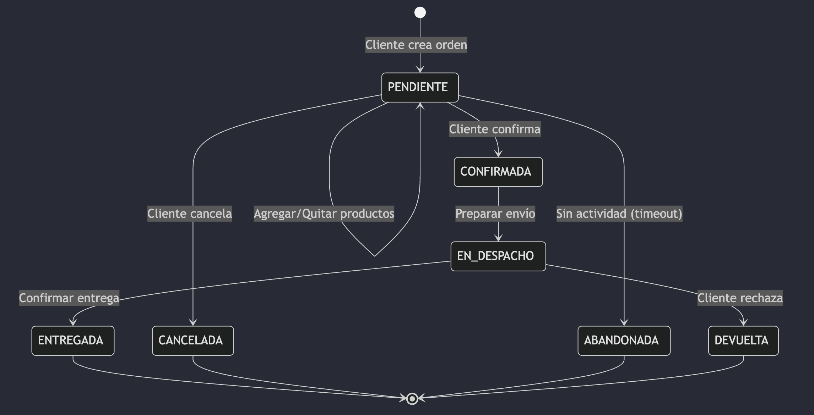

---

## Resumen y Conclusiones

### Conceptos Clave de DDD

| Concepto            | Descripción                           | Ejemplo en Arka            |
| ------------------- | ------------------------------------- | -------------------------- |
| Entidad             | Objeto con identidad única            | Producto, OrdenDeCompra    |
| Value Object        | Objeto inmutable sin identidad        | Dinero, ProductoId         |
| Agregado            | Cluster de entidades con raíz         | OrdenDeCompra + LineaOrden |
| Servicio de Dominio | Lógica que no pertenece a una entidad | ValidacionStockService     |
| Evento de Dominio   | Algo que ocurrió en el dominio        | OrdenConfirmadaEvent       |

### Bounded Contexts y Context Maps

**Bounded Context:**

- Frontera donde el modelo tiene significado
- Cada contexto = un microservicio (potencial)
- Lenguaje ubicuo local
- Autonomía de equipo

**Context Map:**

- Documenta relaciones entre contextos
- Define patrones de integración
- Identifica dependencias
- Guía decisiones arquitectónicas

### Por qué usar DDD

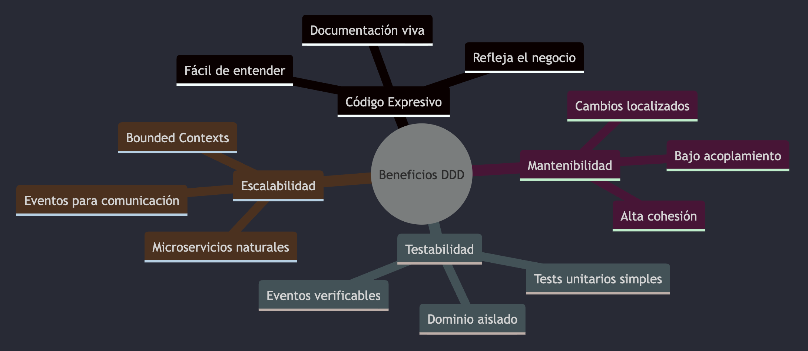

### Recursos Adicionales

**Libros recomendados:**

- "Domain-Driven Design" - Eric Evans
- "Implementing Domain-Driven Design" - Vaughn Vernon
- "Domain-Driven Design Distilled" - Vaughn Vernon

**Recursos en línea:**

- [DDD Community](https://www.domainlanguage.com/)
- [Martin Fowler - DDD](https://martinfowler.com/tags/domain%20driven%20design.html)

---

## Extra

### AWS Lambda y Colas Muertas

Las lambdas tienen una cuota estándar de 1000 instancias de Lambdas concurrentes por cuenta. Si se excede este límite, las peticiones fallan y los nuevos eventos se van a Throttling (se pierde el evento); por lo que se recomienda configurar una Cola Muerta (Dead Letter Queue) en estas para que sirva como Fail Over.

### Idempotencia

Una operación es idempotente si ejecutarla múltiples veces produce el mismo resultado que ejecutarla una vez.

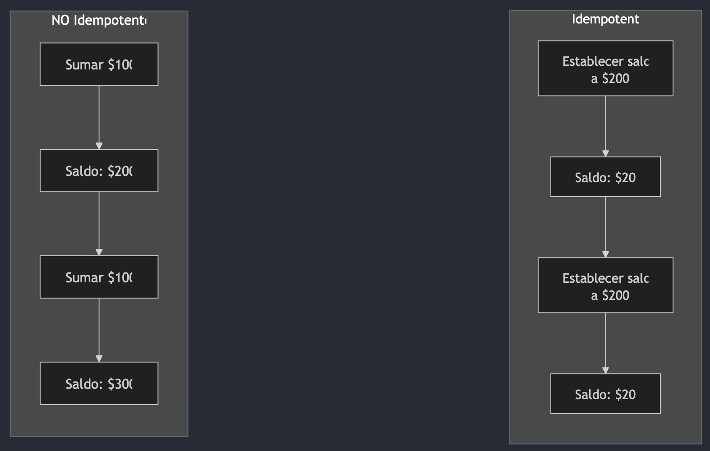

#### Idempotencia en Eventos

**¿Por qué es importante?**

- Los eventos pueden llegar duplicados
- Los listeners pueden reintentar
- La red puede fallar y reenviar

**Técnicas comunes:**

- Guardar ID del evento procesado
- Verificar si ya se ejecutó la acción

> Ejemplo: Antes de enviar email, verificar: "¿Ya envié email para este evento ID?"

### Las 4 Señales Doradas de SRE

**SRE (Site Reliability Engineering)** es una disciplina que aplica principios de ingeniería de software a la operación de infraestructura y sistemas. Fue desarrollada por Google para garantizar la confiabilidad, disponibilidad y rendimiento de servicios a gran escala.

Las **4 Señales Doradas** son métricas fundamentales para monitorear la salud de un sistema desde la perspectiva del usuario. Estas métricas permiten detectar la mayoría de problemas que impactan la experiencia del usuario antes de que escalen.

#### 1. Latencia (Latency)

**Qué mide:** Tiempo que toma procesar una solicitud.

**Por qué importa:** Los usuarios experimentan la latencia directamente. Una búsqueda que retorna resultados en 50ms se siente instantánea. La misma búsqueda tomando 5 segundos se siente rota, incluso si eventualmente tiene éxito.

**Qué monitorear:**

- Latencia de solicitudes exitosas vs fallidas (separadas)
- Percentiles: p50, p95, p99, p99.9 (no solo promedios)
- Latencia por fases: cliente → balanceador, balanceador → backend, backend → base de datos

**Umbrales prácticos:**

- APIs REST: p95 < 500ms
- Consultas de base de datos: p95 < 100ms
- Operaciones en tiempo real: p95 < 50ms

**Ejemplo de alerta:**

```text
if (p95_latency > 500ms for 3 consecutive minutes) {
  alert: "API latency degraded"
  severity: high
  action: "Check database query performance and external dependencies"
}
```

#### 2. Tráfico (Traffic)

**Qué mide:** Demanda sobre el sistema.

**Por qué importa:** El tráfico revela patrones de uso, necesidades de capacidad y firmas de ataque. Picos súbitos pueden indicar crecimiento viral, campañas de marketing o ataques DDoS. Caídas inesperadas sugieren fallos upstream que impiden que las solicitudes lleguen al servicio.

**Qué monitorear:**

- Solicitudes por segundo (RPS)
- Por tipo de operación (lectura vs escritura)
- Por endpoint/ruta
- Por región geográfica

**Ejemplo de alerta:**

```text
if (current_traffic < 0.5 * baseline for 5 minutes) {
  alert: "Traffic drop detected"
  severity: high
  action: "Check upstream load balancers and DNS resolution"
}
```

#### 3. Errores (Errors)

**Qué mide:** Tasa de solicitudes fallidas.

**Por qué importa:** Los errores impactan directamente la experiencia del usuario. Un usuario viendo mensajes de error no puede completar su trabajo. Tasas altas de error indican bugs, fallos de infraestructura o problemas de capacidad.

**Qué monitorear:**

- Errores de servidor (HTTP 5xx)
- Errores de cliente (HTTP 4xx) - para análisis, no alertas
- Excepciones no capturadas
- Timeouts
- Por tipo de error y endpoint

**Umbrales prácticos:**

- Error rate < 0.1%: Excelente
- Error rate 0.1-1%: Aceptable, investigar
- Error rate > 1%: Crítico, acción inmediata

**Ejemplo de alerta:**

```text
if (server_error_rate > 1% for 3 consecutive checks) {
  alert: "Elevated server error rate"
  severity: critical
  action: "Check application logs, database connectivity, external dependencies"
}
```

#### 4. Saturación (Saturation)

**Qué mide:** Qué tan lleno está el sistema (proximidad a capacidad máxima).

**Por qué importa:** La saturación predice fallos futuros. Un pool de conexiones de base de datos al 95% de uso llegará al 100% pronto, causando que nuevas solicitudes fallen. Un servicio consumiendo 90% de CPU disponible se ralentizará antes de colapsar.

**Qué monitorear:**

- CPU utilization
- Memoria utilizada
- Espacio en disco
- Ancho de banda de red
- Pool de conexiones de base de datos
- Tamaño de colas

**Umbrales prácticos:**

- CPU: < 80%
- Memoria: < 85%
- Disco: < 80%
- Pool de conexiones DB: < 70%

**Ejemplo de alerta:**

```text
if (database_connection_pool_usage > 70% for 10 minutes) {
  alert: "Database connection pool saturation"
  severity: high
  action: "Scale connection pool size or reduce query load"
}
```

#### Cómo Trabajan Juntas las 4 Señales

Monitorear las cuatro señales revela el panorama completo de la salud del sistema:

**Escenario 1: Alta latencia + pocos errores + alta saturación**

- Sistema sobrecargado pero aún procesando solicitudes
- Usuarios experimentan respuestas lentas, pero las solicitudes eventualmente tienen éxito
- **Solución:** Agregar recursos u optimizar rendimiento

**Escenario 2: Baja latencia + muchos errores + baja saturación**

- Las solicitudes fallan rápidamente sin estrés de recursos
- Sugiere bugs de aplicación, problemas de configuración o fallos de dependencias externas
- **Solución:** Revisar logs de aplicación y estado de servicios externos

**Escenario 3: Pico de tráfico + alta saturación + latencia estable + errores estables**

- Sistema maneja carga aumentada exitosamente
- Recursos utilizados pero dentro de límites
- **Acción:** Monitorear crecimiento continuo y planear aumentos de capacidad

**Escenario 4: Caída de tráfico + pocos errores + baja latencia + baja saturación**

- Todo se ve saludable desde la perspectiva del servicio, pero el tráfico desapareció
- Indica problemas upstream
- **Solución:** Revisar balanceadores de carga, DNS, CDN o servicios upstream

#### Principios Clave de SRE

1. **Monitorear desde la perspectiva del usuario:** Priorizar métricas que reflejan la experiencia del usuario (latencia, errores) sobre métricas internas (CPU, memoria)

2. **Alertar sobre impacto al usuario:** Diseñar alertas basadas en problemas que afectan usuarios, no solo umbrales de infraestructura

3. **Usar condiciones multi-señal:** Combinar múltiples señales para confirmar problemas reales y reducir falsos positivos

4. **Establecer baselines:** Definir rangos normales basados en datos históricos y alertar sobre desviaciones del comportamiento normal

**Referencias:**

- [Google SRE Book - The Four Golden Signals](https://sre.google/sre-book/monitoring-distributed-systems/)
- [The Site Reliability Workbook](https://sre.google/workbook/table-of-contents/) - Beyer, Murphy, Rensin, Kawahara, Thorne, O'Reilly Media, 2018

---

**Fin del documento**
