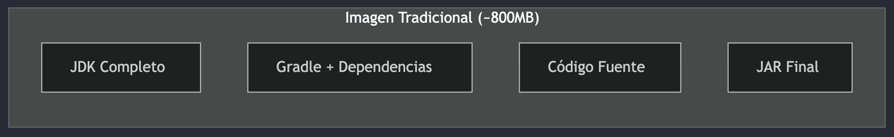

# Clase 13 - Docker & Docker Compose

**Recursos:**

- [Diapositivas](https://manulasker.github.io/enyoi_java_slides/clase_22_23_docker/#/title-slide)
- [Repositorio de práctica](https://github.com/Saisho137/docker-practice-java-scaffold-enyoi)

---

## Índice

1. [Resumen](#resumen)
2. [Introducción a Docker](#introducción-a-docker)
3. [Conceptos Fundamentales](#conceptos-fundamentales)
4. [Dockerfile](#dockerfile)
5. [Optimización de Imágenes](#optimización-de-imágenes)
6. [Volúmenes](#volúmenes)

---

## Introducción a Docker

Docker es una plataforma de contenedorización que permite empaquetar aplicaciones con todas sus dependencias en unidades estandarizadas llamadas **contenedores**.

### Por qué Docker

**Problemas que resuelve:**

| Sin Docker                              | Con Docker                  |
| --------------------------------------- | --------------------------- |
| "En mi máquina funciona"                | Ambientes reproducibles     |
| Instalación manual de dependencias      | Aislamiento de aplicaciones |
| Configuraciones diferentes por ambiente | Portabilidad total          |
| Conflictos de versiones                 | Consistencia dev → prod     |
| Despliegues inconsistentes              | Infraestructura como código |

### Arquitectura Docker


**Componentes principales:**

- **Docker Client**: Interfaz de línea de comandos (CLI)
- **Docker Daemon**: Servicio que gestiona contenedores e imágenes
- **Docker Registry**: Repositorio de imágenes (Docker Hub, registries privados)
- **Contenedores**: Instancias ejecutables aisladas
- **Imágenes**: Plantillas inmutables para crear contenedores

---

## Conceptos Fundamentales

### Imagen vs Contenedor

| Concepto       | Descripción                                                          | Analogía            |
| -------------- | -------------------------------------------------------------------- | ------------------- |
| **Imagen**     | Plantilla de solo lectura con el sistema de archivos y configuración | Clase en Java       |
| **Contenedor** | Instancia ejecutable de una imagen                                   | Objeto/Instancia    |
| **Dockerfile** | Archivo con instrucciones para construir una imagen                  | Código fuente       |
| **Registry**   | Repositorio de imágenes                                              | Maven Central / npm |

### Primer Contenedor

```bash
# Descargar y ejecutar imagen de Java
docker run -it eclipse-temurin:21-jdk java --version

# Ejecutar contenedor en segundo plano (daemon)
docker run -d --name mi-postgres postgres:16

# Ver contenedores en ejecución
docker ps

# Ver todos los contenedores (incluidos detenidos)
docker ps -a

# Detener y eliminar contenedor
docker stop mi-postgres
docker rm mi-postgres
```

> **Flags importantes:**
>
> - `-it` = interactivo + TTY (terminal)
> - `-d` = daemon (segundo plano)
> - `--name` = asignar nombre al contenedor
> - `-p` = mapear puertos (host:contenedor)

### Comandos Esenciales


**Gestión de imágenes:**

```bash
docker images                    # Listar imágenes locales
docker pull <imagen>             # Descargar imagen
docker rmi <imagen>              # Eliminar imagen
docker build -t <tag> .          # Construir imagen
docker history <imagen>          # Ver capas de la imagen
```

**Gestión de contenedores:**

```bash
docker ps                        # Contenedores activos
docker ps -a                     # Todos los contenedores
docker start <contenedor>        # Iniciar contenedor
docker stop <contenedor>         # Detener contenedor
docker rm <contenedor>           # Eliminar contenedor
docker logs -f <contenedor>      # Ver logs en tiempo real
docker exec -it <contenedor> /bin/bash  # Acceder al contenedor
```

---

## Dockerfile

Un Dockerfile es un archivo de texto con instrucciones para construir una imagen Docker de forma automatizada y reproducible.

### Instrucciones Básicas

| Instrucción  | Descripción                          | Ejemplo                           |
| ------------ | ------------------------------------ | --------------------------------- |
| `FROM`       | Imagen base                          | `FROM eclipse-temurin:21-jdk`     |
| `WORKDIR`    | Directorio de trabajo                | `WORKDIR /app`                    |
| `COPY`       | Copiar archivos locales              | `COPY build/libs/*.jar app.jar`   |
| `RUN`        | Ejecutar comando al construir        | `RUN apt-get update`              |
| `ENV`        | Variable de entorno                  | `ENV JAVA_OPTS="-Xmx512m"`        |
| `EXPOSE`     | Puerto que expone el contenedor      | `EXPOSE 8080`                     |
| `CMD`        | Comando al iniciar contenedor        | `CMD ["java", "-jar", "app.jar"]` |
| `ENTRYPOINT` | Punto de entrada (no se sobrescribe) | `ENTRYPOINT ["java", "-jar"]`     |

### Dockerfile Simple para Java

```dockerfile
# Imagen base con JDK 21
FROM eclipse-temurin:21-jdk

# Directorio de trabajo dentro del contenedor
WORKDIR /app

# Copiar el JAR compilado
COPY build/libs/mi-aplicacion.jar app.jar

# Puerto que expone la aplicación
EXPOSE 8080

# Variables de entorno
ENV JAVA_OPTS="-Xmx512m -Xms256m"

# Comando para ejecutar la aplicación
CMD ["sh", "-c", "java $JAVA_OPTS -jar app.jar"]
```

---

## Optimización de Imágenes

### Problema: Imágenes Pesadas



**Problema:** Incluimos herramientas de compilación (JDK, Gradle, Maven) que NO necesitamos en producción.

**Solución:** Multi-stage builds

### Multi-Stage Build para Java

```dockerfile
# ============================================
# Stage 1: Build (Construcción)
# ============================================
FROM amazoncorretto:21-alpine AS builder
VOLUME /tmp
WORKDIR /home/work

# Copiar solo archivos de configuración de Gradle
COPY build.gradle settings.gradle main.gradle gradle.properties lombok.config gradlew ./
COPY gradle ./gradle
COPY applications ./applications
COPY domain ./domain
COPY infrastructure ./infrastructure

# Construir la aplicación
RUN ./gradlew bootJar --info


# ============================================
# Stage 2: Runtime (Ejecución)
# ============================================
FROM eclipse-temurin:21-jre-alpine
VOLUME /tmp
WORKDIR /app

# Copiar SOLO el JAR desde el stage anterior
COPY --from=builder /home/work/applications/app-service/build/libs/*.jar docker-example.jar

# Configuración de JVM optimizada para contenedores
ENV JAVA_OPTS="-XX:+UseContainerSupport -XX:MaxRAMPercentage=70 -Djava.security.egd=file:/dev/./urandom"

EXPOSE 8080

# Crear usuario no-root por seguridad
RUN adduser -D -u 1001 appuser
USER appuser

# Punto de entrada
ENTRYPOINT [ "/bin/sh", "-c", "/opt/java/openjdk/bin/java $JAVA_OPTS -jar ./docker-example.jar" ]
```

**Ventajas del multi-stage build:**

- ✅ Imagen final solo contiene JRE (no JDK completo)
- ✅ No incluye herramientas de build (Gradle, Maven)
- ✅ Reducción de ~60% en tamaño
- ✅ Menor superficie de ataque (seguridad)
- ✅ Despliegues más rápidos

### Comparación de Tamaños


| Tipo de Imagen             | Tamaño Aproximado |
| -------------------------- | ----------------- |
| JDK completo + build tools | ~500-700 MB       |
| Multi-stage + JRE          | ~200-300 MB       |
| **Reducción**              | **~60%**          |

### Optimización de Capas

Docker utiliza un sistema de capas (layers) con caché. Cada instrucción en el Dockerfile crea una capa.

**❌ MAL:** Invalida cache en cada cambio de código

```dockerfile
COPY . .
RUN ./gradlew bootJar
```

**✅ BIEN:** Aprovecha cache de dependencias

```dockerfile
# 1. Copiar solo archivos de configuración (cambian poco)
COPY build.gradle settings.gradle gradlew ./
COPY gradle ./gradle

# 2. Descargar dependencias (se cachea si no cambian)
RUN ./gradlew dependencies --no-daemon

# 3. Copiar código fuente (cambia frecuentemente)
COPY src ./src

# 4. Compilar aplicación
RUN ./gradlew bootJar --no-daemon
```


**Principio:** Las capas que no cambian se reutilizan del cache, acelerando builds subsecuentes.

### Construir y Ejecutar

```bash
# Construir imagen con tag
docker build -t mi-app:1.0 .

# Ver capas de la imagen
docker history mi-app:1.0

# Ejecutar contenedor
docker run -d -p 8080:8080 --name mi-app-container mi-app:1.0

# Ver logs en tiempo real
docker logs -f mi-app-container

# Ejecutar comando dentro del contenedor
docker exec -it mi-app-container /bin/bash

# Inspeccionar contenedor
docker inspect mi-app-container
```

---

## Volúmenes

Los volúmenes permiten **persistir datos** y **compartir archivos** entre el host y los contenedores. Sin volúmenes, los datos se pierden cuando el contenedor se elimina.

---

**Nota:** Se continuarán las notas con Docker Compose en la próxima clase.
