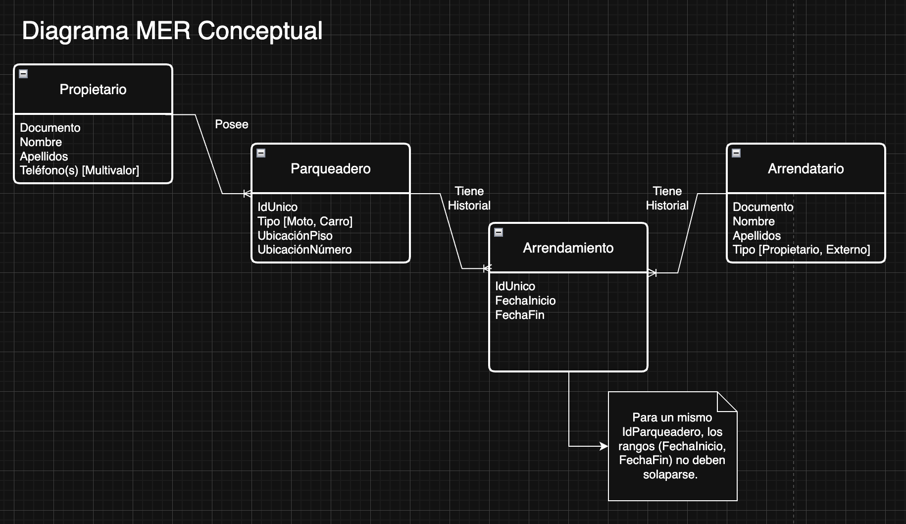
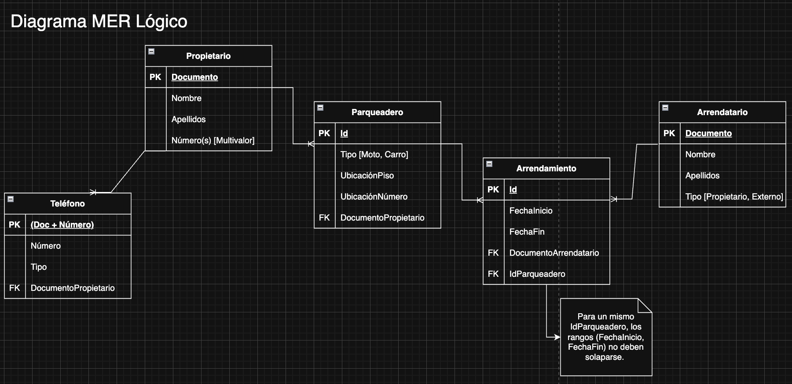

# Clase 4 - Bases de datos relacionales

**Ejercicio de clase:** En 15 minutos hacer 2 endpoints de tienda Arca, GET de productos y POST de producto; con Mocks.

## Índice

1. [Bases de datos relacionales](#bases-de-datos-relacionales)
   - [Modelo basado en tablas](#modelo-basado-en-tablas)
   - [Claves y relaciones](#claves-y-relaciones)
   - [Integridad referencial](#integridad-referencial)
   - [Lenguaje SQL](#lenguaje-sql)
   - [Propiedades ACID](#propiedades-acid)
2. [Modelo Entidad-Relación (MER)](#modelo-entidad-relación-mer)
   - [Representación conceptual](#representación-conceptual)
   - [Tipos de Modelos MER](#tipos-de-modelos-mer)
   - [Elementos clave](#elementos-clave)
   - [Tipos de relaciones](#tipos-de-relaciones)
   - [Producto Cartesiano y Tablas Asociativas](#producto-cartesiano-y-tablas-asociativas)
   - [Cardinalidad](#cardinalidad)
   - [Independencia de implementación](#independencia-de-implementación)
   - [Base para normalización](#base-para-normalización)
3. [Normalización](#normalización)
   - [Primera Forma Normal (1FN)](#primera-forma-normal-1fn)
   - [Segunda Forma Normal (2FN)](#segunda-forma-normal-2fn)
   - [Tercera Forma Normal (3FN)](#tercera-forma-normal-3fn)
   - [Forma Normal de Boyce-Codd (FNBC)](#forma-normal-de-boyce-codd-fnbc)
   - [Resumen de Formas Normales](#resumen-de-formas-normales)
4. [Ejercicio Práctico: Sistema de Arrendamiento de Inmuebles](#ejercicio-práctico-sistema-de-arrendamiento-de-inmuebles)
5. [Resumen final](#resumen-final)

---

## Bases de datos relacionales

Las **bases de datos relacionales** son sistemas de gestión de datos que organizan la información en tablas interconectadas, representando la estructura y lógica de negocio mediante relaciones matemáticas entre entidades.

**Características principales:**

- Estructuran datos en **tablas** (relaciones) con filas y columnas
- Utilizan **relaciones** para conectar información entre tablas
- Garantizan **integridad** mediante restricciones y claves
- Implementan **transacciones ACID** (Todo o Nada)
- Emplean **SQL** como lenguaje estándar de consulta

> **Principio fundamental:** Las bases de datos relacionales están diseñadas para garantizar transacciones bajo el principio de **"Todo o Nada"** - una operación se completa totalmente o no se realiza en absoluto.

### Modelo basado en tablas

Las bases de datos relacionales organizan la información en **tablas** (también llamadas relaciones), donde:

- **Filas (tuplas/registros)**: Representan instancias individuales de una entidad
- **Columnas (atributos/campos)**: Definen las propiedades de la entidad
- **Celdas**: Contienen valores específicos de un atributo para un registro

**Ejemplo:**

Tabla `Estudiantes`:

| id_estudiante | nombre | apellido | fecha_nacimiento | email |
|---------------|--------|----------|------------------|-------|
| 1 | Juan | Pérez | 2000-05-15 | <juan@email.com> |
| 2 | María | García | 1999-08-22 | <maria@email.com> |
| 3 | Carlos | López | 2001-01-10 | <carlos@email.com> |

### Claves y relaciones

Las claves son fundamentales para establecer relaciones e identificar registros únicamente:

#### Clave Primaria (Primary Key - PK)

Identifica de forma **única e inequívoca** cada registro en una tabla.

**Características:**

- Valores únicos (no se repiten)
- No puede ser NULL
- Solo una clave primaria por tabla
- Puede ser simple (una columna) o compuesta (varias columnas)
- **Se indexa automáticamente** para optimizar búsquedas

**Ejemplo:** `id_estudiante INT PRIMARY KEY` (simple) o `PRIMARY KEY (id_estudiante, id_curso)` (compuesta)

#### Clave Foránea (Foreign Key - FK)

Establece una **relación** entre dos tablas, referenciando la clave primaria de otra tabla.

**Características:**

- Apunta a una clave primaria de otra tabla (o de la misma)
- Puede tener valores NULL (si se permite)
- Puede haber múltiples claves foráneas en una tabla
- Garantiza la integridad referencial

**Ejemplo:** `FOREIGN KEY (id_estudiante) REFERENCES Estudiantes(id_estudiante)`

#### Clave Candidata

Cualquier columna o conjunto de columnas que **podría** ser clave primaria (cumple requisitos de unicidad y no nulidad).

**Ejemplo:**

En la tabla `Estudiantes`:

- `id_estudiante` (elegida como PK)
- `email` (también única, es clave candidata)
- `numero_documento` (única, es clave candidata)

#### Clave Única (Unique Key)

Similar a la clave primaria pero con diferencias importantes:

**Diferencias con Primary Key:**

- **Permite un valor NULL** (solo uno en la mayoría de DBMS)
- Puede haber **múltiples claves únicas** por tabla
- **Se indexa automáticamente** (como PK) para garantizar unicidad eficientemente
- No identifica el registro principal de la tabla

**Ejemplo:** `email VARCHAR(100) UNIQUE`

### Integridad referencial

La **integridad referencial** es una regla de consistencia que garantiza que las relaciones entre tablas permanezcan válidas y coherentes.

**Definición:**
> Asegura que toda clave foránea en una tabla hija debe corresponder a una clave primaria existente en la tabla padre, o ser NULL (si se permite).

**Reglas:**

1. **No se pueden insertar** registros hijos que referencien padres inexistentes
2. **No se pueden eliminar** registros padres si tienen hijos dependientes (sin configuración CASCADE)
3. **No se pueden modificar** claves primarias si tienen referencias activas

**Acciones ante violaciones:**

- `ON DELETE CASCADE`: Elimina registros hijos automáticamente
- `ON DELETE SET NULL`: Pone NULL en FK
- `ON DELETE NO ACTION`: Impide eliminación (default)
- `ON UPDATE CASCADE`: Actualiza FK si cambia PK

**En migraciones:** Migrar tablas padre antes que hijas, o usar `SET FOREIGN_KEY_CHECKS = 0` temporalmente.

### Lenguaje SQL

**SQL (Structured Query Language)** es el lenguaje estándar para interactuar con bases de datos relacionales. Se divide en sublanguajes según su función:

#### DDL (Data Definition Language)

Define y modifica la **estructura** de la base de datos (esquema).

**Comandos principales:**

- `CREATE`: Crear objetos (tablas, vistas, índices)
- `ALTER`: Modificar estructura existente
- `DROP`: Eliminar objetos
- `TRUNCATE`: Eliminar todos los datos de una tabla (sin logging)

**Ejemplo:** `CREATE TABLE`, `ALTER TABLE ADD COLUMN`, `DROP TABLE`, `TRUNCATE TABLE`

#### DML (Data Manipulation Language)

Manipula los **datos** dentro de las tablas.

**Comandos principales:**

- `SELECT`: Consultar datos
- `INSERT`: Insertar nuevos registros
- `UPDATE`: Actualizar registros existentes
- `DELETE`: Eliminar registros

**Ejemplo:** `INSERT INTO`, `SELECT * FROM WHERE`, `UPDATE SET`, `DELETE FROM WHERE`

**Constraint CHECK:** Valida condiciones antes de insertar/actualizar (ej: `CHECK (edad >= 18)`)

#### DCL (Data Control Language)

Controla **permisos y accesos** a la base de datos.

**Comandos principales:**

- `GRANT`: Otorgar permisos
- `REVOKE`: Revocar permisos

**Ejemplo:** `GRANT SELECT ON tabla TO usuario`, `REVOKE INSERT FROM usuario`

#### TCL (Transaction Control Language)

Controla las **transacciones** para garantizar ACID.

**Comandos principales:**

- `BEGIN/START TRANSACTION`: Iniciar transacción
- `COMMIT`: Confirmar cambios permanentemente
- `ROLLBACK`: Deshacer cambios
- `SAVEPOINT`: Crear punto de guardado dentro de una transacción

**Ejemplo:** `BEGIN`, `COMMIT` (confirmar), `ROLLBACK` (deshacer), `SAVEPOINT` (punto de retorno)

### Propiedades ACID

Las propiedades **ACID** garantizan que las transacciones en bases de datos relacionales sean confiables y mantengan la integridad de los datos, incluso ante fallos.

#### A - Atomicidad (Atomicity)

**Definición:** Una transacción es una unidad indivisible - **se ejecuta completamente o no se ejecuta en absoluto** (Todo o Nada).

**Ejemplo:** Transferencia bancaria - ambos UPDATE (restar y sumar) se confirman juntos, o se revierten ambos si hay fallo.

#### C - Consistencia (Consistency)

**Definición:** Una transacción lleva la base de datos de un **estado válido a otro estado válido**, respetando todas las reglas e integridad definidas.

**Mecanismos:** Constraints (NOT NULL, CHECK, FK), triggers, reglas de negocio.

**Ejemplo:** No permitir stock negativo (CHECK constraint) o ventas de productos inexistentes (FK).

#### I - Aislamiento (Isolation)

**Definición:** Las transacciones concurrentes se ejecutan de forma **aislada**, sin interferir entre sí, como si fueran secuenciales.

**Niveles de aislamiento:**

| Nivel | Dirty Read | Non-Repeatable Read | Phantom Read | Uso |
|-------|------------|---------------------|--------------|-----|
| **READ UNCOMMITTED** | ✅ | ✅ | ✅ | Reportes no críticos |
| **READ COMMITTED** | ❌ | ✅ | ✅ | Default PostgreSQL |
| **REPEATABLE READ** | ❌ | ❌ | ✅ | Default MySQL, transacciones financieras |
| **SERIALIZABLE** | ❌ | ❌ | ❌ | Sistemas críticos (bancos) |

**Problemas de concurrencia:**

- **Dirty Read:** Leer datos no confirmados de otra transacción
- **Non-Repeatable Read:** Misma consulta da resultados diferentes en la misma transacción
- **Phantom Read:** Aparecen/desaparecen filas entre consultas idénticas

#### D - Durabilidad (Durability)

**Definición:** Una vez que una transacción hace **COMMIT**, los cambios son **permanentes** y sobreviven a fallos del sistema (crashes, pérdida de energía).

**Mecanismos:**

- **Write-Ahead Logging (WAL):** Cambios se escriben primero al log, luego a tablas
- **Checkpoints:** Sincronización periódica de cambios pendientes
- **Transaction Log:** Registro de operaciones para recuperación (Redo/Undo)

## Modelo Entidad-Relación (MER)

El **Modelo Entidad-Relación** es una técnica de modelado conceptual que permite representar la estructura de una base de datos de forma visual e independiente de la implementación técnica.

### Representación Conceptual

**Propósito:** Modelar entidades, atributos y relaciones del dominio del problema **antes del diseño físico**.

**Ventajas:**

- Comunicación clara entre analistas, desarrolladores y stakeholders
- Independiente del DBMS (PostgreSQL, MySQL, Oracle, etc.)
- Facilita la detección de errores en etapas tempranas
- Sirve como documentación del sistema
- Permite establecer un **lenguaje ubicuo** compartido por todo el equipo

**Lenguaje Ubicuo (Ubiquitous Language):**

Es un vocabulario común y preciso que comparten todos los miembros del proyecto (negocio y técnicos) para referirse a conceptos del dominio. El MER ayuda a definir este lenguaje mediante:

- **Nombres de entidades** que reflejan conceptos del negocio (Cliente, Pedido, Producto)
- **Términos consistentes** en código, documentación y conversaciones
- **Reducción de ambigüedades** en requisitos y especificaciones

**Ejemplo:** Si el negocio usa "Miembro" en lugar de "Usuario", el MER, la base de datos y el código deben usar consistentemente "Miembro" para evitar confusiones.

### Tipos de Modelos MER

| Modelo | Descripción | Elementos | Dependencia DBMS | Audiencia |
|--------|-------------|-----------|------------------|----------|
| **Conceptual** | Representación abstracta del dominio de negocio | Entidades, relaciones, atributos genéricos | Independiente | Stakeholders, analistas |
| **Lógico** | Estructura de datos relacional | Tablas, PK, FK, tipos de datos genéricos, normalización | Independiente | Arquitectos de datos |
| **Físico** | Implementación específica del DBMS | DDL SQL, índices, constraints, triggers, optimizaciones | Dependiente (PostgreSQL, MySQL, etc.) | DBAs, desarrolladores |

### Elementos clave

#### 1. Entidades

**Definición:** Objetos o conceptos del mundo real sobre los cuales se almacena información.

**Representación:** Rectángulos

**Tipos:**

| Tipo | Características | Representación | Ejemplos |
|------|----------------|----------------|----------|
| **Fuerte** | Existe independientemente, PK propia | Rectángulo simple | Cliente, Producto, Empleado |
| **Débil** | Depende de otra entidad, PK compuesta (incluye FK) | Rectángulo doble ║ ║ | Dependiente, Habitación, Línea de Pedido |
| **Asociativa** | Conecta entidades en relaciones N:M, tiene atributos propios | Rombo dentro de rectángulo ◇▭ | Inscripción (Estudiante-Curso), Venta (Producto-Pedido) |

**Ejemplo de entidad débil:**

```text
Empleado (Fuerte) ═══ tiene ═══ Dependiente (Débil)
                               PK: (id_empleado, numero)
```

#### 2. Atributos

**Definición:** Propiedades que describen una entidad.

**Representación:** Óvalos

**Tipos:**

| Tipo | Descripción | Ejemplo | Representación |
|------|-------------|---------|----------------|
| **Simple** | Indivisible | edad, precio | Óvalo simple |
| **Compuesto** | Descomponible | nombre_completo, dirección | Óvalo con sub-óvalos |
| **Multi-valuado** | Múltiples valores | teléfonos, emails | Óvalo doble {◯◯} |
| **Derivado** | Se calcula | edad, precio_con_iva | Óvalo punteado ··◯·· |
| **Clave** | Identifica registro | id_cliente | Óvalo subrayado |

**Manejo de atributos multi-valuados:**

- ❌ **Incorrecto:** Concatenar valores en una celda (ej: "tel1, tel2") - Viola 1FN
- ✅ **Correcto:** Crear tabla de datos extendidos (ej: tabla `Telefonos_Cliente` con FK a `Clientes`)

> Las tablas de datos extendidos permiten almacenar múltiples valores manteniendo normalización y eficiencia.

#### 3. Relaciones

**Definición:** Asociaciones o vínculos entre dos o más entidades.

**Representación:** Rombos conectando entidades

**Ejemplo visual:**

```text
┌──────────┐                    ┌──────────┐
│ Cliente  │───── realiza ─────>│  Pedido  │
└──────────┘                    └──────────┘
```

### Tipos de relaciones

Las relaciones se clasifican según su **cardinalidad** (número de instancias que pueden asociarse).

| Tipo | Cardinalidad | Descripción | Ejemplo | Implementación |
|------|--------------|-------------|---------|----------------|
| **Uno a Uno (1:1)** | Una instancia A ↔ Una instancia B | Cada registro de A se relaciona con exactamente uno de B | Persona ↔ Pasaporte | FK con constraint UNIQUE |
| **Uno a Muchos (1:N)** | Una instancia A ↔ Múltiples instancias B | Un registro de A se relaciona con varios de B | Cliente → Pedidos | FK en tabla del lado "muchos" |
| **Muchos a Muchos (N:M)** | Múltiples instancias A ↔ Múltiples instancias B | Varios registros de A con varios de B | Estudiantes ↔ Cursos | Tabla intermedia con PK compuesta |

#### Producto Cartesiano y Tablas Asociativas

**Producto Cartesiano:** Problema que ocurre al implementar relaciones N:M sin tabla intermedia, generando todas las combinaciones posibles (N × M filas) en lugar de solo las relaciones reales.

**Consecuencias:**

- Explosión de filas innecesarias
- Problemas graves de performance
- Desperdicio de espacio en disco
- Consultas lentas y complejas

**Solución: Tabla Asociativa (Tabla de Rompimiento):**

> **Regla:** Para toda relación N:M, crear tabla intermedia con PK compuesta de las FKs de ambas tablas.

**Notación "Pata de Gallina" (Crow's Foot):** Las líneas que terminan en tres segmentos (├─) indican "muchos" en la relación.

### Cardinalidad

La **cardinalidad** especifica el número mínimo y máximo de instancias que pueden participar en una relación.

**Notación:** `(mínimo, máximo)`

**Símbolos comunes:**

- `0` - Cero (participación opcional)
- `1` - Uno
- `N` o `*` - Muchos (sin límite)

#### Ejemplo: Empleado - Departamento

```text
         (1,1)                 (0,N)
Empleado ────pertenece──── Departamento
```

**Interpretación:**

- Un empleado debe pertenecer a **exactamente un** departamento (1,1)
- Un departamento puede tener **0 o muchos** empleados (0,N)

**Cardinalidades comunes:**

| Cardinalidad | Significado | Ejemplo |
|--------------|-------------|---------|
| **(0,1)** | Opcional, máximo uno | Persona → Licencia de conducir |
| **(1,1)** | Obligatorio, exactamente uno | Pedido → Cliente |
| **(0,N)** | Opcional, sin límite | Cliente → Pedidos |
| **(1,N)** | Al menos uno, sin límite | Curso → Estudiantes |

### Independencia de implementación

**Ventaja clave:** El modelo MER es abstracto y no depende del DBMS específico que se use.

**Proceso:**

```text
1. Modelo Conceptual (MER)
   ↓
2. Modelo Lógico (tablas, relaciones)
   ↓
3. Modelo Físico (PostgreSQL, MySQL, Oracle)
```

El mismo MER puede implementarse en diferentes bases de datos sin cambios en el diseño conceptual.

### Base para normalización

El MER sirve como punto de partida para aplicar **formas normales** que eliminan redundancia y mejoran la integridad de datos.

---

## Normalización

La **normalización** es el proceso de organizar datos en una base de datos para **reducir redundancia** y **mejorar integridad**, dividiendo tablas grandes en tablas más pequeñas y definiendo relaciones entre ellas.

**Objetivos:**

- Eliminar datos duplicados
- Minimizar anomalías de inserción, actualización y eliminación
- Simplificar consultas y mantenimiento
- Garantizar dependencias lógicas coherentes

**Proceso:** Aplicar formas normales (FN) progresivamente: 1FN → 2FN → 3FN → FNBC

### Primera Forma Normal (1FN)

**Regla:** Todos los atributos deben contener **valores atómicos** (indivisibles) y **no deben haber grupos repetitivos**.

**Violaciones:** Múltiples valores en una celda (ej: "555-1234, 555-5678"), columnas repetitivas (tel1, tel2, tel3).

**Ejemplo: ❌ No está en 1FN:**

| id | nombre | telefonos | cursos |
|----|--------|-----------|--------|
| 1 | Juan | 555-1234, 555-5678 | Math, Physics |

**Problema:** `telefonos` y `cursos` tienen múltiples valores.

**Solución:** Crear tabla `Estudiantes` (id, nombre) y tabla `Telefonos` (id, id_estudiante, telefono) con FK.

### Segunda Forma Normal (2FN)

**Requisito:** Estar en 1FN

**Regla:** Todos los atributos **no clave** deben depender de **toda la clave primaria**, no solo de parte de ella. Elimina **dependencias parciales** en claves compuestas.

**Ejemplo: ❌ No está en 2FN:**

| id_estudiante | id_curso | nombre_estudiante | nombre_curso | calificacion |
|---------------|----------|-------------------|--------------|--------------|
| 1 | 101 | Juan | Matemáticas | 9.5 |

**PK:** (id_estudiante, id_curso)

**Problema:** `nombre_estudiante` solo depende de `id_estudiante`, `nombre_curso` solo depende de `id_curso`.

**Solución:** Separar en `Estudiantes` (id_estudiante, nombre), `Cursos` (id_curso, nombre), `Inscripciones` (id_estudiante, id_curso, calificacion).

### Tercera Forma Normal (3FN)

**Requisito:** Estar en 2FN

**Regla:** Ningún atributo **no clave** debe depender de otro atributo **no clave**. Elimina **dependencias transitivas** (A → B → C).

**Ejemplo: ❌ No está en 3FN:**

| id_empleado | nombre | id_departamento | nombre_departamento | ubicacion_departamento |
|-------------|--------|-----------------|---------------------|------------------------|
| 1 | Juan | 10 | Ventas | Edificio A |
| 2 | Ana | 20 | IT | Edificio B |

**PK:** id_empleado

**Problema:** `id_empleado` → `id_departamento` → `nombre_departamento` (dependencia transitiva)

**Solución:** Separar en `Empleados` (id_empleado, nombre, id_departamento FK) y `Departamentos` (id_departamento, nombre, ubicacion).

### Forma Normal de Boyce-Codd (FNBC)

**Requisito:** Estar en 3FN

**Regla:** Para toda dependencia funcional `X → Y`, `X` debe ser **superclave**. Es una versión más estricta de 3FN.

**Ejemplo: ❌ Está en 3FN pero NO en FNBC:**

| id_estudiante | id_curso | instructor |
|---------------|----------|------------|
| 1 | Math101 | Dr. Smith |
| 2 | Math101 | Dr. Smith |

**Regla de negocio:** Un instructor solo enseña un curso específico.

**Problema:** `instructor → id_curso` viola FNBC (instructor no es superclave).

**Solución:** Crear `Instructores_Cursos` (instructor PK, id_curso) e `Inscripciones` (id_estudiante, instructor) para eliminar la dependencia.

### Resumen de Formas Normales

| Forma Normal | Requisito | Qué elimina |
|--------------|-----------|-------------|
| **1FN** | Base | Valores no atómicos, grupos repetitivos |
| **2FN** | En 1FN | Dependencias parciales (en claves compuestas) |
| **3FN** | En 2FN | Dependencias transitivas (no-clave → no-clave) |
| **FNBC** | En 3FN | Dependencias de no-superclave |

**Guía:** 1FN es obligatorio, 3FN suficiente para la mayoría, FNBC para sistemas críticos.

---

## Ejercicio Práctico: Sistema de Arrendamiento de Inmuebles


### Solución

#### Modelo Conceptual



#### Modelo Lógico



#### Problema de Sobreposición de Fechas

**Pregunta:** ¿Cómo evitar arrendamientos solapados del mismo inmueble?

**Respuesta:** No se puede representar en Modelo Conceptual. Se implementa mediante:

- **Trigger:** Validar sobreposición de fechas antes de insertar
- **Lógica de aplicación:** Verificar conflictos antes de crear contrato
- **Constraint complejo:** Validación de rangos de fechas activos

> **Principio:** Algunas restricciones complejas (rangos de fechas) deben implementarse en Modelo Físico o lógica de aplicación.

---

## Resumen final

### Conceptos clave

**Bases de datos relacionales:**

- **Modelo basado en tablas:** Filas (registros), columnas (atributos), celdas (valores)
- **Claves:** Primarias (PK - identificación única), Foráneas (FK - relaciones entre tablas), Candidatas (alternativas a PK), Únicas (permiten NULL, múltiples por tabla)
- **Integridad referencial:** FK debe corresponder a PK existente en tabla padre
- **Acciones de integridad:** CASCADE (elimina/actualiza en cascada), SET NULL, NO ACTION
- **SQL:** DDL (CREATE, ALTER, DROP), DML (SELECT, INSERT, UPDATE, DELETE), DCL (GRANT, REVOKE), TCL (BEGIN, COMMIT, ROLLBACK, SAVEPOINT)
- **Propiedades ACID:**
  - **Atomicidad:** Todo o nada en transacciones
  - **Consistencia:** Estado válido a estado válido (constraints, triggers)
  - **Aislamiento:** 4 niveles (READ UNCOMMITTED, READ COMMITTED, REPEATABLE READ, SERIALIZABLE)
  - **Durabilidad:** Cambios permanentes tras COMMIT (WAL, Checkpoints, Transaction Log)

**Modelo Entidad-Relación (MER):**

- **Tres niveles de modelado:** Conceptual (abstracto, independiente de DBMS), Lógico (esquema relacional, normalización), Físico (DDL, índices, optimizaciones específicas del DBMS)
- **Lenguaje ubicuo:** Vocabulario común entre negocio y técnicos
- **Tres tipos de entidades:**
  - **Fuerte:** Independiente, PK propia
  - **Débil:** Dependiente de otra entidad, PK compuesta con FK
  - **Asociativa:** Conecta entidades N:M, tiene atributos propios
- **Cinco tipos de atributos:**
  - **Simple:** Indivisible (edad, precio)
  - **Compuesto:** Descomponible (nombre_completo, dirección)
  - **Multi-valuado:** Múltiples valores (teléfonos, emails) - usar tablas de datos extendidos
  - **Derivado:** Se calcula (edad, precio_con_iva)
  - **Clave:** Identifica registro (id_cliente)
- **Tipos de relaciones:**
  - **1:1** - FK con UNIQUE constraint
  - **1:N** - FK en tabla del lado "muchos"
  - **N:M** - Tabla intermedia con PK compuesta
- **Cardinalidad:** (mínimo, máximo) - (0,1), (1,1), (0,N), (1,N)
- **Producto Cartesiano:** Problema de implementar N:M sin tabla intermedia (N × M filas innecesarias)
- **Notación Crow's Foot:** Líneas con tres segmentos (├─) indican "muchos"

**Normalización:**

- **Objetivo:** Reducir redundancia y anomalías de inserción/actualización/eliminación
- **1FN:** Valores atómicos (indivisibles), sin grupos repetitivos
- **2FN:** Eliminar dependencias parciales en claves compuestas
- **3FN:** Eliminar dependencias transitivas (no-clave → no-clave)
- **FNBC:** Solo superclaves determinan atributos (más estricta que 3FN)
- **Guía:** 1FN obligatoria, 3FN suficiente para mayoría de casos, FNBC para sistemas críticos

**Mejores prácticas:**

- **Diseño:** Siempre empezar con modelo conceptual → lógico → físico
- **Relaciones N:M:** Usar tablas asociativas con PK compuesta de FKs
- **Atributos multi-valuados:** Crear tablas de datos extendidos (nunca concatenar)
- **Entidades débiles:** Configurar ON DELETE CASCADE para mantener integridad
- **Restricciones complejas:** Implementar con triggers, stored procedures o lógica de aplicación (ej: validación de rangos de fechas)
- **Integridad referencial:** Configurar apropiadamente ON DELETE y ON UPDATE
- **Migraciones:** Migrar tablas padre antes que hijas
- **Performance:** Crear índices en FKs y columnas de búsqueda frecuente

---
