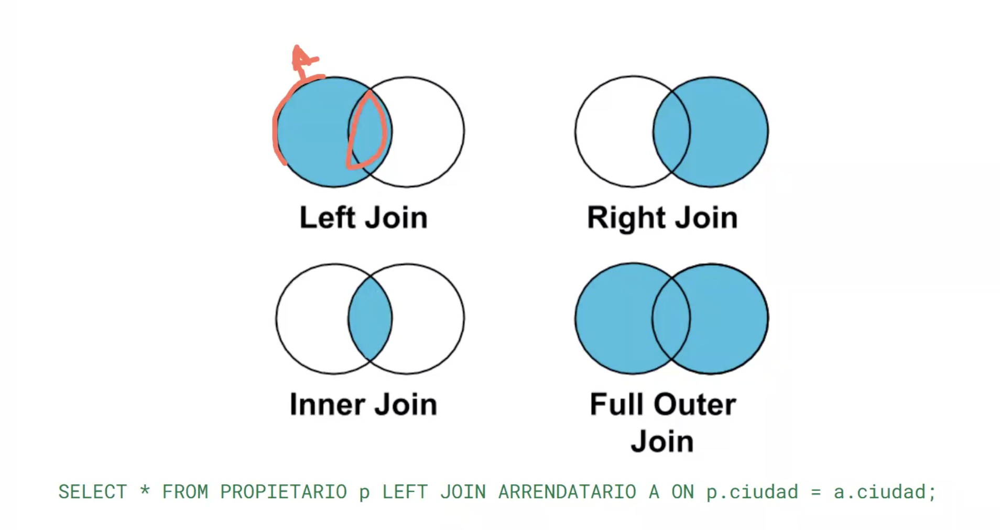

# Clase 4 - Bases de datos relacionales

**Ejercicio de clase:** En 15 minutos hacer 2 endpoints de tienda Arca, GET de productos y POST de producto; con Mocks.

## Índice

1. [Bases de datos relacionales](#bases-de-datos-relacionales)
   - [Modelo basado en tablas](#modelo-basado-en-tablas)
   - [Claves y relaciones](#claves-y-relaciones)
   - [Integridad referencial](#integridad-referencial)
   - [Lenguaje SQL](#lenguaje-sql)
   - [Consultas con JOINs](#consultas-con-joins)
   - [Tipos de datos](#tipos-de-datos)
   - [Estrategias para Analítica](#estrategias-para-analítica)
   - [Propiedades ACID](#propiedades-acid)
2. [Modelo Entidad-Relación (MER)](#modelo-entidad-relación-mer)
   - [Representación conceptual](#representación-conceptual)
   - [Tipos de Modelos MER](#tipos-de-modelos-mer)
   - [Elementos clave](#elementos-clave)
   - [Tipos de relaciones](#tipos-de-relaciones)
   - [Producto Cartesiano y Tablas Asociativas](#producto-cartesiano-y-tablas-asociativas)
   - [Cardinalidad](#cardinalidad)
   - [Independencia de implementación](#independencia-de-implementación)
   - [Base para normalización](#base-para-normalización)
3. [Normalización](#normalización)
   - [Primera Forma Normal (1FN)](#primera-forma-normal-1fn)
   - [Segunda Forma Normal (2FN)](#segunda-forma-normal-2fn)
   - [Tercera Forma Normal (3FN)](#tercera-forma-normal-3fn)
   - [Forma Normal de Boyce-Codd (FNBC)](#forma-normal-de-boyce-codd-fnbc)
   - [Resumen de Formas Normales](#resumen-de-formas-normales)
4. [Ejercicio Práctico: Sistema de Arrendamiento de Inmuebles](#ejercicio-práctico-sistema-de-arrendamiento-de-inmuebles)
   - [Solución](#solución)
   - [Diagrama MER Lógico Detallado](#diagrama-mer-lógico-detallado)
   - [Implementación en PostgreSQL](#implementación-en-postgresql)
   - [Consultas SQL Prácticas](#consultas-sql-prácticas)
5. [Resumen final](#resumen-final)

---

## Bases de datos relacionales

Las **bases de datos relacionales** son sistemas de gestión de datos que organizan la información en tablas interconectadas, representando la estructura y lógica de negocio mediante relaciones matemáticas entre entidades.

**Características principales:**

- Estructuran datos en **tablas** (relaciones) con filas y columnas
- Utilizan **relaciones** para conectar información entre tablas
- Garantizan **integridad** mediante restricciones y claves
- Implementan **transacciones ACID** (Todo o Nada)
- Emplean **SQL** como lenguaje estándar de consulta

> **Principio fundamental:** Las bases de datos relacionales están diseñadas para garantizar transacciones bajo el principio de **"Todo o Nada"** - una operación se completa totalmente o no se realiza en absoluto.

### Modelo basado en tablas

Las bases de datos relacionales organizan la información en **tablas** (también llamadas relaciones), donde:

- **Filas (tuplas/registros)**: Representan instancias individuales de una entidad
- **Columnas (atributos/campos)**: Definen las propiedades de la entidad
- **Celdas**: Contienen valores específicos de un atributo para un registro

**Ejemplo:**

Tabla `Estudiantes`:

| id_estudiante | nombre | apellido | fecha_nacimiento | email |
|---------------|--------|----------|------------------|-------|
| 1 | Juan | Pérez | 2000-05-15 | <juan@email.com> |
| 2 | María | García | 1999-08-22 | <maria@email.com> |
| 3 | Carlos | López | 2001-01-10 | <carlos@email.com> |

### Claves y relaciones

Las claves son fundamentales para establecer relaciones e identificar registros únicamente:

#### Clave Primaria (Primary Key - PK)

Identifica de forma **única e inequívoca** cada registro en una tabla.

**Características:**

- Valores únicos (no se repiten)
- No puede ser NULL
- Solo una clave primaria por tabla
- Puede ser simple (una columna) o compuesta (varias columnas)
- **Se indexa automáticamente** para optimizar búsquedas

**Ejemplo:** `id_estudiante INT PRIMARY KEY` (simple) o `PRIMARY KEY (id_estudiante, id_curso)` (compuesta)

#### Clave Foránea (Foreign Key - FK)

Establece una **relación** entre dos tablas, referenciando la clave primaria de otra tabla.

**Características:**

- Apunta a una clave primaria de otra tabla (o de la misma)
- Puede tener valores NULL (si se permite)
- Puede haber múltiples claves foráneas en una tabla
- Garantiza la integridad referencial

**Ejemplo:** `FOREIGN KEY (id_estudiante) REFERENCES Estudiantes(id_estudiante)`

#### Clave Candidata

Cualquier columna o conjunto de columnas que **podría** ser clave primaria (cumple requisitos de unicidad y no nulidad).

**Ejemplo:**

En la tabla `Estudiantes`:

- `id_estudiante` (elegida como PK)
- `email` (también única, es clave candidata)
- `numero_documento` (única, es clave candidata)

#### Clave Única (Unique Key)

Similar a la clave primaria pero con diferencias importantes:

**Diferencias con Primary Key:**

- **Permite un valor NULL** (solo uno en la mayoría de DBMS)
- Puede haber **múltiples claves únicas** por tabla
- **Se indexa automáticamente** (como PK) para garantizar unicidad eficientemente
- No identifica el registro principal de la tabla

**Ejemplo:** `email VARCHAR(100) UNIQUE`

### Integridad referencial

La **integridad referencial** es una regla de consistencia que garantiza que las relaciones entre tablas permanezcan válidas y coherentes.

**Definición:**
> Asegura que toda clave foránea en una tabla hija debe corresponder a una clave primaria existente en la tabla padre, o ser NULL (si se permite).

**Reglas:**

1. **No se pueden insertar** registros hijos que referencien padres inexistentes
2. **No se pueden eliminar** registros padres si tienen hijos dependientes (sin configuración CASCADE)
3. **No se pueden modificar** claves primarias si tienen referencias activas

**Acciones ante violaciones:**

- `ON DELETE CASCADE`: Elimina registros hijos automáticamente
- `ON DELETE SET NULL`: Pone NULL en FK
- `ON DELETE NO ACTION`: Impide eliminación (default)
- `ON UPDATE CASCADE`: Actualiza FK si cambia PK

**En migraciones:** Migrar tablas padre antes que hijas, o usar `SET FOREIGN_KEY_CHECKS = 0` temporalmente.

### Lenguaje SQL

**SQL (Structured Query Language)** es el lenguaje estándar para interactuar con bases de datos relacionales. Se divide en sublanguajes según su función:

#### DDL (Data Definition Language)

Define y modifica la **estructura** de la base de datos (esquema).

| Comando | ¿Qué hace? | Ejemplo | Notas |
|---------|------------|---------|-------|
| **CREATE** | Crea objetos (tablas, vistas, índices, esquemas) | `CREATE TABLE clientes (...);` | Define estructura inicial |
| **ALTER** | Modifica estructura de un objeto existente | `ALTER TABLE clientes ADD telefono VARCHAR(15);` | Agrega, elimina o cambia columnas |
| **DROP** | Elimina un objeto permanentemente | `DROP TABLE clientes;` | ⚠️ Borra datos y estructura; irreversible |
| **TRUNCATE** | Borra todos los datos sin eliminar estructura | `TRUNCATE TABLE clientes;` | ⚡ Rápido pero ⚠️ sin ROLLBACK |

> ⚠️ **TRUNCATE:** No genera log de transacciones, **no se puede revertir**. Usar solo cuando se esté seguro.

#### DML (Data Manipulation Language)

Manipula los **datos** dentro de las tablas.

| Comando | ¿Qué hace? | Ejemplo | Notas |
|---------|------------|---------|-------|
| **SELECT** | Consulta y recupera datos | `SELECT * FROM clientes WHERE activo = TRUE;` | Solo lectura |
| **INSERT** | Inserta nuevos registros | `INSERT INTO clientes (nombre) VALUES ('Juan');` | Validado por constraints |
| **UPDATE** | Actualiza registros existentes | `UPDATE clientes SET email = 'x@mail.com' WHERE id = 1;` | ⚠️ Sin WHERE actualiza TODO |
| **DELETE** | Elimina registros | `DELETE FROM clientes WHERE id = 1;` | ⚠️ Sin WHERE elimina TODO |

> ⚠️ **UPDATE/DELETE sin WHERE:** Siempre incluir cláusula WHERE para evitar modificar/eliminar todos los registros.

**Constraint CHECK:** Valida condiciones antes de insertar/actualizar (ej: `CHECK (edad >= 18)`)

#### DCL (Data Control Language)

Controla **permisos y accesos** a la base de datos.

| Comando | ¿Qué hace? | Ejemplo |
|---------|------------|---------|
| **GRANT** | Otorga permisos a usuarios o roles | `GRANT SELECT, INSERT ON clientes TO usuario_app;` |
| **REVOKE** | Revoca permisos previamente otorgados | `REVOKE INSERT ON clientes FROM usuario_app;` |

> 🔐 Aplicar principio de **mínimo privilegio** - solo permisos estrictamente necesarios.

#### TCL (Transaction Control Language)

Controla las **transacciones** para garantizar ACID.

| Comando | ¿Qué hace? | Ejemplo |
|---------|------------|---------|
| **BEGIN** | Inicia una transacción | `BEGIN;` o `START TRANSACTION;` |
| **COMMIT** | Confirma cambios permanentemente | `COMMIT;` |
| **ROLLBACK** | Deshace cambios desde BEGIN | `ROLLBACK;` |
| **SAVEPOINT** | Crea punto de guardado para rollback parcial | `SAVEPOINT antes_de_borrar;` |

#### Resumen de Riesgos

| Comando | Riesgo | ¿Reversible? |
|---------|--------|--------------|
| SELECT | 🟢 Bajo | N/A |
| INSERT/UPDATE/DELETE | 🟠 Alto | ✅ Con ROLLBACK |
| TRUNCATE/DROP | 🔴 Crítico | ❌ No |

### Consultas con JOINs

Los **JOINs** materializan la teoría de conjuntos en SQL, permitiendo combinar registros de dos o más tablas basándose en condiciones de relación.



| Tipo de JOIN | ¿Qué hace? | Sintaxis | ¿Qué devuelve? |
|--------------|------------|----------|----------------|
| **INNER JOIN** | Une filas que coinciden en ambas tablas | `SELECT * FROM A INNER JOIN B ON A.id = B.a_id;` | Solo registros con coincidencia en ambas |
| **LEFT JOIN** | Devuelve todas las filas de la tabla izquierda y las coincidentes de la derecha | `SELECT * FROM A LEFT JOIN B ON A.id = B.a_id;` | Si no hay coincidencia, columnas de B quedan NULL |
| **RIGHT JOIN** | Igual que LEFT, pero prioriza la tabla derecha | `SELECT * FROM A RIGHT JOIN B ON A.id = B.a_id;` | Devuelve todo de B, y de A solo si hay match |
| **FULL JOIN** | Une todos los registros de ambas tablas, coincidan o no | `SELECT * FROM A FULL JOIN B ON A.id = B.a_id;` | Coincidencias + filas sin match de ambos lados (con NULL) |

**Buenas prácticas:**

- ✅ Hacer JOINs sobre **llaves indexadas** (PK, FK) para mayor eficiencia
- ✅ Colocar la **tabla más liviana a la izquierda** (el orden importa en rendimiento)
- ✅ Usar **alias** para mejorar legibilidad (`FROM propietario p JOIN arrendatario a`)

> ⚠️ **No es lo mismo A JOIN B que B JOIN A** - Si una tabla es más pesada, dejarla de segundo puede mejorar el rendimiento.

#### Consulta Asimétrica

Ocurre cuando la relación entre dos tablas no es recíproca. La tabla con FK "sabe" la relación directamente; la otra debe buscarla.

```sql
-- Parqueadero → Propietario (DIRECTO): Parqueadero tiene el FK
SELECT * FROM parqueadero WHERE documento_propiet = '123';  -- Siempre 1 resultado

-- Propietario → Parqueadero (INVERSO): Debe buscar quién lo referencia
SELECT * FROM parqueadero WHERE documento_propiet = '123';  -- 0, 1 o N resultados
```

#### Diferencia Simétrica (Complemento)

Útil para encontrar registros sin relación. Se logra con LEFT JOIN + WHERE ... IS NULL:

```sql
-- Encontrar parqueaderos SIN propietario asignado
SELECT p.* 
FROM parqueadero p 
LEFT JOIN propietario prop ON p.documento_propiet = prop.documento_persona
WHERE prop.documento_persona IS NULL;
```

#### Optimización de consultas

> 📊 **Plan de Ejecución:** Herramienta del motor SQL que muestra cómo se ejecuta una consulta (tiempos por paso, uso de índices, latencias de disco). Úsalo para optimizar consultas complejas con `EXPLAIN ANALYZE`.

### Tipos de datos

Los **tipos de datos** definen qué clase de información puede almacenarse en cada columna de una tabla y cómo se representa internamente.

| Tipo de dato | Propósito | Ejemplo de uso |
|--------------|-----------|----------------|
| **INT** | Almacena números enteros | `edad INT → edad = 25` |
| **DECIMAL(p,s)** | Almacena números decimales con precisión (p) y escala (s) | `precio DECIMAL(6,2) → precio = 1234.56` |
| **BOOLEAN** | Almacena valores TRUE o FALSE | `es_activo BOOLEAN → TRUE` |
| **VARCHAR(n)** | Cadena de texto variable, hasta n caracteres | `nombre VARCHAR(50) → 'Carlos'` |
| **CHAR(n)** | Cadena de texto de longitud fija | `sexo CHAR(1) → 'M' o 'F'` |
| **TEXT** | Texto largo sin límite fijo | `comentario TEXT → 'Este producto es excelente'` |
| **DATE** | Almacena solo una fecha (YYYY-MM-DD) | `fecha_nacimiento DATE → '1990-10-15'` |
| **TIME** | Almacena solo la hora (HH:MM:SS) | `hora_entrada TIME → '14:30:00'` |
| **TIMESTAMP** | Almacena fecha y hora (YYYY-MM-DD HH:MM:SS) | `creado_en TIMESTAMP → '2024-06-25 18:23:59'` |
| **UUID** | Identificador único universal | `id UUID → '550e8400-e29b-41d4-a716-446655440000'` |
| **BLOB** | Almacena datos binarios (imágenes, archivos, etc.) | `foto BLOB →` imagen en bytes |

#### Consideraciones importantes

**VARCHAR y problemas con ASCII extendido:**

> ⚠️ **Advertencia:** Tener cuidado con `VARCHAR` cuando se usa con ASCII extendido, ya que puede causar problemas con caracteres especiales como "~", acentos o símbolos. Se recomienda usar codificación UTF-8 para soporte completo de caracteres internacionales.

**TIMESTAMP en el sector financiero:**

> 💰 **Nota crítica:** En el sector financiero, todas las transacciones se deben registrar con **TIMESTAMP** para incluir milisegundos y garantizar trazabilidad precisa de operaciones. Esto es esencial para auditorías y cumplimiento regulatorio.

#### Código ASCII (American Standard Code for Information Interchange)

**Definición:** ASCII es un estándar de codificación de caracteres que asigna un número único (0-127) a cada letra, dígito, símbolo y comando de control del idioma inglés.

**Propósito:** Permite que diferentes sistemas informáticos representen y compartan texto de manera consistente.

**Estructura:**

- **ASCII básico (0-127):** 128 caracteres que incluyen:
  - Caracteres de control (0-31): saltos de línea, tabulaciones, etc.
  - Caracteres imprimibles (32-126): letras (A-Z, a-z), dígitos (0-9), símbolos básicos (!, @, #, etc.)
  - DEL (127): carácter de borrado

- **ASCII extendido (128-255):** 128 caracteres adicionales que varían según la página de códigos, incluyendo:
  - Caracteres acentuados (á, é, í, ñ, ü)
  - Símbolos especiales (€, °, ±, ~)
  - Caracteres de dibujo de cuadros

**Problema:** El ASCII extendido **no es estándar** - diferentes sistemas operativos usan diferentes páginas de códigos (Windows-1252, ISO-8859-1), causando incompatibilidades.

**Uso en bases de datos:**

- `CHAR` y `VARCHAR` tradicionalmente usaban ASCII/Latin-1
- Caracteres fuera del ASCII básico (ñ, á, ~) pueden causar problemas de visualización o comparación
- **Solución moderna:** Usar codificación **UTF-8** (Unicode) que soporta todos los idiomas

**Ejemplo de problema:**

```sql
-- Con ASCII extendido (puede fallar)
INSERT INTO Usuarios (nombre) VALUES ('José');  -- "é" puede corromperse

-- Con UTF-8 (correcto)
SET NAMES utf8mb4;
INSERT INTO Usuarios (nombre) VALUES ('José');  -- Funciona correctamente
```

**Recomendación:** Siempre configurar bases de datos con `utf8mb4` (MySQL) o `UTF8` (PostgreSQL) para soporte completo de caracteres internacionales.

### Estrategias para Analítica

Cuando las consultas analíticas afectan el rendimiento de la base de datos principal, existen estrategias para separar cargas de trabajo:

| Estrategia | Descripción | Ventaja | Desventaja |
|------------|-------------|---------|------------|
| **Read Replica** | Instancia de solo lectura sincronizada con la principal | Datos casi en tiempo real | Costo de infraestructura |
| **ETL** (Extract, Transform, Load) | Job que extrae, transforma y carga datos a otra DB | Transformaciones complejas | Datos con retraso (T-X) |
| **Data Warehouse / Cubo** | Almacenamiento multidimensional con datos pre-calculados | Consultas analíticas muy rápidas | Complejidad de implementación |

**ETL y el concepto T-X:**

> Los procesos ETL tienen un retraso inherente. Se expresa como **"T-X"** donde X es el tiempo de atraso. Ej: "Esta DB está a T-5" = 5 minutos desactualizada.

**Arquitectura de Data Warehouse:**

```text
┌─────────────┐     ┌─────────────┐     ┌─────────────┐     ┌─────────────┐
│  DB Origen  │────►│  Data Lake  │────►│   Staging   │────►│    Cubo     │────► PowerBI
│ (Operativa) │ ETL │(Materia prima)│    │(Hechos/Dim) │OLAP │(Multidim.)  │     Tableau
└─────────────┘     └─────────────┘     └─────────────┘     └─────────────┘
```

### Propiedades ACID

Las propiedades **ACID** garantizan que las transacciones en bases de datos relacionales sean confiables y mantengan la integridad de los datos, incluso ante fallos.

#### A - Atomicidad (Atomicity)

**Definición:** Una transacción es una unidad indivisible - **se ejecuta completamente o no se ejecuta en absoluto** (Todo o Nada).

**Ejemplo:** Transferencia bancaria - ambos UPDATE (restar y sumar) se confirman juntos, o se revierten ambos si hay fallo.

#### C - Consistencia (Consistency)

**Definición:** Una transacción lleva la base de datos de un **estado válido a otro estado válido**, respetando todas las reglas e integridad definidas.

**Mecanismos:** Constraints (NOT NULL, CHECK, FK), triggers, reglas de negocio.

**Ejemplo:** No permitir stock negativo (CHECK constraint) o ventas de productos inexistentes (FK).

#### I - Aislamiento (Isolation)

**Definición:** Las transacciones concurrentes se ejecutan de forma **aislada**, sin interferir entre sí, como si fueran secuenciales.

**Niveles de aislamiento:**

| Nivel | Dirty Read | Non-Repeatable Read | Phantom Read | Uso |
|-------|------------|---------------------|--------------|-----|
| **READ UNCOMMITTED** | ✅ | ✅ | ✅ | Reportes no críticos |
| **READ COMMITTED** | ❌ | ✅ | ✅ | Default PostgreSQL |
| **REPEATABLE READ** | ❌ | ❌ | ✅ | Default MySQL, transacciones financieras |
| **SERIALIZABLE** | ❌ | ❌ | ❌ | Sistemas críticos (bancos) |

**Problemas de concurrencia:**

- **Dirty Read:** Leer datos no confirmados de otra transacción
- **Non-Repeatable Read:** Misma consulta da resultados diferentes en la misma transacción
- **Phantom Read:** Aparecen/desaparecen filas entre consultas idénticas

#### D - Durabilidad (Durability)

**Definición:** Una vez que una transacción hace **COMMIT**, los cambios son **permanentes** y sobreviven a fallos del sistema (crashes, pérdida de energía).

**Mecanismos:**

- **Write-Ahead Logging (WAL):** Cambios se escriben primero al log, luego a tablas
- **Checkpoints:** Sincronización periódica de cambios pendientes
- **Transaction Log:** Registro de operaciones para recuperación (Redo/Undo)

## Modelo Entidad-Relación (MER)

El **Modelo Entidad-Relación** es una técnica de modelado conceptual que permite representar la estructura de una base de datos de forma visual e independiente de la implementación técnica.

### Representación Conceptual

**Propósito:** Modelar entidades, atributos y relaciones del dominio del problema **antes del diseño físico**.

**Ventajas:**

- Comunicación clara entre analistas, desarrolladores y stakeholders
- Independiente del DBMS (PostgreSQL, MySQL, Oracle, etc.)
- Facilita la detección de errores en etapas tempranas
- Sirve como documentación del sistema
- Permite establecer un **lenguaje ubicuo** compartido por todo el equipo

**Lenguaje Ubicuo (Ubiquitous Language):**

Es un vocabulario común y preciso que comparten todos los miembros del proyecto (negocio y técnicos) para referirse a conceptos del dominio. El MER ayuda a definir este lenguaje mediante:

- **Nombres de entidades** que reflejan conceptos del negocio (Cliente, Pedido, Producto)
- **Términos consistentes** en código, documentación y conversaciones
- **Reducción de ambigüedades** en requisitos y especificaciones

**Ejemplo:** Si el negocio usa "Miembro" en lugar de "Usuario", el MER, la base de datos y el código deben usar consistentemente "Miembro" para evitar confusiones.

### Tipos de Modelos MER

| Modelo | Descripción | Elementos | Dependencia DBMS | Audiencia |
|--------|-------------|-----------|------------------|----------|
| **Conceptual** | Representación abstracta del dominio de negocio | Entidades, relaciones, atributos genéricos | Independiente | Stakeholders, analistas |
| **Lógico** | Estructura de datos relacional | Tablas, PK, FK, tipos de datos genéricos, normalización | Independiente | Arquitectos de datos |
| **Físico** | Implementación específica del DBMS | DDL SQL, índices, constraints, triggers, optimizaciones | Dependiente (PostgreSQL, MySQL, etc.) | DBAs, desarrolladores |

### Elementos clave

#### 1. Entidades

**Definición:** Objetos o conceptos del mundo real sobre los cuales se almacena información.

**Representación:** Rectángulos

**Tipos:**

| Tipo | Características | Representación | Ejemplos |
|------|----------------|----------------|----------|
| **Fuerte** | Existe independientemente, PK propia | Rectángulo simple | Cliente, Producto, Empleado |
| **Débil** | Depende de otra entidad, PK compuesta (incluye FK) | Rectángulo doble ║ ║ | Dependiente, Habitación, Línea de Pedido |
| **Asociativa** | Conecta entidades en relaciones N:M, tiene atributos propios | Rombo dentro de rectángulo ◇▭ | Inscripción (Estudiante-Curso), Venta (Producto-Pedido) |

**Ejemplo de entidad débil:**

```text
Empleado (Fuerte) ═══ tiene ═══ Dependiente (Débil)
                               PK: (id_empleado, numero)
```

#### 2. Atributos

**Definición:** Propiedades que describen una entidad.

**Representación:** Óvalos

**Tipos:**

| Tipo | Descripción | Ejemplo | Representación |
|------|-------------|---------|----------------|
| **Simple** | Indivisible | edad, precio | Óvalo simple |
| **Compuesto** | Descomponible | nombre_completo, dirección | Óvalo con sub-óvalos |
| **Multi-valuado** | Múltiples valores | teléfonos, emails | Óvalo doble {◯◯} |
| **Derivado** | Se calcula | edad, precio_con_iva | Óvalo punteado ··◯·· |
| **Clave** | Identifica registro | id_cliente | Óvalo subrayado |

**Manejo de atributos multi-valuados:**

- ❌ **Incorrecto:** Concatenar valores en una celda (ej: "tel1, tel2") - Viola 1FN
- ✅ **Correcto:** Crear tabla de datos extendidos (ej: tabla `Telefonos_Cliente` con FK a `Clientes`)

> Las tablas de datos extendidos permiten almacenar múltiples valores manteniendo normalización y eficiencia.

#### 3. Relaciones

**Definición:** Asociaciones o vínculos entre dos o más entidades.

**Representación:** Rombos conectando entidades

**Ejemplo visual:**

```text
┌──────────┐                    ┌──────────┐
│ Cliente  │───── realiza ─────>│  Pedido  │
└──────────┘                    └──────────┘
```

### Tipos de relaciones

Las relaciones se clasifican según su **cardinalidad** (número de instancias que pueden asociarse).

| Tipo | Cardinalidad | Descripción | Ejemplo | Implementación |
|------|--------------|-------------|---------|----------------|
| **Uno a Uno (1:1)** | Una instancia A ↔ Una instancia B | Cada registro de A se relaciona con exactamente uno de B | Persona ↔ Pasaporte | FK con constraint UNIQUE |
| **Uno a Muchos (1:N)** | Una instancia A ↔ Múltiples instancias B | Un registro de A se relaciona con varios de B | Cliente → Pedidos | FK en tabla del lado "muchos" |
| **Muchos a Muchos (N:M)** | Múltiples instancias A ↔ Múltiples instancias B | Varios registros de A con varios de B | Estudiantes ↔ Cursos | Tabla intermedia con PK compuesta |

#### Producto Cartesiano y Tablas Asociativas

**Producto Cartesiano:** Problema que ocurre al implementar relaciones N:M sin tabla intermedia, generando todas las combinaciones posibles (N × M filas) en lugar de solo las relaciones reales.

**Consecuencias:**

- Explosión de filas innecesarias
- Problemas graves de performance
- Desperdicio de espacio en disco
- Consultas lentas y complejas

**Solución: Tabla Asociativa (Tabla de Rompimiento):**

> **Regla:** Para toda relación N:M, crear tabla intermedia con PK compuesta de las FKs de ambas tablas.

**Notación "Pata de Gallina" (Crow's Foot):** Las líneas que terminan en tres segmentos (├─) indican "muchos" en la relación.

### Cardinalidad

La **cardinalidad** especifica el número mínimo y máximo de instancias que pueden participar en una relación.

**Notación:** `(mínimo, máximo)`

**Símbolos comunes:**

- `0` - Cero (participación opcional)
- `1` - Uno
- `N` o `*` - Muchos (sin límite)

#### Ejemplo: Empleado - Departamento

```text
         (1,1)                 (0,N)
Empleado ────pertenece──── Departamento
```

**Interpretación:**

- Un empleado debe pertenecer a **exactamente un** departamento (1,1)
- Un departamento puede tener **0 o muchos** empleados (0,N)

**Cardinalidades comunes:**

| Cardinalidad | Significado | Ejemplo |
|--------------|-------------|---------|
| **(0,1)** | Opcional, máximo uno | Persona → Licencia de conducir |
| **(1,1)** | Obligatorio, exactamente uno | Pedido → Cliente |
| **(0,N)** | Opcional, sin límite | Cliente → Pedidos |
| **(1,N)** | Al menos uno, sin límite | Curso → Estudiantes |

### Independencia de implementación

**Ventaja clave:** El modelo MER es abstracto y no depende del DBMS específico que se use.

**Proceso:**

```text
1. Modelo Conceptual (MER)
   ↓
2. Modelo Lógico (tablas, relaciones)
   ↓
3. Modelo Físico (PostgreSQL, MySQL, Oracle)
```

El mismo MER puede implementarse en diferentes bases de datos sin cambios en el diseño conceptual.

### Base para normalización

El MER sirve como punto de partida para aplicar **formas normales** que eliminan redundancia y mejoran la integridad de datos.

---

## Normalización

La **normalización** es el proceso de organizar datos en una base de datos para **reducir redundancia** y **mejorar integridad**, dividiendo tablas grandes en tablas más pequeñas y definiendo relaciones entre ellas.

**Objetivos:**

- Eliminar datos duplicados
- Minimizar anomalías de inserción, actualización y eliminación
- Simplificar consultas y mantenimiento
- Garantizar dependencias lógicas coherentes

**Proceso:** Aplicar formas normales (FN) progresivamente: 1FN → 2FN → 3FN → FNBC

### Primera Forma Normal (1FN)

**Regla:** Todos los atributos deben contener **valores atómicos** (indivisibles) y **no deben haber grupos repetitivos**.

**Violaciones:** Múltiples valores en una celda (ej: "555-1234, 555-5678"), columnas repetitivas (tel1, tel2, tel3).

**Ejemplo: ❌ No está en 1FN:**

| id | nombre | telefonos | cursos |
|----|--------|-----------|--------|
| 1 | Juan | 555-1234, 555-5678 | Math, Physics |

**Problema:** `telefonos` y `cursos` tienen múltiples valores.

**Solución:** Crear tabla `Estudiantes` (id, nombre) y tabla `Telefonos` (id, id_estudiante, telefono) con FK.

### Segunda Forma Normal (2FN)

**Requisito:** Estar en 1FN

**Regla:** Todos los atributos **no clave** deben depender de **toda la clave primaria**, no solo de parte de ella. Elimina **dependencias parciales** en claves compuestas.

**Ejemplo: ❌ No está en 2FN:**

| id_estudiante | id_curso | nombre_estudiante | nombre_curso | calificacion |
|---------------|----------|-------------------|--------------|--------------|
| 1 | 101 | Juan | Matemáticas | 9.5 |

**PK:** (id_estudiante, id_curso)

**Problema:** `nombre_estudiante` solo depende de `id_estudiante`, `nombre_curso` solo depende de `id_curso`.

**Solución:** Separar en `Estudiantes` (id_estudiante, nombre), `Cursos` (id_curso, nombre), `Inscripciones` (id_estudiante, id_curso, calificacion).

### Tercera Forma Normal (3FN)

**Requisito:** Estar en 2FN

**Regla:** Ningún atributo **no clave** debe depender de otro atributo **no clave**. Elimina **dependencias transitivas** (A → B → C).

**Ejemplo: ❌ No está en 3FN:**

| id_empleado | nombre | id_departamento | nombre_departamento | ubicacion_departamento |
|-------------|--------|-----------------|---------------------|------------------------|
| 1 | Juan | 10 | Ventas | Edificio A |
| 2 | Ana | 20 | IT | Edificio B |

**PK:** id_empleado

**Problema:** `id_empleado` → `id_departamento` → `nombre_departamento` (dependencia transitiva)

**Solución:** Separar en `Empleados` (id_empleado, nombre, id_departamento FK) y `Departamentos` (id_departamento, nombre, ubicacion).

### Forma Normal de Boyce-Codd (FNBC)

**Requisito:** Estar en 3FN

**Regla:** Para toda dependencia funcional `X → Y`, `X` debe ser **superclave**. Es una versión más estricta de 3FN.

**Ejemplo: ❌ Está en 3FN pero NO en FNBC:**

| id_estudiante | id_curso | instructor |
|---------------|----------|------------|
| 1 | Math101 | Dr. Smith |
| 2 | Math101 | Dr. Smith |

**Regla de negocio:** Un instructor solo enseña un curso específico.

**Problema:** `instructor → id_curso` viola FNBC (instructor no es superclave).

**Solución:** Crear `Instructores_Cursos` (instructor PK, id_curso) e `Inscripciones` (id_estudiante, instructor) para eliminar la dependencia.

### Resumen de Formas Normales

| Forma Normal | Requisito | Qué elimina |
|--------------|-----------|-------------|
| **1FN** | Base | Valores no atómicos, grupos repetitivos |
| **2FN** | En 1FN | Dependencias parciales (en claves compuestas) |
| **3FN** | En 2FN | Dependencias transitivas (no-clave → no-clave) |
| **FNBC** | En 3FN | Dependencias de no-superclave |

**Guía:** 1FN es obligatorio, 3FN suficiente para la mayoría, FNBC para sistemas críticos.

---

## Ejercicio Práctico: Sistema de Arrendamiento de Inmuebles


### Solución

#### Modelo Conceptual


#### Modelo Lógico


#### Problema de Sobreposición de Fechas

**Pregunta:** ¿Cómo evitar arrendamientos solapados del mismo inmueble?

**Respuesta:** No se puede representar en Modelo Conceptual. Se implementa mediante:

- **Trigger:** Validar sobreposición de fechas antes de insertar
- **Lógica de aplicación:** Verificar conflictos antes de crear contrato
- **Constraint complejo:** Validación de rangos de fechas activos

> **Principio:** Algunas restricciones complejas (rangos de fechas) deben implementarse en Modelo Físico o lógica de aplicación.

---

## Resumen final

### Conceptos clave

**Bases de datos relacionales:**

- **Modelo basado en tablas:** Filas (registros), columnas (atributos), celdas (valores)
- **Claves:** Primarias (PK - identificación única), Foráneas (FK - relaciones entre tablas), Candidatas (alternativas a PK), Únicas (permiten NULL, múltiples por tabla)
- **Integridad referencial:** FK debe corresponder a PK existente en tabla padre
- **Acciones de integridad:** CASCADE (elimina/actualiza en cascada), SET NULL, NO ACTION
- **SQL:** DDL (CREATE, ALTER, DROP), DML (SELECT, INSERT, UPDATE, DELETE), DCL (GRANT, REVOKE), TCL (BEGIN, COMMIT, ROLLBACK, SAVEPOINT)
- **JOINs:** INNER (solo coincidencias), LEFT (todo de izq + coincidencias), RIGHT (todo de der + coincidencias), FULL (todos los registros)
  - Usar llaves indexadas para mejor rendimiento
  - Tabla más liviana a la izquierda
  - **Consulta asimétrica:** La tabla con FK "sabe" la relación; la otra debe buscarla
  - **Diferencia simétrica:** `LEFT JOIN ... WHERE B.key IS NULL` para encontrar registros sin relación
- **Plan de ejecución:** `EXPLAIN ANALYZE` para optimizar consultas
- **Estrategias analítica:** Read Replica (tiempo real), ETL (T-X de retraso), Data Warehouse/Cubos (pre-calculado)
- **Propiedades ACID:**
  - **Atomicidad:** Todo o nada en transacciones
  - **Consistencia:** Estado válido a estado válido (constraints, triggers)
  - **Aislamiento:** 4 niveles (READ UNCOMMITTED, READ COMMITTED, REPEATABLE READ, SERIALIZABLE)
  - **Durabilidad:** Cambios permanentes tras COMMIT (WAL, Checkpoints, Transaction Log)

**Modelo Entidad-Relación (MER):**

- **Tres niveles de modelado:** Conceptual (abstracto, independiente de DBMS), Lógico (esquema relacional, normalización), Físico (DDL, índices, optimizaciones específicas del DBMS)
- **Lenguaje ubicuo:** Vocabulario común entre negocio y técnicos
- **Tres tipos de entidades:**
  - **Fuerte:** Independiente, PK propia
  - **Débil:** Dependiente de otra entidad, PK compuesta con FK
  - **Asociativa:** Conecta entidades N:M, tiene atributos propios
- **Cinco tipos de atributos:**
  - **Simple:** Indivisible (edad, precio)
  - **Compuesto:** Descomponible (nombre_completo, dirección)
  - **Multi-valuado:** Múltiples valores (teléfonos, emails) - usar tablas de datos extendidos
  - **Derivado:** Se calcula (edad, precio_con_iva)
  - **Clave:** Identifica registro (id_cliente)
- **Tipos de relaciones:**
  - **1:1** - FK con UNIQUE constraint
  - **1:N** - FK en tabla del lado "muchos"
  - **N:M** - Tabla intermedia con PK compuesta
- **Cardinalidad:** (mínimo, máximo) - (0,1), (1,1), (0,N), (1,N)
- **Producto Cartesiano:** Problema de implementar N:M sin tabla intermedia (N × M filas innecesarias)
- **Notación Crow's Foot:** Líneas con tres segmentos (├─) indican "muchos"

**Normalización:**

- **Objetivo:** Reducir redundancia y anomalías de inserción/actualización/eliminación
- **1FN:** Valores atómicos (indivisibles), sin grupos repetitivos
- **2FN:** Eliminar dependencias parciales en claves compuestas
- **3FN:** Eliminar dependencias transitivas (no-clave → no-clave)
- **FNBC:** Solo superclaves determinan atributos (más estricta que 3FN)
- **Guía:** 1FN obligatoria, 3FN suficiente para mayoría de casos, FNBC para sistemas críticos

**Mejores prácticas:**

- **Diseño:** Siempre empezar con modelo conceptual → lógico → físico
- **Relaciones N:M:** Usar tablas asociativas con PK compuesta de FKs
- **Atributos multi-valuados:** Crear tablas de datos extendidos (nunca concatenar)
- **Entidades débiles:** Configurar ON DELETE CASCADE para mantener integridad
- **Restricciones complejas:** Implementar con triggers, stored procedures o lógica de aplicación (ej: validación de rangos de fechas)
- **Integridad referencial:** Configurar apropiadamente ON DELETE y ON UPDATE
- **Migraciones:** Migrar tablas padre antes que hijas
- **Performance:** Crear índices en FKs y columnas de búsqueda frecuente

---


### Diagrama MER Lógico Detallado

```text
┌─────────────────────────────────────────────────────────────────────────────────────────┐
│                                   DIAGRAMA MER LÓGICO                                    │
└─────────────────────────────────────────────────────────────────────────────────────────┘

    ┌─────────────────────┐
    │       Persona       │
    ├─────────────────────┤
    │ PK  documento       │◄─────────────────────────────────────────┐
    │     tipo_documento  │                                          │
    │     nombre          │                                          │
    │     apellidos       │                                          │
    │     created_at      │                                          │
    │     updated_at      │                                          │
    └─────────┬───────────┘                                          │
              │                                                      │
              │ 1:N                                                   │
              ▼                                                      │
    ┌─────────────────────┐                                          │
    │      Telefono       │                                          │
    ├─────────────────────┤                                          │
    │ PK  id              │                                          │
    │ FK  documento_pers  │                                          │
    │     numero          │                                          │
    │     tipo            │  [MOVIL, FIJO, TRABAJO]                  │
    │     es_principal    │                                          │
    │     created_at      │                                          │
    └─────────────────────┘                                          │
                                                                     │
    ┌─────────────────────┐         ┌─────────────────────┐          │
    │    Propietario      │         │    Arrendatario     │          │
    ├─────────────────────┤         ├─────────────────────┤          │
    │ PK  documento_pers  │────┐    │ PK  documento_pers  │──────────┤
    │ FK  (hereda Persona)│    │    │ FK  (hereda Persona)│          │
    │     activo          │    │    │     tipo            │ [PROPIETARIO, EXTERNO]
    │     created_at      │    │    │     activo          │          │
    │     updated_at      │    │    │     created_at      │          │
    └─────────────────────┘    │    │     updated_at      │          │
              │                │    └──────────┬──────────┘          │
              │ 1:N            │               │                     │
              ▼                │               │ 1:N                 │
    ┌─────────────────────┐    │               │                     │
    │    Parqueadero      │    │               │                     │
    ├─────────────────────┤    │               │                     │
    │ PK  id              │◄───────────────────┼─────────────────────┘
    │ FK  documento_prop  │────┘               │
    │     tipo            │ [MOTO, CARRO]      │
    │     ubicacion_piso  │                    │
    │     ubicacion_num   │                    │
    │     activo          │                    │
    │     created_at      │                    │
    │     updated_at      │                    │
    └─────────┬───────────┘                    │
              │                                │
              │ 1:N                            │
              │         ┌──────────────────────┘
              ▼         ▼
    ┌─────────────────────────┐       ┌─────────────────────┐
    │     Arrendamiento       │       │  EstadoArrendamiento│
    ├─────────────────────────┤       ├─────────────────────┤
    │ PK  id                  │       │ PK  id              │
    │ FK  id_parqueadero      │       │     codigo          │ [ACTIVO, FINALIZADO,
    │ FK  documento_arrend    │       │     nombre          │  CANCELADO, VENCIDO]
    │ FK  id_estado           │──────►│     descripcion     │
    │     fecha_inicio        │       └─────────────────────┘
    │     fecha_fin           │
    │     valor_mensual       │       ┌ ─ ─ ─ ─ ─ ─ ─ ─ ─ ─ ─ ─ ─ ─ ─ ┐
    │     notas               │         CONSTRAINT: Para un mismo
    │     created_at          │       │ id_parqueadero, los rangos    │
    │     updated_at          │         (fecha_inicio, fecha_fin) NO
    │     deleted_at          │       │ deben solaparse.              │
    └─────────────────────────┘       └ ─ ─ ─ ─ ─ ─ ─ ─ ─ ─ ─ ─ ─ ─ ─ ┘


┌─────────────────────────────────────────────────────────────────────────────────────────┐
│ LEYENDA:                                                                                │
│   PK = Primary Key    FK = Foreign Key    ──► = Relación    [ ] = Valores ENUM/CHECK   │
│                                                                                         │
│ DECISIONES DE DISEÑO:                                                                   │
│   • Persona: Tabla base para evitar duplicación (un propietario puede ser arrendatario)│
│   • Soft Delete: Solo en Arrendamiento (deleted_at) para historial                     │
│   • Hard Delete: En otras tablas con validación de dependencias                        │
│   • Teléfono: Ahora relacionado con Persona (sirve para ambos roles)                   │
└─────────────────────────────────────────────────────────────────────────────────────────┘
```

### Implementación en PostgreSQL

```sql
-- ============================================================================
-- SISTEMA DE GESTIÓN DE PARQUEADEROS
-- Base de datos PostgreSQL
-- Fecha: 2025
-- ============================================================================

-- Eliminar objetos existentes (para desarrollo)
DROP TRIGGER IF EXISTS trg_validar_solapamiento ON arrendamiento;
DROP FUNCTION IF EXISTS fn_validar_solapamiento_arrendamiento();
DROP FUNCTION IF EXISTS fn_actualizar_updated_at();
DROP TABLE IF EXISTS arrendamiento CASCADE;
DROP TABLE IF EXISTS parqueadero CASCADE;
DROP TABLE IF EXISTS arrendatario CASCADE;
DROP TABLE IF EXISTS propietario CASCADE;
DROP TABLE IF EXISTS telefono CASCADE;
DROP TABLE IF EXISTS persona CASCADE;
DROP TABLE IF EXISTS estado_arrendamiento CASCADE;

-- TIPOS ENUMERADOS
CREATE TYPE tipo_documento_enum AS ENUM ('CC', 'CE', 'NIT', 'PASAPORTE', 'TI');
CREATE TYPE tipo_telefono_enum AS ENUM ('MOVIL', 'FIJO', 'TRABAJO');
CREATE TYPE tipo_parqueadero_enum AS ENUM ('MOTO', 'CARRO');
CREATE TYPE tipo_arrendatario_enum AS ENUM ('PROPIETARIO', 'EXTERNO');

-- TABLA: persona
CREATE TABLE persona (
    documento       VARCHAR(20)           NOT NULL,
    tipo_documento  tipo_documento_enum   NOT NULL DEFAULT 'CC',
    nombre          VARCHAR(100)          NOT NULL,
    apellidos       VARCHAR(100)          NOT NULL,
    email           VARCHAR(150),
    created_at      TIMESTAMP             NOT NULL DEFAULT CURRENT_TIMESTAMP,
    updated_at      TIMESTAMP             NOT NULL DEFAULT CURRENT_TIMESTAMP,

    CONSTRAINT pk_persona PRIMARY KEY (documento),
    CONSTRAINT uq_persona_email UNIQUE (email),
    CONSTRAINT chk_persona_nombre CHECK (LENGTH(TRIM(nombre)) >= 2),
    CONSTRAINT chk_persona_apellidos CHECK (LENGTH(TRIM(apellidos)) >= 2),
    CONSTRAINT chk_persona_email CHECK (email IS NULL OR email ~* '^[A-Za-z0-9._%+-]+@[A-Za-z0-9.-]+\.[A-Za-z]{2,}$')
);

-- TABLA: telefono
CREATE TABLE telefono (
    id                  SERIAL                NOT NULL,
    documento_persona   VARCHAR(20)           NOT NULL,
    numero              VARCHAR(15)           NOT NULL,
    tipo                tipo_telefono_enum    NOT NULL DEFAULT 'MOVIL',
    es_principal        BOOLEAN               NOT NULL DEFAULT FALSE,
    created_at          TIMESTAMP             NOT NULL DEFAULT CURRENT_TIMESTAMP,

    CONSTRAINT pk_telefono PRIMARY KEY (id),
    CONSTRAINT fk_telefono_persona FOREIGN KEY (documento_persona)
        REFERENCES persona(documento) ON DELETE CASCADE ON UPDATE CASCADE,
    CONSTRAINT uq_telefono_persona_numero UNIQUE (documento_persona, numero),
    CONSTRAINT chk_telefono_numero CHECK (numero ~ '^[0-9]{7,15}$')
);

CREATE INDEX idx_telefono_documento ON telefono(documento_persona);

-- TABLA: propietario
CREATE TABLE propietario (
    documento_persona   VARCHAR(20)   NOT NULL,
    activo              BOOLEAN       NOT NULL DEFAULT TRUE,
    fecha_registro      DATE          NOT NULL DEFAULT CURRENT_DATE,
    created_at          TIMESTAMP     NOT NULL DEFAULT CURRENT_TIMESTAMP,
    updated_at          TIMESTAMP     NOT NULL DEFAULT CURRENT_TIMESTAMP,

    CONSTRAINT pk_propietario PRIMARY KEY (documento_persona),
    CONSTRAINT fk_propietario_persona FOREIGN KEY (documento_persona)
        REFERENCES persona(documento) ON DELETE RESTRICT ON UPDATE CASCADE
);

-- TABLA: arrendatario
CREATE TABLE arrendatario (
    documento_persona   VARCHAR(20)             NOT NULL,
    tipo                tipo_arrendatario_enum  NOT NULL DEFAULT 'EXTERNO',
    activo              BOOLEAN                 NOT NULL DEFAULT TRUE,
    fecha_registro      DATE                    NOT NULL DEFAULT CURRENT_DATE,
    created_at          TIMESTAMP               NOT NULL DEFAULT CURRENT_TIMESTAMP,
    updated_at          TIMESTAMP               NOT NULL DEFAULT CURRENT_TIMESTAMP,

    CONSTRAINT pk_arrendatario PRIMARY KEY (documento_persona),
    CONSTRAINT fk_arrendatario_persona FOREIGN KEY (documento_persona)
        REFERENCES persona(documento) ON DELETE RESTRICT ON UPDATE CASCADE
);

-- TABLA: parqueadero
CREATE TABLE parqueadero (
    id                  SERIAL                  NOT NULL,
    documento_propiet   VARCHAR(20)             NOT NULL,
    tipo                tipo_parqueadero_enum   NOT NULL,
    ubicacion_piso      SMALLINT                NOT NULL,
    ubicacion_numero    VARCHAR(10)             NOT NULL,
    activo              BOOLEAN                 NOT NULL DEFAULT TRUE,
    observaciones       TEXT,
    created_at          TIMESTAMP               NOT NULL DEFAULT CURRENT_TIMESTAMP,
    updated_at          TIMESTAMP               NOT NULL DEFAULT CURRENT_TIMESTAMP,

    CONSTRAINT pk_parqueadero PRIMARY KEY (id),
    CONSTRAINT fk_parqueadero_propietario FOREIGN KEY (documento_propiet)
        REFERENCES propietario(documento_persona) ON DELETE RESTRICT ON UPDATE CASCADE,
    CONSTRAINT uq_parqueadero_ubicacion UNIQUE (ubicacion_piso, ubicacion_numero),
    CONSTRAINT chk_parqueadero_piso CHECK (ubicacion_piso >= -5 AND ubicacion_piso <= 50),
    CONSTRAINT chk_parqueadero_numero CHECK (LENGTH(TRIM(ubicacion_numero)) >= 1)
);

CREATE INDEX idx_parqueadero_propietario ON parqueadero(documento_propiet);
CREATE INDEX idx_parqueadero_tipo ON parqueadero(tipo) WHERE activo = TRUE;
CREATE INDEX idx_parqueadero_ubicacion ON parqueadero(ubicacion_piso, ubicacion_numero);

-- TABLA: estado_arrendamiento
CREATE TABLE estado_arrendamiento (
    id              SERIAL          NOT NULL,
    codigo          VARCHAR(20)     NOT NULL,
    nombre          VARCHAR(50)     NOT NULL,
    descripcion     TEXT,
    es_final        BOOLEAN         NOT NULL DEFAULT FALSE,

    CONSTRAINT pk_estado_arrendamiento PRIMARY KEY (id),
    CONSTRAINT uq_estado_codigo UNIQUE (codigo)
);

INSERT INTO estado_arrendamiento (codigo, nombre, descripcion, es_final) VALUES
    ('ACTIVO', 'Activo', 'El arrendamiento está vigente', FALSE),
    ('FINALIZADO', 'Finalizado', 'El arrendamiento terminó en la fecha acordada', TRUE),
    ('CANCELADO', 'Cancelado', 'El arrendamiento fue cancelado por mutuo acuerdo', TRUE),
    ('VENCIDO', 'Vencido', 'El arrendamiento superó la fecha fin sin renovación', TRUE);

-- TABLA: arrendamiento
CREATE TABLE arrendamiento (
    id                      SERIAL          NOT NULL,
    id_parqueadero          INTEGER         NOT NULL,
    documento_arrendatario  VARCHAR(20)     NOT NULL,
    id_estado               INTEGER         NOT NULL DEFAULT 1,
    fecha_inicio            DATE            NOT NULL,
    fecha_fin               DATE            NOT NULL,
    valor_mensual           DECIMAL(12,2)   NOT NULL,
    notas                   TEXT,
    created_at              TIMESTAMP       NOT NULL DEFAULT CURRENT_TIMESTAMP,
    updated_at              TIMESTAMP       NOT NULL DEFAULT CURRENT_TIMESTAMP,
    deleted_at              TIMESTAMP       NULL,

    CONSTRAINT pk_arrendamiento PRIMARY KEY (id),
    CONSTRAINT fk_arrendamiento_parqueadero FOREIGN KEY (id_parqueadero)
        REFERENCES parqueadero(id) ON DELETE RESTRICT ON UPDATE CASCADE,
    CONSTRAINT fk_arrendamiento_arrendatario FOREIGN KEY (documento_arrendatario)
        REFERENCES arrendatario(documento_persona) ON DELETE RESTRICT ON UPDATE CASCADE,
    CONSTRAINT fk_arrendamiento_estado FOREIGN KEY (id_estado)
        REFERENCES estado_arrendamiento(id) ON DELETE RESTRICT ON UPDATE CASCADE,
    CONSTRAINT chk_arrendamiento_fechas CHECK (fecha_fin > fecha_inicio),
    CONSTRAINT chk_arrendamiento_valor CHECK (valor_mensual > 0),
    CONSTRAINT chk_arrendamiento_duracion_minima CHECK (fecha_fin >= fecha_inicio + INTERVAL '1 month')
);

CREATE INDEX idx_arrendamiento_parqueadero ON arrendamiento(id_parqueadero) WHERE deleted_at IS NULL;
CREATE INDEX idx_arrendamiento_arrendatario ON arrendamiento(documento_arrendatario) WHERE deleted_at IS NULL;
CREATE INDEX idx_arrendamiento_estado ON arrendamiento(id_estado) WHERE deleted_at IS NULL;
CREATE INDEX idx_arrendamiento_fechas ON arrendamiento(fecha_inicio, fecha_fin) WHERE deleted_at IS NULL;
CREATE INDEX idx_arrendamiento_activos ON arrendamiento(id_parqueadero, fecha_inicio, fecha_fin)
    WHERE deleted_at IS NULL AND id_estado = 1;

-- FUNCIONES
CREATE OR REPLACE FUNCTION fn_validar_solapamiento_arrendamiento()
RETURNS TRIGGER AS $$
DECLARE
    v_count INTEGER;
BEGIN
    IF NEW.deleted_at IS NOT NULL THEN
        RETURN NEW;
    END IF;

    SELECT COUNT(*) INTO v_count
    FROM arrendamiento a
    WHERE a.id_parqueadero = NEW.id_parqueadero
      AND a.id != COALESCE(NEW.id, 0)
      AND a.deleted_at IS NULL
      AND a.id_estado = 1
      AND (
          (NEW.fecha_inicio >= a.fecha_inicio AND NEW.fecha_inicio < a.fecha_fin)
          OR (NEW.fecha_fin > a.fecha_inicio AND NEW.fecha_fin <= a.fecha_fin)
          OR (NEW.fecha_inicio <= a.fecha_inicio AND NEW.fecha_fin >= a.fecha_fin)
      );

    IF v_count > 0 THEN
        RAISE EXCEPTION 'El parqueadero ID % ya tiene un arrendamiento activo que se solapa con el rango de fechas % a %',
            NEW.id_parqueadero, NEW.fecha_inicio, NEW.fecha_fin
            USING ERRCODE = 'unique_violation';
    END IF;

    RETURN NEW;
END;
$$ LANGUAGE plpgsql;

CREATE OR REPLACE FUNCTION fn_actualizar_updated_at()
RETURNS TRIGGER AS $$
BEGIN
    NEW.updated_at = CURRENT_TIMESTAMP;
    RETURN NEW;
END;
$$ LANGUAGE plpgsql;

-- TRIGGERS
CREATE TRIGGER trg_validar_solapamiento
    BEFORE INSERT OR UPDATE ON arrendamiento
    FOR EACH ROW EXECUTE FUNCTION fn_validar_solapamiento_arrendamiento();

CREATE TRIGGER trg_persona_updated_at
    BEFORE UPDATE ON persona FOR EACH ROW EXECUTE FUNCTION fn_actualizar_updated_at();

CREATE TRIGGER trg_propietario_updated_at
    BEFORE UPDATE ON propietario FOR EACH ROW EXECUTE FUNCTION fn_actualizar_updated_at();

CREATE TRIGGER trg_arrendatario_updated_at
    BEFORE UPDATE ON arrendatario FOR EACH ROW EXECUTE FUNCTION fn_actualizar_updated_at();

CREATE TRIGGER trg_parqueadero_updated_at
    BEFORE UPDATE ON parqueadero FOR EACH ROW EXECUTE FUNCTION fn_actualizar_updated_at();

CREATE TRIGGER trg_arrendamiento_updated_at
    BEFORE UPDATE ON arrendamiento FOR EACH ROW EXECUTE FUNCTION fn_actualizar_updated_at();

-- VISTAS
CREATE OR REPLACE VIEW vw_arrendamientos_activos AS
SELECT
    a.id AS arrendamiento_id,
    p_parq.ubicacion_piso,
    p_parq.ubicacion_numero,
    p_parq.tipo AS tipo_parqueadero,
    prop.documento_persona AS propietario_documento,
    per_prop.nombre || ' ' || per_prop.apellidos AS propietario_nombre,
    arr.documento_persona AS arrendatario_documento,
    per_arr.nombre || ' ' || per_arr.apellidos AS arrendatario_nombre,
    arr.tipo AS tipo_arrendatario,
    a.fecha_inicio,
    a.fecha_fin,
    a.valor_mensual,
    ea.nombre AS estado,
    (a.fecha_fin - a.fecha_inicio) / 30 AS meses_contratados,
    CASE
        WHEN CURRENT_DATE > a.fecha_fin THEN 'VENCIDO'
        WHEN CURRENT_DATE >= a.fecha_fin - INTERVAL '30 days' THEN 'POR VENCER'
        ELSE 'VIGENTE'
    END AS alerta_vencimiento
FROM arrendamiento a
INNER JOIN parqueadero p_parq ON a.id_parqueadero = p_parq.id
INNER JOIN propietario prop ON p_parq.documento_propiet = prop.documento_persona
INNER JOIN persona per_prop ON prop.documento_persona = per_prop.documento
INNER JOIN arrendatario arr ON a.documento_arrendatario = arr.documento_persona
INNER JOIN persona per_arr ON arr.documento_persona = per_arr.documento
INNER JOIN estado_arrendamiento ea ON a.id_estado = ea.id
WHERE a.deleted_at IS NULL AND a.id_estado = 1;

CREATE OR REPLACE VIEW vw_parqueaderos_disponibles AS
SELECT
    p.id, p.tipo, p.ubicacion_piso, p.ubicacion_numero,
    per.nombre || ' ' || per.apellidos AS propietario,
    per.documento AS propietario_documento
FROM parqueadero p
INNER JOIN propietario prop ON p.documento_propiet = prop.documento_persona
INNER JOIN persona per ON prop.documento_persona = per.documento
WHERE p.activo = TRUE
  AND NOT EXISTS (
      SELECT 1 FROM arrendamiento a
      WHERE a.id_parqueadero = p.id AND a.deleted_at IS NULL
        AND a.id_estado = 1 AND CURRENT_DATE BETWEEN a.fecha_inicio AND a.fecha_fin
  );

-- DATOS DE EJEMPLO
INSERT INTO persona (documento, tipo_documento, nombre, apellidos, email) VALUES
    ('1234567890', 'CC', 'Carlos', 'García Mendoza', 'carlos.garcia@email.com'),
    ('0987654321', 'CC', 'María', 'López Ruiz', 'maria.lopez@email.com'),
    ('1122334455', 'CC', 'Juan', 'Martínez Pérez', 'juan.martinez@email.com'),
    ('5544332211', 'CE', 'Ana', 'Rodríguez Silva', 'ana.rodriguez@email.com');

INSERT INTO telefono (documento_persona, numero, tipo, es_principal) VALUES
    ('1234567890', '3001234567', 'MOVIL', TRUE),
    ('1234567890', '6011234567', 'FIJO', FALSE),
    ('0987654321', '3109876543', 'MOVIL', TRUE),
    ('1122334455', '3201122334', 'MOVIL', TRUE);

INSERT INTO propietario (documento_persona) VALUES ('1234567890'), ('0987654321');

INSERT INTO arrendatario (documento_persona, tipo) VALUES
    ('1122334455', 'EXTERNO'), ('5544332211', 'EXTERNO'), ('0987654321', 'PROPIETARIO');

INSERT INTO parqueadero (documento_propiet, tipo, ubicacion_piso, ubicacion_numero) VALUES
    ('1234567890', 'CARRO', 1, 'A-101'), ('1234567890', 'CARRO', 1, 'A-102'),
    ('1234567890', 'MOTO', 1, 'M-01'), ('0987654321', 'CARRO', 2, 'B-201'),
    ('0987654321', 'MOTO', -1, 'S-M01');

INSERT INTO arrendamiento (id_parqueadero, documento_arrendatario, fecha_inicio, fecha_fin, valor_mensual, notas) VALUES
    (1, '1122334455', '2025-01-01', '2025-12-31', 150000.00, 'Contrato anual'),
    (4, '5544332211', '2025-06-01', '2026-05-31', 180000.00, 'Incluye acceso 24/7'),
    (3, '0987654321', '2025-03-01', '2025-08-31', 50000.00, 'Propietario arrienda para su moto personal');
```

### Consultas SQL Prácticas

```sql
-- Personas que son propietarias --
SELECT p2.* FROM ejercicio_parqueaderos.propietario as p1
INNER JOIN ejercicio_parqueaderos.persona as p2 ON p1.documento_persona = p2.documento;

-- Propietarios que NO tienen Parqueadero --
SELECT DISTINCT p.documento_persona FROM ejercicio_parqueaderos.propietario as p
LEFT JOIN ejercicio_parqueaderos.parqueadero as par ON p.documento_persona = par.documento_propiet
WHERE par.documento_propiet IS NULL;

-- Personas que son propietarios y arrendatarios Y tienen más de 1 parqueadero --
SELECT prop.documento_persona, COUNT(1) FROM ejercicio_parqueaderos.propietario as prop
INNER JOIN ejercicio_parqueaderos.arrendatario as arr ON prop.documento_persona = arr.documento_persona 
-- Hasta aquí PERSONAS propietarias y arrendatarias --
INNER JOIN ejercicio_parqueaderos.parqueadero as par ON par.documento_propiet = arr.documento_persona
-- Hasta aquí son PERSONAS propietarias y arrendatarias Y tienen 1+ PARQUEADERO --
GROUP BY prop.documento_persona 
-- TENIENDO un recuento de Parqueaderos > 1 --
HAVING COUNT(1) > 1;
```
