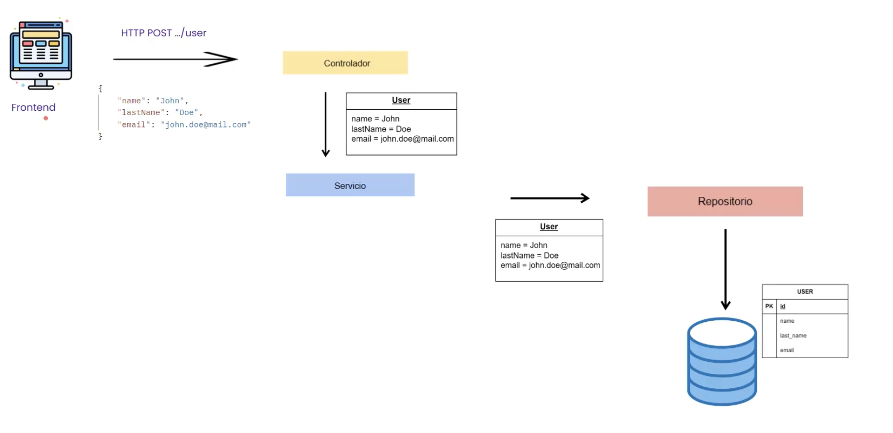
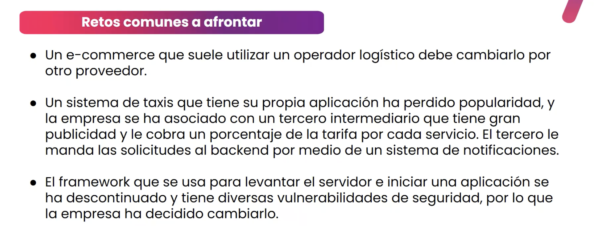
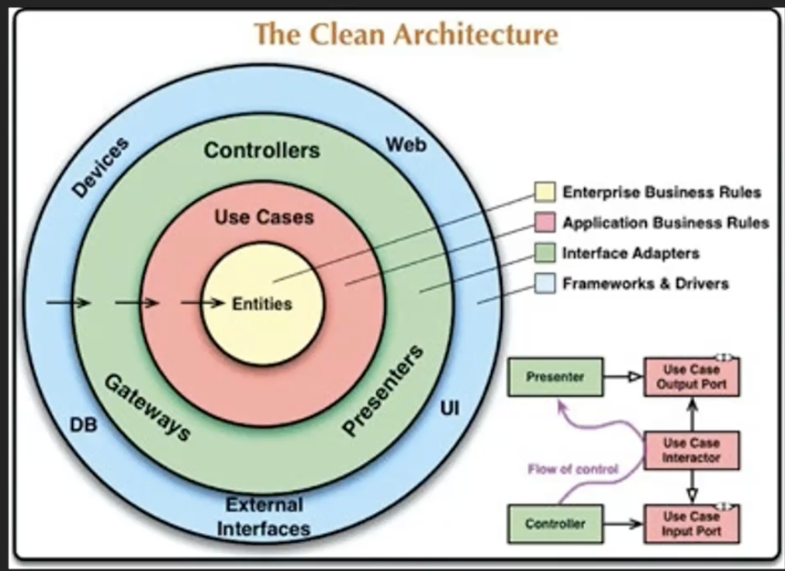

# Clase 5.2 - Arquitectura Limpia (Clean Architecture)

---

## 📑 Índice

1. [Arquitecturas Clásicas](#1-arquitecturas-clásicas)
2. [Arquitectura Limpia](#2-arquitectura-limpia)
3. [Capas de la Arquitectura Limpia](#3-capas-de-la-arquitectura-limpia)
4. [Regla de Dependencia](#4-regla-de-dependencia)
5. [Implementación Práctica](#5-implementación-práctica)
6. [Resumen](#6-resumen)

---

## 1. Arquitecturas Clásicas

### Arquitectura en Capas (Layered Architecture)

La arquitectura en capas es el patrón más tradicional, donde la aplicación se divide en capas horizontales, cada una con una responsabilidad específica.

#### Capas típicas del patrón MVC

| Capa | Responsabilidad | Componentes |
|------|-----------------|-------------|
| **Presentación (View)** | Interfaz de usuario | HTML, CSS, Templates, UI Components |
| **Controlador (Controller)** | Orquesta las peticiones | Controllers, Handlers, Endpoints |
| **Lógica de Negocio (Model/Service)** | Reglas de negocio | Services, Business Logic |
| **Acceso a Datos (Repository)** | Persistencia | DAOs, Repositories, ORM |
| **Base de Datos** | Almacenamiento | SQL, NoSQL |

#### Flujo de una petición

```text
Usuario → Controlador → Servicio → Repositorio → Base de Datos
                ↓
            Respuesta ← ← ← ← ← ← ← ← ← ← ← ← ←
```

#### Ejemplo de Arquitectura en Capas



```text
📁 src/
├── 📁 controllers/          # Capa de Presentación
│   └── UserController.java
├── 📁 services/              # Capa de Negocio
│   └── UserService.java
├── 📁 repositories/          # Capa de Datos
│   └── UserRepository.java
└── 📁 models/                # Entidades
    └── User.java
```

### Retos Comunes de la Arquitectura en Capas



| Reto | Descripción | Consecuencia |
|------|-------------|--------------|
| **Acoplamiento alto** | Las capas superiores dependen directamente de las inferiores | Cambiar la BD requiere modificar múltiples capas |
| **Dificultad para testing** | La lógica de negocio está acoplada a frameworks y BD | Tests lentos y frágiles |
| **Lógica dispersa** | Reglas de negocio esparcidas entre controladores y servicios | Código difícil de mantener |
| **Dependencia de frameworks** | El núcleo de la aplicación depende de Spring, Hibernate, etc. | Difícil migrar o actualizar tecnologías |
| **Violación de SRP** | Servicios hacen demasiadas cosas | Clases gigantes y complejas |

---

## 2. Arquitectura Limpia

### ¿Qué es la Arquitectura Limpia?

Debe ser:

- Modular
- Mantenible
- Desacoplado

La **Arquitectura Limpia** (Clean Architecture) es un conjunto de principios y estilos arquitectónicos propuestos por **Robert C. Martin (Uncle Bob)** que buscan:

| Principio | Descripción |
|-----------|-------------|
| **Independencia de Frameworks** | El negocio no depende de Spring, Django, etc. Los frameworks son herramientas, no el centro |
| **Testeable** | Las reglas de negocio se pueden probar sin UI, BD, ni servicios externos |
| **Independencia de UI** | La UI puede cambiar (web, móvil, CLI) sin afectar el negocio |
| **Independencia de BD** | Puedes cambiar de MySQL a MongoDB sin tocar la lógica de negocio |
| **Independencia de agentes externos** | El negocio no sabe nada de APIs externas, emails, etc. |

### Diagrama Estándar de Clean Architecture



El diagrama se lee de **afuera hacia adentro**

---

## 3. Capas de la Arquitectura Limpia

### 🟡 Capa de Dominio (Enterprise Business Rules)

Es el **núcleo de la aplicación**. Contiene todo lo relacionado con la **lógica de negocio pura**.

| Componente | Descripción | Ejemplo |
|------------|-------------|---------|
| **Entidades (Entities)** | Clases que representan los objetos del negocio con sus reglas | `Usuario`, `CuentaBancaria`, `Producto`, `Pedido` |
| **Value Objects** | Objetos inmutables que representan conceptos del dominio | `Email`, `Dinero`, `Direccion` |
| **Domain Services** | Lógica que no pertenece a una entidad específica | `CalculadoraDeImpuestos`, `ValidadorDeCredito` |

```java
// Ejemplo: Entidad de Dominio
public class CuentaBancaria {
    private final String numeroCuenta;
    private BigDecimal saldo;
    
    public void depositar(BigDecimal monto) {
        if (monto.compareTo(BigDecimal.ZERO) <= 0) {
            throw new MontoInvalidoException("El monto debe ser positivo");
        }
        this.saldo = this.saldo.add(monto);
    }
    
    public void retirar(BigDecimal monto) {
        if (monto.compareTo(this.saldo) > 0) {
            throw new SaldoInsuficienteException("Saldo insuficiente");
        }
        this.saldo = this.saldo.subtract(monto);
    }
}
```

### 🟠 Capa de Casos de Uso (Application Business Rules)

Define **cómo se usa el sistema**. Orquesta las entidades para cumplir objetivos del negocio.

| Componente | Descripción | Ejemplo |
|------------|-------------|---------|
| **Casos de Uso (Use Cases)** | Acciones que el usuario puede realizar en el sistema | `RealizarTransferencia`, `RegistrarUsuario`, `GenerarReporte` |
| **Interfaces de Puertos** | Contratos abstractos para dependencias externas | `RepositorioUsuario`, `ServicioEmail`, `GeneradorFactura` |
| **DTOs de Entrada/Salida** | Objetos para comunicar datos entre capas | `TransferenciaRequest`, `UsuarioResponse` |

```java
// Ejemplo: Caso de Uso
public class RealizarTransferenciaUseCase {
    private final CuentaRepository cuentaRepository;  // Interface, no implementación
    private final NotificacionService notificacionService;  // Interface
    
    public TransferenciaResponse ejecutar(TransferenciaRequest request) {
        // 1. Obtener cuentas
        CuentaBancaria origen = cuentaRepository.buscarPorNumero(request.getCuentaOrigen());
        CuentaBancaria destino = cuentaRepository.buscarPorNumero(request.getCuentaDestino());
        
        // 2. Ejecutar lógica de negocio (en las entidades)
        origen.retirar(request.getMonto());
        destino.depositar(request.getMonto());
        
        // 3. Persistir cambios
        cuentaRepository.guardar(origen);
        cuentaRepository.guardar(destino);
        
        // 4. Notificar
        notificacionService.enviarConfirmacion(request);
        
        return new TransferenciaResponse("Transferencia exitosa");
    }
}
```

### 🟢 Capa de Adaptadores de Interfaz (Interface Adapters)

**Traduce** datos entre el formato del dominio y el formato externo.

| Componente | Descripción | Ejemplo |
|------------|-------------|---------|
| **Controllers** | Reciben peticiones HTTP y las convierten a llamadas de casos de uso | `TransferenciaController` |
| **Presenters** | Formatean la respuesta para la UI | `JsonPresenter`, `HtmlPresenter` |
| **Gateways/Repositories Impl** | Implementan las interfaces definidas en casos de uso | `CuentaRepositoryJPA`, `EmailServiceSMTP` |
| **Mappers** | Convierten entre entidades y DTOs | `CuentaMapper` |

```java
// Ejemplo: Controller (Adaptador)
@RestController
@RequestMapping("/api/transferencias")
public class TransferenciaController {
    private final RealizarTransferenciaUseCase realizarTransferencia;
    
    @PostMapping
    public ResponseEntity<TransferenciaResponse> transferir(
            @RequestBody TransferenciaRequest request) {
        TransferenciaResponse response = realizarTransferencia.ejecutar(request);
        return ResponseEntity.ok(response);
    }
}

// Ejemplo: Repository Implementation (Adaptador)
@Repository
public class CuentaRepositoryJPA implements CuentaRepository {
    private final CuentaJpaRepository jpaRepository;
    private final CuentaMapper mapper;
    
    @Override
    public CuentaBancaria buscarPorNumero(String numero) {
        CuentaEntity entity = jpaRepository.findByNumeroCuenta(numero);
        return mapper.toDomain(entity);  // Convierte Entity JPA → Dominio
    }
}
```

### 🔵 Capa de Frameworks y Drivers (Frameworks & Drivers)

La capa más **externa**. Contiene detalles técnicos y configuraciones.

| Componente | Descripción | Ejemplo |
|------------|-------------|---------|
| **Frameworks Web** | Spring Boot, Express, Django | Configuración de Spring |
| **Base de Datos** | JPA Entities, configuración de BD | `@Entity`, `application.yml` |
| **UI** | Templates, React, Angular | Componentes frontend |
| **Servicios Externos** | APIs de terceros, SDKs | AWS SDK, Stripe API |

---

## 4. Regla de Dependencia

### La Regla de Oro 🏆

> **Las dependencias del código fuente solo pueden apuntar hacia ADENTRO.**

```text
Frameworks → Adapters → Use Cases → Entities
    ↑                                    ↑
 EXTERNO                             INTERNO
(Detalles)                          (Políticas)
```

### Inversión de Dependencias

Para que la capa interna no dependa de la externa, usamos **interfaces**:

```java
// ❌ MAL: El caso de uso depende de JPA (framework externo)
public class TransferenciaUseCase {
    private final CuentaJpaRepository repository;  // Dependencia de Spring Data
}

// ✅ BIEN: El caso de uso depende de una abstracción
public class TransferenciaUseCase {
    private final CuentaRepository repository;  // Interface del dominio
}

// La implementación concreta está en la capa externa
@Repository
public class CuentaRepositoryJPA implements CuentaRepository {
    // Implementación con JPA
}
```

---

## 5. Implementación Práctica

### Estructura de Carpetas Recomendada

```text
📁 src/main/java/com/ejemplo/banco/
├── 📁 domain/                          # 🟡 DOMINIO
│   ├── 📁 entities/
│   │   ├── CuentaBancaria.java
│   │   └── Usuario.java
│   ├── 📁 valueobjects/
│   │   ├── Email.java
│   │   └── Dinero.java
│   ├── 📁 exceptions/
│   │   ├── SaldoInsuficienteException.java
│   │   └── CuentaNoEncontradaException.java
│   └── 📁 services/
│       └── CalculadoraComisiones.java
│
├── 📁 application/                      # 🟠 CASOS DE USO
│   ├── 📁 usecases/
│   │   ├── RealizarTransferenciaUseCase.java
│   │   ├── ConsultarSaldoUseCase.java
│   │   └── RegistrarUsuarioUseCase.java
│   ├── 📁 ports/
│   │   ├── 📁 in/                       # Puertos de entrada
│   │   │   └── TransferenciaInputPort.java
│   │   └── 📁 out/                      # Puertos de salida
│   │       ├── CuentaRepository.java
│   │       └── NotificacionService.java
│   └── 📁 dto/
│       ├── TransferenciaRequest.java
│       └── TransferenciaResponse.java
│
├── 📁 adapters/                         # 🟢 ADAPTADORES
│   ├── 📁 in/
│   │   ├── 📁 web/
│   │   │   ├── TransferenciaController.java
│   │   │   └── UsuarioController.java
│   │   └── 📁 cli/
│   │       └── BancoCommandLine.java
│   └── 📁 out/
│       ├── 📁 persistence/
│       │   ├── CuentaRepositoryJPA.java
│       │   ├── CuentaEntity.java
│       │   └── CuentaMapper.java
│       └── 📁 messaging/
│           └── EmailNotificacionService.java
│
└── 📁 infrastructure/                   # 🔵 FRAMEWORKS
    ├── 📁 config/
    │   ├── BeanConfiguration.java
    │   └── SecurityConfig.java
    └── 📁 persistence/
        └── JpaConfig.java
```

### Ejemplo Completo: Flujo de Transferencia

```text
1. HTTP Request POST /transferencias
        ↓
2. TransferenciaController (Adapter IN)
   - Recibe JSON, valida formato
        ↓
3. RealizarTransferenciaUseCase (Application)
   - Orquesta la lógica
        ↓
4. CuentaBancaria.retirar() / .depositar() (Domain)
   - Ejecuta reglas de negocio
        ↓
5. CuentaRepositoryJPA (Adapter OUT)
   - Persiste en BD
        ↓
6. EmailNotificacionService (Adapter OUT)
   - Envía confirmación
        ↓
7. Response JSON al cliente
```

---

## 6. Resumen

### 🎯 Puntos Clave

| Concepto | Descripción |
|----------|-------------|
| **Arquitectura en Capas** | Tradicional, simple pero con alto acoplamiento |
| **Clean Architecture** | Separa negocio de detalles técnicos |
| **Dominio** | Entidades + Reglas de negocio (núcleo) |
| **Casos de Uso** | Qué puede hacer el usuario con el sistema |
| **Adaptadores** | Traducen entre dominio y mundo exterior |
| **Frameworks** | Detalles técnicos (BD, Web, etc.) |
| **Regla de Dependencia** | Las dependencias apuntan hacia adentro |

### 📊 Comparativa Rápida

| Aspecto | Arq. en Capas | Clean Architecture |
|---------|---------------|-------------------|
| Complejidad inicial | Baja | Media-Alta |
| Mantenibilidad | Media | Alta |
| Testabilidad | Difícil | Fácil |
| Flexibilidad tecnológica | Baja | Alta |
| Curva de aprendizaje | Corta | Larga |
| Ideal para | Proyectos pequeños | Proyectos medianos/grandes |
