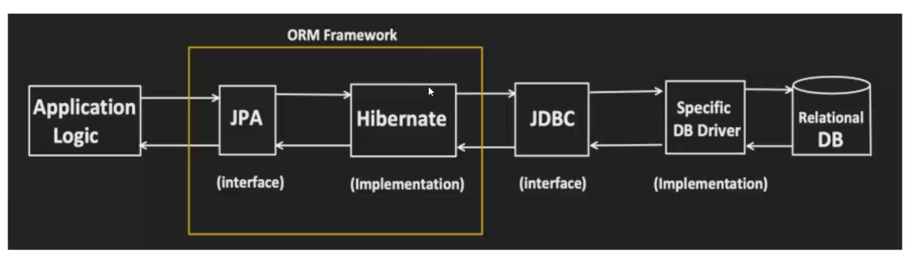
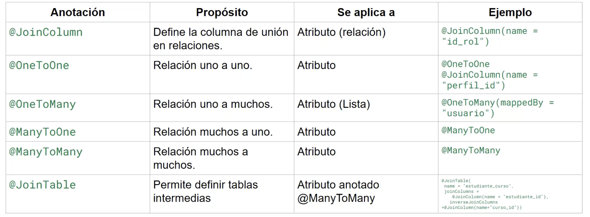
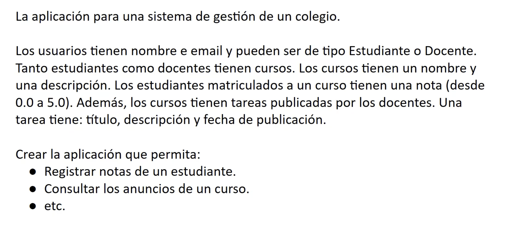

# Clase 6 - Spring Data / JPA

---

## 📑 Índice

1. [Conceptos clave](#conceptos-clave)
2. [JPA (Java Persistence API)](#jpa-java-persistence-api)
3. [Anotaciones básicas de JPA](#anotaciones-básicas-de-jpa)
4. [Anotaciones de relación](#anotaciones-de-relación)
5. [Tarea: Sistema de gestión de colegio](#tarea-aplicación-spring--jpa)

---

## Conceptos clave

### JDBC (Java Database Connectivity)

La forma **tradicional** de establecer conexión entre Java y una base de datos.

**Características de JDBC:**

- Se debe configurar una clase de conexión/configuración con la DB
- La conexión se abre **manualmente**
- Las consultas SQL se escriben directamente en el código (*hard-coded*)
- Es un **Driver** que permite establecer conexiones con distintas bases de datos

### ORM (Object Relational Mapping)

**Definición:** Técnica de programación que permite mapear objetos de un lenguaje orientado a objetos a tablas de una base de datos relacional.

**Ventajas de los ORM:**

- Simplifican la interacción con las bases de datos
- Administran automáticamente las conexiones
- Gestionan las transacciones
- Facilitan las consultas mediante nombres de métodos (Query Methods)
- Reducen el código boilerplate

---

## JPA (Java Persistence API)

**JPA** es la especificación estándar de Java para el mapeo objeto-relacional.

**Características principales:**

- Es una **interfaz/especificación** (no una implementación)
- Permite mapear objetos Java a tablas de bases de datos SQL
- Define un conjunto de anotaciones para el mapeo
- **Hibernate** es la implementación más popular de JPA

### Flujo de conexión



**Capas de la arquitectura:**

| Capa | Descripción |
|------|-------------|
| **Application** | Código de la aplicación que utiliza las entidades |
| **JPA (Hibernate)** | Capa de persistencia que maneja el mapeo ORM |
| **JDBC** | Driver de conexión a la base de datos |
| **Database** | Base de datos relacional (MySQL, PostgreSQL, etc.) |

---

## Anotaciones básicas de JPA

Las anotaciones de JPA se utilizan para definir cómo se mapean las clases Java a las tablas de la base de datos.

| Anotación | Descripción |
|-----------|-------------|
| `@Entity` | Marca una clase como una entidad JPA (tabla en la DB) |
| `@Table` | Especifica el nombre de la tabla en la base de datos |
| `@Id` | Define el campo como clave primaria |
| `@GeneratedValue` | Configura la estrategia de generación automática del ID |
| `@Column` | Personaliza el mapeo de una columna (nombre, nullable, unique, etc.) |
| `@Transient` | Indica que el campo NO debe persistirse en la base de datos |

### Ejemplo de entidad básica

```java
@Entity
@Table(name = "estudiantes")
public class Estudiante {
    
    @Id
    @GeneratedValue(strategy = GenerationType.IDENTITY)
    private Long id;
    
    @Column(name = "nombre_completo", nullable = false)
    private String nombre;
    
    @Column(unique = true)
    private String email;
    
    @Transient
    private int edad; // No se guarda en la DB
}
```

---

## Anotaciones de relación

Las anotaciones de relación definen cómo se conectan las entidades entre sí.



| Anotación | Cardinalidad | Descripción |
|-----------|--------------|-------------|
| `@OneToOne` | 1:1 | Relación uno a uno (ej: Usuario - Perfil) |
| `@OneToMany` | 1:N | Relación uno a muchos (ej: Departamento - Empleados) |
| `@ManyToOne` | N:1 | Relación muchos a uno (inversa de OneToMany) |
| `@ManyToMany` | N:M | Relación muchos a muchos (ej: Estudiantes - Cursos) |
| `@JoinColumn` | - | Especifica la columna de unión (foreign key) |

### Ejemplo de relaciones

```java
// Relación OneToMany (Un departamento tiene muchos empleados)
@Entity
public class Departamento {
    @Id
    @GeneratedValue(strategy = GenerationType.IDENTITY)
    private Long id;
    
    private String nombre;
    
    @OneToMany(mappedBy = "departamento")
    private List<Empleado> empleados;
}

// Relación ManyToOne (Muchos empleados pertenecen a un departamento)
@Entity
public class Empleado {
    @Id
    @GeneratedValue(strategy = GenerationType.IDENTITY)
    private Long id;
    
    private String nombre;
    
    @ManyToOne
    @JoinColumn(name = "departamento_id")
    private Departamento departamento;
}
```

---

## TAREA: Aplicación Spring + JPA

**Sistema de gestión de un colegio:**


