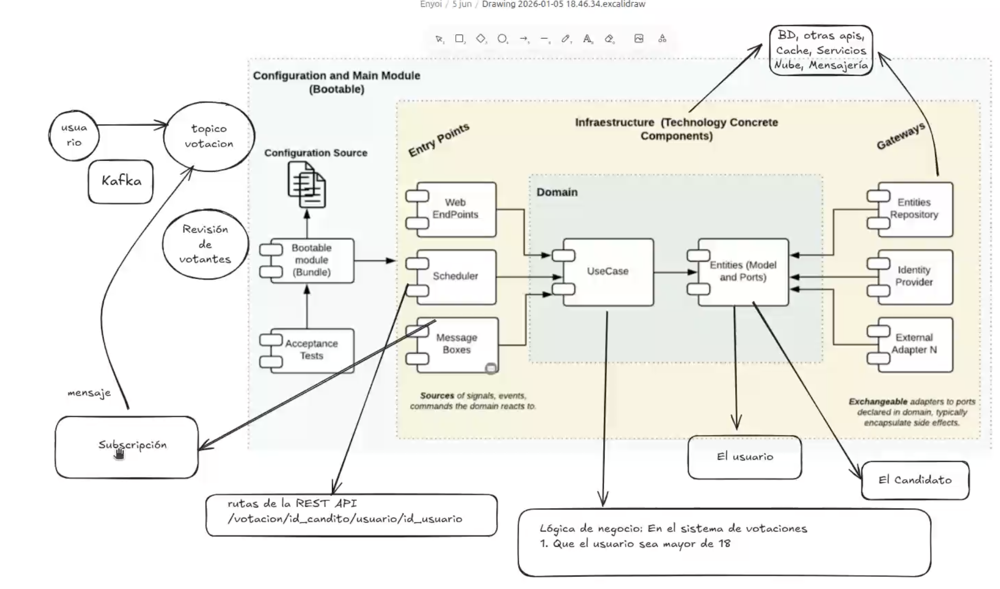
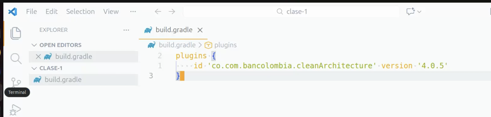
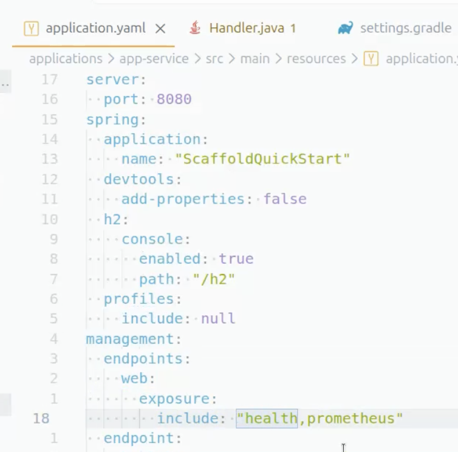
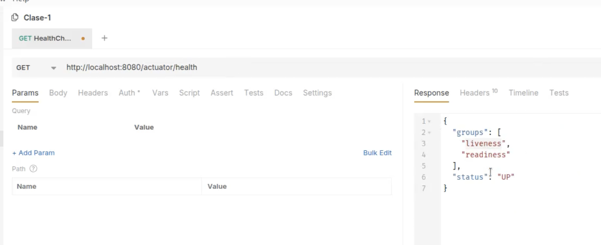

# Clase 8 - Repaso de Arquitectura Limpia y Herramientas

## Índice

1. [Scaffolding de Bancolombia](#scaffolding-de-bancolombia)
2. [Build.gradle](#buildgradle)
3. [Brokers y Mensajería](#brokers-y-mensajería)
4. [Spring Boot y Herramientas](#spring-boot-y-herramientas)
5. [Despliegue y Contenedores](#despliegue-y-contenedores)

## Resumen

Esta clase cubre los conceptos fundamentales del Scaffold de Arquitectura Limpia de Bancolombia, además de la estructura modular de proyectos Java, configuración de Gradle, brokers de mensajería (Kafka, RabbitMQ, AWS SNS/SQS), Dead Letter Queues, Spring Boot Actuator, y herramientas de despliegue con Docker y Kubernetes.

---

## Scaffolding de Bancolombia

Un **Scaffold** es un template que proporciona la estructura base de un proyecto, en este caso, un microservicio Java implementando Arquitectura Limpia. A diferencia de las automatizaciones que ofrece el IDE, este Scaffold separa las capas en módulos independientes a nivel de compilación, garantizando el aislamiento y la correcta separación de responsabilidades.



**Repositorio oficial:** <https://github.com/bancolombia/scaffold-clean-architecture?tab=readme-ov-file>

### Estructura del Scaffold

- **Infraestructura (Infrastructure):** Contiene los Adaptadores que implementan tecnologías específicas (bases de datos, APIs REST, colas de mensajería, etc.). Esta capa es la más externa y depende del dominio.

- **Dominio (Domain):** Alberga la lógica de negocio pura, incluyendo las entidades del dominio y los casos de uso (UseCases). No tiene dependencias externas y representa el núcleo del sistema.

- **Plugin de Validación:** Ejecuta un script en cada build que valida las reglas de Arquitectura Limpia. Por ejemplo, verifica que el `build.gradle` del módulo "model" no contenga dependencias externas, manteniendo la pureza del dominio.

- **Settings.gradle:** Es el archivo que une todos los submódulos del proyecto. Define qué módulos forman parte del proyecto multi-módulo de Gradle.

- **Main.gradle (Build principal):** Configura el build global y genera un archivo `.jar` final que agrupa todos los módulos compilados del proyecto.

### Inicialización del Scaffold

Solo se necesita tener instalado Gradle y crear un archivo `build.gradle` con el plugin de Scaffold para inicializar la estructura:



## Build.gradle

El archivo `build.gradle` define las dependencias y configuraciones de compilación del proyecto. Gradle distingue diferentes tipos de dependencias según su alcance y propósito:

### Tipos de Dependencias

- **`implementation`:** Dependencias que se incluirán en el `.jar` compilado final (producción). Son necesarias para que la aplicación funcione en tiempo de ejecución. Ejemplo: librerías de Spring Boot, conectores de bases de datos.

- **`testImplementation`:** Dependencias que solo se instalan y están disponibles durante la ejecución de las pruebas unitarias. No se incluyen en el artefacto de producción. Ejemplo: JUnit, Mockito, Hamcrest.

- **`testRuntimeOnly`:** Dependencias necesarias en tiempo de ejecución solo para las pruebas, pero no para compilar el código de test. Ejemplo: drivers de bases de datos H2 para pruebas.

- **`compileOnly`:** Dependencias que solo se necesitan durante la compilación del código, pero no se incluyen en el resultado de producción. Son útiles para anotaciones y APIs que se proporcionan en tiempo de ejecución por el contenedor. Ejemplo: Lombok, anotaciones de Jakarta/Javax.

- **`runtimeOnly`:** Dependencias necesarias solo en tiempo de ejecución, no para compilación. Ejemplo: drivers JDBC específicos.

- **`annotationProcessor`:** Procesadores de anotaciones que generan código durante la compilación. Ejemplo: Lombok, MapStruct.

- **`api`:** Similar a `implementation`, pero expone las dependencias transitivamente a otros módulos que dependan de este. Útil en proyectos multi-módulo.

---

## Brokers y Mensajería

Los **brokers de mensajería** permiten implementar arquitecturas basadas en eventos y comunicación asíncrona entre servicios. Facilitan el desacoplamiento entre productores y consumidores de mensajes.

### Kafka

**Apache Kafka** es una plataforma distribuida de streaming de eventos diseñada para manejar grandes volúmenes de datos en tiempo real. Se utiliza para:

- **Mensajería pub/sub:** Los productores publican mensajes en topics y los consumidores se suscriben a esos topics.
- **Procesamiento de streams:** Permite transformar y procesar flujos de datos en tiempo real.
- **Alta disponibilidad:** Diseñado para ser distribuido, tolerante a fallos y escalable horizontalmente.
- **Persistencia:** Almacena los mensajes en disco, permitiendo el replay de eventos.

**Características principales:**

- Modelo de particiones para paralelización
- Retención configurable de mensajes
- Consumer groups para balanceo de carga

### RabbitMQ

**RabbitMQ** es un broker de mensajería que implementa el protocolo AMQP (Advanced Message Queuing Protocol). Se caracteriza por:

- **Colas tradicionales:** Modelo basado en colas donde los mensajes se entregan a un solo consumidor.
- **Exchanges y Routing:** Permite enrutamiento complejo de mensajes mediante diferentes tipos de exchanges (direct, topic, fanout, headers).
- **Garantías de entrega:** Soporta acknowledgments y confirmaciones para asegurar que los mensajes se procesen correctamente.
- **Más ligero que Kafka:** Ideal para volúmenes menores con patrones de enrutamiento complejos.

**Casos de uso:**

- Procesamiento de tareas en background
- Implementación de patrones request-reply
- Comunicación entre microservicios

### AWS SNS/SQS

**AWS SNS (Simple Notification Service)** y **SQS (Simple Queue Service)** son servicios de mensajería administrados en la nube de Amazon:

**SNS:**

- Servicio de notificaciones pub/sub
- Solo puede enviar notificaciones a aplicaciones expuestas en internet pública
- Permite fan-out (un mensaje a múltiples destinos)

**SQS:**

- Servicio de colas administrado
- A diferencia de Kafka, no utiliza suscripciones. Los consumidores realizan **long polling** (sondeo largo) para obtener mensajes de la cola.
- Dos tipos: Standard (mayor throughput, sin orden garantizado) y FIFO (orden garantizado, menor throughput)
- Escalabilidad automática

### Dead Letter Queue (DLQ)

Las **Dead Letter Queues** son colas especiales donde se redirigen los mensajes o eventos que no pudieron ser procesados correctamente después de varios intentos.

**Objetivos principales:**

- **Aislamiento de errores:** Evitar que mensajes problemáticos bloqueen el procesamiento de mensajes válidos.
- **Análisis y debugging:** Permiten inspeccionar mensajes fallidos para identificar y corregir problemas.
- **Reintentos controlados:** Posibilidad de reprocesar manualmente los mensajes una vez solucionado el problema.
- **Monitoreo:** Facilitan la alerta y seguimiento de errores recurrentes en el sistema.

**Implementación:**

- Configuración de número máximo de reintentos
- Routing automático a DLQ tras superar el límite
- Posibilidad de definir diferentes DLQs por tipo de error

### Comparativa: ¿Cuál Broker Usar?

| Criterio | Kafka | RabbitMQ | AWS SNS/SQS |
| -------- | ----- | -------- | ----------- |
| **Licencia** | Código abierto (Apache 2.0) | Código abierto (Mozilla Public License) | Propietario/Administrado por AWS |
| **Modelo** | Streaming de eventos (log distribuido) | Mensajería tradicional (colas) | Pub/Sub (SNS) + Colas (SQS) |
| **Throughput** | Muy alto (millones msg/seg) | Medio-Alto (decenas de miles msg/seg) | Alto, escalado automático |
| **Latencia** | Baja (milisegundos) | Muy baja (microsegundos) | Media (depende de polling) |
| **Persistencia** | Sí, configurable (días/semanas) | Opcional (en disco o RAM) | Sí, hasta 14 días |
| **Orden de mensajes** | Garantizado por partición | No garantizado (excepto con configuración especial) | Solo en SQS FIFO |
| **Replay de eventos** | Sí, consumidores pueden retroceder | No | No |
| **Complejidad** | Alta (requiere gestión de clúster) | Media | Baja (servicio administrado) |
| **Costos** | Infraestructura propia | Infraestructura propia | Pay-per-use (por mensajes procesados) |

### ¿Cuándo usar Kafka?

**Escenarios ideales:**

✅ **Event Sourcing y CQRS:** Cuando necesitas mantener un log inmutable de todos los eventos del sistema.

✅ **Streaming en tiempo real:** Procesamiento de grandes volúmenes de datos (IoT, analytics, métricas).

✅ **Microservicios con eventos de dominio:** Cuando múltiples servicios necesitan reaccionar al mismo evento.

✅ **Replay de eventos:** Necesitas reprocesar eventos históricos (auditoría, recuperación de errores).

✅ **Alta disponibilidad y durabilidad:** Datos críticos que no pueden perderse.

**Ventajas específicas:**

- Código abierto, sin vendor lock-in
- Ecosistema maduro (Kafka Streams, Kafka Connect)
- Escalabilidad horizontal probada
- Comunidad grande y activa

**Desventajas:**

- Curva de aprendizaje pronunciada
- Requiere equipo especializado para operación
- Mayor overhead de infraestructura (ZooKeeper/KRaft, múltiples brokers)
- Configuración y tuning complejos

### ¿Cuándo usar RabbitMQ?

**Escenarios ideales:**

✅ **Patrones de enrutamiento complejos:** Cuando necesitas routing dinámico basado en reglas (topic exchanges, headers).

✅ **Request-Reply:** Implementación de RPC asíncrono entre servicios.

✅ **Procesamiento de tareas:** Job queues, workers pools, procesamiento en background.

✅ **Baja latencia:** Aplicaciones que requieren respuesta inmediata (trading, notificaciones en tiempo real).

✅ **Adopción rápida:** Equipos que necesitan implementar mensajería sin mucha complejidad.

**Ventajas específicas:**

- Código abierto con licencia permisiva
- Más simple de operar que Kafka
- Latencia muy baja
- Soporte para múltiples protocolos (AMQP, MQTT, STOMP)
- Excelente para volúmenes moderados

**Desventajas:**

- No está diseñado para streaming de eventos
- Menor throughput comparado con Kafka
- Sin replay de mensajes
- Escalabilidad horizontal más limitada

### ¿Cuándo usar AWS SNS/SQS?

**Escenarios ideales:**

✅ **Infraestructura en AWS:** Cuando tu aplicación ya está desplegada en AWS.

✅ **Zero operations:** Equipos pequeños sin capacidad de gestionar infraestructura.

✅ **Escalabilidad automática:** Cargas de trabajo con picos impredecibles.

✅ **Fan-out simple:** SNS para notificar múltiples destinos simultáneamente.

✅ **Desacoplamiento de microservicios:** Comunicación asíncrona sin gestionar brokers.

**Ventajas específicas:**

- Sin infraestructura que gestionar
- Integración nativa con servicios AWS (Lambda, S3, DynamoDB)
- Pago por uso (cost-effective para bajo volumen)
- Alta disponibilidad garantizada por AWS
- SQS FIFO para orden estricto de mensajes

**Desventajas:**

- Vendor lock-in (dependencia de AWS)
- Costos pueden escalar significativamente con alto volumen
- No disponible on-premise o en otras nubes
- Funcionalidad más básica comparada con Kafka/RabbitMQ
- Long polling puede añadir latencia

### Tabla de Decisión Rápida

**Elige Kafka si:**

- Necesitas streaming de eventos y event sourcing
- Manejas millones de mensajes por segundo
- Requieres replay de eventos históricos
- Tienes equipo con expertise en operaciones

**Elige RabbitMQ si:**

- Necesitas enrutamiento complejo de mensajes
- Priorizas baja latencia sobre alto throughput
- Implementas patrones request-reply o RPC
- Buscas balance entre funcionalidad y simplicidad

**Elige AWS SNS/SQS si:**

- Tu infraestructura está en AWS
- No quieres gestionar brokers
- El volumen de mensajes es moderado
- Necesitas escalabilidad automática sin intervención

### Consideración: Soluciones Híbridas

En arquitecturas complejas, es común usar **múltiples brokers** para diferentes propósitos:

- **Kafka** para eventos de dominio y streaming de datos
- **RabbitMQ** para comandos y request-reply entre servicios
- **AWS SQS** para procesamiento de tareas no críticas y colas de trabajo

**Ejemplo en Bancolombia:**

- Eventos de transacciones financieras → Kafka (auditoría, event sourcing)
- Notificaciones push a usuarios → RabbitMQ (baja latencia)
- Procesamiento batch de reportes → AWS SQS (escalabilidad automática)

---

## Spring Boot y Herramientas

### Spring WebFlux y Concurrencia

- **WebFlux** es la librería reactiva de Spring que implementa un modelo de programación no bloqueante.
- Genera un **Event Loop** similar al de Node.js para permitir concurrencia eficiente.
- Utiliza **hilos virtuales** (green threads) que consumen menos recursos que los hilos tradicionales del sistema operativo.
- Ideal para aplicaciones con alta concurrencia I/O-bound.

### Spring Boot Actuator

**Actuator** es un conjunto de endpoints que Spring Boot proporciona por defecto para monitoreo y gestión de aplicaciones. Se activan mediante configuración en `application.yml`:



**Endpoints importantes:**

- `/actuator/health` - Estado de salud de la aplicación
- `/actuator/metrics` - Métricas de rendimiento
- `/actuator/info` - Información de la aplicación
- `/actuator/env` - Variables de entorno

### Health Checks en Kubernetes

Al desplegar en Kubernetes, es fundamental distinguir entre dos tipos de health checks:



- **Liveness Probe:** Verifica si el contenedor está vivo (prendió). Si falla, Kubernetes reinicia el pod.
- **Readiness Probe:** Verifica si el contenedor está listo para recibir tráfico (está listo para responder solicitudes). Si falla, Kubernetes deja de enviar tráfico al pod sin reiniciarlo.

**Configuración típica:**

```yaml
livenessProbe:
  httpGet:
    path: /actuator/health/liveness
    port: 8080
readinessProbe:
  httpGet:
    path: /actuator/health/readiness
    port: 8080
```

---

## Despliegue y Contenedores

### Gradle Wrapper

- **No es necesario instalar Gradle** en la máquina local.
- Se utiliza el **Gradle Wrapper** (archivos `gradlew` en Linux/Mac o `gradlew.bat` en Windows).
- El wrapper permite ejecutar comandos de Gradle en el proyecto sin instalación previa:

  ```bash
  ./gradlew build
  ./gradlew test
  ```

### Herramientas de Gestión

**SDK Manager (SDKman):**

- Herramienta similar a NVM pero para Java y herramientas JVM
- Permite administrar múltiples versiones de JDK, Gradle, Maven, Kotlin, etc.
- **Sitio oficial:** <https://sdkman.io/>
- Instalación sencilla y cambio de versiones sin conflictos

**Podman:**

- Alternativa a Docker, sin daemon y sin necesidad de privilegios root
- Compatible con imágenes y comandos de Docker
- **Nativo y gratuito:** <https://podman.io/>
- Más seguro para entornos de producción

### Ejecución de la Aplicación

**Ejecución local con Java:**

```bash
# Desde la raíz del proyecto después del build
java -jar applications/app-service/build/libs/ScaffoldQuickStart.jar
```

**Construcción de imagen Docker:**

```bash
# Desde la raíz del proyecto
docker build -t java-image-app . -f deployment/Dockerfile
```

**Ejecución del contenedor:**

```bash
docker run -p 8080:8080 -t java-image-app:latest
```

### Buenas Prácticas en Bancolombia

- En Bancolombia se utiliza un **Digest de un Registry privado** para las imágenes Docker.
- Esto garantiza la integridad y seguridad de las imágenes utilizadas en producción.
- El digest es un hash SHA256 inmutable que identifica unívocamente una versión específica de la imagen.
