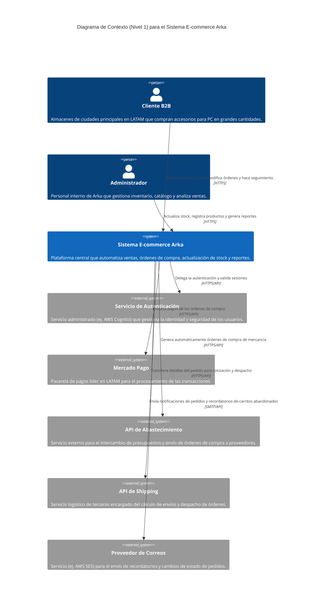

# Definición de Contexto de Negocio - Sistema E-commerce Arka

## Acuerdos de Integración y Sistemas Externos

Con el fin de resolver las ambigüedades iniciales para el diseño de la arquitectura de Arka, se han establecido las siguientes definiciones estratégicas:

1. **Sistema de Pagos:** Se integra **Mercado Pago** como pasarela de pagos principal, dado el enfoque de expansión en LATAM (Colombia, Ecuador, Perú y Chile).
2. **Integración de Abastecimiento:** Se consumirá una **API de terceros** (servicio externo) para la gestión de reabastecimiento e intercambio de presupuestos con proveedores.
3. **Logística y Envíos (Shipping):** Se consumirá una **API de terceros** para el cálculo de envíos y logística. Una vez la orden es confirmada, este servicio externo se encarga del flujo de despacho.
4. **Gestión de Identidad y Autenticación:** Se utilizará un **Servicio Administrado** (tipo AWS Cognito) para la gestión de identidades y acceso de los usuarios.
5. **Interfaz de Usuario (Frontend / BFF):** Aunque las interfaces web/móvil serán desarrolladas para Arka, se **omiten** explícitamente estas capas y las de BFF en este diagrama de contexto inicial para enfocarse exclusivamente en el núcleo del sistema y sus integraciones externas.
6. **Notificaciones (Existente):** Se mantiene el uso de un proveedor de correos (tipo AWS SES) para las notificaciones de estado de pedidos y carritos abandonados.

## Diagrama C1

## Diagrama C2

```mermaid
C4Container
title Diagrama de Contenedores (Nivel 2) - Backend E-commerce Arka

Person(cliente, "Cliente B2B", "Usuarios de almacenes que interactúan vía API para comprar.")
Person(admin, "Administrador", "Personal de Arka gestionando inventario y revisando reportes.")

System_Ext(cognito, "AWS Cognito", "Servicio administrado para autenticación y autorización.")
System_Ext(mercadoPago, "Mercado Pago", "Pasarela externa para el procesamiento de pagos.")
System_Ext(proveedorAPI, "API de Abastecimiento", "Sistema externo de proveedores para reabastecimiento.")
System_Ext(shippingAPI, "API de Shipping", "Operador logístico externo para cotización y despacho.")
System_Ext(ses, "AWS SES", "Servicio administrado para el envío de correos transaccionales.")

System_Boundary(backend, "Sistema E-commerce Arka (AWS Infrastructure)") {

    Container(apiGateway, "API Gateway", "Spring Cloud Gateway", "Punto de entrada único. Enruta peticiones, maneja seguridad y rate limiting.")

    Container(orderService, "Order Service", "Java, Spring Boot", "Orquestador principal. Gestiona la creación de órdenes e inicia la Saga transaccional.")
    ContainerDb(orderDb, "Order DB", "PostgreSQL", "Almacena transacciones y el estado del ciclo de vida de las órdenes.")

    Container(paymentService, "Payment Service", "Java, Spring Boot", "Gestiona transacciones monetarias externas y maneja la idempotencia de cobros.")
    ContainerDb(paymentDb, "Payment DB", "PostgreSQL", "Mantiene estado transaccional, llaves de idempotencia y tabla Outbox de eventos.")

    Container(inventoryService, "Inventory Service", "Java, Spring Boot", "Controla el stock en tiempo real y gestiona reabastecimiento.")
    ContainerDb(inventoryDb, "Inventory DB", "PostgreSQL", "Almacena existencias físicas y previene sobreventas con bloqueos relacionales ACID.")

    Container(catalogService, "Catalog Service", "Java, Spring Boot", "Gestiona productos, categorías, atributos y consultas.")
    ContainerDb(catalogDb, "Catalog DB", "DynamoDB", "Base de datos NoSQL clave-valor optimizada para lecturas de baja latencia.")

    Container(cartService, "Cart Service", "Java, Spring Boot", "Gestiona carritos. Ejecuta internamente un CronJob para detectar y procesar carritos abandonados.")
    ContainerDb(cartDb, "Cart DB", "DynamoDB", "Almacena el estado persistente de los carritos para el seguimiento y recuperación de ventas.")

    Container(reporterService, "Reporter Service", "Java, Spring Boot", "Genera analíticas, reportes semanales y listados de abastecimiento (CQRS).")
    ContainerDb(reporterDb, "Reporter DB", "PostgreSQL", "Almacena vistas materializadas optimizadas para lectura analítica.")

    Container(notificationService, "Notification Service", "Java, Spring Boot", "Renderiza plantillas y delega envío de alertas al cliente.")
    ContainerDb(notificationDb, "Notification DB", "MongoDB", "Almacena plantillas de correo e historiales de notificaciones en formato documental.")

    Container(shippingService, "Shipping Service", "Java, Spring Boot", "Cotiza envíos, administra guías y coordina despacho logístico.")
    ContainerDb(shippingDb, "Shipping DB", "PostgreSQL", "Mantiene históricos de guías de envío, cotizaciones y previene duplicidad de despachos.")

    ContainerQueue(kafka, "Message Broker", "Apache Kafka", "Bus de eventos central. Facilita EDA, el patrón Outbox y la orquestación asíncrona de la Saga.")
}

Rel(cliente, apiGateway, "Realiza peticiones a las APIs", "JSON/HTTPS")
Rel(admin, apiGateway, "Realiza peticiones a las APIs", "JSON/HTTPS")

Rel(apiGateway, cognito, "Delega autenticación y valida tokens JWT", "HTTPS")

Rel(apiGateway, orderService, "Enruta creación/modificación de órdenes", "JSON/HTTPS")
Rel(apiGateway, catalogService, "Enruta búsquedas de catálogo", "JSON/HTTPS")
Rel(apiGateway, cartService, "Enruta gestión de carritos", "JSON/HTTPS")
Rel(apiGateway, inventoryService, "Enruta actualización manual de stock", "JSON/HTTPS")
Rel(apiGateway, reporterService, "Solicita extracción de reportes", "JSON/HTTPS")

Rel(orderService, orderDb, "Lee/Escribe", "R2DBC/JDBC")
Rel(paymentService, paymentDb, "Lee/Escribe", "R2DBC/JDBC")
Rel(inventoryService, inventoryDb, "Lee/Escribe", "R2DBC/JDBC")
Rel(catalogService, catalogDb, "Lee/Escribe", "AWS SDK")
Rel(cartService, cartDb, "Lee/Escribe", "AWS SDK")
Rel(reporterService, reporterDb, "Lee/Escribe", "R2DBC/JDBC")
Rel(notificationService, notificationDb, "Lee/Escribe", "MongoDB Driver")
Rel(shippingService, shippingDb, "Lee/Escribe", "R2DBC/JDBC")

%% Transacción Síncrona Crítica (Prevención de Sobreventas)
Rel(orderService, inventoryService, "Valida y reserva stock de productos", "JSON/HTTPS (Síncrono)")

%% Integraciones a Terceros
Rel(paymentService, mercadoPago, "Procesa intentos de pago y valida webhooks", "JSON/HTTPS")
Rel(inventoryService, proveedorAPI, "Dispara órdenes automáticas de abastecimiento", "JSON/HTTPS")
Rel(shippingService, shippingAPI, "Cotiza fletes y transfiere orden de despacho", "JSON/HTTPS")
Rel(notificationService, ses, "Despacha plantillas renderizadas para envío final", "AWS SDK/API")

%% Integración Asíncrona / Orquestación Saga y EDA
Rel(orderService, kafka, "Coordina Saga (Comandos de Pago/Envío, Compensaciones)", "Kafka Protocol")
Rel(paymentService, kafka, "Consume comandos, publica estado vía Outbox", "Kafka Protocol")
Rel(shippingService, kafka, "Consume eventos de despacho, publica guías", "Kafka Protocol")
Rel(inventoryService, kafka, "Publica eventos de quiebre de stock", "Kafka Protocol")
Rel(cartService, kafka, "Publica alertas de carritos abandonados detectados internamente", "Kafka Protocol")
Rel(reporterService, kafka, "Consume eventos de dominio para nutrir vistas CQRS", "Kafka Protocol")
Rel(notificationService, kafka, "Consume eventos consolidados para generar correos", "Kafka Protocol")
```

