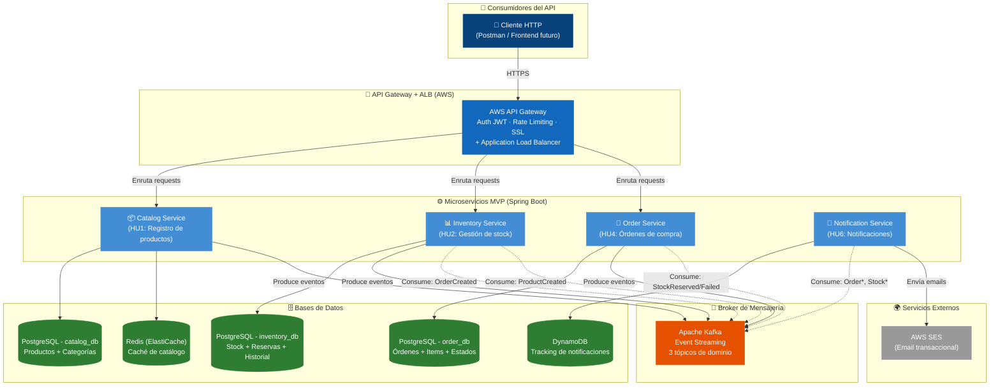

# MVP Backend Arka - Arquitectura de Microservicios

**Proyecto:** Arka - Plataforma B2B de Distribución de Accesorios para PC  
**Stack Técnico:** Java + Spring Boot, Apache Kafka, PostgreSQL, DynamoDB, Redis, AWS (API Gateway, ALB, SES, RDS)  
**Basado en:** [arquitectura-backend-arka-c4-nivel2.md](arquitectura-backend-arka-c4-nivel2.md) v2.0

---

## 1. Justificación del MVP

### ¿Por qué un MVP?

La arquitectura completa definida en el documento C4 Nivel 2 contempla **11 microservicios**, **4 tipos de bases de datos**, **BFF Layer**, **funciones Lambda**, **EventBridge**, y múltiples servicios AWS. Dado que **no es posible cumplir con todas las actividades en el tiempo asignado**, se requiere una **reducción estratégica del alcance** que entregue valor de negocio real con los recursos y tiempo disponibles.

### Principio de Diseño del MVP

> **"Resolver primero el problema que más duele"**

Según los PDFs del proyecto, los problemas críticos de Arka son:

1. **Sobreventa por concurrencia** → Se han vendido más productos de los que había en stock
2. **Gestión manual del inventario** → Insostenible con el volumen actual
3. **Ausencia de flujo automatizado de pedidos** → Tiempos de atención altos
4. **Clientes desinformados** → No saben el estado de sus pedidos

Las 4 HUs de alta prioridad atacan exactamente estos problemas.

### Qué INCLUYE este MVP

| Componente               | Justificación                                                         |
| ------------------------ | --------------------------------------------------------------------- |
| **Catalog Service**      | HU1 - Registrar productos (dominio: catálogo maestro)                 |
| **Inventory Service**    | HU2 - Actualizar stock (dominio: disponibilidad física)               |
| **Order Service**        | HU4 - Registrar órdenes de compra                                     |
| **Notification Service** | HU6 - Notificaciones de estado del pedido                             |
| **Apache Kafka**         | Broker de mensajería para comunicación asíncrona entre servicios      |
| **API Gateway + ALB**    | Punto de entrada único, Auth (JWT/Cognito futuro), Rate Limiting, SSL |
| **PostgreSQL (RDS)**     | Database per Service para cada microservicio (ACID crítico)           |
| **Redis (ElastiCache)**  | Caché de catálogo para lecturas de alta frecuencia                    |

### Qué NO INCLUYE este MVP (diferido a fases posteriores)

| Componente Diferido      | HU / Razón                                           | Prioridad Original |
| ------------------------ | ---------------------------------------------------- | ------------------ |
| Auth Service             | Se maneja con API Gateway (Cognito/Auth0 futuro)     | -                  |
| Cart Service             | HU8 - Carritos abandonados                           | Media              |
| Reporting Service        | HU7 - Reportes semanales / HU3 - Reportes stock bajo | Media / Baja       |
| Payment Service          | No hay HU directa; se simplifica flujo en MVP        | -                  |
| Shipping Service         | No hay HU directa de alta prioridad                  | -                  |
| Supplier Service         | HU3 - Reportes abastecimiento                        | Baja               |
| Recommendation Service   | Sin HU asociada                                      | -                  |
| BFF Layer (Web/Mobile)   | Excluido explícitamente                              | -                  |
| Frontend                 | Excluido explícitamente                              | -                  |
| DocumentDB               | Sin Recommendations en MVP                           | -                  |
| AWS Lambda / EventBridge | Sin reportes automáticos en MVP                      | -                  |
| Strangler Fig (Shipping) | Migración diferida                                   | -                  |

---

## 2. Historias de Usuario del MVP

### HU1 - Registrar productos en el sistema (Catalog Service)

> Como administrador, quiero registrar nuevos productos con sus características para que los clientes puedan comprarlos.

**Criterios de aceptación:**

- Se debe permitir la carga de nombre, descripción, precio, stock inicial y categoría
- Validaciones de datos requeridos (campos obligatorios, precio > 0, SKU único)
- Mensaje de confirmación tras el registro exitoso
- Al registrar un producto, se publica evento `ProductCreated` vía Kafka → Inventory Service crea el registro de stock inicial

### HU2 - Actualizar stock de productos (Inventory Service)

> Como administrador, quiero actualizar la cantidad de productos en stock para evitar sobreventas.

**Criterios de aceptación:**

- El sistema debe permitir modificar el stock de un producto
- No se deben permitir valores negativos (constraint `stock >= 0` a nivel de BD)
- Historial de cambios en el stock (tabla `stock_movements` con auditoría)
- Reserva temporal de stock con lock pesimista para prevenir race conditions

### HU4 - Registrar una orden de compra (Order Service)

> Como cliente, quiero poder registrar una orden de compra con múltiples productos para realizar mi pedido.

**Criterios de aceptación:**

- Se debe validar la disponibilidad del stock (vía Saga con Inventory Service)
- Registro de fecha y detalles del pedido
- Mensaje de confirmación con resumen del pedido
- Máquina de estados: `PENDING` → `CONFIRMED` → `IN_DISPATCH` → `DELIVERED` (o `CANCELLED`)

### HU6 - Notificación de cambio de estado del pedido (Notification Service)

> Como cliente, quiero recibir notificaciones sobre el estado de mi pedido para estar informado de su progreso.

**Criterios de aceptación:**

- Notificación por correo electrónico (AWS SES)
- Estados notificados: pendiente, confirmado, en despacho, entregado
- Cada transición de estado del pedido dispara una notificación automática vía evento Kafka

---

## 3. Diagrama C4 Nivel 2 - Contenedores (MVP)

### Diagrama Visual (Mermaid.js)



### Comparativa: Arquitectura Completa vs MVP

| Aspecto                | Arquitectura Completa (v2.0)                                                                                     | MVP (v1.0)                                      |
| ---------------------- | ---------------------------------------------------------------------------------------------------------------- | ----------------------------------------------- |
| **Microservicios**     | 11 (Auth, Catalog, Inventory, Cart, Order, Payment, Shipping, Supplier, Reporting, Notification, Recommendation) | **4** (Catalog, Inventory, Order, Notification) |
| **Bases de datos**     | 7 PostgreSQL + DynamoDB + DocumentDB + Redis                                                                     | **3 PostgreSQL + Redis + DynamoDB**             |
| **Broker**             | Kafka + SQS/SNS + EventBridge                                                                                    | **Kafka**                                       |
| **Compute**            | EC2/ECS + Lambda                                                                                                 | **EC2/ECS**                                     |
| **Entrada**            | API Gateway + ALB + BFF Web + BFF Mobile                                                                         | **API Gateway + ALB**                           |
| **Tópicos Kafka**      | 9+ tópicos                                                                                                       | **3 tópicos**                                   |
| **Servicios externos** | SES + Twilio + MercadoPago + PayU + Legacy Shipping                                                              | **SES**                                         |
| **Autenticación**      | Auth Service dedicado                                                                                            | **API Gateway (Cognito futuro)**                |
| **Complejidad**        | Alta                                                                                                             | **Media-Baja**                                  |
| **HUs cubiertas**      | 8 (HU1-HU8)                                                                                                      | **4** (HU1, HU2, HU4, HU6)                      |

---

## 4. Responsabilidades de Cada Contenedor (MVP)

### 4.0 Decisión Arquitectónica: ¿Por qué Catalog e Inventory son servicios separados?

Esta es una pregunta fundamental que merece una justificación sólida basada en **Domain-Driven Design (DDD)** y las características únicas del negocio de Arka.

#### Bounded Contexts Diferentes

Según Eric Evans (DDD) y la arquitectura hexagonal, cada microservicio debe representar un **bounded context** — un límite lógico del dominio con su propio lenguaje ubicuo y responsabilidades.

| Aspecto                       | Catalog Service (📦)                                                                           | Inventory Service (📊)                                             |
| ----------------------------- | ---------------------------------------------------------------------------------------------- | ------------------------------------------------------------------ |
| **Bounded Context**           | Catálogo Maestro de Productos                                                                  | Disponibilidad Física y Reservas                                   |
| **Pregunta de negocio**       | ¿QUÉ vendemos?                                                                                 | ¿CUÁNTO hay disponible?                                            |
| **Responsabilidad principal** | Información descriptiva de productos (nombre, precio, categoría, atributos técnicos, imágenes) | Cantidad disponible, reservas temporales, historial de movimientos |
| **Naturaleza de los datos**   | **Datos maestros** — relativamente estáticos                                                   | **Datos transaccionales** — altamente dinámicos                    |
| **Frecuencia de cambios**     | Baja (producto se registra una vez, actualiza ocasionalmente)                                  | **Muy alta** (cada venta/reserva/abastecimiento modifica stock)    |
| **Patrón de acceso**          | 95% lecturas, 5% escrituras                                                                    | 60% escrituras, 40% lecturas                                       |
| **Problema crítico**          | Búsqueda y filtrado eficiente                                                                  | **Sobreventa por concurrencia** (problema #1 de Arka)              |
| **Mecanismo de consistencia** | Eventual (cambio de precio no afecta órdenes en curso)                                         | **ACID estricto** (lock pesimista para evitar race conditions)     |
| **Estrategia de escalado**    | **Horizontal con caché agresivo** (Redis)                                                      | **Vertical con ACID riguroso** (PostgreSQL con locks)              |
| **Equipo propietario**        | Producto / Marketing                                                                           | Operaciones / Logística                                            |
| **Ciclo de vida**             | Producto puede existir sin stock (pre-orden)                                                   | Stock puede existir sin producto visible (descontinuado)           |
| **Eventos de dominio**        | `ProductCreated`, `ProductUpdated`, `PriceChanged`                                             | `StockReserved`, `StockReleased`, `StockUpdated`                   |
| **Integraciones externas**    | Futuro: proveedores de información de productos, APIs de fabricantes                           | Futuro: WMS (Warehouse Management System), proveedores             |

#### Justificación desde los Problemas de Arka

Según los PDFs del proyecto, Arka ha tenido **incidentes críticos de sobreventa** donde se vendieron más productos de los que había en stock debido a alta concurrencia. Este problema requiere:

1. **Lock pesimista (`SELECT ... FOR UPDATE`)** en la tabla de stock — bloquea el row mientras se verifica y reserva
2. **Transacciones ACID estrictas** — no se puede tolerar consistencia eventual
3. **Reservas temporales con timeout** — libera stock si el pago no se completa en 15 minutos

Si **Catalog e Inventory estuvieran juntos**, implicaría:

- ❌ Las **lecturas del catálogo** (alta frecuencia, bajo costo) competirían por conexiones de BD con las **transacciones de stock** (lock pesimista, alta criticidad)
- ❌ Un **cambio en cómo se presenta el catálogo** (ej: agregar filtros dinámicos) requeriría desplegar el mismo servicio que maneja locking crítico de stock — riesgo de regresión
- ❌ No se podría **cachear agresivamente** el catálogo (porque el servicio también maneja escrituras transaccionales de stock)
- ❌ Los **equipos de producto y operaciones** tendrían que coordinarse para CADA cambio, incluso si no afecta al otro dominio

#### Patrón Cache-Aside con Redis

Con servicios separados, se habilita el siguiente flujo optimizado:

```text
Cliente consulta catálogo:
  └─> API GW ─> Catalog Service ─> Redis (HIT 95% del tiempo, <1ms)
                                       └─> PostgreSQL (MISS 5%, ~20ms)

Cliente crea orden:
  └─> Order Service ─> Kafka: OrderCreated
       └─> Inventory Service ─> PostgreSQL con SELECT FOR UPDATE (lock)
            └─> Reserva stock atómicamente
            └─> Kafka: StockReserved / StockReserveFailed
```

**Beneficios tangibles:**

- ✅ **Latencia del catálogo:** <10ms (desde Redis) vs ~50ms (PostgreSQL con joins)
- ✅ **Throughput de reservas:** No degradado por lecturas del catálogo
- ✅ **Disponibilidad independiente:** Si Catalog Service cae, aún se pueden procesar órdenes (Inventory sigue funcionando)
- ✅ **Equipos autónomos:** Marketing puede iterar en el catálogo sin afectar crítico de stock

#### ¿Cuándo UNIR Catalog e Inventory?

Si Arka fuera un **negocio más simple** con:

- Volumen bajo (<100 pedidos/día)
- Sin problema de sobreventa (suficiente stock siempre)
- Un solo equipo gestionando todo

Entonces, sí podrían estar juntos en un **Product Service** único. Pero dado el contexto de Arka (alto volumen de transacciones, expansión LATAM, modelo B2B con alta concurrencia, problema crítico de sobreventa), la **separación es justificada incluso en el MVP**.

---

### 4.1 API Gateway + Application Load Balancer (AWS)

**Tipo:** Infraestructura como Servicio  
**Responsabilidades en MVP:**

- ✅ **Punto de entrada único** para todos los consumidores del API
- ✅ **Autenticación JWT** — AWS API Gateway con Lambda Authorizer o Amazon Cognito (decisión pendiente para fase posterior)
- ✅ **Rate Limiting** — 100 req/s por IP para prevenir abuso
- ✅ **Terminación SSL/TLS** — HTTPS obligatorio
- ✅ **Enrutamiento por path** directamente a los microservicios (sin BFF)
- ✅ **Balanceo de carga** vía ALB con health checks automáticos
- ✅ **Logging centralizado** — CloudWatch Logs

> **Nota sobre Autenticación:** En el MVP, la validación de JWT se maneja a nivel de API Gateway usando Lambda Authorizers. No hay un servicio de autenticación dedicado. En fases posteriores, se evaluará integrar con Amazon Cognito, Auth0 u otro proveedor según los requerimientos de RBAC y multi-tenancy.

**Rutas del API Gateway (MVP):**

| Método | Path                              | Servicio destino  | Descripción                               |
| ------ | --------------------------------- | ----------------- | ----------------------------------------- |
| `POST` | `/api/v1/products`                | Catalog Service   | Registrar producto (HU1)                  |
| `GET`  | `/api/v1/products`                | Catalog Service   | Listar productos                          |
| `GET`  | `/api/v1/products/{id}`           | Catalog Service   | Consultar producto                        |
| `PUT`  | `/api/v1/products/{id}`           | Catalog Service   | Actualizar producto                       |
| `PUT`  | `/api/v1/inventory/{sku}/stock`   | Inventory Service | Actualizar stock (HU2)                    |
| `GET`  | `/api/v1/inventory/{sku}`         | Inventory Service | Consultar stock                           |
| `GET`  | `/api/v1/inventory/{sku}/history` | Inventory Service | Historial de stock (HU2)                  |
| `POST` | `/api/v1/orders`                  | Order Service     | Crear orden (HU4)                         |
| `GET`  | `/api/v1/orders/{id}`             | Order Service     | Consultar orden                           |
| `GET`  | `/api/v1/orders`                  | Order Service     | Listar órdenes por cliente                |
| `PUT`  | `/api/v1/orders/{id}/status`      | Order Service     | Cambiar estado (Admin: dispatch, deliver) |

> **Diferencia clave vs arquitectura completa:** En el MVP, el API Gateway enruta **directamente** a los microservicios. No hay capa BFF intermedia. Esto simplifica la arquitectura pero implica que los microservicios devuelven respuestas genéricas (no optimizadas por plataforma).

---

### 4.2 Catalog Service (Servicio de Catálogo) — HU1

**HU cubierta:** HU1 - Registrar productos en el sistema

**Responsabilidades en MVP:**

- 📦 **CRUD de productos** con atributos: SKU, nombre, descripción, precio, categoría
- 📂 **Gestión de categorías** — CRUD básico de categorías maestras
- ✅ **Validaciones de negocio:**
  - Campos obligatorios (nombre, precio, SKU, categoría)
  - Precio > 0
  - SKU único en el sistema
- 📊 **Publicación de eventos a Kafka:**
  - `ProductCreated` → Consumed por Inventory Service para crear registro de stock inicial
  - `ProductUpdated` → Informar cambios a otros servicios

**Base de Datos:** PostgreSQL (catalog_db)

```text
catalog_db
├── categories
│   ├── id (UUID, PK)
│   ├── name (VARCHAR, NOT NULL, UNIQUE)
│   ├── description (TEXT)
│   └── created_at (TIMESTAMP)
│
└── products
    ├── id (UUID, PK)
    ├── sku (VARCHAR, NOT NULL, UNIQUE)
    ├── name (VARCHAR, NOT NULL)
    ├── description (TEXT)
    ├── price (DECIMAL(12,2), NOT NULL, CHECK > 0)
    ├── category_id (UUID, FK → categories.id)
    ├── active (BOOLEAN, DEFAULT true)
    ├── created_at (TIMESTAMP)
    └── updated_at (TIMESTAMP)
```

**Endpoints:**

| Método   | Path             | Rol requerido   | Descripción                       |
| -------- | ---------------- | --------------- | --------------------------------- |
| `POST`   | `/products`      | ADMIN           | Registrar producto (HU1)          |
| `GET`    | `/products`      | CUSTOMER, ADMIN | Listar productos (paginado)       |
| `GET`    | `/products/{id}` | CUSTOMER, ADMIN | Consultar producto por ID         |
| `PUT`    | `/products/{id}` | ADMIN           | Actualizar producto               |
| `DELETE` | `/products/{id}` | ADMIN           | Desactivar producto (soft delete) |
| `POST`   | `/categories`    | ADMIN           | Crear categoría                   |
| `GET`    | `/categories`    | CUSTOMER, ADMIN | Listar categorías                 |

**Evento publicado a Kafka — `ProductCreated`:**

```json
{
  "eventId": "uuid-event-001",
  "eventType": "ProductCreated",
  "timestamp": "2026-02-21T10:00:00Z",
  "payload": {
    "productId": "uuid-prod-001",
    "sku": "GPU-RTX4090",
    "name": "NVIDIA RTX 4090",
    "price": 1599.99,
    "initialStock": 50,
    "categoryId": "uuid-cat-001"
  }
}
```

**Integración con Redis — Patrón Cache-Aside:**

El Catalog Service implementa Redis como caché de lectura para optimizar el acceso al catálogo de productos:

```text
┌─────────────────────────────────────────────────────────┐
│           CATÁLOGO: PATRÓN CACHE-ASIDE                  │
│                                                         │
│  Cliente solicita GET /products                         │
│          │                                              │
│          ▼                                              │
│  ┌──────────────────┐                                   │
│  │ Catalog Service  │                                   │
│  └────────┬─────────┘                                   │
│           │                                              │
│       1. Check Redis                                    │
│           │                                              │
│           ▼                                              │
│    ┌──────────────┐      HIT (95%)                      │
│    │    Redis     │ ───────────▶ Return <1ms            │
│    │ (ElastiCache)│                                     │
│    └──────┬───────┘                                     │
│           │                                              │
│       MISS (5%)                                         │
│           │                                              │
│           ▼                                              │
│  2. Query PostgreSQL                                    │
│    ┌────────────────┐                                   │
│    │  catalog_db    │  Read ~20ms                       │
│    │  (PostgreSQL)  │                                   │
│    └────────┬───────┘                                   │
│           │                                              │
│       3. Store in Redis (TTL: 1h)                       │
│           │                                              │
│           ▼                                              │
│    Return to client                                     │
└─────────────────────────────────────────────────────────┘

Invalidación de caché:
  ProductCreated/Updated → Invalida key en Redis → Próxima lectura rebuilt from PostgreSQL
```

**Justificación de Redis (NoSQL) en el MVP:**

| Criterio                    | PostgreSQL (solo)                       | PostgreSQL + Redis (MVP)                            |
| --------------------------- | --------------------------------------- | --------------------------------------------------- |
| **Latencia de lectura**     | ~20-50ms (query + network)              | **<1ms** (in-memory cache) ✅                       |
| **Throughput de lecturas**  | ~1,000 req/s (saturación de conexiones) | **10,000+ req/s** (Redis escala horizontalmente) ✅ |
| **Carga en PostgreSQL**     | 100% de lecturas golpean la BD          | **5% de lecturas** (solo cache misses) ✅           |
| **Complejidad operacional** | Baja                                    | Media (gestión de cache + invalidación)             |
| **Costo**                   | 1x RDS instance                         | 1x RDS + 1x ElastiCache (~1.3x costo total)         |

**Por qué tiene sentido para Arka:**

- El catálogo es **95% lecturas, 5% escrituras** (productos se registran pocas veces, se consultan millones de veces)
- Los clientes (almacenes) consultan el catálogo repetidamente antes de realizar compras en grandes cantidades
- La información de productos cambia raramente (precio, nombre, descripción)
- Reducir latencia de catálogo **mejora la UX** significativamente (<1ms vs 50ms)

**Estrategia de invalidación:**

- **Write-through:** Al crear/actualizar producto → escribe en PostgreSQL + invalida cache en Redis
- **TTL:** 1 hora en Redis (auto-expiry para datos eventualmente consistentes)
- **Eventos Kafka:** `ProductUpdated` → consumer invalida key específica en Redis

**Lo que se DIFIERE para fases posteriores:**

- Búsqueda con filtros dinámicos (marca, atributos técnicos) con Redis Search
- Gestión de precios multi-moneda (COP, USD, PEN, CLP)
- CQRS completo (escritura PostgreSQL, lectura desde Redis con replicate)
- Imágenes de productos (S3 + CloudFront CDN)

---

### 4.3 Inventory Service (Servicio de Inventario) — HU2

**Tipo:** Microservicio Spring Boot  
**HU cubierta:** HU2 - Actualizar stock de productos

**Responsabilidades en MVP:**

- 📊 **Control de stock en tiempo real** por SKU con constraint `stock >= 0` a nivel de BD
- 🔒 **Reserva temporal de stock** con timeout de 15 minutos — Usa `SELECT ... FOR UPDATE` (lock pesimista) para prevenir race conditions de concurrencia (resuelve el problema crítico de sobreventa)
- 📝 **Historial de cambios en stock** — Tabla `stock_movements` con trazabilidad completa (quién, cuándo, cuánto, por qué)
- ⏰ **Liberación de reservas expiradas** — Job periódico que libera stock de reservas con más de 15 minutos
- 🔔 **Publicación de eventos a Kafka:**
  - `StockReserved` → Order Service transiciona orden a CONFIRMED
  - `StockReserveFailed` → Order Service transiciona orden a CANCELLED
  - `StockReleased` → Cuando se libera reserva por timeout o cancelación
  - `StockUpdated` → Cuando admin actualiza stock manualmente

**Base de Datos:** PostgreSQL (inventory_db)

```text
inventory_db
├── stock
│   ├── id (UUID, PK)
│   ├── sku (VARCHAR, NOT NULL, UNIQUE)
│   ├── product_id (UUID, NOT NULL)
│   ├── quantity (INTEGER, NOT NULL, CHECK >= 0)  ← Constraint crítico
│   ├── reserved_quantity (INTEGER, DEFAULT 0)
│   ├── available_quantity (GENERATED: quantity - reserved_quantity)
│   ├── updated_at (TIMESTAMP)
│   └── version (BIGINT)  ← Optimistic locking adicional
│
├── stock_reservations
│   ├── id (UUID, PK)
│   ├── sku (VARCHAR, NOT NULL)
│   ├── order_id (UUID, NOT NULL, UNIQUE per sku)
│   ├── quantity (INTEGER, NOT NULL)
│   ├── status (ENUM: PENDING, CONFIRMED, EXPIRED, RELEASED)
│   ├── created_at (TIMESTAMP)
│   └── expires_at (TIMESTAMP, DEFAULT NOW() + 15min)
│
├── stock_movements  ← Historial completo (HU2)
│   ├── id (UUID, PK)
│   ├── sku (VARCHAR, NOT NULL)
│   ├── movement_type (ENUM: MANUAL_ADJUSTMENT, ORDER_RESERVE,
│   │                        ORDER_CONFIRM, RESERVATION_RELEASE,
│   │                        PRODUCT_CREATION)
│   ├── quantity_change (INTEGER, NOT NULL)  ← Positivo o negativo
│   ├── previous_quantity (INTEGER)
│   ├── new_quantity (INTEGER)
│   ├── reference_id (UUID)  ← orderId o userId según contexto
│   ├── reason (TEXT)
│   └── created_at (TIMESTAMP)
│
└── outbox_events  ← Transactional Outbox
    ├── id (UUID, PK)
    ├── event_type (VARCHAR)
    ├── topic (VARCHAR)
    ├── payload (JSONB)
    ├── status (ENUM: PENDING, PUBLISHED)
    └── created_at (TIMESTAMP)
```

**Consumer de Eventos Kafka:**

| Evento consumido | Tópico           | Acción                                                                |
| ---------------- | ---------------- | --------------------------------------------------------------------- |
| `ProductCreated` | `product-events` | Crea registro en tabla `stock` con quantity = initialStock            |
| `OrderCreated`   | `order-events`   | Reserva stock temporalmente (`SELECT ... FOR UPDATE` + timeout 15min) |
| `OrderCancelled` | `order-events`   | Libera reserva de stock, restaura quantity                            |

**Endpoints:**

| Método | Path                       | Rol requerido   | Descripción                        |
| ------ | -------------------------- | --------------- | ---------------------------------- |
| `PUT`  | `/inventory/{sku}/stock`   | ADMIN           | Actualizar stock manualmente (HU2) |
| `GET`  | `/inventory/{sku}`         | CUSTOMER, ADMIN | Consultar disponibilidad de un SKU |
| `GET`  | `/inventory/{sku}/history` | ADMIN           | Ver historial de movimientos (HU2) |

#### Patrón Crítico: Saga Choreography + Lock Pesimista

Este es el servicio que resuelve el **problema #1 de Arka** (sobreventa por concurrencia):

```sql
── OrderCreated event llega ──

BEGIN TRANSACTION;
  SELECT * FROM stock WHERE sku = 'GPU-RTX4090' FOR UPDATE;
  -- Lock adquirido: ningún otro thread puede modificar este row

  IF available_quantity >= requested_quantity THEN
    -- Decrementar available
    UPDATE stock SET reserved_quantity = reserved_quantity + :qty WHERE sku = :sku;

    -- Crear reserva con expiración
    INSERT INTO stock_reservations (sku, order_id, quantity, status, expires_at)
    VALUES (:sku, :orderId, :qty, 'PENDING', NOW() + INTERVAL '15 minutes');

    -- Registrar movimiento
    INSERT INTO stock_movements (sku, movement_type, quantity_change, ...)
    VALUES (:sku, 'ORDER_RESERVE', -:qty, ...);

    -- Guardar evento en outbox (MISMA transacción)
    INSERT INTO outbox_events (event_type, topic, payload, status)
    VALUES ('StockReserved', 'inventory-events', :json, 'PENDING');
  ELSE
    -- Stock insuficiente
    INSERT INTO outbox_events (event_type, topic, payload, status)
    VALUES ('StockReserveFailed', 'inventory-events', :json, 'PENDING');
  END IF;
COMMIT;
-- Lock liberado
```

**Liberación de reservas expiradas:**

Job periódico que ejecuta cada 60 segundos:

1. Busca reservas con `expires_at < NOW()` y `status = PENDING`
2. Para cada reserva expirada:
   - Marca como `EXPIRED`
   - Restaura stock (`quantity += reserved_qty`, `reserved_quantity -= reserved_qty`)
   - Registra movimiento en `stock_movements` (tipo: `RESERVATION_RELEASE`)
   - Publica evento `StockReleased` a Kafka (vía outbox)

**Lo que se DIFIERE para fases posteriores:**

- Alertas de umbral de reorden (`LowStockAlert`)
- Registro de mermas (daños, robos, pérdidas)
- Recepción de stock por compras a proveedores (`PurchaseOrderDelivered`)
- Integración con Supplier Service

---

### 4.4 Order Service (Servicio de Pedidos) — HU4

**Tipo:** Microservicio Spring Boot  
**HU cubierta:** HU4 - Registrar una orden de compra

**Responsabilidades en MVP:**

- 📝 **Creación de pedidos** con múltiples productos — Validación de datos y publicación de evento para que Inventory reserve stock
- 🎯 **Máquina de estados simplificada:**
  - `PENDING` → Pedido creado, esperando reserva de stock
  - `CONFIRMED` → Stock reservado exitosamente
  - `IN_DISPATCH` → Marcado por admin como en despacho
  - `DELIVERED` → Marcado por admin como entregado
  - `CANCELLED` → Cancelado por falta de stock o solicitud del cliente
- 🔄 **Participación en Saga Choreography** — Reacciona a eventos de Inventory Service
- 📊 **Publicación de eventos a Kafka:**
  - `OrderCreated` → Inventory Service reserva stock
  - `OrderConfirmed` → Notification Service envía confirmación
  - `OrderStatusChanged` → Notification Service envía actualización
  - `OrderCancelled` → Inventory Service libera stock + Notification Service notifica

**Base de Datos:** PostgreSQL (order_db)

```text
order_db
├── orders
│   ├── id (UUID, PK)
│   ├── customer_id (UUID, NOT NULL)
│   ├── status (ENUM: PENDING, CONFIRMED, IN_DISPATCH, DELIVERED, CANCELLED)
│   ├── total_amount (DECIMAL(12,2))
│   ├── customer_email (VARCHAR, NOT NULL)  ← Para notificaciones
│   ├── shipping_address (TEXT)
│   ├── notes (TEXT)
│   ├── created_at (TIMESTAMP)
│   └── updated_at (TIMESTAMP)
│
├── order_items
│   ├── id (UUID, PK)
│   ├── order_id (UUID, FK → orders.id)
│   ├── product_id (UUID, NOT NULL)
│   ├── sku (VARCHAR, NOT NULL)
│   ├── product_name (VARCHAR)  ← Snapshot al momento de compra
│   ├── quantity (INTEGER, NOT NULL, CHECK > 0)
│   ├── unit_price (DECIMAL(12,2), NOT NULL)
│   └── subtotal (DECIMAL(12,2), GENERATED: quantity * unit_price)
│
├── order_state_history  ← Auditoría de estados (Event Sourcing lite)
│   ├── id (UUID, PK)
│   ├── order_id (UUID, FK → orders.id)
│   ├── previous_status (VARCHAR)
│   ├── new_status (VARCHAR, NOT NULL)
│   ├── changed_by (UUID)  ← userId del que hizo el cambio
│   ├── reason (TEXT)
│   └── created_at (TIMESTAMP)
│
└── outbox_events  ← Transactional Outbox
    ├── id (UUID, PK)
    ├── event_type (VARCHAR)
    ├── topic (VARCHAR)
    ├── payload (JSONB)
    ├── status (ENUM: PENDING, PUBLISHED)
    └── created_at (TIMESTAMP)
```

**Consumer de Eventos Kafka:**

| Evento consumido     | Tópico             | Acción                                                    |
| -------------------- | ------------------ | --------------------------------------------------------- |
| `StockReserved`      | `inventory-events` | Transiciona orden a `CONFIRMED`, publica `OrderConfirmed` |
| `StockReserveFailed` | `inventory-events` | Transiciona orden a `CANCELLED`, publica `OrderCancelled` |
| `StockReleased`      | `inventory-events` | Si la orden estaba PENDING, transiciona a `CANCELLED`     |

**Endpoints:**

| Método | Path                  | Rol requerido   | Descripción                                  |
| ------ | --------------------- | --------------- | -------------------------------------------- |
| `POST` | `/orders`             | CUSTOMER        | Crear orden de compra (HU4)                  |
| `GET`  | `/orders/{id}`        | CUSTOMER, ADMIN | Consultar detalle de una orden               |
| `GET`  | `/orders`             | CUSTOMER, ADMIN | Listar órdenes (filtros: status, customerId) |
| `PUT`  | `/orders/{id}/status` | ADMIN           | Cambiar estado (dispatch, deliver)           |
| `PUT`  | `/orders/{id}/cancel` | CUSTOMER, ADMIN | Cancelar orden (solo si PENDING)             |

**Request para crear orden (HU4):**

```json
POST /api/v1/orders
{
  "customerId": "uuid-customer-001",
  "customerEmail": "almacen-bogota@email.com",
  "shippingAddress": "Cra 7 #32-16, Bogotá, Colombia",
  "items": [
    {
      "productId": "uuid-prod-001",
      "sku": "GPU-RTX4090",
      "quantity": 5
    },
    {
      "productId": "uuid-prod-002",
      "sku": "RAM-DDR5-32GB",
      "quantity": 20
    }
  ],
  "notes": "Entregar en horario laboral"
}
```

**Response (202 Accepted):**

```json
{
  "orderId": "uuid-order-001",
  "status": "PENDING",
  "message": "Orden registrada. Se validará la disponibilidad del stock.",
  "items": [
    { "sku": "GPU-RTX4090", "quantity": 5, "unitPrice": 1599.99 },
    { "sku": "RAM-DDR5-32GB", "quantity": 20, "unitPrice": 89.99 }
  ],
  "totalAmount": 9799.75,
  "createdAt": "2026-02-21T10:00:00Z"
}
```

> **Nota:** Se responde `202 Accepted` (no `201 Created`) porque la orden queda en estado `PENDING` hasta que el Inventory Service confirme la disponibilidad vía Saga asíncrona. El cliente puede consultar el estado con `GET /orders/{id}`.

**Decisión de MVP — Sin Payment Service:**

En el MVP, la Saga simplificada tiene **2 pasos** (no 3):

1. `Order Service` → `OrderCreated` → Kafka
2. `Inventory Service` → `StockReserved` / `StockReserveFailed` → Kafka
3. `Order Service` consume respuesta → `CONFIRMED` o `CANCELLED`

> El pago se maneja como proceso externo en el MVP. Los clientes de Arka son almacenes (modelo B2B), por lo que se utiliza facturación diferida con términos a 30-60 días. Esta simplificación permite validar el flujo crítico de órdenes sin la complejidad de integraciones con pasarelas de pago.

**Lo que se DIFIERE para fases posteriores:**

- HU5: Modificar órdenes antes de confirmación
- Integración con Payment Service (paso 3 de la Saga completa)
- Creación de orden desde Cart Service (`CartCheckedOut`)
- Integración con Shipping Service (`OrderConfirmed` → crear envío)

---

### 4.5 Notification Service (Servicio de Notificaciones) — HU6

**Tipo:** Microservicio Spring Boot  
**HU cubierta:** HU6 - Notificación de cambio de estado del pedido

**Responsabilidades en MVP:**

- 📧 **Envío de emails transaccionales** mediante servicio de email managed (AWS SES) para cada cambio de estado del pedido
- 🔔 **Eventos cubiertos (4 estados del pedido):**
  - `OrderConfirmed` → "Tu pedido #123 ha sido confirmado"
  - `OrderStatusChanged (IN_DISPATCH)` → "Tu pedido #123 ha sido despachado"
  - `OrderStatusChanged (DELIVERED)` → "Tu pedido #123 ha sido entregado"
  - `OrderCancelled` → "Tu pedido #123 ha sido cancelado. Motivo: stock insuficiente"
- 🔄 **Estrategia de reintentos** — Implementa backoff exponencial ante fallos del servicio de email
- 🆔 **Idempotencia garantizada** — Tracking de eventos procesados en DynamoDB para prevenir envíos duplicados

**Consumer de Eventos Kafka:**

| Evento consumido     | Tópico             | Acción                                    |
| -------------------- | ------------------ | ----------------------------------------- |
| `OrderConfirmed`     | `order-events`     | Email de confirmación al cliente          |
| `OrderStatusChanged` | `order-events`     | Email con nuevo estado (dispatch/deliver) |
| `OrderCancelled`     | `order-events`     | Email de cancelación con motivo           |
| `StockReserveFailed` | `inventory-events` | Email informando falta de stock           |

**Base de Datos:** DynamoDB (notifications_tracking)

**¿Por qué DynamoDB para Notification Service?**

| Aspecto                      | PostgreSQL (alternativa)           | DynamoDB (MVP) ✅                                        |
| ---------------------------- | ---------------------------------- | -------------------------------------------------------- |
| **Patrón de acceso**         | Requiere índices y conexiones      | Key-value lookup nativo (GetItem por eventId)            |
| **Latencia de idempotencia** | ~10-20ms (query con índice)        | **<5ms** (single-digit millisecond latency)              |
| **Escalabilidad**            | Vertical (más recursos)            | Auto-scaling horizontal sin límites                      |
| **TTL automático**           | Requiere cron job manual           | **TTL nativo** (limpieza automática de records antiguos) |
| **Overhead operacional**     | Gestión de conexiones, backups     | Fully managed, sin administración de BD                  |
| **Costo**                    | Instancia RDS fija                 | Pay-per-request (muy bajo para MVP)                      |
| **Consistencia**             | ACID (innecesario para esta tabla) | Eventually consistent (suficiente)                       |

**Modelo de datos DynamoDB:**

```text
Table: notifications_tracking
  - Partition Key: eventId (String)
  - Attributes:
    - eventType (String) — Tipo de evento procesado
    - processedAt (Number) — Unix timestamp
    - orderId (String) — Referencia a la orden
    - customerEmail (String) — Email destino
    - status (String) — SENT | FAILED
  - TTL: processedAt + 90 días (limpieza automática)
```

**Flujo de idempotencia:**

```text
1. Evento llega de Kafka (OrderConfirmed)
   ↓
2. DynamoDB GetItem(eventId)
   ↓
3a. Item existe → LOG "Duplicate event, skip" → FIN
3b. Item NO existe → Continuar
   ↓
4. Enviar email mediante servicio de email managed
   ↓
5. DynamoDB PutItem(eventId, status=SENT)
   ↓
6. Commit offset de Kafka
```

**Justificación arquitectónica:**

- **Notification Service es el único stateless por naturaleza** — No gestiona dominio de negocio, solo reacciona a eventos
- **El único estado que necesita es idempotencia** — Tracking de "ya procesé este evento"
- **Patrón de acceso = 100% key-value lookups** — DynamoDB es optimal para este caso
- **TTL elimina necesidad de limpieza manual** — Registros antiguos se borran automáticamente
- **Preparado para escalar** — Si el volumen de notificaciones crece masivamente, DynamoDB escala sin cambios arquitectónicos

> **Nota sobre trade-off:** Para el volumen actual del MVP B2B (cientos de almacenes), una tabla `processed_events` en PostgreSQL también sería suficiente. Se opta por DynamoDB para establecer el patrón desde el inicio y evitar migración futura cuando el volumen crezca con la expansión LATAM.

**Lo que se DIFIERE para fases posteriores:**

- Notificaciones SMS (Twilio / AWS SNS)
- Push notifications (mobile)
- Plantillas de email avanzadas con localización
- Recordatorios de carrito abandonado (requiere Cart Service)
- Alertas de stock bajo a administradores (requiere Reporting Service)
- Dead Letter Queue para eventos fallidos tras reintentos

---

### 4.6 Apache Kafka (Message Broker)

**Tipo:** Plataforma de Event Streaming  
**Justificación en MVP:** Kafka es el **nervio central** que habilita la comunicación asíncrona entre microservicios, la Saga Pattern y el desacoplamiento temporal. Sin Kafka, cada servicio tendría que llamar síncronamente a los otros, lo que genera acoplamiento fuerte y fallos en cascada.

**Tópicos del MVP (3 tópicos):**

| Tópico             | Productor(es)     | Consumidor(es)                          | Eventos                                                                  |
| ------------------ | ----------------- | --------------------------------------- | ------------------------------------------------------------------------ |
| `product-events`   | Catalog Service   | Inventory Service                       | `ProductCreated`, `ProductUpdated`                                       |
| `order-events`     | Order Service     | Inventory Service, Notification Service | `OrderCreated`, `OrderConfirmed`, `OrderStatusChanged`, `OrderCancelled` |
| `inventory-events` | Inventory Service | Order Service, Notification Service     | `StockReserved`, `StockReserveFailed`, `StockReleased`, `StockUpdated`   |

**Características de configuración:**

- **Particiones:** 3 por tópico (paralelismo básico)
- **Replicación:** Factor 1 en desarrollo, factor 3 en producción
- **Retención:** 7 días (168 horas)
- **Creación de tópicos:** Explícita (no auto-create)

**Consumer Groups (MVP):**

| Consumer Group               | Servicio             | Tópicos suscritos                  |
| ---------------------------- | -------------------- | ---------------------------------- |
| `inventory-service-group`    | Inventory Service    | `product-events`, `order-events`   |
| `order-service-group`        | Order Service        | `inventory-events`                 |
| `notification-service-group` | Notification Service | `order-events`, `inventory-events` |

**Formato de eventos (estándar para todos los servicios):**

```json
{
  "eventId": "uuid",
  "eventType": "OrderCreated",
  "timestamp": "2026-02-21T10:00:00Z",
  "source": "order-service",
  "correlationId": "uuid-correlation",
  "payload": { ... }
}
```

> **Extensibilidad:** Cuando se agreguen Cart Service, Payment Service, Shipping Service, etc. en fases posteriores, solo se necesita crear nuevos tópicos y consumer groups. Los servicios existentes no se modifican.

---

## 5. Flujos Críticos del MVP

### 5.1 Flujo Completo: Crear Orden de Compra (Happy Path — Saga Exitosa)

```text
[Cliente]
    │
    │ 1. POST /api/v1/orders
    │    { customerId, items: [{sku, qty}...], shippingAddress }
    ▼
[API Gateway + ALB]
    │ Valida autenticación (Lambda Authorizer)
    │ Rate Limiting
    │ Enruta a Order Service
    ▼
[Order Service]
    │ 2. Valida request (campos requeridos, cantidades > 0)
    │    Consulta precios actuales al Catalog Service (HTTP síncrono interno)
    │    Crea orden con estado PENDING
    │    Guarda en order_db:
    │      - orders (status=PENDING, total_amount calculado)
    │      - order_items (snapshot de precios)
    │      - order_state_history (PENDING)
    │
    │ 3. Guarda evento en outbox_events (MISMA transacción):
    │    Event: OrderCreated { orderId, items: [{sku, qty}...] }
    │
    │ 4. Responde al cliente: 202 Accepted
    │    { orderId, status: "PENDING", message: "Validando stock..." }
    │
    ▼
[Outbox Relay — Order Service]
    │ 5. Polling periódico (cada 5s): Lee outbox_events con status=PENDING
    │    Publica a Kafka: topic="order-events", event=OrderCreated
    │    Marca evento como PUBLISHED
    ▼
[Apache Kafka — topic: order-events]
    │
    │ 6. Distribuye evento a consumers
    │
    ├──────────────────────────────┐
    ▼                              ▼
[Inventory Service]          [Notification Service]
    │                              │
    │ 7. Consume OrderCreated      │ (No actúa en OrderCreated,
    │    Para CADA item del        │  espera confirmación)
    │    pedido:                   │
    │                              │
    │  BEGIN TRANSACTION;          │
    │   SELECT * FROM stock        │
    │   WHERE sku=:sku             │
    │   FOR UPDATE;  ← Lock       │
    │                              │
    │   IF available >= qty:       │
    │     Reserva stock            │
    │     Crea stock_reservation   │
    │     Registra movimiento      │
    │     Guarda StockReserved     │
    │     en outbox                │
    │  COMMIT;                     │
    │                              │
    │ 8. Outbox Relay publica:     │
    │    StockReserved             │
    ▼                              │
[Apache Kafka — topic: inventory-events]
    │                              │
    ├──────────────────────────────┤
    ▼                              ▼
[Order Service]              [Notification Service]
    │                              │
    │ 9. Consume StockReserved     │ 11. Consume OrderConfirmed
    │    Actualiza orden:          │     Envía email vía SES:
    │    status = CONFIRMED        │     "Tu pedido #uuid-001
    │    Registra en               │      ha sido confirmado"
    │    order_state_history       │
    │                              │
    │ 10. Publica evento:          │
    │     OrderConfirmed           │
    │     { orderId, customerEmail,│
    │       items, totalAmount }   │
    ▼                              ▼
                              [AWS SES]
                                  │
                                  │ Email al cliente:
                                  │ "Pedido #uuid-001 confirmado"
                                  ▼
                              [📧 Bandeja del cliente]
```

### 5.2 Flujo de Compensación: Stock Insuficiente (Saga Fallida)

```text
[Order Service]
    │ Publica OrderCreated
    ▼
[Inventory Service]
    │ Consume OrderCreated
    │ SELECT * FROM stock WHERE sku='GPU-RTX4090' FOR UPDATE;
    │ available_quantity = 3, requested = 10
    │ 3 < 10 → STOCK INSUFICIENTE ❌
    │
    │ Publica: StockReserveFailed
    │   { orderId, sku, requested: 10, available: 3,
    │     reason: "Insufficient stock" }
    ▼
[Apache Kafka — topic: inventory-events]
    │
    ├──────────────────────────────┐
    ▼                              ▼
[Order Service]              [Notification Service]
    │                              │
    │ Consume StockReserveFailed   │ Consume StockReserveFailed
    │ Actualiza orden:             │ Envía email vía SES:
    │ status = CANCELLED           │ "Lo sentimos, no hay stock
    │ reason = "Insufficient       │  suficiente para el producto
    │           stock for          │  GPU-RTX4090 (disponible: 3,
    │           GPU-RTX4090"       │  solicitado: 10)"
    │                              │
    │ Publica: OrderCancelled      │
    ▼                              ▼
```

### 5.3 Flujo: Actualización de Estado por Admin (Dispatch → Deliver)

```text
[Admin Arka]
    │
    │ PUT /api/v1/orders/uuid-001/status
    │ { "newStatus": "IN_DISPATCH" }
    ▼
[API Gateway + ALB]
    │ Valida JWT (rol ADMIN)
    ▼
[Order Service]
    │ Valida transición: CONFIRMED → IN_DISPATCH ✅
    │ Actualiza order.status = IN_DISPATCH
    │ Registra en order_state_history
    │ Publica: OrderStatusChanged
    │   { orderId, previousStatus: CONFIRMED,
    │     newStatus: IN_DISPATCH, customerEmail }
    ▼
[Apache Kafka — topic: order-events]
    │
    ▼
[Notification Service]
    │ Consume OrderStatusChanged
    │ Envía email vía SES:
    │ "Tu pedido #uuid-001 ha sido despachado 📦"
    ▼
[AWS SES → 📧 Cliente]
```

### 5.4 Flujo: Registro de Producto y Creación de Stock (HU1 + HU2)

```text
[Admin Arka]
    │
    │ POST /api/v1/products
    │ { sku: "GPU-RTX4090", name: "NVIDIA RTX 4090",
    │   price: 1599.99, categoryId: "uuid-cat-001",
    │   initialStock: 50 }
    ▼
[API Gateway + ALB]
    │ Valida JWT (rol ADMIN)
    ▼
[Catalog Service]
    │ Valida: SKU único, precio > 0, categoría existe
    │ Guarda producto en catalog_db
    │ Guarda ProductCreated en outbox_events
    │ Responde: 201 Created { productId, sku, name, price }
    │
    │ Outbox Relay publica: ProductCreated
    │   { productId, sku, initialStock: 50 }
    ▼
[Apache Kafka — topic: product-events]
    │
    ▼
[Inventory Service]
    │ Consume ProductCreated
    │ Crea registro en tabla stock:
    │   { sku: "GPU-RTX4090", quantity: 50,
    │     reserved_quantity: 0, product_id: "uuid-prod-001" }
    │ Registra movimiento en stock_movements:
    │   { type: PRODUCT_CREATION, quantity_change: +50 }
    ▼
[Stock listo para recibir órdenes]
```

---

## 6. Transición de Estados del Pedido (Máquina de Estados MVP)

```text
                    ┌──────────────────────────────────────────────────────┐
                    │           MÁQUINA DE ESTADOS - MVP                   │
                    │                                                      │
                    │   ┌─────────┐  StockReserved   ┌───────────┐        │
  POST /orders ──▶  │   │ PENDING │ ─────────────▶  │ CONFIRMED │        │
                    │   └─────────┘                  └───────────┘        │
                    │       │                              │               │
                    │       │ StockReserveFailed            │ Admin:        │
                    │       │ o Cancel request              │ PUT /status   │
                    │       ▼                              ▼               │
                    │   ┌───────────┐              ┌─────────────┐        │
                    │   │ CANCELLED │              │ IN_DISPATCH │        │
                    │   └───────────┘              └─────────────┘        │
                    │                                    │               │
                    │                                    │ Admin:        │
                    │                                    │ PUT /status   │
                    │                                    ▼               │
                    │                              ┌───────────┐        │
                    │                              │ DELIVERED  │        │
                    │                              └───────────┘        │
                    └──────────────────────────────────────────────────────┘

Transiciones válidas:
  PENDING     → CONFIRMED    (automático: Saga exitosa)
  PENDING     → CANCELLED    (automático: Saga fallida | manual: cliente cancela)
  CONFIRMED   → IN_DISPATCH  (manual: admin marca como despachado)
  CONFIRMED   → CANCELLED    (manual: admin o cliente cancela antes de despacho)
  IN_DISPATCH → DELIVERED    (manual: admin marca como entregado)

Transiciones INVÁLIDAS (rechazadas por validación):
  DELIVERED   → cualquiera   (estado terminal)
  CANCELLED   → cualquiera   (estado terminal)
  IN_DISPATCH → CONFIRMED   (no se puede retroceder)
```

**Cada transición de estado genera:**

1. Actualización en `orders.status`
2. Registro en `order_state_history` (auditoría)
3. Evento a Kafka → Notification Service envía email (HU6)

---

## 7. Patrones Arquitectónicos Implementados en el MVP

### 7.1 Saga Pattern (Choreography) — Simplificada a 2 pasos

| Paso | Servicio          | Acción             | Evento producido                       | Compensación                     |
| ---- | ----------------- | ------------------ | -------------------------------------- | -------------------------------- |
| 1    | Order Service     | Crea orden PENDING | `OrderCreated`                         | N/A (orden ya existe)            |
| 2    | Inventory Service | Reserva stock      | `StockReserved` / `StockReserveFailed` | Libera stock si orden se cancela |
| 3    | Order Service     | Confirma o cancela | `OrderConfirmed` / `OrderCancelled`    | N/A                              |

> **vs. Arquitectura completa:** La Saga completa tiene 3 pasos (Order → Inventory → Payment). En el MVP se omite Payment para simplificar, postergando la integración con pasarelas de pago a fases posteriores.

### 7.2 Transactional Outbox Pattern

Implementado en **Catalog Service**, **Inventory Service** y **Order Service**.

Garantiza atomicidad entre la escritura en BD y la publicación de eventos a Kafka:

```text
┌─────────────────────────────────────────────┐
│            MISMA TRANSACCIÓN                │
│                                             │
│  1. INSERT INTO orders (...) VALUES (...)   │
│  2. INSERT INTO outbox_events               │
│     (event_type, topic, payload, status)    │
│     VALUES ('OrderCreated', 'order-events', │
│             :json, 'PENDING')               │
│                                             │
│  COMMIT;                                    │
└─────────────────────────────────────────────┘
        │
        │ Outbox Relay (polling periódico)
        ▼
┌─────────────────────────────────────────────┐
│         OUTBOX RELAY                        │
│                                             │
│  1. SELECT * FROM outbox_events             │
│     WHERE status = 'PENDING'                │
│  2. Para cada evento:                       │
│     - kafkaProducer.send(topic, payload)    │
│     - UPDATE outbox_events                  │
│       SET status = 'PUBLISHED'              │
└─────────────────────────────────────────────┘
```

**Implementación del Relay:** Job periódico (cada 5 segundos) que lee eventos pendientes y los publica a Kafka.

**Alternativa avanzada (diferida):** Debezium CDC (Change Data Capture) que lee el Write-Ahead Log de PostgreSQL para publicar eventos en tiempo real sin polling.

### 7.3 Idempotencia en Consumers

Cada consumer de Kafka implementa tracking de eventos procesados para prevenir procesamiento duplicado (Kafka garantiza at-least-once delivery, no exactly-once):

**Estrategia:**

- Antes de procesar evento: verificar si `eventId` ya existe en tracking store
- Si existe: ignorar (log warning)
- Si no existe: procesar evento + guardar `eventId` en tracking store

**Almacenamiento del tracking:**

- **PostgreSQL services (Catalog, Inventory, Order):** Tabla `processed_events` (eventId PK)
- **Notification Service:** DynamoDB `notifications_tracking` con TTL de 90 días

### 7.4 Database per Service

Cada microservicio tiene su propia base de datos **aislada**. Ningún servicio accede directamente a la BD de otro:

| Servicio             | Base de Datos                     | Comunicación con otros servicios                              |
| -------------------- | --------------------------------- | ------------------------------------------------------------- |
| Catalog Service      | `catalog_db` PostgreSQL           | Kafka (eventos de producto) + Redis (caché de lecturas)       |
| Inventory Service    | `inventory_db` PostgreSQL         | Kafka (eventos de stock)                                      |
| Order Service        | `order_db` PostgreSQL             | Kafka (eventos de orden) + HTTP al Catalog (consulta precios) |
| Notification Service | `notifications_tracking` DynamoDB | Kafka (consumer de eventos) + Email Service (AWS SES)         |

> **Nota:** Notification Service usa DynamoDB exclusivamente para idempotencia (tracking de eventos procesados).

### 7.5 Cache-Aside Pattern (Redis)

Implementado en **Catalog Service** para optimizar lecturas del catálogo de productos.

**Flujo:**

1. Cliente solicita producto (GET `/products/{id}`)
2. Catalog Service verifica Redis:
   - **Cache HIT (95%):** Retorna desde Redis (<1ms latency)
   - **Cache MISS (5%):** Query a PostgreSQL (~20ms)
3. En caso de MISS: guarda resultado en Redis con TTL de 1 hora
4. Retorna producto al cliente

**Invalidación de caché:**

- Al actualizar/crear producto: elimina key de Redis + publica evento `ProductUpdated` a Kafka
- TTL automático: keys expiran tras 1 hora (datos eventualmente consistentes)

**Beneficios medibles:**

- Latencia p95: <1ms (vs ~20-50ms sin caché)
- Reducción de carga en PostgreSQL: 95%
- Throughput: 10,000+ req/s (vs ~1,000 req/s solo PostgreSQL)

### 7.6 Circuit Breaker Pattern

Aplicado en el MVP para proteger contra fallos en cascada:

**Casos de uso:**

- **Notification Service → Email Service:** Si el servicio de email falla, el circuit breaker se abre para evitar saturar el servicio con reintentos. Eventos fallidos se reintentan con backoff exponencial.
- **Order Service → Catalog Service** (HTTP síncrono para consulta de precios): Fallback usa precio del request si Catalog no responde.

**Estados del Circuit Breaker:**

- **Closed:** Funcionamiento normal, se monitorean fallos
- **Open:** Servicio degradado detectado, rechaza requests inmediatamente (fail-fast)
- **Half-Open:** Prueba con pocas requests para verificar recuperación

**Configuración arquitectónica:**

- Umbral de fallo: 50% (abre circuit si 50% de requests fallan)
- Duración en estado Open: 30 segundos (antes de intentar Half-Open)
- Ventana de evaluación: últimos 10 requests
- Reintentos: 3 intentos con backoff exponencial (2s, 4s, 8s)

---

## 8. Modelo de Datos Consolidado (MVP)

### Diagrama Entidad-Relación Simplificado

```text
┌──────────────────────┐         ┌────────────────────────────┐
│     catalog_db       │         │     inventory_db           │
│   (PostgreSQL)       │         │     (PostgreSQL)           │
│                      │         │                            │
│  ┌────────────────┐  │         │  ┌──────────────────┐      │
│  │  categories    │  │         │  │     stock        │      │
│  ├────────────────┤  │         │  ├──────────────────┤      │
│  │ id (PK)        │  │         │  │ id (PK)          │      │
│  │ name (UNIQUE)  │  │         │  │ sku (UNIQUE)     │      │
│  │ description    │  │         │  │ product_id       │      │
│  └────────┬───────┘  │         │  │ quantity          │      │
│           │1         │         │  │ reserved_qty     │      │
│           │          │         │  └──────┬───────────┘      │
│  ┌────────┴───────┐  │         │         │1                 │
│  │   products     │  │         │  ┌──────┴───────────┐      │
│  ├────────────────┤  │         │  │stock_reservations│      │
│  │ id (PK)        │  │         │  ├──────────────────┤      │
│  │ sku (UNIQUE)   │◄─┼─────────┼──│ sku              │      │
│  │ name           │  │         │  │ order_id         │      │
│  │ description    │  │         │  │ quantity          │      │
│  │ price          │  │         │  │ status           │      │
│  │ category_id(FK)│  │         │  │ expires_at       │      │
│  │ active         │  │         │  └──────────────────┘      │
│  └────────────────┘  │         │                            │
│                      │         │  ┌──────────────────┐      │
│  ┌────────────────┐  │         │  │ stock_movements  │      │
│  │ outbox_events  │  │         │  ├──────────────────┤      │
│  └────────────────┘  │         │  │ id (PK)          │      │
└──────────────────────┘         │  │ sku              │      │
                                 │  │ movement_type    │      │
                                 │  │ quantity_change   │      │
┌──────────────────────┐         │  └──────────────────┘      │
│   Redis (Cache)      │         │                            │
│   (ElastiCache)      │         │  ┌──────────────────┐      │
│                      │         │  │  outbox_events   │      │
│ Key-Value Store:     │         │  └──────────────────┘      │
│ - product:{id}       │         └────────────────────────────┘
│ - products:list      │
│ - categories:list    │         ┌────────────────────────────┐
│                      │         │        order_db            │
│ TTL: 1 hora          │         │      (PostgreSQL)          │
└──────────────────────┘         │                            │
                                 │  ┌──────────────────┐      │
                                 │  │     orders       │      │
                                 │  ├──────────────────┤      │
                                 │  │ id (PK)          │      │
                                 │  │ customer_id      │      │
                                 │  │ status           │      │
                                 │  │ total_amount     │      │
                                 │  │ customer_email   │      │
                                 │  └──────┬───────────┘      │
                                 │         │1                 │
                                 │  ┌──────┴───────────┐      │
                                 │  │  order_items     │      │
                                 │  ├──────────────────┤      │
                                 │  │ id (PK)          │      │
                                 │  │ order_id (FK)    │      │
                                 │  │ product_id       │      │
                                 │  │ sku              │      │
                                 │  │ quantity          │      │
                                 │  │ unit_price       │      │
                                 │  └──────────────────┘      │
                                 │                            │
                                 │  ┌──────────────────┐      │
                                 │  │order_state_history│     │
                                 │  ├──────────────────┤      │
                                 │  │ id (PK)          │      │
                                 │  │ order_id (FK)    │      │
                                 │  │ previous_status  │      │
                                 │  │ new_status       │      │
                                 │  │ changed_by       │      │
                                 │  └──────────────────┘      │
                                 │                            │
                                 │  ┌──────────────────┐      │
                                 │  │  outbox_events   │      │
                                 │  └──────────────────┘      │
                                 └────────────────────────────┘

┌──────────────────────────┐
│ notifications_tracking   │
│      (DynamoDB)          │
│                          │
│ Table: Key-Value         │
│ - PK: eventId (String)   │
│ - eventType (String)     │
│ - processedAt (Number)   │
│ - orderId (String)       │
│ - customerEmail (String) │
│ - status (String)        │
│                          │
│ TTL: processedAt + 90d   │
└──────────────────────────┘

Comunicación entre BDs: SOLO vía eventos Kafka (nunca acceso directo cruzado)
Redis: Caché de solo-lectura, invalidado por eventos ProductCreated/Updated
DynamoDB: Idempotencia de notificaciones con TTL automático
```

### Diagrama de Infraestructura AWS (MVP)

```text
┌─────────────────────────────────────────────────────────┐
│ AWS Cloud                                               │
│                                                         │
│ ┌──────────────────────────────────────────────────┐    │
│ │ VPC (10.0.0.0/16)                                │    │
│ │                                                  │    │
│ │ ┌─────────────────────────────────────────────┐  │    │
│ │ │ Subnet Pública                              │  │    │
│ │ │                                             │  │    │
│ │ │ ┌─────────────┐ ┌──────────────────┐        │  │    │
│ │ │ │ API Gateway │──▶│ ALB             │        │  │    │
│ │ │ │ (Regional)  │ │ (Health Checks)  │        │  │    │
│ │ │ └─────────────┘ └────────┬─────────┘        │  │    │
│ │ └──────────────────────────┼──────────────────┘  │    │
│ │                            │                     │    │
│ │ ┌──────────────────────────┼──────────────────┐  │    │
│ │ │ Subnet Privada           │                  │  │    │
│ │ │                          ▼                  │  │    │
│ │ │ ┌───────────────────────────────────────┐   │  │    │
│ │ │ │ ECS Cluster (o EC2 instances)         │   │  │    │
│ │ │ │ 4 microservicios                      │   │  │    │
│ │ │ │                                       │   │  │    │
│ │ │ │ ┌──────────────┐ ┌──────────────┐     │   │  │    │
│ │ │ │ │ Catalog      │ │ Inventory    │     │   │  │    │
│ │ │ │ │ Service      │ │ Service      │     │   │  │    │
│ │ │ │ └──────────────┘ └──────────────┘     │   │  │    │
│ │ │ │                                       │   │  │    │
│ │ │ │ ┌──────────────┐ ┌──────────────┐     │   │  │    │
│ │ │ │ │ Order        │ │ Notification │     │   │  │    │
│ │ │ │ │ Service      │ │ Service      │     │   │  │    │
│ │ │ │ └──────────────┘ └──────────────┘     │   │  │    │
│ │ │ └───────────────────────────────────────┘   │  │    │
│ │ │                                             │  │    │
│ │ │ ┌───────────────────────────────────────┐   │  │    │
│ │ │ │ Apache Kafka (MSK o self-hosted)      │   │  │    │
│ │ │ │ 3 brokers (o 1 en dev)               │   │  │    │
│ │ │ └───────────────────────────────────────┘   │  │    │
│ │ │                                             │  │    │
│ │ │ ┌───────────────────────────────────────┐   │  │    │
│ │ │ │ PostgreSQL (RDS Multi-AZ)             │   │  │    │
│ │ │ │ catalog_db │ inventory_db │ order_db  │   │  │    │
│ │ │ └───────────────────────────────────────┘   │  │    │
│ │ │                                             │  │    │
│ │ │ ┌───────────────────────────────────────┐   │  │    │
│ │ │ │ Redis (ElastiCache)                   │   │  │    │
│ │ │ │ Caché para catálogo · TTL: 1 hora     │   │  │    │
│ │ │ └───────────────────────────────────────┘   │  │    │
│ │ └─────────────────────────────────────────────┘  │    │
│ └──────────────────────────────────────────────────┘    │
│                                                         │
│ ┌──────────────────┐  ┌──────────────────┐              │
│ │ AWS SES          │  │ DynamoDB         │              │
│ │ (Email)          │  │ (Idempotencia)   │              │
│ └──────────────────┘  └──────────────────┘              │
│  Servicios regionales, fuera de VPC                     │
└─────────────────────────────────────────────────────────┘
```

### Stack Tecnológico del MVP

| Componente                  | Tecnología                                 | Justificación                                                 |
| --------------------------- | ------------------------------------------ | ------------------------------------------------------------- |
| **Framework Backend**       | Spring Boot 3.2                            | Madurez, ecosistema Spring, producción probada                |
| **Persistencia**            | Spring Data JPA + Hibernate                | ORM estándar para PostgreSQL, soporte ACID                    |
| **Caché**                   | Redis (AWS ElastiCache)                    | Latencia <1ms para catálogo, reducción de carga en PostgreSQL |
| **BD Transaccional**        | PostgreSQL 15 (RDS)                        | ACID, relaciones, constraints, madurez                        |
| **BD NoSQL (idempotencia)** | DynamoDB                                   | Key-value lookups, TTL automático, auto-scaling               |
| **Message Broker**          | Apache Kafka (MSK o Docker en dev)         | Event streaming, retención, consumer groups                   |
| **API Gateway**             | AWS API Gateway (REST API)                 | Managed service, autenticación, rate limiting, SSL            |
| **Load Balancer**           | AWS ALB                                    | Health checks, distribución de tráfico                        |
| **Email**                   | AWS SES                                    | Alta entregabilidad, bajo costo para LATAM                    |
| **Seguridad**               | Spring Security                            | Framework de seguridad estándar                               |
| **Resiliencia**             | Circuit Breaker + Retry patterns           | Protección contra fallos en cascada                           |
| **Contenedores**            | Docker + Docker Compose (dev) / ECS (prod) | Portabilidad, consistencia entre entornos                     |
| **Logging**                 | SLF4J + Logback                            | Estándar Spring Boot                                          |
| **CI/CD**                   | GitHub Actions (pipeline básico)           | Build → Test → Deploy                                         |

---

## 9. Consideraciones de Seguridad (MVP)

| Aspecto                 | Implementación MVP                                            |
| ----------------------- | ------------------------------------------------------------- |
| **Autenticación**       | Manejada en API Gateway (Lambda Authorizer o Cognito futuro)  |
| **Autorización**        | RBAC con 2 roles: CUSTOMER, ADMIN                             |
| **HTTPS**               | Obligatorio vía API Gateway (SSL termination)                 |
| **BD protegida**        | PostgreSQL en subnet privada (no accesible desde internet)    |
| **Kafka protegido**     | MSK en subnet privada con SASL authentication                 |
| **Secrets**             | AWS Secrets Manager para credenciales de BD y JWT signing key |
| **Rate Limiting**       | 100 req/s por IP en API Gateway                               |
| **Validación de input** | Bean Validation (@NotNull, @Size, @Positive) en cada servicio |

---

## 10. Métricas de Éxito del MVP (SLOs Simplificados)

| Métrica                     | Objetivo MVP | Medición                                               |
| --------------------------- | ------------ | ------------------------------------------------------ |
| **Disponibilidad**          | 99.5%        | Uptime del API Gateway                                 |
| **Latencia API (p95)**      | <1s          | Tiempo de respuesta en API GW                          |
| **Tasa de sobreventa**      | 0%           | Órdenes confirmadas con stock negativo (DEBE SER CERO) |
| **Notificaciones enviadas** | >95%         | Emails enviados / Cambios de estado                    |
| **Tiempo Saga (p95)**       | <10s         | Tiempo desde OrderCreated hasta OrderConfirmed         |

---

## 11. Roadmap: Del MVP a la Arquitectura Completa

### Fase 1: MVP (Este documento) — Actividades AWS 1-3 simplificadas

- ✅ **4 microservicios:** Catalog Service + Inventory Service + Order Service + Notification Service
- ✅ Kafka + Saga Choreography (2 pasos) + Outbox Pattern
- ✅ API Gateway + ALB (autenticación externalizada)
- ✅ 3 PostgreSQL per service + Redis (ElastiCache) para caché de catálogo
- ✅ AWS SES para notificaciones
- **HUs cubiertas:** HU1, HU2, HU4, HU6

### Fase 2: Completar Saga + Cart — Actividades AWS 4

- ⬜ **Payment Service** → Completa la Saga a 3 pasos (Order → Inventory → Payment)
- ⬜ **Cart Service** → HU8 (carritos abandonados) + checkout → orden
- ⬜ **Redis** → Caché de catálogo y sesiones de carrito
- **HUs nuevas cubiertas:** HU8

### Fase 3: Reportes + Shipping — Actividades AWS 5-6

- ⬜ **Reporting Service** + DynamoDB → HU7 (reportes semanales), HU3 (stock bajo)
- ⬜ **Shipping Service** → Strangler Fig Pattern (proxy al legacy)
- ⬜ **EventBridge + Lambda** → Reportes automáticos CSV/PDF
- **HUs nuevas cubiertas:** HU7, HU3

### Fase 4: Cloud Avanzado — Actividades AWS 7-9

- ⬜ **Supplier Service** → Órdenes de compra automáticas
- ⬜ **Recommendation Service** + DocumentDB
- ⬜ **BFF Layer** (Web + Mobile)
- ⬜ **HU5:** Modificar órdenes antes de confirmación

### Fase 5: DevOps + Observabilidad

- ⬜ Pipelines CI/CD completos (EC2 + Lambda)
- ⬜ Infraestructura como Código (CloudFormation / Terraform)
- ⬜ Observabilidad (CloudWatch + Grafana + Alarmas)

---

## 12. Decisiones Arquitectónicas del MVP

| #   | Decisión                                       | Justificación                                                    | Trade-off                                                        |
| --- | ---------------------------------------------- | ---------------------------------------------------------------- | ---------------------------------------------------------------- |
| 1   | **4 microservicios** (no 11)                   | Reducir complejidad operacional para entregar en tiempo          | Menos funcionalidades, se agregan iterativamente                 |
| 2   | **Sin Auth Service**                           | Autenticación externalizada a API Gateway; simplifica MVP        | Decisión Cognito vs Auth0 se pospone; menos control directo      |
| 3   | **Sin BFF Layer**                              | Excluido del scope; API Gateway enruta directo a servicios       | Respuestas no optimizadas por plataforma                         |
| 4   | **Sin Payment Service**                        | Facturación diferida B2B (30-60 días); simplifica Saga a 2 pasos | Integración con pasarelas de pago se difiere a fases futuras     |
| 5   | **PostgreSQL + Redis + DynamoDB**              | PostgreSQL (ACID), Redis (caché), DynamoDB (idempotencia NoSQL)  | Tres tecnologías BD; justificado por patrones específicos        |
| 6   | **Solo Kafka** (no SQS/SNS/EventBridge)        | Un solo broker simplifica la operación y es suficiente para MVP  | Sin scheduling nativo (Cron ≥ EventBridge); usar jobs periódicos |
| 7   | **Saga de 2 pasos** (no 3)                     | Omitir Payment reduce puntos de fallo y compensaciones           | No hay verificación de pago automática                           |
| 8   | **Outbox con polling periódico** (no Debezium) | Simplicidad, sin dependencias extra                              | Polling cada 5s = latencia máxima adicional de 5s                |
| 9   | **2 roles RBAC** (no 3)                        | Suficiente para MVP (CUSTOMER + ADMIN)                           | Sin rol SUPPORT; agregar cuando se implemente panel de soporte   |
| 10  | **Email único canal** (no SMS/Push)            | Email vía servicio managed cubre HU6 completamente               | Sin SMS ni push notifications; agregar en Fase 2+                |

**Decisión destacada #5: ¿Por qué 3 tecnologías de bases de datos en un MVP?**

- **PostgreSQL (3 instancias):** Datos transaccionales con ACID obligatorio (catalog, inventory, orders). Pattern: Database per Service.
- **Redis (1 cluster):** Caché de catálogo con latencia <1ms, reducción del 95% de carga en PostgreSQL. Pattern: Cache-Aside.
- **DynamoDB (1 tabla):** Idempotencia de notificaciones con TTL automático, sin overhead de PostgreSQL para key-value lookups. Pattern: Event Deduplication.

Cada tecnología resuelve un problema específico que no se puede resolver eficientemente con las otras. La complejidad operacional adicional está justificada por las ganancias en performance, escalabilidad y simplicidad del MVP.

---

## 13. Resumen Ejecutivo

Este MVP resuelve los **4 problemas más críticos de Arka** con la mínima complejidad viable:

| Problema                                | HU  | Solución MVP                                                               |
| --------------------------------------- | --- | -------------------------------------------------------------------------- |
| No hay sistema de registro de productos | HU1 | Catalog Service con CRUD + validaciones + Redis cache                      |
| Sobreventa por concurrencia             | HU2 | Inventory Service con lock pesimista + constraint BD + reservas temporales |
| No hay flujo automatizado de pedidos    | HU4 | Order Service + Saga Choreography con Kafka                                |
| Clientes desinformados del estado       | HU6 | Notification Service + emails automáticos por cambio de estado             |

**Arquitectura resultante:**

- **4 microservicios** con responsabilidades claras y desacoplados vía Kafka
- **API Gateway + ALB** como punto de entrada seguro (autenticación externalizada)
- **Apache Kafka** como broker central de eventos
- **PostgreSQL (Database per Service)** para consistencia ACID (3 instancias)
- **Redis (ElastiCache)** para caché de catálogo de solo-lectura (<1ms latency)
- **DynamoDB** para tracking de idempotencia con TTL automático
- **Patrones implementados:** Saga Choreography, Transactional Outbox, Cache-Aside, Event Deduplication, Circuit Breaker, Database per Service

> Este MVP es la **base sólida** sobre la cual se construirán iterativamente el resto de funcionalidades de la arquitectura completa definida en el documento C4 Nivel 2 v2.0.

---

## 14. Referencias

- [Arquitectura Backend Arka - C4 Nivel 2 v2.0](arquitectura-backend-arka-c4-nivel2.md) — Documento base de arquitectura completa
- [Backlog del Proyecto Java Backend Arka](<assets/PDFs/Backlog%20del%20proyecto%20Java%20Backend%20Arka%20(MD).md>) — Historias de usuario y priorización
- [Proyecto Arka 1](<assets/PDFs/Proyecto%20Arka%201%20(MD).md>) — Definición de módulos y actividades
- [Proyecto Java Backend Reto V2](<assets/PDFs/Proyecto%20Java%20Backend%20Reto%20V2%20(MD).md>) — Descripción del reto y necesidades del negocio
- [Microservices Patterns - Chris Richardson](https://microservices.io/patterns/)
- [Saga Pattern - Microsoft Azure](https://learn.microsoft.com/en-us/azure/architecture/patterns/saga)
- [Transactional Outbox Pattern](https://microservices.io/patterns/data/transactional-outbox.html)
- [Apache Kafka Documentation](https://kafka.apache.org/documentation/)
- [Spring Boot Documentation](https://docs.spring.io/spring-boot/docs/current/reference/html/)
- [Resilience4j Guide](https://resilience4j.readme.io/)
