# Clase 19 - AWS: Patrones de Arquitectura

**Recursos:**

- [Diapositivas](https://manulasker.github.io/enyoi_java_slides/clase_31_32_aws/#/title-slide)
- [Laboratorio Docker & LocalStack](https://manulasker.github.io/enyoi_java_slides/lab_1_docker_localstack/)

---

## Índice

1. [Resumen](#resumen)
2. [Caso Guía: E-commerce de Pedidos](#caso-guía-e-commerce-de-pedidos)
3. [Capa 1 - Networking y Seguridad de Red](#capa-1---networking-y-seguridad-de-red)
4. [Capa 2 - Compute y Escalabilidad](#capa-2---compute-y-escalabilidad)
5. [Capa 3 - Storage y Estado](#capa-3---storage-y-estado)
6. [Capa 4 - Datos y Disponibilidad](#capa-4---datos-y-disponibilidad)
7. [Capa 5 - Mensajería y Desacoplamiento](#capa-5---mensajería-y-desacoplamiento)
8. [Capa 6 - Seguridad Transversal (IAM)](#capa-6---seguridad-transversal-iam)
9. [Capa 7 - Infrastructure as Code (IaC)](#capa-7---infrastructure-as-code-iac)
10. [Patrones Arquitectónicos Integrados](#patrones-arquitectónicos-integrados)
11. [Well-Architected Aplicado](#well-architected-aplicado)
12. [SQS - Límites y Extended Client](#sqs---límites-y-extended-client)
13. [AWS Secrets Manager](#aws-secrets-manager)
14. [CloudFormation - Convenciones](#cloudformation---convenciones)
15. [Recursos Adicionales](#recursos-adicionales)

---

## Resumen

Arquitectura cloud en AWS = cadena de decisiones técnicas conectadas por capas:

- **Red (VPC):** define perímetro de confianza con subnets públicas/privadas, IGW, NAT, SG/NACLs.
- **Compute (EC2 + ASG):** elasticidad horizontal con Auto Scaling y ALB/API Gateway como entrada.
- **Storage:** EBS (bloque local), EFS (compartido NFS), S3 (objetos + lifecycle).
- **Datos:** RDS Multi-AZ para SQL transaccional, DocumentDB para esquemas flexibles.
- **Mensajería:** SNS + SQS para fan-out y desacoplamiento; long polling en producción siempre.
- **Seguridad (IAM):** least privilege como principio; roles, policies, trust policies.
- **IaC:** CloudFormation (AWS nativo) vs Terraform (multi-cloud); ambos con CI/CD y guardrails.
- **Patrones clave:** Multi-tier, Fan-out, Disaster Recovery, Saga (transacciones distribuidas).
- **SQS Extended Client:** para mensajes > 1 MB usando S3 como almacenamiento extendido.
- **Secrets Manager:** rotación automática de credenciales vía Lambda.

---

## Caso Guía: E-commerce de Pedidos

Escenario que conecta todas las capas:

- API de pedidos con tráfico variable (picos por promociones).
- Backend procesa pagos y envía notificaciones.
- Datos transaccionales en SQL + catálogo flexible en documentos.
- Requisitos: seguridad por defecto, alta disponibilidad, costos controlados.

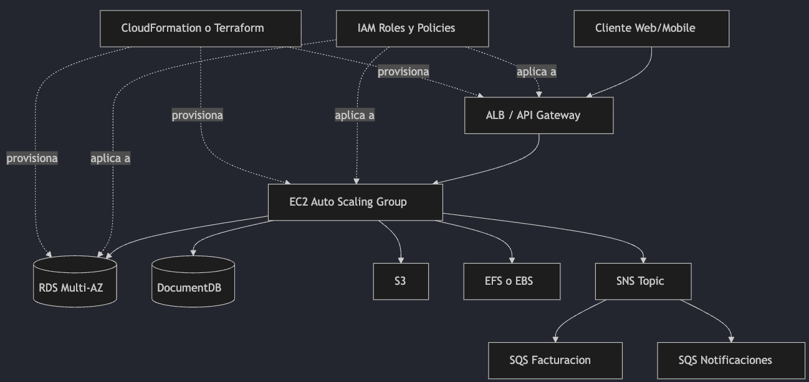

---

## Capa 1 - Networking y Seguridad de Red

**Objetivo:** definir límites de red, aislar componentes, garantizar rutas correctas.

### VPC - Conceptos Clave

| Componente      | Analogía                         | Función                             |
| --------------- | -------------------------------- | ----------------------------------- |
| VPC             | Ciudad privada                   | Red aislada en AWS                  |
| Subnets         | Barrios                          | Segmentos con reglas distintas      |
| Route Tables    | Mapas de tráfico                 | Definen hacia dónde va cada paquete |
| Security Groups | Portería (stateful)              | Firewall a nivel instancia          |
| NACLs           | Reglamento de barrio (stateless) | Firewall a nivel subnet             |

**Buenas prácticas:**

- Separar subnets: públicas, privadas de app, privadas de datos.
- Distribuir en múltiples AZ para tolerancia a fallos.
- Diseñar CIDR con crecimiento futuro.

### Topología VPC Multi-tier

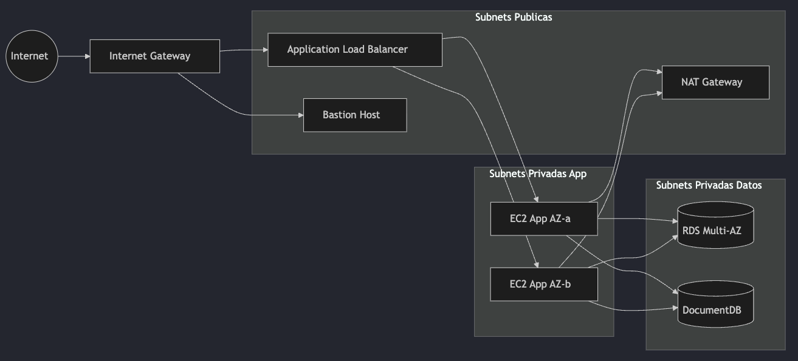

### Route Tables

| Tipo de Subnet | Ruta default (0.0.0.0/0) |
| -------------- | ------------------------ |
| Pública        | → IGW                    |
| Privada App    | → NAT Gateway            |
| Privada Datos  | Sin salida a Internet    |

> **Error común:** "Mi instancia privada no instala paquetes" → Causa: route table sin NAT.

### Security Groups vs NACLs

| Aspecto | Security Group      | NACL               |
| ------- | ------------------- | ------------------ |
| Nivel   | Instancia/ENI       | Subnet             |
| Estado  | Stateful            | Stateless          |
| Uso     | Control fino diario | Guardrails amplios |

### Bastion Host

- **Uso:** equipos que dependen de SSH/RDP tradicional.
- **Alternativa moderna:** AWS Systems Manager Session Manager (sin exponer puerto 22).
- **Regla:** acceso administrativo = temporal + auditado + mínimo.

### ALB + API Gateway

No compiten, se complementan:

- **ALB:** balanceo L7 HTTP/HTTPS dentro de VPC.
- **API Gateway:** puerta de entrada para APIs públicas (throttling, auth).
- **Patrón:** Cliente → API Gateway → ALB → EC2/ECS/Lambda.

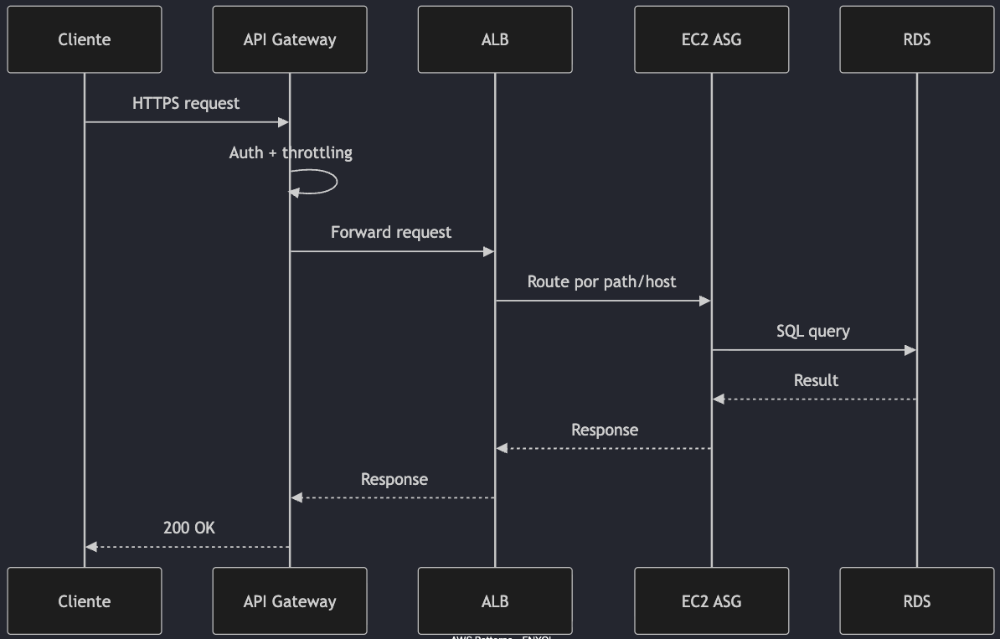

### Terraform: VPC Base

```hcl
resource "aws_vpc" "main" {
  cidr_block           = "10.20.0.0/16"
  enable_dns_hostnames = true
  enable_dns_support   = true
  tags = { Name = "prod-vpc" }
}

resource "aws_subnet" "public_a" {
  vpc_id                  = aws_vpc.main.id
  cidr_block              = "10.20.1.0/24"
  availability_zone       = "us-east-1a"
  map_public_ip_on_launch = true
}

resource "aws_subnet" "private_app_a" {
  vpc_id            = aws_vpc.main.id
  cidr_block        = "10.20.11.0/24"
  availability_zone = "us-east-1a"
}

resource "aws_internet_gateway" "igw" {
  vpc_id = aws_vpc.main.id
}

resource "aws_nat_gateway" "nat" {
  allocation_id = aws_eip.nat.id
  subnet_id     = aws_subnet.public_a.id
}
```

### Checklist Networking

- ✅ Puedes explicar por qué una subnet es pública/privada.
- ✅ Route tables explícitas para cada subnet.
- ✅ Entrada controlada (ALB/API Gateway) y salida controlada (NAT).
- ✅ Acceso admin no depende de "abrir SSH al mundo".

---

## Capa 2 - Compute y Escalabilidad

### EC2

- Control total de runtime, SO y librerías.
- Ideal para afinación fina o cargas legacy.
- Mayor carga operativa si no automatizas.

**Modelo de costo:**

| Tipo             | Cuándo                           |
| ---------------- | -------------------------------- |
| On-Demand        | Incertidumbre alta               |
| Savings/Reserved | Carga estable                    |
| Spot             | Batch tolerante a interrupciones |

### Auto Scaling

No es solo "agregar instancias":

- Define **métrica principal** (CPU, request count, queue depth).
- Define **umbral y ventana** (evitar flapping).
- Define **mínimo, máximo y capacidad deseada** (ej: Min 2, Desired 4, Max 12).
- **Target tracking:** CPU promedio 60%.


### ALB Best Practices

- Terminar TLS en ALB con AWS Certificate Manager.
- Health checks por endpoint crítico (`/healthz`).
- Target groups por tipo de workload.
- Access logs habilitados para auditoría.

### API Gateway Best Practices

- Throttling y quotas por cliente/API key.
- Authorizers (IAM/JWT/Lambda) según contexto.
- Versionado de APIs para evitar breaking changes.
- Observabilidad con CloudWatch.

### Terraform: ASG + ALB

```hcl
resource "aws_launch_template" "api" {
  name_prefix   = "api-"
  image_id      = "ami-xxxxxxxx"
  instance_type = "t3.medium"
}

resource "aws_autoscaling_group" "api" {
  min_size            = 2
  max_size            = 12
  desired_capacity    = 4
  vpc_zone_identifier = [aws_subnet.private_app_a.id, aws_subnet.private_app_b.id]
  target_group_arns   = [aws_lb_target_group.api.arn]
  health_check_type   = "ELB"
}

resource "aws_autoscaling_policy" "cpu60" {
  name                   = "cpu-target-60"
  policy_type            = "TargetTrackingScaling"
  autoscaling_group_name = aws_autoscaling_group.api.name

  target_tracking_configuration {
    predefined_metric_specification {
      predefined_metric_type = "ASGAverageCPUUtilization"
    }
    target_value = 60
  }
}
```

---

## Capa 3 - Storage y Estado

### Matriz de Decisión

| Criterio                 | EBS            | EFS                 | S3               |
| ------------------------ | -------------- | ------------------- | ---------------- |
| **Tipo**                 | Bloque         | File system (NFS)   | Objetos          |
| **Compartido multi-EC2** | No (nativo)    | Sí                  | Vía API          |
| **Latencia**             | Muy baja       | Baja-media          | Mayor            |
| **Caso típico**          | DB en EC2      | Shared files        | Backups/static   |
| **Patrón**               | Stateful local | Stateful compartido | Stateless assets |

### EBS - Bloque Local

- Base de datos instalada en EC2, baja latencia, control de IOPS.
- Persistencia por volumen y snapshots.
- ⚠️ No es almacenamiento compartido nativo entre múltiples EC2.

### EFS - Sistema de Archivos Compartido

- Varias instancias leen/escriben el mismo árbol de archivos.
- Contenido compartido, home dirs, assets comunes.
- Trade-off: más simple para compartición, usualmente mayor costo que EBS.

### S3 - Objetos y Ciclo de Vida

- Backups, contenido estático, data lake, archivos históricos.
- Integraciones event-driven y alta durabilidad (11 nueves).
- Buenas prácticas: versioning, encryption, block public access, lifecycle.

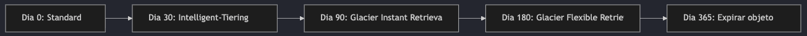

### Terraform: S3 Lifecycle Policy

```hcl
resource "aws_s3_bucket" "logs" {
  bucket = "acme-prod-logs"
}

resource "aws_s3_bucket_lifecycle_configuration" "logs_lifecycle" {
  bucket = aws_s3_bucket.logs.id

  rule {
    id     = "logs-tiering"
    status = "Enabled"

    transition {
      days          = 30
      storage_class = "INTELLIGENT_TIERING"
    }

    transition {
      days          = 90
      storage_class = "GLACIER_IR"
    }

    expiration {
      days = 365
    }
  }
}
```

---

## Capa 4 - Datos y Disponibilidad

### RDS - SQL Administrado

- Reduce carga operativa: backups, parches, monitoreo automáticos.
- Engines: PostgreSQL, MySQL, MariaDB.
- Para sistemas transaccionales con integridad relacional.

### Multi-AZ: Alta Disponibilidad

- Réplica sincrónica standby en otra AZ.
- Failover automático ante fallo del primario.
- **Multi-AZ mejora disponibilidad, NO escala lectura** → para eso, Read Replicas.

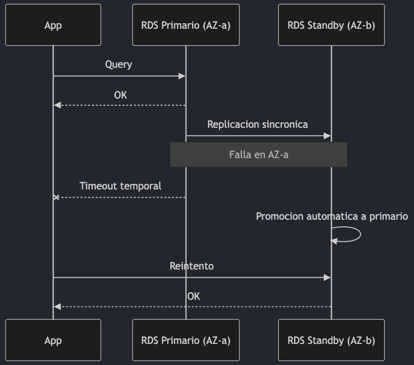

### DocumentDB - Modelos Flexibles

**Cuándo aporta valor:**

- Esquemas variables (catálogos con atributos dinámicos).
- Evolución rápida de modelo sin migraciones pesadas.
- Consultas por documentos y estructuras anidadas.

**Cuándo NO:**

- Relaciones complejas con joins fuertes y transacciones SQL intensivas.

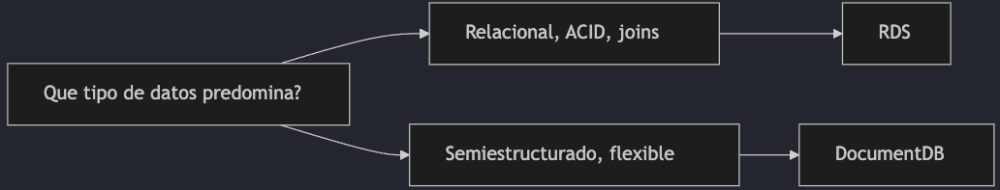

---

## Capa 5 - Mensajería y Desacoplamiento

### SNS + SQS: Patrón Fan-out

- Desacopla productor y consumidores.
- Aísla fallos de un consumidor sin tumbar todo.
- Escala cada consumidor a su ritmo.

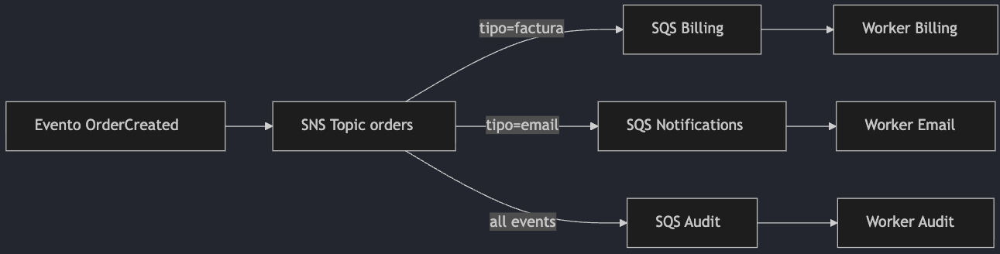

### SQS Best Practices

- **Visibility timeout** > tiempo máximo de procesamiento.
- **Dead Letter Queue** para mensajes fallidos repetidos.
- **Idempotencia** en consumidor para evitar dobles efectos.
- **Long polling** para reducir costo y respuestas vacías.

### Long Polling (Deep Dive)

`ReceiveMessage` espera hasta 20s por mensajes en lugar de responder vacío inmediatamente. Reduce llamadas API inútiles y baja costo.

| Tema                            | Short Polling       | Long Polling                   |
| ------------------------------- | ------------------- | ------------------------------ |
| Espera por request              | Casi inmediata      | Hasta 20s                      |
| Empty responses                 | Frecuentes          | Mucho menos frecuentes         |
| Costo API                       | Mayor               | Menor                          |
| Latencia mensaje recién llegado | Variable            | Baja (espera activa en server) |
| Uso recomendado                 | Baja escala puntual | **Producción por defecto**     |

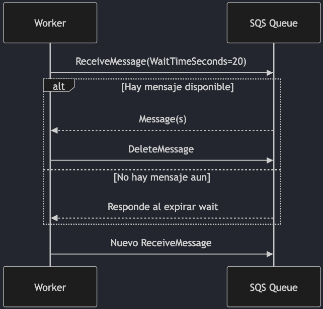

**Configuración recomendada:**

- Cola: `ReceiveMessageWaitTimeSeconds = 20` como baseline.
- Consumidor: `WaitTimeSeconds` explícito.
- HTTP timeout cliente > WaitTimeSeconds + margen de red.
- `MaxNumberOfMessages` hasta 10 para mejorar throughput.

> **Regla de oro:** Si no usas long polling en producción, casi seguro estás pagando de más.

### Errores Comunes

| Error                    | Consecuencia                               |
| ------------------------ | ------------------------------------------ |
| `WaitTimeSeconds=0`      | Short polling, empty receives disparados   |
| Visibility timeout corto | Duplica procesamiento en cargas lentas     |
| No usar DLQ              | Reintentos infinitos en mensajes venenosos |
| Un solo worker           | Cuello de botella en alto volumen          |

**Checklist:**

- ✅ Long polling activo.
- ✅ Visibility timeout alineado al p95/p99 de procesamiento.
- ✅ DLQ con `maxReceiveCount` definido.
- ✅ Métricas CloudWatch: `NumberOfMessagesReceived`, `ApproximateAgeOfOldestMessage`.

### Terraform: SQS con Long Polling

```hcl
resource "aws_sqs_queue" "orders" {
  name                        = "orders-events"
  receive_wait_time_seconds   = 20
  visibility_timeout_seconds  = 60
  message_retention_seconds   = 345600
  max_message_size            = 262144
}
```

### Consumidor Java (Spring Boot)

```java
import io.awspring.cloud.sqs.annotation.SqsListener;
import io.awspring.cloud.sqs.listener.acknowledgement.Acknowledgement;
import org.springframework.stereotype.Component;

@Component
public class OrdersConsumer {

  // application.yml:
  // spring.cloud.aws.sqs.listener.max-messages-per-poll=10
  // spring.cloud.aws.sqs.listener.poll-timeout=20s
  // spring.cloud.aws.sqs.listener.acknowledgement-mode=MANUAL
  @SqsListener(value = "orders-events")
  public void onMessage(String payload, Acknowledgement ack) {
    if (alreadyProcessed(payload)) {
      ack.acknowledge();
      return;
    }
    processMessage(payload);
    ack.acknowledge();
  }

  private boolean alreadyProcessed(String payload) {
    return false;
  }

  private void processMessage(String payload) {
    // Lógica de negocio
  }
}
```

### Terraform: SNS + SQS Subscription con Fan-out

```hcl
resource "aws_sns_topic" "orders" {
  name = "orders-events"
}

resource "aws_sqs_queue" "billing" {
  name = "orders-billing"

  redrive_policy = jsonencode({
    deadLetterTargetArn = aws_sqs_queue.billing_dlq.arn
    maxReceiveCount     = 5
  })
}

resource "aws_sqs_queue" "billing_dlq" {
  name = "orders-billing-dlq"
}

resource "aws_sns_topic_subscription" "billing_sub" {
  topic_arn = aws_sns_topic.orders.arn
  protocol  = "sqs"
  endpoint  = aws_sqs_queue.billing.arn

  filter_policy = jsonencode({
    eventType = ["INVOICE_REQUIRED"]
  })
}
```

---

## Capa 6 - Seguridad Transversal (IAM)

### Principio Central: Least Privilege

Permitir solo acciones necesarias, sobre recursos necesarios, por tiempo necesario.

**Modelo mental:**

- **Role** = identidad asumible.
- **Policy** = permisos (qué puede hacer).
- **Trust Policy** = quién puede asumir el rol.

### Policy de Mínimo Privilegio

```json
{
  "Version": "2012-10-17",
  "Statement": [
    {
      "Sid": "ReadOnlyInvoicesPrefix",
      "Effect": "Allow",
      "Action": ["s3:GetObject"],
      "Resource": "arn:aws:s3:::acme-invoices-prod/2026/*"
    },
    {
      "Sid": "ListOnlyInvoicesFolder",
      "Effect": "Allow",
      "Action": ["s3:ListBucket"],
      "Resource": "arn:aws:s3:::acme-invoices-prod",
      "Condition": {
        "StringLike": { "s3:prefix": "2026/*" }
      }
    }
  ]
}
```

### Trust Policy (AssumeRole)

```json
{
  "Version": "2012-10-17",
  "Statement": [
    {
      "Effect": "Allow",
      "Principal": { "Service": "ec2.amazonaws.com" },
      "Action": "sts:AssumeRole"
    }
  ]
}
```

### Checklist IAM

- ✅ Evitar `Resource: *` salvo justificación.
- ✅ Preferir condiciones (`aws:SourceIp`, tags, prefijos).
- ✅ Rotar y evitar credenciales de larga duración en apps.
- ✅ Auditar con CloudTrail y Access Analyzer.

---

## Capa 7 - Infrastructure as Code (IaC)

### CloudFormation vs Terraform

| Dimensión      | CloudFormation            | Terraform                        |
| -------------- | ------------------------- | -------------------------------- |
| **Alcance**    | AWS nativo                | Multi-cloud                      |
| **Estado**     | Gestionado por stack      | State explícito (backend remoto) |
| **Drift**      | Drift detection nativo    | `plan`/`refresh` + tooling       |
| **Módulos**    | Nested stacks / StackSets | Módulos reutilizables maduros    |
| **Caso ideal** | Organización 100% AWS     | Multi-cloud o estándar HCL       |

**Cuándo usar cada uno:**

- **CloudFormation:** integración AWS nativa y gobierno centralizado por stack.
- **Terraform:** estandarizar IaC entre nubes y ecosistemas diversos.

### CloudFormation: VPC

```yaml
Resources:
  MainVPC:
    Type: AWS::EC2::VPC
    Properties:
      CidrBlock: 10.30.0.0/16
      EnableDnsHostnames: true
      EnableDnsSupport: true

  PublicSubnetA:
    Type: AWS::EC2::Subnet
    Properties:
      VpcId: !Ref MainVPC
      CidrBlock: 10.30.1.0/24
      MapPublicIpOnLaunch: true
```

### Terraform equivalente: VPC

```hcl
resource "aws_vpc" "main" {
  cidr_block           = "10.30.0.0/16"
  enable_dns_hostnames = true
  enable_dns_support   = true
}

resource "aws_subnet" "public_a" {
  vpc_id                  = aws_vpc.main.id
  cidr_block              = "10.30.1.0/24"
  map_public_ip_on_launch = true
}
```

### IaC Guardrails

- Pull requests + `terraform plan` / Change Sets en CI.
- Estado remoto con locking.
- Políticas de borrado y backups antes de cambios destructivos.
- Etiquetado obligatorio para costo/propiedad.

---

## Patrones Arquitectónicos Integrados

### Patrón 1: Multi-tier en AWS

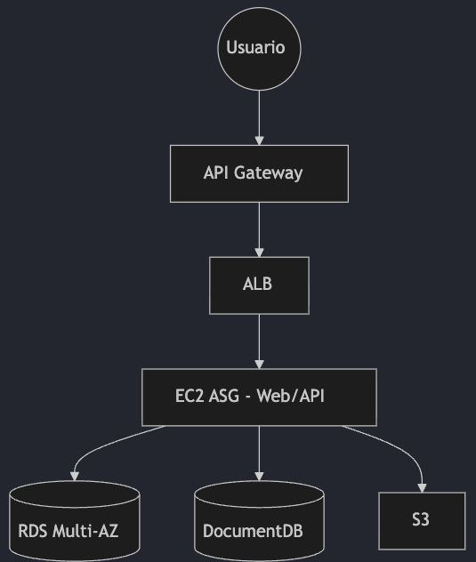

### Patrón 2: Fan-out para Desacoplar Dominio

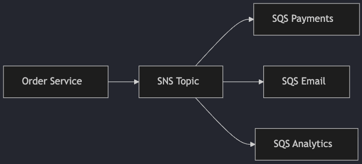

### Patrón 3: Disaster Recovery

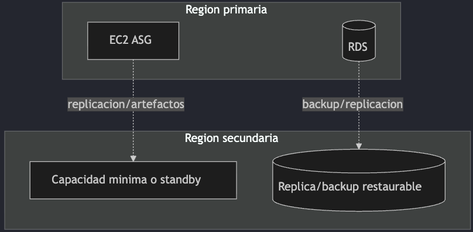

**Estrategias DR (de menor a mayor costo):**

| Estrategia       | RTO        | Costo |
| ---------------- | ---------- | ----- |
| Backup & Restore | Mayor      | Menor |
| Pilot Light      | Medio-alto | Bajo  |
| Warm Standby     | Medio      | Medio |
| Active/Active    | Menor      | Mayor |

> **Regla práctica:** Si el negocio no tolera caída larga, no puedes elegir estrategia barata por defecto.

---

## Well-Architected Aplicado

### Checklist por Pilar

| Pilar                      | Aplicación                                  |
| -------------------------- | ------------------------------------------- |
| **Operational Excellence** | IaC, despliegues repetibles, runbooks       |
| **Security**               | IAM least privilege, cifrado, auditoría     |
| **Reliability**            | Multi-AZ, health checks, colas y reintentos |
| **Performance Efficiency** | Auto Scaling, tipo de storage correcto      |
| **Cost Optimization**      | Lifecycle S3, right sizing, clases EC2      |

### Matriz de Decisión Final

| Necesidad                   | Servicio/Patrón   | Motivo                                  |
| --------------------------- | ----------------- | --------------------------------------- |
| Entrada HTTP resiliente     | ALB + API Gateway | Seguridad, routing, control de consumo  |
| Compute elástico            | EC2 + ASG         | Escala horizontal con control operativo |
| Archivos compartidos        | EFS               | Multi-EC2 con semántica filesystem      |
| Datos transaccionales       | RDS Multi-AZ      | HA administrada para SQL                |
| Eventos desacoplados        | SNS + SQS         | Aislar consumidores, absorber picos     |
| Gobierno de infraestructura | IaC (CF o TF)     | Cambios auditables y repetibles         |

---

## SQS - Límites y Extended Client

### Límite de Tamaño

**AWS SQS** tiene un límite de **1 MB** (1,048,576 bytes) por mensaje.

> **Actualización 2025:** AWS aumentó el límite de 256 KB a 1 MB en enero de 2025.

### Solución para Mensajes > 1 MB: Extended Client Library

Usa **S3** como almacenamiento extendido (hasta 2 GB por mensaje):

```xml
<dependency>
    <groupId>com.amazonaws</groupId>
    <artifactId>amazon-sqs-java-extended-client-lib</artifactId>
    <version>2.0.3</version>
</dependency>
```

**Cómo funciona:**

1. Mensaje > 1 MB → cliente sube payload a S3.
2. SQS recibe solo una referencia (pointer) al objeto S3.
3. Consumidor lee pointer → cliente descarga automáticamente de S3.

```java
AmazonS3 s3 = AmazonS3ClientBuilder.defaultClient();
AmazonSQS sqsExtended = new AmazonSQSExtendedClient(
    AmazonSQSClientBuilder.defaultClient(),
    new ExtendedClientConfiguration()
        .withLargePayloadSupportEnabled(s3, "mi-bucket-payloads")
        .withAlwaysThroughS3(false)
        .withPayloadSizeThreshold(256 * 1024)
);

sqsExtended.sendMessage(queueUrl, largeMessage);
```

```text
Productor → Extended Client (detecta tamaño, sube a S3)
                ├→ SQS (pointer)
                └→ S3 (payload)

SQS (pointer) → Extended Client (lee pointer, descarga de S3) → Consumidor
```

### Límites

| Aspecto             | Límite                               |
| ------------------- | ------------------------------------ |
| SQS estándar        | 1 MB por mensaje                     |
| Con Extended Client | Hasta 2 GB                           |
| S3 objeto máximo    | 5 TB (Extended Client limita a 2 GB) |
| Costo adicional     | Almacenamiento S3 + GET/PUT          |

### CloudFormation: SQS + S3 para Payloads Grandes

```yaml
Parameters:
  pEnvironment:
    Type: String
    Default: dev

Resources:
  rPayloadsBucket:
    Type: AWS::S3::Bucket
    Properties:
      BucketName: !Sub sqs-payloads-${pEnvironment}
      LifecycleConfiguration:
        Rules:
          - Id: DeleteOldPayloads
            Status: Enabled
            ExpirationInDays: 7

  rOrdenesQueue:
    Type: AWS::SQS::Queue
    Properties:
      QueueName: !Sub ordenes-${pEnvironment}
      MessageRetentionPeriod: 345600
      VisibilityTimeout: 300

Outputs:
  oOrdenesQueueUrl:
    Value: !GetAtt rOrdenesQueue.QueueUrl
  oPayloadsBucketName:
    Value: !Ref rPayloadsBucket
```

### Alternativas para Mensajes Grandes

1. **Kinesis Data Streams:** hasta 1 MB/registro, mejor para streaming.
2. **S3 + EventBridge:** notificaciones de eventos en S3.
3. **Step Functions:** orquestación con estado persistente.
4. **Dividir mensajes:** partir en chunks más pequeños.

---

## AWS Secrets Manager

### ¿Qué es?

Servicio gestionado para almacenar, recuperar y **rotar automáticamente** secretos (contraseñas, claves API, tokens, credenciales de BD).

### Rotación Automática

```text
1. Secrets Manager programa rotación (ej: cada 30 días)
2. Invoca función Lambda de rotación
3. Lambda ejecuta 4 pasos:
   ├─ createSecret: Genera nueva credencial
   ├─ setSecret: Actualiza en el sistema destino
   ├─ testSecret: Verifica que funciona
   └─ finishSecret: Marca como actual
4. Aplicaciones usan automáticamente el nuevo secreto
```

### Ventajas

| Característica      | Beneficio                                   |
| ------------------- | ------------------------------------------- |
| Rotación automática | Reduce riesgo de credenciales comprometidas |
| Versionado          | Rollback fácil a versiones anteriores       |
| Auditoría           | CloudTrail registra todos los accesos       |
| Cifrado             | KMS cifra secretos en reposo                |
| Integración         | RDS, Redshift, DocumentDB                   |

### Costos

- **$0.40** por secreto/mes.
- **$0.05** por cada 10,000 llamadas API.
- Rotación automática: sin costo adicional (solo Lambda).

### Secrets Manager vs Parameter Store

|            | Parameter Store | Secrets Manager       |
| ---------- | --------------- | --------------------- |
| Costo      | Más económico   | $0.40/secreto/mes     |
| Rotación   | Manual          | Automática con Lambda |
| Caso ideal | Config simple   | Credenciales críticas |

---

## CloudFormation - Convenciones

### Prefijos en Logical IDs (Buena Práctica)

| Sección    | Prefijo | Ejemplo            |
| ---------- | ------- | ------------------ |
| Resources  | `r`     | `rOrdenesQueue`    |
| Parameters | `p`     | `pEnvironment`     |
| Outputs    | `o`     | `oOrdenesQueueUrl` |

### Ejemplo con Prefijos

```yaml
Parameters:
  pEnvironment:
    Type: String
    Default: dev
    Description: Ambiente de despliegue

Resources:
  rOrdenesQueue:
    Type: AWS::SQS::Queue
    Properties:
      QueueName: !Sub ordenes-${pEnvironment}
      MessageRetentionPeriod: 345600

Outputs:
  oOrdenesQueueUrl:
    Description: URL de la cola de órdenes
    Value: !GetAtt rOrdenesQueue.QueueUrl
    Export:
      Name: !Sub ${AWS::StackName}-OrdenesQueueUrl
```

### Otras Convenciones

- **PascalCase** para Logical IDs: `rUserTable` ✅ / `r_user_table` ❌
- **Nombres descriptivos:** `rApiGateway` ✅ / `rAG` ❌
- **Consistencia** en toda la plantilla.

---

## Recursos Adicionales

### Documentación Oficial

- [AWS VPC](https://docs.aws.amazon.com/vpc/)
- [EC2](https://docs.aws.amazon.com/ec2/)
- [Elastic Load Balancing](https://docs.aws.amazon.com/elasticloadbalancing/)
- [API Gateway](https://docs.aws.amazon.com/apigateway/)
- [S3](https://docs.aws.amazon.com/s3/) · [EFS](https://docs.aws.amazon.com/efs/) · [EBS](https://docs.aws.amazon.com/ebs/)
- [RDS](https://docs.aws.amazon.com/rds/) · [DocumentDB](https://docs.aws.amazon.com/documentdb/)
- [SNS](https://docs.aws.amazon.com/sns/) · [SQS](https://docs.aws.amazon.com/sqs/)
- [IAM](https://docs.aws.amazon.com/iam/)
- [CloudFormation](https://docs.aws.amazon.com/cloudformation/) · [Best Practices](https://docs.aws.amazon.com/AWSCloudFormation/latest/UserGuide/best-practices.html)
- [Secrets Manager](https://docs.aws.amazon.com/secretsmanager/) · [Rotation](https://docs.aws.amazon.com/secretsmanager/latest/userguide/rotating-secrets.html)
- [Terraform Docs](https://developer.hashicorp.com/terraform/docs)
- [SQS Extended Client (Java)](https://github.com/awslabs/amazon-sqs-java-extended-client-lib)
- [Saga Pattern - Microservices.io](https://microservices.io/patterns/data/saga.html)
- [LocalStack](https://docs.localstack.cloud/)
